# Mermaid Flow Patterns

Flow diagram templates organized by orchestrator type.

---

## Code-Based Patterns (Trigger.dev / FastAPI)

All code-based automations follow the 5-step BaseAutomation pattern.

### Base Pattern

Every automation uses this structure:

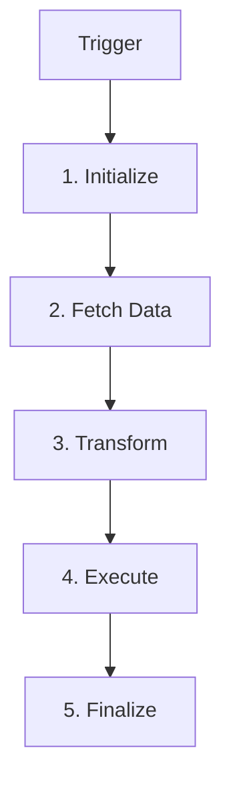

### Filter Pattern

When fetching data and filtering before processing:

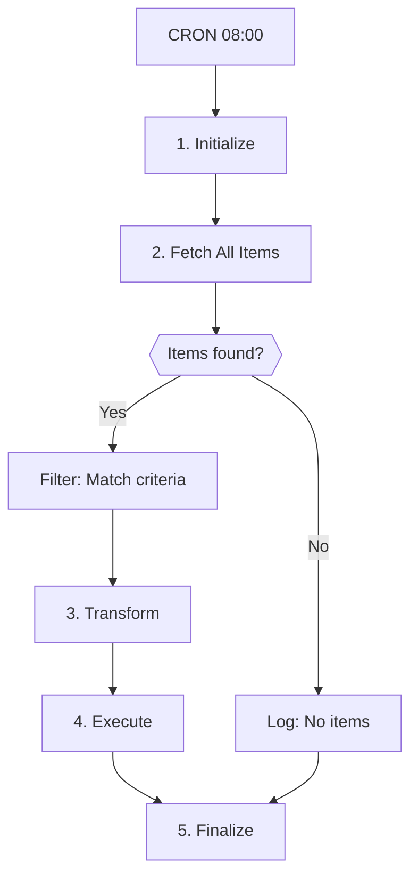

### Duplicate Check Pattern

When preventing duplicate creation:

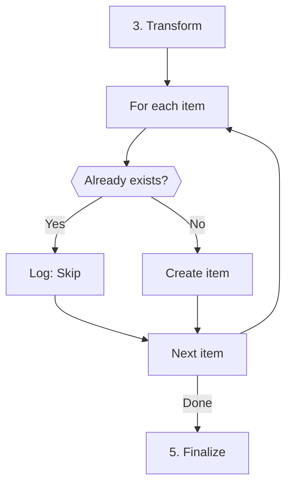

### Webhook Classification Pattern

When classifying incoming webhooks:

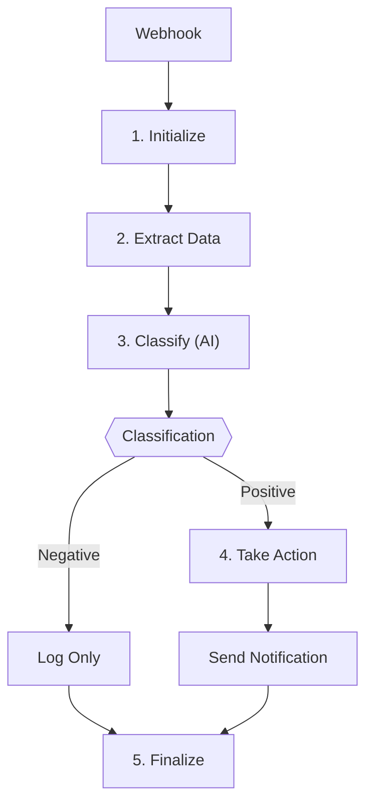

### Sync Pattern

When syncing data between systems:

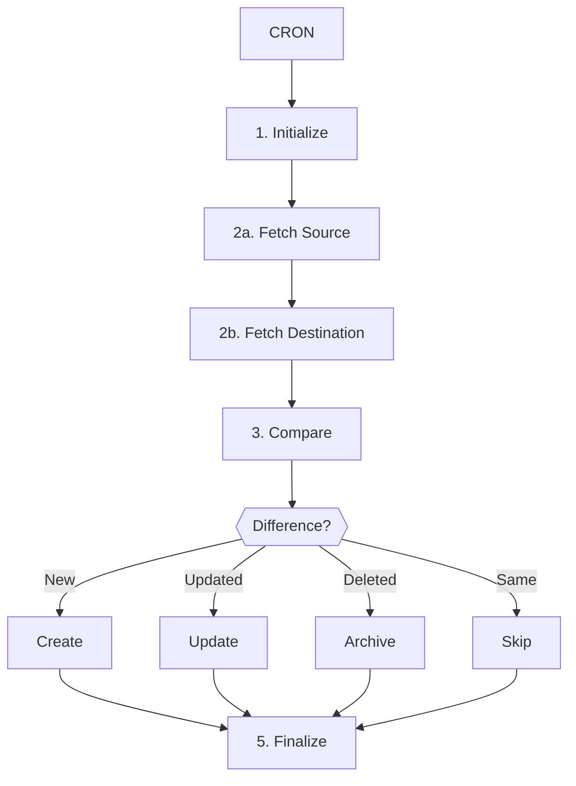

### Multi-System Pipeline

When data flows through multiple systems:

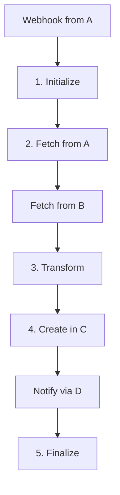

---

## n8n Workflow Patterns

n8n workflows use node-based patterns. Diagrams reference node types and operations directly.

### Node Naming Conventions

| Node Type | Naming in Diagram | Example |
|-----------|-------------------|---------|
| HTTP Request | Method + path | `"GET /orders"`, `"POST /customers"` |
| Native node | Node name + action | `"Slack: Post Message"` |
| Code node | `Code:` + purpose | `"Code: Transform Data"`, `"Code: Build Payload"` |
| IF node | Question format | `"Status = ACTIVE?"`, `"Due within 7 days?"` |
| Trigger | Type + context | `"CRON: 08:00 CET"`, `"Webhook: POST"` |

### HTTP API Pattern

Scheduled fetching from APIs with filtering and creation:

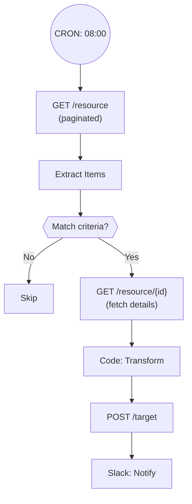

### Webhook Processing Pattern

Receiving and processing webhook events:

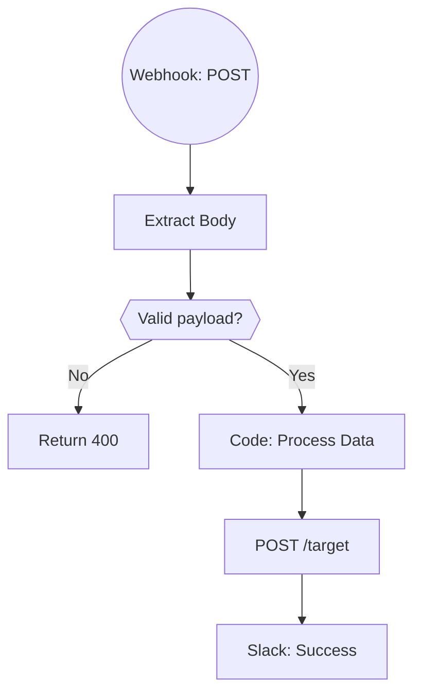

### Enrichment Pattern

Fetching an item and enriching it with additional data:

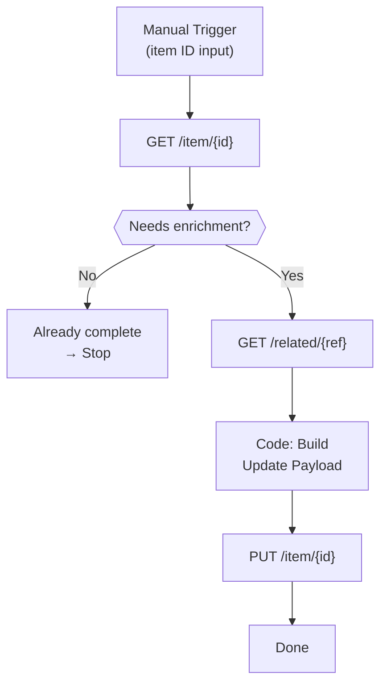

### Duplicate Detection Pattern

Checking for existing items before creation:

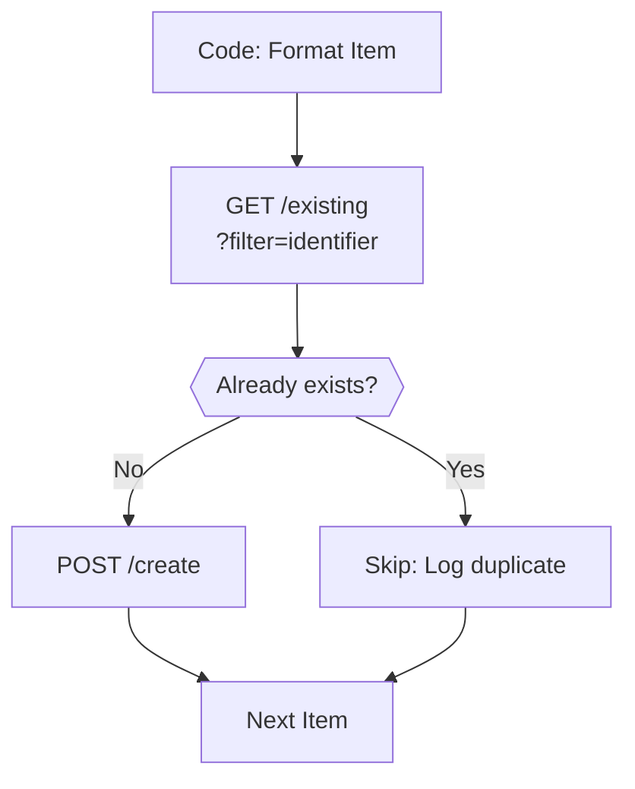

### Sync Pattern (n8n)

Syncing data between two systems:

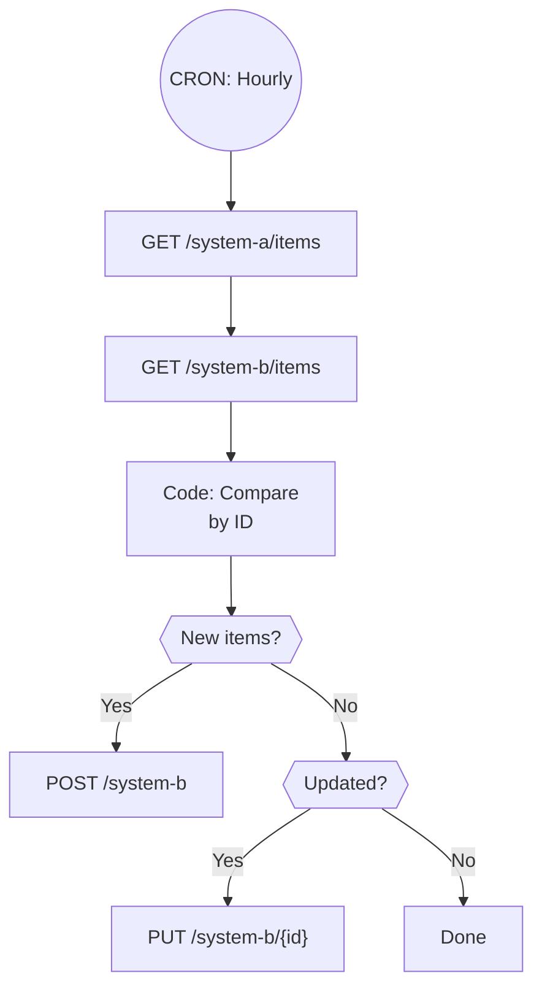

### Phased Pattern

Building incrementally (manual first, then automated):

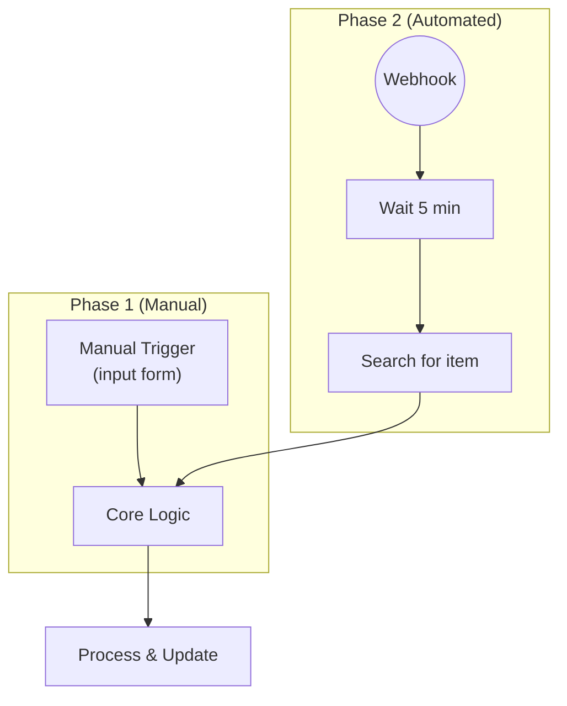

---

## Make.com Scenario Patterns

Make.com scenarios use module-based patterns. Diagrams reference module types and apps.

### Module Naming Conventions

| Module Type | Naming in Diagram | Example |
|-------------|-------------------|---------|
| App action | `App: Action` | `"Fortnox: List orders"`, `"Slack: Post message"` |
| HTTP module | `HTTP: Method path` | `"HTTP: GET /orders"`, `"HTTP: POST /items"` |
| Router | `Router` | `"Router"` |
| Iterator | `Iterator: purpose` | `"Iterator: Process items"` |
| Aggregator | `Aggregator: purpose` | `"Aggregator: Collect results"` |
| Filter | `Filter: condition` | `"Filter: Status = Active"` |
| Tools | `Tools: Action` | `"Tools: Set variable"` |
| Trigger | `Type + app` | `"Watch: New orders"`, `"Webhook: POST"` |

### Scheduled API Pattern (Make.com)

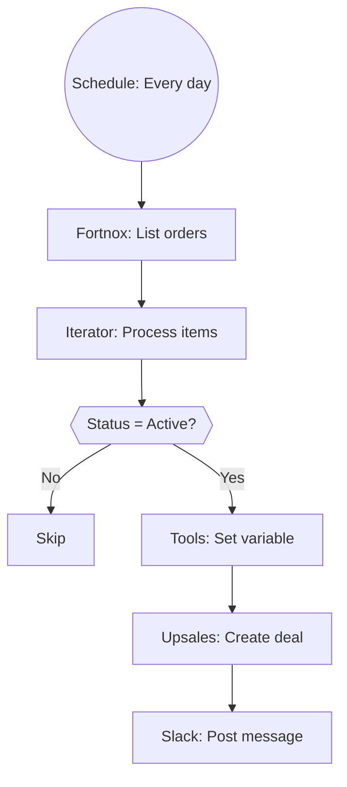

### Webhook Processing Pattern (Make.com)

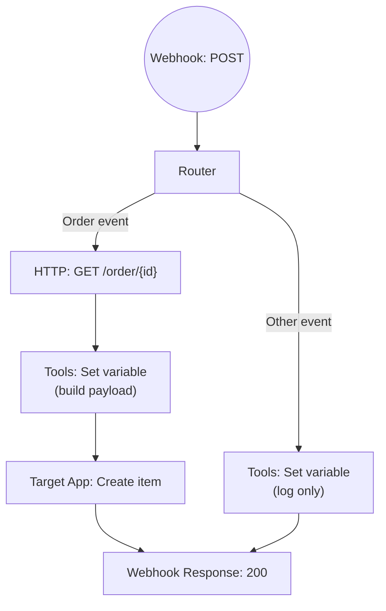

### Data Sync Pattern (Make.com)

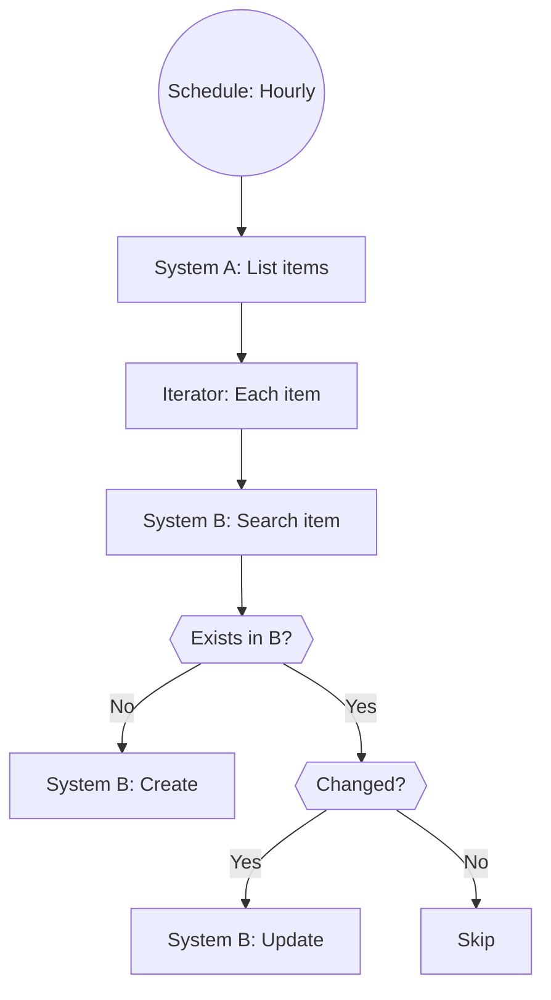

---

## Style Guidelines

### Node Shapes

| Shape | Syntax | Use For |
|-------|--------|---------|
| Rectangle | `["text"]` | Steps, actions, nodes |
| Diamond | `{{"text"}}` | Decision points (IF/Switch) |
| Stadium | `(("text"))` | Triggers (CRON, Webhook) |
| Parallelogram | `[/"text"/]` | Input/Output |

### Naming Conventions

- **Triggers:** Stadium shape with context: `(("CRON: 08:00 CET"))` or `(("Webhook: POST"))`
- **Code-based:** Numbered steps (1-5) for main automation steps
- **n8n:** Show what the node DOES, not generic names
- **Make.com:** Show app name + action (e.g., "Fortnox: List orders")
- **Decisions:** Question format in diamond nodes
- **Multiline:** Use `\n` for complex node labels

### Complexity Limits

- Maximum 15-20 nodes for readability
- Break complex flows into sub-diagrams if needed
- Show main flow, detail edge cases in text
- Use subgraphs for logical grouping:

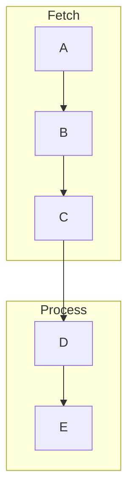

## Trigger Node Examples

| Trigger Type | Code-Based | n8n | Make.com |
|--------------|-----------|-----|---------|
| Daily CRON | `["CRON 08:00"]` | `(("CRON: 08:00 CET"))` | `(("Schedule: Every day"))` |
| Hourly CRON | `["CRON Hourly"]` | `(("CRON: Every Hour"))` | `(("Schedule: Hourly"))` |
| Webhook | `["Webhook: {event}"]` | `(("Webhook: POST"))` | `(("Webhook: POST"))` |
| Manual | `["Manual Trigger"]` | `["Manual Trigger\n(input form)"]` | `["Run once\n(manual)"]` |
| Watch/Poll | — | — | `(("Watch: New items"))` |
