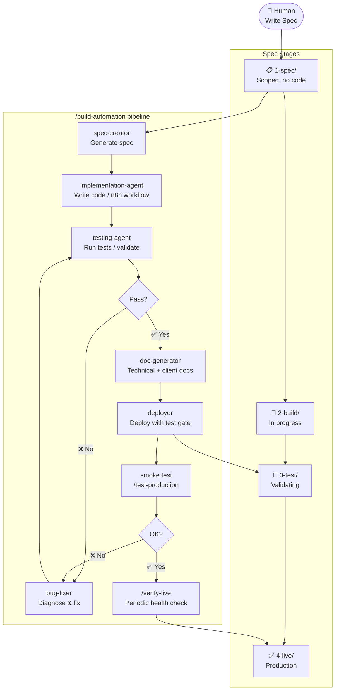

# Agentic Ops — Delivery Guide

> How to use this workspace to onboard clients, build automations, and ship to production.

---

## Table of Contents

1.  [Workspace Overview](#1-workspace-overview)
    
2.  [Orchestrator Options](#2-orchestrator-options)
    
3.  [Onboarding a New Client](#3-onboarding-a-new-client)
    
4.  [The Spec-Driven Workflow](#4-the-spec-driven-workflow)
    
5.  [Building an Automation](#5-building-an-automation)
    
6.  [Testing](#6-testing)
    
7.  [Deployment](#7-deployment)
    
8.  [Ongoing Maintenance](#8-ongoing-maintenance)
    
9.  [Key Commands Reference](#9-key-commands-reference)
    
10.  [Client Status Snapshot](#10-client-status-snapshot)

11.  [Autonomous Pipeline Vision](#11-autonomous-pipeline-vision)


---

## Autonomous Agent Pipeline

> The goal: Human writes the spec. Agent builds, validates, fixes, and deploys — autonomously.



**n8n validation loop** (what the agent uses automatically):

```
validate_workflow → n8n_test_workflow → n8n_executions → fix if failed → redeploy
```

---

## 1\. Workspace Overview

```
Agentic Ops/
├── workspace/
│   ├── clients/           ← One folder per client
│   ├── templates/         ← Boilerplate for new clients
│   └── docs/              ← Internal docs & guides
├── .claude/
│   ├── skills/            ← Reusable Claude skills (/skill-name)
│   ├── commands/          ← One-liner Claude commands (/command)
│   ├── agents/            ← Specialized Claude agents
│   └── rules/             ← Auto-loaded reference docs
└── CLAUDE.md              ← Project-wide Claude instructions
```

Each client lives in `workspace/clients/{client-name}/` and contains:

| Folder | Contents |
| --- | --- |
| specs/ | Specs organised by pipeline stage |
| automations/ | Code — git subtree linked to the client's GitHub repo |
| context/ | Client notes, credentials info, open questions |
| reference/ | Symlink to the client folder in The Crucible |

---

## 2\. Orchestrator Options

Choose **before** starting any client work. This determines folder layout, templates, and deployment.

| Orchestrator | When to Use | Deployment | Clients |
| --- | --- | --- | --- |
| Trigger.dev | New clients, code-first, complex logic | GitHub Actions → Trigger.dev cloud | Uplifted Consulting |
| n8n | Visual workflows, non-developer clients | n8n cloud (managed) | Peakora, Herbox NL |
| FastAPI (legacy) | Existing clients only — do NOT use for new work | Railway | Herbox Sweden |

**Detection:** Check `workspace/clients/{client}/automations/` for:

-   `trigger.config.ts` → Trigger.dev
    
-   `.mcp.json` entry named `n8n-{client}` → n8n
    
-   `railway.toml` → Legacy FastAPI
    

---

## 3\. Onboarding a New Client

### Step 1 — Create the folder structure

```
/new-client {client-name}
```

This creates `workspace/clients/{client-name}/` with:

-   `specs/1-spec/`, `2-build/`, `3-test/`, `4-live/`, `_archive/`, `_checklists/`
    
-   `specs/README.md` (blank index)
    
-   `context/` folder
    
-   `automations/` from the appropriate template
    

### Step 2 — Fill in client context

Edit `context/process-notes.md`:

-   Key contacts (names, roles, access levels)
    
-   Systems involved (CRM, ERP, APIs)
    
-   Auth methods (OAuth2, API keys, webhooks)
    
-   Business pain points driving each automation
    

### Step 3 — Create a GitHub repo and link it

When ready to start coding:

```
/client-handoff {client-name}
```

This:

1.  Creates `agentic-ops--{client-name}` on GitHub
    
2.  Sets up the git subtree link between `automations/` and the repo
    
3.  Pushes the template code
    

### Step 4 — Set up environment variables

For **Trigger.dev** clients: add secrets to Trigger.dev dashboard + `.env` for local dev. For **FastAPI** clients: add Railway environment variables. For **n8n** clients: configure credentials directly in the n8n instance.

---

## 4\. The Spec-Driven Workflow

Every piece of work starts with a spec. Code follows the spec.

### Spec Pipeline Stages

```
1-spec/ → 2-build/ → 3-test/ → 4-live/
```

| Stage | Meaning |
| --- | --- |
| 1-spec/ | Planned and scoped, no code yet |
| 2-build/ | Actively being implemented |
| 3-test/ | Implementation complete, being validated |
| 4-live/ | Deployed and confirmed working in production |

**Archive:** `_archive/` for deprecated or superseded specs. **Checklists:** `_checklists/` for per-automation testing checklists.

### Spec ID Prefixes

| Prefix | Type | Example |
| --- | --- | --- |
| a{N} | Automation (background job) | a1, a6 |
| a{N}.{M} | Sub-automation (child of parent) | a6.1, a6.3 |
| app{N} | Frontend / UI | app1 |
| be{N} | Backend / infra / DB migration | be1 |
| p{N} | Multi-phase project | p1 |
| p{N}.{M} | Phase within a project | p1.2 |
| fix{N} | Bug fix | fix3 |

### Creating a Spec

```
/spec-creator
```

The skill will walk through:

1.  Automation purpose and trigger type
    
2.  Systems involved
    
3.  Step-by-step flow (generates Mermaid diagram)
    
4.  API references
    
5.  Edge cases and error handling
    
6.  Acceptance criteria
    

Save the output to `specs/1-spec/{id}-{name}.md`.

### Spec Frontmatter (required fields)

```yaml
---
id: a6.1
name: Apify Scraper Starter
type: sub-automation        # automation | sub-automation | app | backend | project | phase | bug-fix
stage: build                # spec | build | test | live
needs_fixes: false
version: 1.0.0
created: 2026-01-14
updated: 2026-01-14
orchestrator: trigger-dev   # trigger-dev | fastapi | n8n | none
trigger:
  type: webhook             # webhook | cron | manual
systems:
  - apify
  - airtable
last_changes:
  - Initial implementation
next_steps:
  - Add retry logic for failed scrapes
---
```

---

## 5\. Building an Automation

### Option A — Automated (recommended)

```
/build-automation {client-name}
```

This orchestrates the full pipeline:

1.  **Plan** → `spec-creator` generates the spec
    
2.  **Code** → `implementation-agent` writes the automation
    
3.  **Test** → `testing-agent` validates it
    
4.  **Docs** → `doc-generator` produces technical + client docs
    
5.  **Deploy** → `deployer` ships it with test gates
    

### Option B — Manual (for control or complex cases)

**1\. Move spec to** `2-build/` and update frontmatter `stage: build`.

**2\. Implement the automation:**

For **Trigger.dev** clients:

-   Python class in `python/automations/{name}.py` extending `BaseAutomation`
    
-   TypeScript wrapper in `src/trigger/{name}.ts` that calls `python.runScript()`
    

For **n8n** clients:

-   Build the workflow using n8n MCP tools or n8n UI
    
-   Use `/n8n-mcp-tools-expert` for guidance
    

For **FastAPI** clients:

-   Python class in `app/automations/{name}.py` extending `BaseAutomation`
    
-   Route in `app/routers/` if webhook-triggered
    

**3\. Reference the spec in the code docstring:**

```python
"""
Automation A6.1: Apify Scraper Starter
Spec: specs/2-build/a6.1-apify-scraper-starter.md
"""
```

**4\. Add any needed API clients** to `clients/` (use `/fetch-api` to generate boilerplate).

**5\. Write tests** in `tests/test_{name}.py`.

### Building for Trigger.dev (expanded)

```
workspace/clients/{client}/automations/
├── src/trigger/
│   └── {task-name}.ts        ← TypeScript task wrapper
├── python/
│   ├── automations/
│   │   └── {name}.py         ← Python automation logic
│   └── clients/
│       └── {api}.py          ← API client wrappers
```

**TypeScript task wrapper pattern:**

```ts
import { task } from "@trigger.dev/sdk";
import { python } from "@trigger.dev/build/extensions/python";

export const myAutomationTask = task({
  id: "my-automation",
  run: async (payload) => {
    const result = await python.runScript("./python/automations/my_automation.py", [
      JSON.stringify(payload),
    ]);
    return JSON.parse(result.stdout);
  },
});
```

**Python automation pattern:**

```python
import sys, json
from base_automation import BaseAutomation

class MyAutomation(BaseAutomation):
    """
    Automation A1: My Automation
    Spec: specs/2-build/a1-my-automation.md
    """

    async def run(self, payload: dict) -> dict:
        self.log("Starting...")
        # logic here
        return {"status": "success"}

if __name__ == "__main__":
    payload = json.loads(sys.argv[1]) if len(sys.argv) > 1 else {}
    result = MyAutomation().execute(payload)
    print(json.dumps(result))  # stdout → TypeScript wrapper
```

---

## 6\. Testing

### Generate a testing checklist

```
/testing-checklist
```

This reads the spec and code to produce step-by-step testing instructions. The checklist is saved to `specs/_checklists/` and used by the testing-agent. For n8n automations, the agent executes each check using MCP tools rather than requiring manual review.

> **Note:** Checklists in `_checklists/` can be auto-generated via `/testing-checklist` or manually authored. The `order-automation-checklist.md` for Herbox Sweden was manually created — use `/testing-checklist` to auto-generate these going forward.

### Run automated tests

**FastAPI / Trigger.dev (Python):**

```bash
uv run pytest tests/
```

**Trigger.dev dev mode** (connects local code to cloud):

```bash
npx trigger.dev dev
```

### n8n Automated Validation (agent-driven)

For n8n automations, the testing-agent runs a validation loop using MCP tools:

| Step | Tool | What it checks |
| --- | --- | --- |
| 1. Structure | `validate_workflow` | Node configs, required fields, expression syntax |
| 2. Execute | `n8n_test_workflow` | Runs the workflow with test input |
| 3. Inspect | `n8n_executions` | Checks execution status, data output, errors |
| 4. Fix & retry | `n8n_update_partial_workflow` + re-validate | Autonomous fix loop if step 2–3 fail |

This loop runs before marking a spec as `3-test` and again after deployment.

### Test levels

| Level | Command | When |
| --- | --- | --- |
| Unit tests | uv run pytest tests/ | After any code change (FastAPI / Trigger.dev) |
| n8n validation | auto via testing-agent | After any n8n workflow change |
| Dev integration | /test-dev | Before marking as 3-test |
| Production smoke test | /test-production | After deployment |
| Verify live | /verify-live | Periodic production health checks |

### Move to test stage

When tests pass locally:

1.  Update spec frontmatter: `stage: test`
    
2.  Move spec file from `2-build/` to `3-test/`
    
3.  Commit + deploy (see next section)
    

---

## 7\. Deployment

### Trigger.dev

Deployment is automatic via GitHub Actions when code is pushed to `main`:

```bash
# Push changes via git subtree
git subtree push \
  --prefix="workspace/clients/{client}/automations" \
  git@github.com:akkton/agentic-ops--{client}.git \
  main
```

Or use the publish command:

```
/publish {client-name}
```

### FastAPI (Railway)

```
/deploy {client-name}
```

This runs tests first and only deploys if they pass.

### n8n

Workflows are deployed directly from the n8n UI or via n8n MCP tools (`n8n_create_workflow`, `n8n_update_partial_workflow`). After changes, pull via `n8nac` to version-control them:

```bash
cd workspace/clients/{client}/automations/n8n
n8nac pull
```

Then commit the updated `.workflow.ts` files.

### Post-deployment checklist

- [ ] Smoke test in production (`/test-production`)
- [ ] Verify live status (`/verify-live`)
- [ ] Update spec: `stage: live`, move to `4-live/`
- [ ] Update `specs/README.md`
- [ ] Run `/checkpoint` to save session state

---

## 8\. Ongoing Maintenance

### Updating a spec (new features or changes)

```
/spec-updater
```

Adds new sections, bumps version, updates `last_changes` and `next_steps`.

### Fixing bugs

```
/fix-bugs {client-name}
```

The bug-fixer agent:

1.  Reads the failing test output
    
2.  Identifies root cause
    
3.  Implements a minimal fix
    
4.  Re-runs tests to verify
    

If the bug warrants tracking, create a `fix{N}` spec in `2-build/`.

### Keeping context across sessions

Always end a work session by:

1.  Updating spec frontmatter (`last_changes`, `next_steps`, `stage`)
    
2.  Committing code changes
    
3.  Running `/checkpoint` to save conversation state
    

To resume: read the spec frontmatter — `last_changes` shows what was done, `next_steps` shows what's left.

### Managing n8n workflow versions

After any n8n workflow change:

```bash
cd workspace/clients/{client}/automations/n8n
n8nac pull          # Pull latest from n8n instance
git add .
git commit -m "sync: pull latest n8n workflows for {client}"
```

---

## 9\. Key Commands Reference

### Client lifecycle

| Command | What it does |
| --- | --- |
| /new-client {name} | Create client folder structure from template |
| /client-handoff {name} | Create GitHub repo + git subtree link |
| /publish {name} | Push code to client GitHub (triggers deploy) |
| /deploy {name} | Deploy FastAPI client to Railway (with test gate) |

### Automation building

| Command | What it does |
| --- | --- |
| /build-automation {name} | End-to-end: spec → code → test → deploy |
| /spec-creator | Create a new automation spec |
| /spec-updater | Add features/changes to existing spec |
| /spec-cleanup {name} | Audit and fix misplaced specs / stale frontmatter |
| /fetch-api --url {url} | Download API docs + generate Python client boilerplate |

### Testing & verification

| Command | What it does |
| --- | --- |
| /test | Run full test suite |
| /test-dev | Integration test against real dev APIs |
| /test-production | Smoke test against live production |
| /verify-live | Confirm production health |
| /testing-checklist | Generate step-by-step test checklist from spec |
| /fix-bugs {name} | Diagnose and fix failing tests |

### n8n specific

| Command | What it does |
| --- | --- |
| /n8n-instances | Manage per-client n8n MCP server entries in .mcp.json |
| /n8n-mcp-tools-expert | Guided help for building with n8n MCP tools |
| /n8n-workflow-patterns | Architectural patterns for n8n workflows |
| /n8n-converter | Convert exported n8n JSON to a Python spec |

### Session management

| Command | What it does |
| --- | --- |
| /checkpoint | Save current conversation state to disk |
| /status-check | Overview of all automation statuses |

---

## 10\. Client Status Snapshot

| Client | Orchestrator | Deployment | Active Work |
| --- | --- | --- | --- |
| Herbox Sweden | FastAPI + n8n | Railway | A2, A6.1, A6.3, A7, A8 in build; A1 in test |
| Uplifted Consulting | Trigger.dev | Trigger.dev cloud | A1 in build |
| Peakora | n8n | n8n cloud | 47 workflows version-controlled |
| Herbox Netherlands | n8n | n8n cloud | 22 workflows version-controlled |

---

## Quick Decision Trees

### "Which orchestrator do I use?"

```
New client?
  ├─ Yes → Trigger.dev (code-first, scalable)
  └─ No, existing client → check automations/ folder
       ├─ trigger.config.ts → Trigger.dev
       ├─ railway.toml → FastAPI (legacy, don't migrate unless planned)
       └─ .mcp.json n8n entry → n8n
```

### "Where does new code go?"

```
Trigger.dev client?
  ├─ Python logic → python/automations/{name}.py
  ├─ TypeScript task → src/trigger/{name}.ts
  └─ API client → python/clients/{api}.py

FastAPI client?
  ├─ Python logic → app/automations/{name}.py
  ├─ Webhook route → app/routers/webhooks.py
  └─ API client → app/clients/{api}.py

n8n client?
  └─ Workflow built in n8n UI / via MCP tools
     then pulled with n8nac → committed to automations/n8n/
```

### "What stage should this spec be in?"

```
Just scoped, no code → 1-spec/
Code in progress → 2-build/
Code done, testing → 3-test/
Deployed + confirmed → 4-live/
Superseded or scrapped → _archive/
```

---

## 11\. Autonomous Pipeline Vision

> The human's only job is to write the spec. The agent does the rest.

### What's fully autonomous today

| Phase | FastAPI / Trigger.dev | n8n |
| --- | --- | --- |
| Implementation | ✅ implementation-agent | ✅ builds via MCP tools |
| Structural validation | ✅ pytest | ✅ validate\_workflow |
| Test execution | ✅ uv run pytest | ✅ n8n\_test\_workflow |
| Result inspection | ✅ test output | ✅ n8n\_executions |
| Bug fixing | ✅ bug-fixer agent | ⚠️ partial — no autonomous fix loop yet |
| Deployment | ✅ deployer agent | ✅ via MCP (workflows live in n8n) |
| Post-deploy verification | ✅ /test-production | ⚠️ manual |
| Checklist generation | ✅ /testing-checklist | ✅ /testing-checklist |

### Key gaps (open improvement areas)

**1. n8n autonomous fix loop**
Currently: agent validates → finds error → stops and asks human.
Target: agent validates → finds error → fixes workflow node → re-validates → loops until green.
This requires building an `n8n-testing-agent` that wraps the validate → test → inspect → fix cycle.

**2. n8n post-deploy smoke test**
After a workflow is deployed/activated, there's no automatic trigger of a real test execution and result check. Should be added to the deployer flow for n8n clients.

**3. Testing checklists auto-generated, not manual**
The `_checklists/` folder should always be populated by `/testing-checklist` as part of `/build-automation`, not created by hand. Manual checklists (like the Herbox Sweden order checklist) should be migrated to this pattern.

**4. Agent memory of past failures**
When a bug-fixer resolves an issue, the fix pattern isn't saved anywhere. Over time, agents should learn from recurring errors across clients and avoid repeating them. The auto-memory system partially addresses this but needs more deliberate use.

### The ideal future loop (n8n)

```
Human: write spec
  → /build-automation
  → spec-creator generates spec
  → implementation-agent builds workflow via MCP
  → n8n-testing-agent:
       validate_workflow → fix → n8n_test_workflow → inspect executions → fix → repeat
  → all green → deployer activates workflow
  → smoke test via n8n_test_workflow (production)
  → spec moves to 4-live/
  → Human: confirm ✅ or flag ❌
```