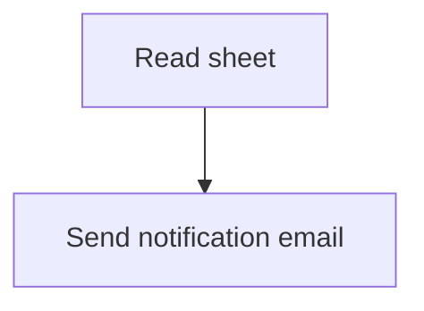

# fx1 — Fixture: spec missing trigger

## Goal

Synthetic spec for the agnt_make-builder smoke test. The `trigger` field is intentionally absent from frontmatter so the agent's Step 1 fail-fast check fires and emits a `## Build BLOCKED` shape citing the missing trigger.

## Flow

## Step details

1. Read recent rows from a Google Sheet.
2. For each new row, send a notification email.

## Expected agent behavior

- Step 1: parse frontmatter, detect `trigger` absent → BLOCK.
- Should NOT proceed to Step 2 (instance resolution).
- Output: `## Build BLOCKED — fx1: Fixture — spec missing trigger` with `**Blocking gate:** spec` and a `**Blocker:** Trigger type not specified...` sentence.
