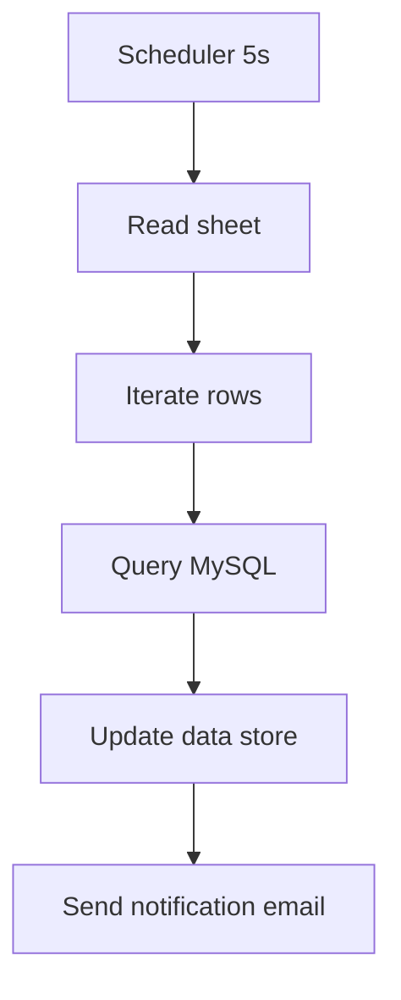

# fx2 — Fixture: ops projection blows past plan

## Goal

Synthetic spec to validate Gate G1 (operations estimation) in the agnt_make-builder agent. Scheduled every 5 seconds with a 6-module flow against a fixture plan with `plan_ops_limit: 10000` — projected ops are ~3.2M/month, ~32,000% of the plan.

## Flow

## Step details

1. Scheduler fires every 5 seconds (288/min × 1440 min × 31 days ≈ 535k runs/month).
2. For each run, 6 modules execute (scheduler counts as 1; the iterator, MySQL query, data store update, and email send count for ~5 more depending on row count — for the estimate, assume each scheduled run uses ~6 ops).
3. Projection: 535k × 6 ≈ 3.2M ops/month.
4. Fixture plan limit: 10,000 ops/month. Projection is 320x the plan.

## Expected agent behavior

- Step 1: parse frontmatter, `trigger.interval_seconds: 5` present → PASS spec validation.
- Step 2: resolve instance from fixture infrastructure.yaml (`fixture_dev`, `plan_ops_limit: 10000`).
- Step 3, Gate G1: compute ops projection (`(2,592,000 / 5) × 6 = 3,110,400`/month). Compare against `plan_ops_limit - ops_used_this_period = 10000 - 1200 = 8800`. Projection is 35,000% of remaining budget. BLOCK.
- Should NOT proceed to G2 or any later gate (G1 BLOCK is a hard stop).
- Output: `## Build BLOCKED — fx2: Fixture — ops projection blows past plan` with `**Blocking gate:** G1` and `**Blocker:** Ops projection 3,110,400 > 80% of plan (8,000)...` (or similar with the actual math), citing register #49.

## Why this fixture exists

Register #49 (2026-03-14, meji-media): 4 scenarios deployed to a 10k/month plan without ops estimation; projection was ~201k/month; account paused. The make-builder agent's G1 gate is the structural fix for this incident class. This fixture verifies the gate actually fires.
