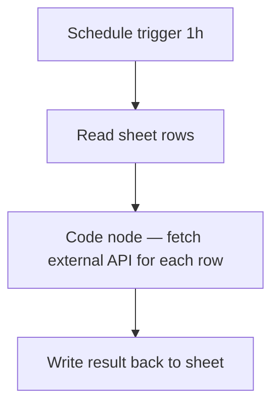

# nx1 — Fixture: Code node uses banned fetch()

## Goal

Synthetic spec for the agnt_n8n-builder smoke test. The planned Code node uses `fetch()` to hit a public API, which the n8n Cloud sandbox blocks per register #37. The agent should BLOCK on Gate N3 and recommend refactoring to a dedicated HTTP Request node.

## Flow



## Step details

1. Schedule trigger fires hourly.
2. Read rows from a Google Sheet.
3. **Code node (planned body):**
   ```javascript
   const items = $input.all();
   const results = [];
   for (const item of items) {
     const response = await fetch(`https://api.example.com/lookup?id=${item.json.id}`);
     const data = await response.json();
     results.push({ json: { ...item.json, lookup: data } });
   }
   return results;
   ```
4. Write lookup results back to sheet.

## Expected agent behavior

- Step 1: parse frontmatter, trigger present, systems listed → PASS.
- Step 2: resolve `_fixture-n8n-builder` instance from fixture infrastructure.yaml.
- Step 3, Gate N1: nodeType format clean (uses `n8n-nodes-base.*` for workflow body) → PASS.
- Step 3, Gate N2: no splitInBatches node → N-A.
- Step 3, Gate N3: scan Code-node body for banned patterns. Finds `await fetch(\`https://api.example.com/lookup?id=...\`)` → BLOCK.
- Should NOT proceed to N4–N7 or any later step.
- Output: `## Build BLOCKED — nx1: Fixture — Code node uses banned fetch()` with `**Blocking gate:** N3` and a `**Blocker:**` line quoting the offending fragment, citing register #37 (and #35 for the broader sandbox class).

## Why this fixture exists

Register #35 + #37 (kunde-inc, 2026-03-03/04): n8n Cloud Code node sandbox blocks `fetch()`, `$helpers.httpRequest()`, and `this.helpers.httpRequestWithAuthentication()`. Workflows using these patterns work in dev (self-hosted) but break the moment they're deployed to Cloud. Gate N3 is the structural fix.
