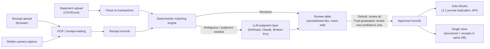

# p1 — AI-Assisted Expense Reconciliation Platform
## Functional Specification, v2

> **Authority:** This document supersedes v1 (`reference/2026-05-14-functional-spec-original.md`)
> for all build decisions. v1 is preserved verbatim as a primary source. Where v2 and v1
> diverge, v2 is binding. Every v2 change traces to an entry in
> `context/2026-05-20-call-outcomes.md` (cited inline).

---

## 0. Revision history & change log

### v1 — 2026-05-14, Dirk Neumann
Preserved verbatim at `workspace/clients/brisken/reference/2026-05-14-functional-spec-original.md`.

### v2.1 — 2026-05-24, same-day addendum (Matthias)
Added candidate answers to §26 (Architecture) and §38 (Open Research Items)
for Dirk's review. Three answers reverse prior call decisions and are flagged
inline so Dirk approves the proposal and the reversal together:
- GCP + Cloud Storage for receipts reverses §9 single-store.
- Vertex AI or Bedrock reverses the "use Brisken Claude Pro subscription" path.
- AWS Bedrock specifically reverses Dirk's "no AWS as provider" decision.

The candidate answers do not change any v2.0 requirement. They populate the
"how" of the §26.3 candidate stack and the §38 research items.

### v2 — 2026-05-24, revised by Matthias
Read line-by-line against v1 per Dirk's directive (call-outcomes, Part 2,
"Comprehension directive"), then revised against the 2026-05-20 call.

#### Material changes (v1 -> v2)

| § | Change | Source |
|---|---|---|
| 1 Executive Summary | Reframed: north-star goal restated (turn Chris's multi-day reconciliation grind into ~15 minutes/month of review, 99% automated). MVP narrowed to expenses; full-bookkeeping is direction, not MVP scope. | call-outcomes Part 2 ("Scope nuance — correction") |
| 2 Product Vision | Long-term vision = replace Zoho Books with in-house "Brisken Books" (lightweight double-entry, GL hierarchy, light invoice issuing). | call-outcomes "Scope change (significant)" |
| 4 Target Users | Replaced single-admin assumption with a full RBAC hierarchy. Chris (Brisken finance manager) is the key user. | call-outcomes Part 2 "RBAC model" |
| 5 Scope Overview | Multi-tenant moved to day-1 hard requirement (was open question). Mobile receipt scanning moved from Release 3 to MVP-mandatory. | call-outcomes "A2 multi-tenant"; Part 2 "Receipt scanning" |
| 6 Accounting Target | Zoho integration model = full record-keeping in our tool + 1:1 replication of journal entries to Zoho via API; map our GL/expense categories to Zoho GL accounts. | call-outcomes "Zoho access" |
| 7 Source Transactions | MVP narrowed to single format (CSV or Excel — whichever Brisken already downloads). Future: any format incl. MT/CAMT. Live bank-aggregator connections explicitly post-MVP. | call-outcomes Part 2 "Statement intake" |
| 9 Receipt Storage | Single store: structured data and receipt files in the same DB (cheap-but-secure). Retention pending accountant confirmation; per-jurisdiction config required. | call-outcomes Part 2 "Storage"; "Open / to research" |
| 13 AI Classification | Reframed deterministic-first; LLM only for judgment. Permission granted to use Brisken's ~5 years of manual reconciliation history to improve matching. | call-outcomes "Matching approach"; "Historical data" |
| 14 Automation Philosophy | Default: review everything for the first months, build trust, then only review low-confidence-flagged items and auto-accept the rest. | call-outcomes "D2 auto-approval" |
| 15 Matching Engine | Hybrid: deterministic where possible (USD card + USD expense ≈ 99% on amount+date), LLM only for judgment (hard case: EUR payment on USD card needs mock-FX conversion + vendor/reference match). | call-outcomes "Matching approach" |
| 16 Review Workflow | Spreadsheet-like table with mass-edit / quick reclassify (responds to Zoho ERP-rigidity pain point). | call-outcomes "Scope change" |
| 20 Currency | Three layers locked: transaction (any) / account-card (Brisken: USD, EUR, GBP) / book currency (configurable per legal entity, fixed per entity). German GmbH out of scope. | call-outcomes "A1 currency" |
| 21 Zoho Integration | Direction = API replication of journals (APIs: journals + auth + webhooks). MVP may use file export as a fast bridge; architectural target is API. | call-outcomes "Zoho access" |
| 22 Chart of Accounts | Structured GL account hierarchy: main accounts, sub-accounts, possibly sub-sub-accounts, reflected in reporting. | call-outcomes "Scope change" |
| 23 Data Model | Added: Tenant, LegalEntity, Role, Scope mapping. Existing entities scoped by tenant + legal entity + account. | call-outcomes Part 2 "New hard requirements" |
| 24 Processing Pipeline | Clarified component separation: OCR / receipt-reading ≠ deterministic matching engine ≠ LLM judgment layer ≠ web framework. (Addresses the "FastAPI = parser" muddle on the call.) | call-outcomes "Stack reversal" §2 |
| 25 Non-Functional | ADDED: reconciliation guarantee as hard NFR. Security: built-in per-use consent prompt for sensitive data through AI; no-training guarantee required on the AI account. | call-outcomes "Scope change"; "Anthropic Claude" |
| 26 Technical Architecture | Entirely rewritten. Azure (Document Intelligence + Blob) REJECTED. AWS-as-provider DECLINED. Firebase/GCP candidate for the whole platform — pending research. Single store. Anthropic via existing Brisken Pro subscription. | call-outcomes "Stack reversal"; Part 2 "Storage / Anthropic Claude / Firebase" |
| 27 MVP Screens | Added mobile receipt-capture page. | call-outcomes Part 2 "Receipt scanning" |
| 30 MVP Success Criteria | Added: multi-tenant + multi-entity functional; mobile scanning works end-to-end; reconciliation guarantee holds for a full test month. | (synthesis of new hard requirements) |
| 31 Open Questions | Consolidated: most v1 questions answered on the call; remaining items moved to §38 Open Research Items. | (synthesis) |
| 32 Implementation Order | Added Phase 0 (multi-tenant + multi-entity + RBAC + single-store foundation) and a mobile-scanning phase. | (synthesis) |
| 34 Key Principles | Added: reconciliation guarantee; deterministic-first matching. Noted: Dirk said the name "expense" is probably wrong but retained for now. | call-outcomes (multiple) |
| NEW §36 | Long-term vision: Brisken Books (Zoho replacement), double-entry, GL hierarchy, light invoice issuing, bank aggregator integration. | call-outcomes "Scope change" |
| NEW §37 | People & Process: Chris is the key user; Dirk briefs her -> joint call -> regular cadence; Dirk wants visibility into everything built. | call-outcomes "People"; "Process / cadence" |
| NEW §38 | Open Research Items (gating the stack decision). | call-outcomes "Open / to research" |

Sections 3, 8, 10, 11, 12, 17, 18, 19, 28, 29, 33, 35 carry forward from v1 with light wording cleanup and no semantic change.

---

## 1. Executive Summary

This document defines requirements for an AI-assisted expense reconciliation
application. The product is intended to be developed as a commercial,
multi-tenant SaaS for use by different companies, not only as an internal
Brisken tool. The initial design partner is Brisken; the initial key user is
Brisken's finance manager Chris, who today performs the manual reconciliation
the product is built to replace.

**North-star goal** (Dirk's restatement on the 2026-05-20 call, transcript
01:30:49 onward):

> Turn the bookkeeper's multi-day monthly reconciliation into approximately
> 15 minutes per month of review, 99% automated. The product saves time, not
> licence cost (Zoho Books itself is only roughly USD 600 to 800 per year).

The MVP focuses narrowly on **expenses and reconciliation**. The long-term
direction is broader (see §36 Vision); MVP scope does not chase the vision.

The product must support different levels of automation, configurable per
organization. The default progression is: review everything for the first
months -> build trust -> only review low-confidence-flagged items and
auto-accept the rest.

---

## 2. Product Vision

The application is an AI-native expense reconciliation and bookkeeping
assistant, not just a receipt scanner.

It ingests financial transaction sources, ingests receipts and invoices,
extracts relevant data, automatically matches receipts to transactions,
classifies expenses with AI logic, supports review and approval, and posts
approved expenses into Zoho Books (MVP) — with the long-term direction of
becoming the book of record itself, replacing Zoho Books for the design
partner and shipping as a standalone SaaS.

Primary product concept:

> A multi-tenant, multi-entity AI-assisted expense reconciliation platform
> that combines deterministic matching, LLM judgment for hard cases,
> structured GL-account classification, receipt attachment, configurable
> approval workflows, accounting-system replication, and (long term)
> a lightweight in-house double-entry book of record.

---

## 3. Core Business Problem

(Carried forward from v1 §3 — unchanged.)

Companies typically have:

- credit card statements with multiple business transactions;
- receipts and invoices stored separately as photos, PDFs, emails, or files;
- personal expenses accidentally made on business cards;
- business expenses paid using personal cards requiring reimbursement;
- missing, duplicate, or unclear receipts;
- manual classification, upload, and attachment work;
- repeated reconciliation effort every month.

The product solves this by connecting financial statement lines to their
corresponding receipts, applying classification logic, allowing user review,
and posting into Zoho Books (with a clear path to becoming the book of
record itself, see §36).

---

## 4. Target Users and RBAC

### 4.1 The key user (design partner)

**Chris** — Brisken's finance manager, the only finance person at Brisken,
holds admin access to Zoho Books and Zoho Expense, holds all bank/card
statements, and holds the historic reconciliation data. The product's pain
specification originated from Dirk's exercise with Chris. Functional work
with Brisken goes through Chris (call-outcomes Part 2 "People").

### 4.2 Multi-tenant + multi-entity + RBAC (hard requirement, MVP)

The system is multi-tenant from day 1 (call-outcomes "A2 multi-tenant").
Within a tenant, the system supports multiple legal entities, each with
separate management, separate user access, own reports, and consolidated
reports across entities (call-outcomes Part 2 "Multi-entity").

Legal entity is both:
- a system dimension (drives consolidated reporting), and
- a row-level access field (drives what a given user can see).

The RBAC model (call-outcomes Part 2 "RBAC model"):

```
App account (Tenant)
 └── Owner / Admin           — configures, sees all entities, manages users
      └── Legal Entity
           ├── Legal-entity admin      — grants access, manages at entity level
           ├── Process user / Operator — creates expenses, operates;
           │                             scoped to assigned bank/card accounts;
           │                             one person responsible per account
           └── Viewer                   — read-only: reports, reconciliation
                                          results, data. Scope:
                                          - Brisken usage: all-accounts viewer
                                          - other customers: scope per account
```

Authorization granularity is `(user, role, scope)` where scope is a mapping
of `(legal_entity_ids, bank_card_account_ids)`. "Multi tenant, multi legal
entity, account sits on the tenant" (Dirk, call Part 2).

### 4.3 MVP role minimum

For the MVP demo with Brisken, the system must support at least:
- Owner / Admin (for Dirk),
- Legal-entity admin + Process user (for Chris — likely both, since she is
  the only finance person),
- Viewer (read-only for stakeholders),

across at least two legal entities (Brisken's actual entity count to be
confirmed with Chris; the German GmbH is out of scope per call-outcomes
"A1 currency").

---

## 5. Scope Overview

### 5.1 MVP scope (revised)

The MVP is a browser-accessible multi-tenant SaaS application. It must
support:

1. Tenant, legal-entity, and user/role provisioning (RBAC per §4).
2. Statement upload (single format — CSV or Excel, whichever Brisken
   downloads today; see §7.1).
3. Receipt and invoice upload from local/desktop browser uploads.
4. **Mobile receipt capture** — a mobile web page that opens the device
   camera, captures the receipt, uploads to a known folder the app reads
   (call-outcomes Part 2 "Receipt scanning"). Cropping is a bonus. Fallback
   discussed: use Zoho Expense's mobile app + Zoho Expense API to read
   expenses and fetch the receipt-picture URL; Zoho's own auto-scan is
   usable as comparative info only.
5. OCR / data extraction from uploaded receipt documents.
6. Hybrid matching engine: deterministic where possible, LLM only for
   judgment calls (§15).
7. AI classification against the tenant's chart of accounts.
8. Spreadsheet-like review table with mass-edit / quick reclassify (§16).
9. Approval workflow with the default progression in §14.
10. Posting / replication of approved expenses to Zoho Books (MVP can start
    with file export; architectural target is the Zoho API replication
    model per §21).
11. Receipt linkage preserved end-to-end (single store — receipts and
    structured data live in the same DB per §9).
12. Reconciliation guarantee (§25.5).

### 5.2 Post-MVP, Release 2

- Live Zoho Books API replication if the MVP shipped with file export.
- Direct upload of receipts to Zoho Books via API where the customer keeps
  Zoho as book of record.
- Configurable auto-approval thresholds (per §14).
- Email-ingestion path for receipts.

### 5.3 Post-MVP, Release 3 and beyond

- Live bank/card connectivity via third-party aggregator providers
  (call-outcomes Part 2 "Bank connectivity (future)"). Explicitly **not
  MVP / not Phase 1**. Long term. Geographic-specialised providers,
  certification required, varying data freshness and format.
- Further statement-format ingestion (PDF, Google Sheets, text, MT / CAMT
  bank formats). If MT / CAMT is used, the future live connection likely
  uses the same format, which saves rework.
- Cloud-folder watch / import.

### 5.4 Vision (post-MVP direction, not committed scope)

See §36 — Brisken Books as a Zoho-replacement book of record, double-entry,
GL hierarchy, light invoice issuing.

---

## 6. Accounting System Target

### 6.1 MVP

Zoho Books, Expenses object first. The product is the **source of record
for what we book**; Zoho receives a 1:1 replication of journal entries
mapped from our internal GL / expense categories to the customer's Zoho GL
accounts (call-outcomes "Zoho access").

### 6.2 Post-MVP

Zoho Books Bills as a second supported object.

### 6.3 Key principles

- Our internal data model is decoupled from any single Zoho import
  template; the export / posting layer is a mapping concern.
- Long-term, the customer can choose to drop Zoho as book of record and
  use our system as book of record (see §36 Vision). The data model must
  support this without rework.

---

## 7. Source Transactions

### 7.1 MVP source format

Credit card statements only. **Single format**: CSV or Excel — whichever
Brisken already downloads from its card provider today, so Chris's existing
spreadsheets work directly (call-outcomes Part 2 "Statement intake (MVP)").
The exact format choice is TBD pending one piece of evidence from Chris
(a sample of what she downloads today).

Statements are read as **structured columns with no interpretation**
(call-outcomes "C1 statements"). They are not a parsing problem. They are
a tabular ingest.

### 7.2 Post-MVP

Any format: PDF, Excel, CSV, Google Sheets, text, MT / CAMT (call-outcomes
Part 2 "Statement intake (future)"). Bank-statement ingest, employee
reimbursements, cash expenses, PayPal, other card providers, direct bank
feeds via aggregators (see §5.3).

---

## 8. Receipt and Invoice Sources

### 8.1 MVP sources

- Browser file upload from a desktop/laptop (drag-and-drop multiple files);
- **Mobile camera capture** via the mobile web page in §5.1 item 4.

Supported formats: at least JPEG, PNG, PDF.

### 8.2 Post-MVP

- Email ingestion (a designated forwarding address per tenant);
- WhatsApp / messaging uploads;
- Cloud-folder watch (OneDrive, Google Drive, etc.) — these were listed in
  v1 §8.1 but per §5.1 are not MVP; they were not specifically asked for on
  the call, so they move to post-MVP unless Chris asks for them in her
  joint call;
- Direct vendor-invoice imports.

---

## 9. Receipt Storage Requirement

**Storage architecture is a single store** (call-outcomes Part 2
"Storage — resolves the earlier open question"):

- Structured data and receipt files live in the **same place** — a
  database that can also store files, cheap but secure, suitable for
  financial and partial-personal data (bank/account number fragments).
- **No separate object store linked from the DB** for MVP.
- Azure Blob is rejected (same cost / complexity reasons as Azure Document
  Intelligence, see §26).

A receipt file is linked to:

- the extracted document record,
- the matched statement transaction,
- the approved expense / journal record,
- the export / posting status.

### 9.1 Retention

The legal retention period is **TBD pending Brisken's accountant**. Dirk's
guess on the call was approximately 7 years US; this is unconfirmed and
must be verified (call-outcomes "Open / to research"). For the product:

- A per-jurisdiction retention configuration is required (different
  customers have different obligations);
- A candidate commercial model Dirk floated was "store ~2 years by
  default, offer backup/retention as a paid add-on, per-jurisdiction
  config" — this is a candidate to consider, not a decision.

GDPR and deletion / anonymization workflows must be supported (see §25.4).

---

## 10. Required Accounting Fields

(Carried forward from v1 §10 — unchanged.)

Required for posting / export:

1. Date;
2. Vendor;
3. Total amount;
4. Account or credit card used;
5. Currency (see §20 for the three-layer model);
6. Expense account / category to post to.

VAT not required for MVP (management-reporting use case).

Additional extracted fields are retained where present: receipt / invoice
number, reference number, address, payment method, original-language text,
line item details, country, tax / VAT, merchant metadata, notes, confidence
scores, extraction warnings.

Reference field: receipt / invoice number maps to reference where
available. Line-item details consolidate into description for MVP (not
posted as separate accounting lines).

---

## 11. VAT / Tax Handling

(Carried forward from v1 §11 — unchanged.)

Not required for MVP; extracted and stored as metadata where visible.
Post-MVP may require VAT accounting, rate separation, German VAT,
mixed-VAT receipts, tax-code mapping, and country-specific treatment.
Open: whether VAT extraction is visually shown in the review table in MVP.

---

## 12. Languages

(Carried forward from v1 §12 — unchanged.)

Recognize at least German, English, Portuguese. Translate into English
where required for the user-facing display or for Zoho fields. Preserve
original-language information in metadata.

---

## 13. AI Classification Logic

### 13.1 Approach

Classification is **AI-supported, not static-table** (Dirk explicit in v1
§13: "specifically does not want a simple static vendor assignment table
as the main intelligence mechanism").

But the classification engine is built on top of the matching engine, and
matching is **deterministic-first, LLM only for judgment** (see §15).
This means classification uses LLM only when the inputs do not deterministically
resolve to a category from the tenant's chart of accounts (e.g., new vendor,
ambiguous line items, multi-category split candidate, contradictory signals).

### 13.2 Signals considered

Vendor name, transaction description, receipt line items, amount, currency,
country / location, historical user corrections, organization-specific
chart of accounts, statement-line context, uploaded document content.

### 13.3 Output of classification

For every transaction:

- suggested expense account from the tenant's chart of accounts;
- confidence score (semantics TBD per §38);
- reasoning summary suitable for the review pane;
- alternative category candidate where ambiguous;
- warning flag where ambiguous or low-confidence.

### 13.4 Learning from corrections

The system stores corrections from day 1. Permission has been granted by
Dirk to use **Brisken's approximately 5 years of manual reconciliation
history** to improve matching and classification (call-outcomes
"Historical data"). Training-loop architecture is post-MVP; the data path
must support it from day 1.

---

## 14. Configurable Automation Philosophy

The product supports configurable automation per organization. The default
progression for a new tenant (call-outcomes "D2 auto-approval"):

1. **Months 1 to N — review everything.** Every classified record requires
   human approval before posting. Builds trust, builds correction history.
2. **Trust-graduated mode.** Only low-confidence-flagged items require
   review; everything else auto-accepts.
3. **Fully configurable thresholds** (post-MVP) — auto-approve above a
   confidence threshold, per-category rules, amount thresholds,
   vendor-based low-risk rules, always-review-personal-or-ambiguous,
   never-auto-approve-missing-receipt, never-auto-approve-suspected-duplicate.

The default for a fresh tenant in MVP is mode 1. The transition to mode 2
is a configuration action, not a code change.

---

## 15. Matching Engine

The matching engine is the operational heart of the product. It is
**hybrid: deterministic where possible, LLM only for judgment calls**
(call-outcomes "Matching approach", explicit Dirk directive: "does not
want AI where a deterministic match works").

### 15.1 Deterministic layer

For the common case — a USD payment on a USD card matched against a USD
expense receipt — amount + date alone gives roughly 99% match certainty
(Dirk, call transcript ~01:44:20-01:48:04). The deterministic layer
considers:

- amount match (exact, then tolerance bands);
- date proximity (purchase vs posting date, see §15.3);
- currency identity;
- card / account identity;
- vendor-string fuzzy match;
- document reference number;
- payment method.

Deterministic outputs: exact match, probable match (within tolerance),
no match, multiple candidates.

### 15.2 LLM judgment layer

Triggered when the deterministic layer cannot resolve. Concrete hard case
Dirk specified on the call: **EUR payment on a USD card** — the receipt
amount and the statement amount do not match because of FX. The required
behavior:

- apply a **mock-FX conversion** to approximate the expected USD amount
  from the EUR receipt (using a stored rate near the transaction date —
  rate source is TBD per §38);
- combine with vendor / reference matching to confirm the match;
- present the judgment + reasoning to the reviewer.

Other LLM-triggered cases: ambiguous vendor identity, multi-receipt
candidates, split candidates, contradictory signals.

### 15.3 Date logic

Account for purchase date vs posting date, receipt date vs statement date,
time-zone differences, and weekend / bank-processing delays. Tolerance
bands per category are configurable.

### 15.4 Matching outcomes

Each transaction-receipt candidate gets a status:

- exact / high-confidence match,
- probable match,
- possible match — review required,
- no match found,
- duplicate / ambiguous,
- multiple receipts for one transaction,
- one receipt possibly matching multiple transactions.

### 15.5 Confidence score

Every match has a confidence score visible in the review table. Thresholds
(high / medium / low) are **TBD** — Dirk's v1 example "high >= 95%,
medium 75 to 94%, low below 75%" is a candidate to validate with Chris,
not a decision.

---

## 16. Review and Approval Workflow

### 16.1 The review table

The review table is the operational heart of the UX. Hard requirement
(call-outcomes "Scope change", in response to Dirk's pain point with Zoho's
ERP rigidity): the table is **spreadsheet-like with mass-edit and quick
reclassify**, allowing rapid bulk corrections.

Columns displayed (at minimum):

- transaction date / posting date (where different);
- vendor from statement, vendor from receipt;
- amount from statement, amount from receipt;
- currency (with the three-layer model, see §20);
- account / card used;
- legal entity;
- suggested expense account, classification confidence;
- matching confidence;
- receipt preview / extracted text / reference number;
- status, warnings, approval action.

### 16.2 Receipt preview

Open preview alongside the row; zoom; view original file; inspect
extracted text.

### 16.3 Editing

Inline edit: vendor, date, amount, currency, expense category, reference,
description, match assignment, personal / business flag,
reimbursement-related fields.

### 16.4 Approval actions

- approve / reject individual records,
- mark personal / non-business,
- mark reimbursement,
- assign / change receipt match,
- split / merge (if supported),
- **mass approve** selected records,
- filter by status / confidence / warnings,
- export / post only approved records.

### 16.5 Statuses

Imported, Receipt missing, Receipt uploaded, Matched, Needs review,
Approved, Rejected, Posted to Zoho, Error, Duplicate suspected.

---

## 17. Personal vs Business Expense Handling

(Carried forward from v1 §17 — unchanged.)

Three real-world cases:
1. personal expenses on a business card,
2. business expenses on a personal card (reimbursable),
3. normal business expenses on business payment methods.

Flags: Business expense, Personal expense on business card, Reimbursable
business expense paid personally, Do not export, Export as reimbursement,
Needs accounting review. Exact Zoho field mapping for posting logic to be
specified during Zoho integration work.

---

## 18. Duplicate Detection

(Carried forward from v1 §18 — unchanged.)

Considers: identical receipt image hash, same vendor/date/amount,
matching reference number, similar OCR text, repeated uploads, same
transaction line matched to multiple receipts.

System does not auto-delete duplicates; it flags them for user review.
Behavior: flag, show side-by-side, allow merge / ignore / confirm separate.

---

## 19. Multi-Receipt and Split Cases

(Carried forward from v1 §19 — unchanged.)

Eventually support: multi-receipt per transaction, split receipts across
categories, split business / personal, multi-cost-center, tip / service-fee
discrepancies.

MVP: simplified. Open question: whether MVP supports any split, or
defers split cases to manual editing outside the system. To be confirmed
with Chris.

---

## 20. Currency Handling

**Three-layer model** (call-outcomes "A1 currency", direct Dirk
specification):

| Layer | Definition | Brisken specifics |
|---|---|---|
| Transaction currency | The currency of the underlying transaction (the receipt's currency); can be any. | Any |
| Account / card currency | The currency of the bank account or card on which the transaction posted; usually USD; can be other. | USD primary; Brisken also has EUR and GBP accounts |
| Book / legal-entity currency | The legal entity's reporting currency. **Fixed per entity, never changes.** | USD for US entities. German GmbH is out of scope. |

For the product, book currency is **configurable per legal entity**. The
system stores all three layers per transaction and reconciles between them
(this is the basis of the EUR-on-USD-card case in §15.2).

The system stores:
- receipt currency, statement currency, posted-accounting currency;
- amount on receipt, amount on statement;
- exchange rate (where available or computed for matching purposes);
- difference / warning where amounts diverge beyond tolerance.

---

## 21. Zoho Books Integration

### 21.1 Integration model

**Direction = API replication of journals.** Our system is the source of
record; Zoho receives 1:1 replicated journal entries via API
(call-outcomes "Zoho access"). The required Zoho APIs: journals,
authentication, webhooks.

GL mapping: our internal GL / expense categories map to the customer's
Zoho GL accounts. The mapping is a tenant configuration object.

### 21.2 MVP path

Two options exist for MVP, to be selected based on engineering velocity:

- **A. File export** (Zoho-compatible CSV or Excel of approved expenses,
  with attachment-reference where Zoho import permits) — fast to ship, then
  evolve to API in Release 2.
- **B. API replication directly from MVP** — slower to ship but eliminates
  the file-export -> API migration in Release 2 and aligns with the
  long-term direction faster.

Recommendation pending the stack decision (§38) and an evidence call with
Chris on monthly volumes; recorded here as a decision Dirk will weigh in on.

### 21.3 Receipt attachment to Zoho

The original receipt must remain linked end-to-end and, where Zoho is book
of record, must end up on the Zoho expense record. If the file-export path
does not support attachment import, attachment upload via API is required
even in MVP (a constraint to verify during Zoho-API discovery, not in this
spec).

### 21.4 Post-MVP Zoho API surface

Beyond journal POST: vendors, chart of accounts, bank / credit-card
accounts, custom fields, posting-status retrieval, error handling,
duplicate-post prevention.

---

## 22. Chart of Accounts / Categories

The tenant defines or imports its chart of accounts. The structure is
hierarchical:

- main accounts,
- sub-accounts,
- possibly sub-sub-accounts,

reflected in the reporting structure (call-outcomes "Scope change"). This
mirrors what Brisken does in Zoho today.

MVP capabilities:

- manually enter categories,
- upload a category list,
- edit / activate / deactivate,
- map our category outputs to Zoho GL accounts.

Post-MVP: import the chart directly from Zoho via API.

Classification must select from the active category list. The LLM may
flag a need for a new category but does not invent one silently.

---

## 23. Data Model — suggested core objects

The v1 §23 model is extended for multi-tenant + multi-entity + RBAC and
single-store.

### 23.1 Tenant

`tenant_id`, name, contact, plan, automation policy default, retention
config (per §9.1), Zoho organization id (where applicable), created_at.

### 23.2 LegalEntity

`legal_entity_id`, tenant_id, name, country, book_currency,
fiscal_year_start, status, consolidated-reporting flag.

### 23.3 User

`user_id`, tenant_id, name, email, status. Users belong to a tenant; their
authorization is expressed via the Role / Scope mapping below.

### 23.4 Role

Enumerated: `owner`, `admin`, `legal_entity_admin`, `process_user`,
`viewer`. Definitions per §4.2.

### 23.5 Scope

`scope_id`, user_id, role, legal_entity_ids (array), bank_card_account_ids
(array). A user can have multiple scopes (different roles per entity).

### 23.6 FinancialAccount

`account_id`, tenant_id, legal_entity_id, account name, account type
(credit card / bank / personal card / cash), account_currency, Zoho
account mapping, responsible_user_id, active / inactive.

### 23.7 Statement

`statement_id`, account_id, period_start, period_end, source_file,
upload_date, imported_by, status.

### 23.8 Transaction

`transaction_id`, statement_id, legal_entity_id, transaction_date,
posting_date, vendor_from_statement, amount, transaction_currency,
account_card_currency, raw_text, status, matched_receipt_ids,
suggested_category, approved_category, classification_confidence,
matching_confidence, posting_status.

### 23.9 Receipt / Document

`document_id`, tenant_id, original_file (stored in same store per §9),
file_type, upload_date, uploaded_by_user_id, capture_path (`browser_upload`
or `mobile_camera`), OCR_text, detected_vendor, detected_date,
detected_total, detected_transaction_currency, detected_reference,
detected_payment_method, detected_line_items, language, extraction_confidence,
linked_transaction_ids, duplicate_status.

### 23.10 ExpenseRecord / JournalEntry

`expense_id`, tenant_id, legal_entity_id, transaction_id, document_ids,
date, vendor, amount, transaction_currency, book_amount (book-currency
posted amount), book_currency, expense_account (our GL), paid_through
account, reference, description,
business_personal_reimbursement_flag, approval_status, posting_status,
zoho_id_after_post, errors. (Naming: "JournalEntry" reflects the long-term
double-entry direction in §36; the MVP-level posting object is conceptually
a single-leg expense entry mapped to a Zoho Expenses record.)

### 23.11 ChartOfAccountsNode

`node_id`, tenant_id, legal_entity_id, parent_node_id (nullable, for
hierarchy), code, name, type, active. Per §22.

### 23.12 ZohoMapping

`mapping_id`, tenant_id, internal_category_node_id, zoho_account_id,
zoho_account_name, last_synced_at.

### 23.13 AuditLog

`audit_id`, tenant_id, user_id, action, target_type, target_id, before,
after, timestamp. Foundation for the audit-trail requirement Dirk has
emphasised; see §25.5 / Firebase's logging argument in §38.

---

## 24. Processing pipeline (component-clarified)

The v2 pipeline distinguishes **four** components which the call-day
"FastAPI = parser" conflation muddled (call-outcomes "Stack reversal"
§2). These must remain conceptually separate regardless of stack:

- **OCR / receipt-reading component** — turns an image / PDF into
  structured fields. Independent provider, can be swapped (e.g., Google
  Document AI vs an open-source pipeline vs LLM-as-OCR).
- **Deterministic matching engine** — pure logic: amount, date,
  currency, account-id, vendor-fuzzy. No LLM. Fast, cheap, deterministic.
- **LLM judgment layer** — invoked by the matching engine when
  deterministic logic cannot resolve. Anthropic Claude via Brisken's Pro
  subscription (§26.4). Structured outputs + confidence + reasoning.
- **Web / API framework** — serves the UI, handles auth, exposes APIs,
  orchestrates background jobs. This is what the word "FastAPI" referred
  to in v1; it is not a parser.

Operational sequence:



---

## 25. Non-Functional Requirements

### 25.1 Accuracy and transparency

Correctness over blind automation. Where information is unclear, mark
uncertain — never invent data. The system displays confidence and
reasoning to the reviewer.

### 25.2 Performance

The MVP must handle a typical monthly statement and corresponding
receipts without forcing the user into one-by-one handling. Exact target
volume per tenant TBD with Chris.

### 25.3 Security

Authenticated access; encrypted storage; encrypted transport; secure
API-key management (especially the Brisken-owned Claude key, §26.4);
strict tenant isolation in queries and storage paths;
strict entity / account scope enforcement per §4.

### 25.4 GDPR / Privacy

The system processes financial documents and partial personal data
(bank / account numbers). GDPR-relevant from day 1: lawful basis,
deletion rights, data export, data minimization, retention policies (§9.1),
documented third-party processors (the OCR and LLM providers).

### 25.5 Reconciliation guarantee (NEW, hard NFR)

Every transaction on every bank / card statement is captured and
classified; bank and books are always in sync; **not one transaction is
lost** (call-outcomes "Scope change"). This is the central NFR. Test
strategy: a full-month replay test against Brisken's historic data,
expecting zero unaccounted transactions. The audit log (§23.13) is part
of the evidence.

### 25.6 AI consent and no-training (NEW)

Two non-negotiable conditions for any sensitive-data path through an LLM
(call-outcomes "Anthropic Claude"):

1. **The app prompts the user for consent before sensitive data passes
   through the AI.** Built-in per-use consent, not a single onboarding
   checkbox. The user is told, in plain language, what is about to be
   sent, and approves.
2. **The account used must not allow training on the data.** A Pro-level
   Anthropic subscription provides this guarantee; the existing Brisken
   Pro account is the planned source of the API access. Data may train
   *the application* (corrections feed the matching layer per §13.4);
   data must never train Claude.

### 25.7 Auditability

Audit logging is required from day 1 at minimum for: approval actions,
category overrides, posting attempts (success / error), user-role
changes, retention deletions. The Firebase argument in §38 partly hinges
on out-of-the-box audit trails.

---

## 26. Suggested Technical Architecture (re-opened)

The v1 architecture (FastAPI + React + PostgreSQL + Azure Blob + Azure
Document Intelligence + Anthropic Claude) is **partially rejected** by
the client. The replacement stack is **genuinely re-opened pending
research**. This section documents what is decided, what is rejected, and
what is candidate.

### 26.1 Decided

- **Multi-tenant, multi-entity, RBAC** — non-negotiable per §4.
- **Single store** — structured data + receipt files in one database
  (§9). No separate object store.
- **Anthropic Claude as the LLM judgment layer** — via Brisken's
  **existing Pro subscription** (Matthias needs API access to it,
  possibly via a group within it; do not create a new account)
  (call-outcomes "Anthropic Claude" item 3). Built-in consent prompt and
  no-training guarantee per §25.6.
- **Component separation per §24** — OCR, matching, LLM judgment, and
  web framework are distinct components regardless of where they run.

### 26.2 Rejected

- **Azure Document Intelligence** — rejected (call-outcomes "Stack
  reversal"): possible Microsoft exit for Brisken, complexity, cost,
  product must not depend on Brisken's Azure tenant.
- **Azure Blob storage** — rejected (call-outcomes Part 2 "Storage"):
  same reasoning as above; consolidated into the single-store decision.
- **AWS Bedrock as the AI provider** — declined (call-outcomes
  "Anthropic Claude"): Dirk does not want AWS as provider for this. EU
  data residency for European customers can be revisited later (see §38).

### 26.3 Candidate (pending Dirk approval — see §38 for the full proposal)

**Proposed shape (Matthias, 2026-05-24, candidate for Dirk approval):**

Stay on **Google Cloud** as the platform, with the following service mix:

- **Database**: **Cloud SQL (Postgres)** — not Firestore. Holds the ledger,
  GL hierarchy, RBAC, audit log, transactions, expense records. Joins,
  ACID transactions, and clean audit trails are built-in. This is the
  pattern most "we use Firebase" startups land on once data complexity
  rises beyond a simple app, which the §22 GL hierarchy and §25.5
  reconciliation guarantee both qualify as.
- **Auth**: Firebase Auth.
- **Hosting**: Firebase Hosting.
- **Background jobs**: Cloud Functions.
- **Receipt file storage**: Cloud Storage — **flagged tension with §9**.
- **Frontend**: React-based; the v1 React / Next.js recommendation is
  preserved; served via Firebase Hosting.

> **Tension with §9 (single-store decision):** Dirk's call directive was
> "Structured data and the receipt files live in the same place... No
> separate object store linked from the DB" (call-outcomes Part 2,
> "Storage"). The GCP-native answer above puts ledger data in Cloud SQL
> and receipt files in Cloud Storage — that is a separate object store.
> Postgres can store files itself (bytea, large objects) but it is not
> the GCP-native pattern at scale. Dirk needs to choose: lift the
> single-store constraint (accept the Cloud-SQL + Cloud-Storage split),
> or accept Cloud SQL holding the files (single store preserved, less
> idiomatic).

**Mobile receipt-capture mini-app** (open per §38 item 5): Dirk's
direction is "the simplest most effective path to reducing Chris's
reconciliation grind." Per Matthias 2026-05-24: this is a directive,
not a tech pick yet. Candidate paths remain Lovable-built mini-app or
Zoho Expense API fallback; the chosen path is whichever cuts Chris's
time-on-task hardest with the least build cost. Decision to land with
the Phase 3 work in §32.

### 26.4 Anthropic Claude integration specifics

The 2026-05-20 call landed on: use **Brisken's existing Pro subscription**
via the Anthropic direct API. EU-for-all-customers is acceptable now;
per-customer data-center selection is a future feature.

**v2.1 candidate path (Matthias, 2026-05-24, pending Dirk approval — see
§38 for full proposal):** if German enterprise sales matter and / or the
data-residency posture should be the European default from day 1, two
paths exist that bypass Anthropic-direct:

- **Vertex AI (Google Cloud) EU regions** — all current Claude models
  are available in 10 EU regions via Vertex AI (per WAIMAKERS, cited
  by Matthias 2026-05-24). Regional endpoints carry a roughly 10% premium
  over global endpoints. Belgium (europe-west1) is closest in latency to
  Frankfurt. Google Cloud's DPA applies. **Consistent with the §26.3 GCP
  candidate** — keeps Claude in the same cloud as the rest of the stack.
- **AWS Bedrock, eu-central-1 (Frankfurt)** — Claude models (Haiku,
  Sonnet, Opus) available; inference and any associated data stay within
  Germany's geographic boundaries (per Compound Law, cited by Matthias
  2026-05-24). AWS's DPA applies (not Anthropic's directly). Gold
  standard for German enterprise sales.

> **Tension with the call's "use Brisken Pro subscription" directive:**
> both Vertex AI and Bedrock routes use a GCP service-account or AWS IAM
> path, not the Brisken Pro Anthropic account. The no-training guarantee
> would come from GCP / AWS DPA terms instead of from Anthropic's Pro
> guarantee. Dirk needs to approve switching the AI access path.
>
> **Additional tension with AWS Bedrock specifically:** on the
> 2026-05-20 call Dirk said he does not want AWS as provider for this
> build (call-outcomes "Anthropic Claude"). Bedrock here is presented
> because of the German-enterprise-sales argument, but it is a reversal
> of an explicit call decision; Dirk must approve the reversal, not just
> the provider.

The LLM is invoked only from the judgment layer (§24); the OCR and
deterministic layers do not require it. Independent of which Claude
route is approved, the per-use consent prompt (§25.6) and the no-training
guarantee on whichever account holds the credentials are both
non-negotiable.

### 26.5 What is NOT decided here

The exact stack (Firebase-only / Firebase + GCP services / a different
mix entirely / fallback to a more conventional Postgres + Python web
framework) is decided **after** §38 research lands. This spec consciously
does not lock the stack.

---

## 27. Suggested MVP Screens

(Carried forward from v1 §27 with additions for §4 RBAC, §5 mobile
capture, and §16 mass-edit.)

1. **Sign-in screen** — tenant-scoped auth.
2. **Dashboard** — counts per status (imported / matched / missing
   receipt / needs review / approved / posted), scoped by user's
   entity / account scope.
3. **Statement upload screen** — pick legal entity, pick financial
   account, upload CSV / Excel, preview parsed rows, confirm.
4. **Receipt upload screen** — drag-drop multi-file, processing status,
   extraction preview.
5. **Mobile capture page (NEW)** — opens device camera, captures,
   optionally crops, uploads to the tenant's known folder. Designed for
   a phone browser, not a laptop.
6. **Reconciliation review table (main screen)** — per §16: spreadsheet-like,
   mass-edit, inline reclassify, receipt preview side-panel,
   approve / reject / mass-approve, filters by status / confidence / warnings.
7. **Posting / export screen** — select approved records, validate
   readiness, post via API (preferred) or generate the Zoho-compatible
   file (MVP fallback), download attachments where required.
8. **Settings — chart of accounts** — define hierarchy per §22.
9. **Settings — financial accounts and entities** — define legal entities,
   bank / card accounts, currencies, mappings.
10. **Settings — users and access** — provision users, assign roles and
    scopes per §4.
11. **Settings — automation policy** — switch a tenant between
    review-everything mode and trust-graduated mode per §14.
12. **Settings — Zoho mapping** — map internal GL nodes to Zoho GL accounts.

---

## 28. Automation Policy Configuration

(Aligned with §14.) MVP defaults: review everything. Stored fields the
policy can later express:

- auto-approve high-confidence matches (above a threshold);
- category-specific rules;
- amount thresholds;
- vendor-based low-risk;
- always-review personal expense;
- never auto-approve missing receipt;
- never auto-approve suspected duplicate;
- admin-only approval for exceptions.

---

## 29. Error Handling and Warnings

(Carried forward from v1 §29 — unchanged.)

Flags: missing receipt, duplicate receipt, ambiguous match,
amount mismatch, currency mismatch, date mismatch outside tolerance,
vendor mismatch, missing required field, invalid category mapping,
export failure, unsupported file type, unreadable image.

---

## 30. MVP Success Criteria

The MVP is successful when, against a full month of Brisken transactions:

1. Multi-tenant, multi-entity, RBAC operate end-to-end per §4.
2. A monthly statement is imported in Brisken's existing format (§7.1).
3. A batch of receipts (browser + mobile capture) is ingested and
   extracted (§5, §8).
4. The matching engine matches the majority deterministically (target:
   approximately Dirk's 99% baseline for the common USD-on-USD case),
   and the LLM judgment layer handles the FX / ambiguous cases (§15).
5. Classification suggests categories from the tenant's chart of
   accounts (§13, §22).
6. The review table allows Chris to review and mass-correct efficiently
   (§16).
7. Approved records post (or export) to Zoho Books with receipts linked
   (§21).
8. **The reconciliation guarantee holds**: not a single transaction is
   lost in the round-trip (§25.5).
9. Total time-on-task for Chris drops toward the north-star
   approximately 15 minutes / month (§1) on a representative test month.

The business test is: Chris runs a real month through it. If her time
drops materially and zero transactions are lost, the MVP works.

---

## 31. Open Questions Carried Forward

Most v1 open questions are answered by the 2026-05-20 call. The
remaining v1 questions that are *not* stack-decision-dependent:

- Whether MVP supports any split-receipt or multi-receipt case, or
  defers (per v1 §19) — to be confirmed with Chris.
- VAT extraction visible in the review table for MVP, or hidden until
  the future tax module — open.
- Exact Zoho Expenses field mapping for personal / business /
  reimbursement cases (v1 §17) — discovery task during Zoho API work.
- Exact confidence thresholds (v1 §15.4) — Dirk's 95 / 75 % candidate
  to validate with Chris, not a decision.
- Whether high-confidence records can be auto-approved in MVP (v1 §28) —
  answered per §14: default is no (review everything first); enabled
  later as policy.

Stack-decision-dependent open items move to §38.

---

## 32. Recommended MVP Implementation Order

Phases revised to make multi-tenant + multi-entity + RBAC + single-store
foundational, and to insert mobile capture before the screens that
depend on it.

### Phase 0 — Foundation (NEW)

- Stack decision lands (per §38 research).
- Multi-tenant + multi-entity + RBAC data model and middleware (§4, §23).
- Single store provisioned (§9).
- Authentication.
- Audit log scaffold (§25.7).

### Phase 1 — Chart of accounts and tenant config

- Tenant + legal entity + user / role provisioning UI (§4, §22).
- Chart-of-accounts editor with hierarchy (§22).
- Financial-account setup (§23.6).
- Zoho-mapping table scaffold (§23.12).

### Phase 2 — Statement import

- Single-format CSV / Excel ingest with column mapping (§7.1).
- Transaction table populated and visible.

### Phase 3 — Receipt ingest and OCR

- Browser upload.
- **Mobile capture page** (NEW position — was Release 3 in v1) (§5.1, §8.1).
- OCR component invoked, structured extraction stored on `Document`.

### Phase 4 — Deterministic matching

- Match engine per §15.1.
- Confidence scoring scaffold.

### Phase 5 — LLM judgment layer

- Anthropic integration via Brisken Pro key (§26.4).
- FX-mismatch case (§15.2) as the first validated judgment scenario.
- Built-in consent prompt (§25.6).

### Phase 6 — Review table

- Spreadsheet-like UI, mass-edit, inline reclassify, side-panel preview
  (§16).
- Approval workflow with default review-everything (§14).

### Phase 7 — Zoho posting

- File-export path (fast MVP), OR direct API replication (alignment with
  long-term direction); choice per §21.2.
- Attachment linkage.

### Phase 8 — Hardening and the full-month test

- Error handling, duplicate detection, audit logging, security review.
- **Full-month Brisken replay** against the reconciliation guarantee
  (§25.5, §30 item 8).
- Time-on-task measurement vs the north-star (§30 item 9).

---

## 33. Developer Deliverables Expected

(Carried forward from v1 §33 — unchanged in shape.)

Architecture proposal, database schema, frontend wireframes / clickable
prototype, API design, OCR / AI provider recommendation, Zoho mapping
proposal, MVP estimate, roadmap, unresolved-questions list, assumptions
and risks, infra + AI / OCR cost estimate.

---

## 34. Key Product Principles

1. The product is not just OCR.
2. The main value is **reconciliation** and classification (and, long
   term, a lightweight bookkeeping function).
3. AI assists; the organization controls the automation level.
4. Users review, correct, and approve.
5. The receipt stays linked to the transaction and the journal record.
6. The system does not invent missing data; it marks uncertainty.
7. The review table is the core UX, and it is **spreadsheet-like with
   mass-edit** — not an ERP form.
8. **Matching is deterministic-first; LLM is for judgment only.**
9. **Reconciliation guarantee:** zero transactions lost.
10. Zoho Books is the MVP posting target, with a clear architectural
    path to becoming the book of record itself (§36).
11. The architecture supports future bank-aggregator ingest, mobile
    submitter flows, broader accounting integrations.
12. Note: Dirk himself said the name "expense" is probably wrong for what
    the product is becoming. The naming is retained for now; revisit at
    the §36 transition.

---

## 35. Initial One-Sentence Developer Brief

Build a multi-tenant, multi-entity, RBAC-enforced, AI-assisted
reconciliation platform that imports CSV / Excel card statements,
ingests receipts from browser uploads and a mobile camera-capture page,
extracts structured receipt data via an OCR component, matches receipts
to statement transactions through a deterministic-first engine with an
Anthropic Claude judgment layer for ambiguous cases (e.g., FX-on-foreign-card
matches), classifies expenses against a configurable hierarchical chart
of accounts, presents a spreadsheet-like review table with mass-edit and
inline reclassify, supports an automation-policy progression from
review-everything to trust-graduated auto-accept, posts approved records
to Zoho Books via 1:1 journal-entry API replication (file export
acceptable as MVP fast-path) with the original receipt linked
end-to-end in a single store that holds both structured data and files,
and proves zero transactions lost on a full-month replay of real
Brisken history.

---

## 36. Long-Term Vision (post-MVP direction, not committed scope)

Per Dirk on 2026-05-20 (transcript 01:30:49 to 01:39:35, with Part 2
nuance correction):

- **Brisken Books** — replace Zoho Books with the in-house system over
  time. Zoho integration is transitional and eventually switched off.
- **Lightweight double-entry-capable bookkeeping** — every transaction
  booked against a bank / credit-card GL account AND an expense GL
  account (not just an expense with a category). The data model should
  accommodate this from the beginning; the MVP UI does not need to
  expose it.
- **GL hierarchy** per §22, reflected in management-reporting structure.
- **Light invoice issuing** — a table / template to fill, generate an
  invoice, book it to a holding account, later match against open
  invoices on the bank statement. Credit-card-only for now; no
  invoice-first path for card expenses.
- **Bank / card live connectivity** via third-party aggregators (§5.3) —
  market must-have, long term.

Dirk's nuance: the *immediate priority* is expenses / reconciliation
(MVP). The vision sets architectural direction but does not expand MVP
scope.

---

## 37. People and Process

### 37.1 People

- **Dirk Neumann** — Brisken owner; primary stakeholder; sets direction;
  wants visibility into everything built.
- **Chris** — Brisken finance manager, only finance person at Brisken,
  **the key user**. Holds Zoho Books and Zoho Expense admin access, all
  bank / card statements, and ~5 years of historic reconciliation data.
  Will share Zoho access with Matthias. The functional dialogue runs
  through Chris.
- **Giuliano** — builds Brisken's "one pilot V3" on Firebase; the source
  of the Firebase recommendation (§26.3, §38).

### 37.2 Process

- Dirk briefs Chris on the project state and the role she will play.
- A joint call with Dirk + Chris + Matthias once Chris is briefed.
- Regular calls thereafter, more frequent at the start, to check
  direction (Dirk).
- Dirk wants visibility into everything built (which informs the audit /
  logging emphasis in §25.7 and §38).

---

## 38. Open Research Items (gate the stack decision)

These items are explicit Dirk-call outputs; they must land before the
stack is locked (call-outcomes "Open / to research", and "Anthropic
Claude — research items").

Items 1, 2, 3, 4, 5 now carry a **Candidate answer (pending Dirk
approval)** subsection added 2026-05-24 by Matthias. The candidates
populate the §26.3 architecture proposal. The candidates do not lock
anything — each is presented for Dirk's sign-off, and three of them
reverse explicit prior call decisions (flagged inline).

### 38.1 Firebase suitability for audit-heavy accounting

Risk Matthias flagged on the call: Firebase becomes messy / inconsistent
for anything beyond a simple app, especially accounting reports and
audit trails. Counter-evidence: Firebase Data Connect (SQL on Cloud SQL
/ Postgres) weakens the historical "Firebase = NoSQL only" objection.

**Candidate answer (Matthias, 2026-05-24, pending Dirk approval):**

Stay on GCP, but **swap Firestore for Cloud SQL (Postgres)** for the
ledger. Keep Firebase Auth, Firebase Hosting, Cloud Storage for
receipts, Cloud Functions for background jobs. The actual ledger data
lives in a real relational database — joins, ACID transactions, clean
audit trails are built-in. This is the pattern most "we use Firebase"
startups land on once data complexity rises; the §22 GL hierarchy and
§25.5 reconciliation guarantee both qualify as serious complexity.

> **Tension with §9 (single-store decision) — see §26.3.** Cloud Storage
> for receipts splits the store. Dirk must either lift the single-store
> constraint or accept Cloud SQL holding the files directly.

### 38.2 Anthropic direct API region selection

Can the Anthropic direct API select a data center, or create an EU vs
US user / region? Matthias's current understanding is that direct API
keys source to US; this needs verification.

**Candidate answer (Matthias, 2026-05-24, pending Dirk approval):**

Bypass Anthropic-direct entirely in favor of a regional path. Two
options exist (and one of them reopens an explicit call decision):

- **Vertex AI (Google Cloud) EU regions** — all current Claude models
  available in 10 EU regions (per WAIMAKERS, cited). Regional endpoints
  carry a roughly 10% premium over global. Belgium (europe-west1) is
  closest in latency to Frankfurt. Google Cloud DPA applies.
  Consistent with the §38.1 candidate to stay on GCP.
- **AWS Bedrock, eu-central-1 (Frankfurt)** — Claude (Haiku, Sonnet,
  Opus) hosted there; inference and any associated data stay within
  Germany's geographic boundaries (per Compound Law, cited). AWS DPA
  applies. Gold standard for German enterprise sales.

> **Tension with the call's "use Brisken Pro subscription" directive
> (call-outcomes "Anthropic Claude").** Either of these routes uses a
> GCP service account or AWS IAM credential, not the Brisken Anthropic
> Pro subscription. The no-training guarantee shifts from Anthropic's
> Pro guarantee to the GCP / AWS DPA. Dirk needs to approve the path
> change.
>
> **Additional tension with AWS Bedrock specifically.** On the
> 2026-05-20 call Dirk said he does not want AWS as provider. Bedrock
> is presented here because of the German-enterprise-sales argument
> only; it is a direct reversal of an explicit call decision. Dirk
> approves the reversal, not just the provider.

### 38.3 Price comparison — AWS Bedrock vs Anthropic direct vs Vertex AI

For the projected MVP volume.

**Candidate answer (Matthias, 2026-05-24, pending Dirk approval):**
not pinned to a number yet. The 38.2 candidate above selects on
**residency posture and ecosystem fit** before price; price comparison
informs the final pick once Dirk picks Vertex vs Bedrock vs direct.
Concrete price-per-1M-token table to be added when monthly volume is
estimated with Chris.

### 38.4 Firebase AI hub nature

Is Firebase's AI hub a hosted-Claude surface with region choice, or
just an orchestrator that uses your own API keys?

**Candidate answer (Matthias, 2026-05-24, pending Dirk approval):**
moot if the §38.2 candidate is approved. Vertex AI is the direct GCP
surface for Claude with regional control; the Firebase AI hub becomes
unnecessary in that path. Item closes if §38.2 Vertex option is chosen;
remains open only if Dirk rejects §38.2 and falls back to the
Anthropic-direct + Brisken-Pro path.

### 38.5 Mobile receipt-scanning approach

Lovable-built mini-app vs Zoho Expense API fallback (§5.1 item 4).
Decision criteria: setup speed, ongoing maintenance, multi-customer
scalability, mapping back to the single-store ingest path.

**Candidate guidance (Matthias, 2026-05-24, pending Dirk approval):**
the directive is "the simplest most effective path to reducing Chris's
reconciliation grind as much as possible." Pick whichever option cuts
Chris's time-on-task hardest with the least build cost. Tech choice
deferred to Phase 3 (§32) once one of the paths is briefly trialled
against Chris's actual workflow. The directive does not pre-commit to
either Lovable or Zoho-Expense-API; it sets the optimization target.

### 38.6 Legal retention period

(§9.1) — Dirk's ~7 years US guess to be verified with Brisken's
accountant; product needs a per-jurisdiction config regardless. **No
candidate answer**; requires the accountant.

---

When Dirk signs off on the §38.1, §38.2, and §38.5 candidates (or
overrides any of them), the stack decision is locked and Phase 0 (§32)
can start.

---

## 39. References

- v1 source: `workspace/clients/brisken/reference/2026-05-14-functional-spec-original.md`
- Call outcomes (decision extraction): `workspace/clients/brisken/context/2026-05-20-call-outcomes.md`
- Call transcript (primary source): `workspace/clients/brisken/reference/2026-05-20-call-transcript.md`
- 2026-04-10 call transcript (paused lead-nurturing project — for cross-context only, do not cross-edit): `workspace/clients/brisken/reference/2026-04-10-call-transcript.md`
- Project boundaries (active = expense reconciliation; lead nurturing paused): `workspace/clients/brisken/PROJECT-BOUNDARIES.md`
- Pre-call open-decisions sheet (partially superseded by call): `workspace/clients/brisken/reference/expense-reconciliation-open-decisions.md`
