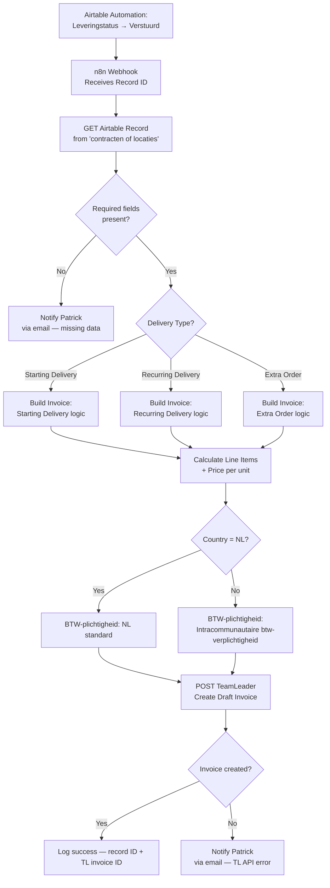

# A1: Invoicing Automation

## Goal

**Problem:** When Herbox sends an order, staff manually copy customer and order data from Airtable into Team Leader to create and send an invoice. With ~1,500 invoices per year across three delivery types, this is a significant source of manual effort and error risk.

**Solution:** When an order's shipment status changes to "Verstuurd" (sent) in Airtable, an n8n workflow automatically creates a draft invoice in Team Leader with the correct customer, location, pricing, and VAT details. Patrick or Koen reviews the draft and clicks send.

**Business Value:**
- Eliminates manual copy-paste for ~1,500 invoices/year
- Reduces billing errors from data entry mistakes
- Enables full delivery-cycle automation in Phase 2 (future scope)

---

## Flow Diagram



---

## API References

| System | Endpoints | Auth | Notes |
|--------|-----------|------|-------|
| Airtable | GET /v0/{baseId}/{tableId}/{recordId} | API Key | Read record triggered by status change |
| Team Leader Focus | GET /contacts.list | OAuth2 (client credentials) | Find customer by name |
| Team Leader Focus | GET /companies.list | OAuth2 | Find company by name |
| Team Leader Focus | POST /invoices.draft | OAuth2 | Create draft invoice |
| Team Leader Focus | GET /taxRates.list | OAuth2 | Get VAT rate IDs |

**Auth Note:** Team Leader uses **OAuth2** (no static API key). Integration registered at `marketplace.focus.teamleader.eu` as a private integration. Credentials: client ID + client secret → access token via OAuth2 flow. Sandbox available at `signup.teamleader.eu/sandbox`.

**n8n Node Strategy:**
- **Airtable:** Native n8n node (or HTTP Request to REST API)
- **Team Leader Focus:** HTTP Request nodes (no native n8n node — OAuth2 credential configured manually in n8n)
- **Code nodes:** Delivery type routing, price calculation, VAT logic, invoice payload construction

---

## N8N Workflow

**Workflow Information:**
- **Status:** New workflow (to be created)
- **n8n Instance:** `n8n-herbox-netherlands`

**Credentials Required:**
| Credential Name | Type | Description |
|----------------|------|-------------|
| Airtable API Key | API Key | Read access to "contracten of locaties" base |
| TeamLeader Focus OAuth2 | OAuth2 API | Create draft invoices; private integration |

**Key Configuration:**
- **Trigger:** Webhook (POST from Airtable automation when Leveringstatus = "Verstuurd")
- **Error Handling:** All HTTP Request nodes → Continue on Fail disabled (fail fast) + error branch → email notification to Patrick
- **Draft mode:** TeamLeader `invoices.draft` endpoint — Patrick manually reviews and sends

**Node Types Used:**
| Node | Purpose | Count |
|------|---------|-------|
| Webhook | Receive Airtable trigger | 1 |
| HTTP Request | Fetch Airtable record | 1 |
| Code | Validate required fields, route delivery type, build invoice payload | 2 |
| Switch | Route by delivery type (Starting / Recurring / Extra) | 1 |
| HTTP Request | Find TL contact/company | 1–2 |
| HTTP Request | Get VAT rate ID | 1 |
| HTTP Request | Create draft invoice (POST) | 1 |
| IF | Check invoice creation success | 1 |
| Send Email / Slack | Error notifications | 1 |

---

## Step Details

### 1. Receive Webhook from Airtable

- Airtable automation fires when field `Leveringstatus` changes to `"Verstuurd"` on a record in the `contracten of locaties` table
- Payload: Airtable record ID (and optionally key fields)
- n8n Webhook node receives POST, returns 200 immediately
- **Output:** Record ID available for next step

### 2. Fetch Full Airtable Record

- HTTP GET to Airtable REST API: `/v0/{baseId}/contracten of locaties/{recordId}`
- Use the `"Riccardo invoicing"` view fields
- **Key fields to extract:**

| Airtable Field | Meaning | Maps to TL Invoice Field |
|---|---|---|
| AccountName | Billing company name | Klant (customer) |
| Locationnaam | Location being invoiced | T.a.v. |
| PO-nummer | Purchase order number | PO reference field |
| BTW-plichtigheid | VAT type (auto-set by country) | Tax rate selection |
| Country | Customer country | VAT logic input |
| Leveringstype | Delivery type (Starting / Recurring / Extra) | Routing logic |
| Prijs per tampon | Unit price | Line item calculation |
| Aantal pakketjes | Package quantity | Line item calculation |
| Leveringsfrequentie | Delivery frequency (3/6/12 months) | Recurring delivery context |

> **Note:** Some field names are in Dutch. Full field list to be confirmed once Airtable access is set up. Patrick created view "Riccardo invoicing" under "contracten of locaties".

- **Output:** Full record object with all invoice-relevant fields

### 3. Validate Required Fields

- Code node checks that mandatory fields are non-empty: AccountName, Locationnaam, Prijs per tampon, Country, Leveringstype
- If any required field is missing: send error notification email to `patrick@herbox.nl` with record ID and missing fields; stop workflow
- **Output:** Validated record ready for routing

### 4. Route by Delivery Type

- Switch node on `Leveringstype` field:
  - `"Starting Delivery"` / `"Startlevering"` → Starting Delivery branch
  - `"Recurring Delivery"` / `"Herlevering"` → Recurring Delivery branch
  - `"Extra Order"` / `"Extra bestelling"` → Extra Order branch
  - Default → Error notification (unknown type)

> **Open question:** Exact Dutch values for Leveringstype in Airtable — to confirm during setup.

### 5. Build Invoice Line Items (per delivery type)

**Starting Delivery:**
- Product description: `"Startlevering — {Locationnaam}"`
- Quantity × unit price from Airtable
- One-time delivery; no frequency logic

**Recurring Delivery:**
- Product description: `"Herlevering {frequency} — {Locationnaam}"` (e.g., "Herlevering 6 maanden")
- Quantity × unit price
- Frequency (3/6/12 months) included in description for traceability

**Extra Order:**
- Product description: `"Extra bestelling — {Locationnaam}"`
- Quantity × unit price (ad-hoc amount from record)

All branches output a standardized invoice payload structure.

### 6. Apply VAT / BTW Logic

- Code node reads `Country` (or `BTW-plichtigheid` directly from Airtable, which auto-updates)
- **NL:** Standard Dutch BTW rate (21%) — use NL VAT rate ID from TeamLeader
- **Non-NL (e.g., BE):** `"Intracommunautaire btw-verplichtigheid"` — 0% / reverse charge; use appropriate TL tax rate
- Fetch correct tax rate ID from TeamLeader `taxRates.list` (or cache on first run)
- **Output:** Invoice payload enriched with correct `taxRateId`

### 7. Find TeamLeader Contact / Company

- HTTP GET `contacts.list` or `companies.list` filtered by `AccountName`
- Match customer to existing TL record (by name or company ID)
- If not found: error notification — customer not in TeamLeader yet
- **Output:** TeamLeader `customerId` / `contactId` for invoice

### 8. Create Draft Invoice in Team Leader

- HTTP POST to `invoices.draft`:
  ```json
  {
    "customer": { "type": "company", "id": "{tlCompanyId}" },
    "payment_term": { "type": "cash" },
    "reference": "{PO-nummer}",
    "line_items": [
      {
        "description": "{product description}",
        "quantity": {qty},
        "unit_price": { "amount": {price}, "currency": "EUR" },
        "tax_rate_id": "{taxRateId}"
      }
    ]
  }
  ```
- Note: `T.a.v. (Locationnaam)` — check if TL supports a "attention to" / sub-address field, else include in description
- **Output:** TeamLeader invoice ID of created draft

### 9. Log Result

- Record in workflow execution log: Airtable record ID, TL invoice ID, delivery type, timestamp
- On success: no notification needed (Patrick reviews drafts in TL manually)
- On failure: email to `patrick@herbox.nl` with error details

---

## Edge Cases & Error Handling

| Scenario | Handling | Recovery |
|----------|----------|----------|
| Required field missing in Airtable | Stop workflow, email Patrick with record ID + missing fields | Patrick updates Airtable, re-triggers |
| Unknown delivery type | Stop workflow, email Patrick | Patrick corrects Leveringstype |
| Customer not found in TeamLeader | Stop workflow, email Patrick | Patrick adds customer to TL |
| Non-NL country — VAT ambiguity | Use BTW-plichtigheid field from Airtable (auto-set) | Auto-handled |
| TeamLeader OAuth token expired | n8n OAuth2 credential auto-refreshes | Automatic |
| TeamLeader API error (5xx) | Retry 3× with backoff; email Patrick if still failing | Manual retry |
| Duplicate trigger (status changed twice) | Check if TL draft invoice already exists for record; skip if yes | Idempotent |
| PO number blank | Omit PO field from invoice (not always required) | Continue |
| Airtable webhook missed | Patrick can manually trigger by re-saving the record | Manual |

---

## Testing

### Manual Testing in N8N

**Setup:**
1. Use a test Airtable record with `Leveringstatus = "Verstuurd"` for each delivery type
2. Disable the "Create Draft Invoice" HTTP node initially
3. Inspect Code node outputs to verify payload structure

**Test Execution (per delivery type):**
1. Starting Delivery: Trigger with a NL customer record → verify correct description, NL VAT rate
2. Starting Delivery: Trigger with a BE customer record → verify Intracommunautaire VAT
3. Recurring Delivery: Trigger with 3-month, 6-month, 12-month records → verify frequency in description
4. Extra Order: Trigger with ad-hoc order record → verify description

**Single Write Test:**
1. Enable "Create Draft Invoice" node for one test record
2. Verify in TeamLeader sandbox:
   - Draft invoice created with correct customer
   - Line items correct (description, qty, price)
   - VAT rate correct
   - PO number populated
   - Location name visible (T.a.v. or description)

**Error Path Tests:**
1. Trigger with missing AccountName → verify error email sent
2. Trigger with unknown Leveringstype → verify error email sent
3. Trigger with BE customer → verify Intracommunautaire VAT applied

**Production Run:**
1. First run: 1 real order with Patrick watching in TeamLeader
2. Patrick reviews draft → confirms correct → sends manually
3. Monitor for 1 week with weekly check-ins

### Acceptance Criteria

- [ ] Airtable status change triggers n8n webhook correctly
- [ ] All three delivery types produce correctly formatted draft invoices in TeamLeader
- [ ] NL customers get standard 21% BTW; non-NL get Intracommunautaire VAT
- [ ] Location name (Locationnaam) visible on invoice
- [ ] PO number populated when present in Airtable
- [ ] Missing required field → error email sent to Patrick, no TL draft created
- [ ] Re-triggering same record does not create duplicate invoices
- [ ] TeamLeader sandbox tests pass before production go-live

---

## Implementation Notes

**Orchestrator:** n8n (HTTP Request nodes for TeamLeader Focus; Airtable native node or HTTP Request)

**Node Strategy:**
- **Native n8n nodes:** Airtable (for reading records)
- **HTTP Request nodes:** TeamLeader Focus (OAuth2 — private integration)
- **Code nodes:** Delivery type routing, invoice payload construction, VAT logic

**Credentials Setup:**
| Credential | Type | Notes |
|------------|------|-------|
| Airtable API Key | API Key | Read-only access to "contracten of locaties" base |
| TeamLeader Focus | OAuth2 API | Private integration; client ID + secret from TL developer portal; sandbox first |

**Environment / Access Still Needed:**
- [ ] Airtable API key + base ID
- [ ] TeamLeader OAuth2 client ID + secret (Patrick to share developer access via Teams call)
- [ ] Confirm exact Dutch field names from Airtable view
- [ ] Confirm exact Leveringstype field values (Dutch strings)
- [ ] Confirm how "T.a.v." (Locationnaam) maps in TeamLeader invoice fields

**Contacts:**
- Patrick Bosma — `patrick@herbox.nl` — Head of Benelux Operations, primary contact
- Koen Stielstra — `koen@herbox.nl` — Technical, cc on project emails

---

## Phase 2 (Out of Scope — Future)

Once Phase 1 is stable, the roadmap is to automate the full delivery cycle:
1. Customer signs contract → Starting delivery triggered automatically
2. System tracks delivery schedule (3/6/12 month cadence) based on Airtable contract terms
3. When delivery date arrives → shipment sent + invoice created automatically (no manual trigger)

This will be a separate spec when contracted.

---

## Changelog

| Version | Date | Changes |
|---------|------|---------|
| 1.0.0 | 2026-02-18 | Initial specification — built from calls (Jan 22, Jan 29), emails (Jan 30 – Feb 11), and proposal PDF |
