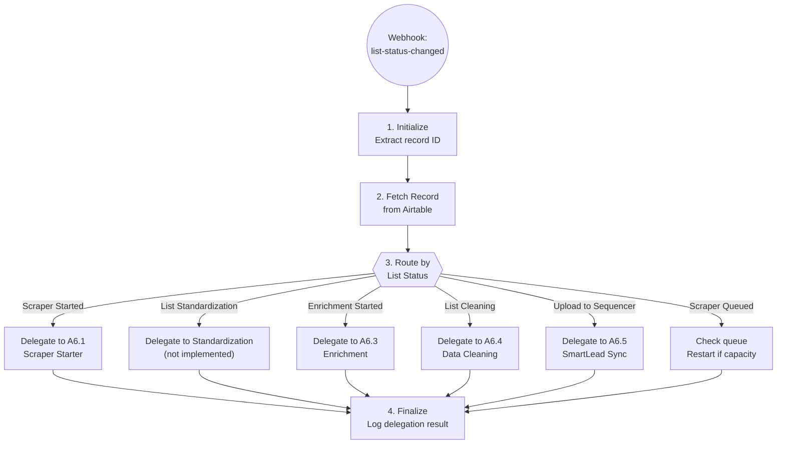

# List Building Orchestrator

## What This Does

The List Building Orchestrator automates your entire lead list building process. Instead of manually managing each stage (scraping, enriching, cleaning, uploading), you simply update the status in Airtable and the system automatically handles the rest.

**Runs:** Triggered automatically whenever you change a list's status in Airtable

## How It Works

Think of this as a smart assistant watching your Airtable List Building table. When you change a list's status, it automatically:

1. **Scraper Started** - Launches the appropriate web scraper (LinkedIn Sales Navigator or Apollo) to find leads based on your search criteria
2. **Enrichment & Verification Started** - Finds email addresses and verifies they're valid
3. **List Cleaning Started** - Uses AI to standardize company names and translate job titles to English
4. **Upload to Email Sequencer** - Syncs cleaned leads to SmartLead for outreach campaigns

## Pipeline Flow

## Example Workflow

### Before (Manual Process)

1. Search for leads in LinkedIn Sales Navigator
2. Export leads manually
3. Upload to separate enrichment tool
4. Download results, import to spreadsheet
5. Clean up company names and job titles by hand
6. Import to email sequencing tool
7. Hope you didn't miss anything or introduce errors

**Time:** 2-3 hours per list

### After (Automated)

1. Create a new record in Airtable List Building table
2. Paste your LinkedIn Sales Navigator search URL
3. Set "List Type" to "Apify - Sales Navigator"
4. Change status to "Scraper Started"
5. Walk away - the system handles everything else

**Time:** 2 minutes of setup, then fully automated

## What You'll See

When the automation runs, you'll see progress in Airtable:

### During Scraping
- **Status:** Changes to "Scraper In Progress"
- **Scraper ID:** Populated with the Apify run ID (for tracking)
- **Note:** If 4 scrapers are already running, status will be "Scraper Queued" until capacity is available

### After Scraping Completes
- **Status:** Automatically updated to next stage
- **Lead Count:** Number of leads found
- **Contacts:** Leads appear in the Contacts table, linked to this list

### During Enrichment
- **Status:** "Enrichment & Verification Started" → "Enrichment Completed"
- **Progress:** Email addresses added to contact records
- **Verification:** Invalid emails filtered out

### During Cleaning
- **Status:** "List Cleaning Started" → "Cleaning Completed"
- **Changes:** Company names standardized, job titles translated to English
- **AI-Powered:** Uses GPT-4 for intelligent data normalization

### Final Upload
- **Status:** "Upload to Email Sequencer" → "Complete"
- **Result:** Leads synced to SmartLead, ready for outreach campaigns

## Status Meanings

| Status | What It Means | What Happens Next |
|--------|---------------|-------------------|
| Scraper Queued | Waiting for scraper capacity | Automatically starts when a slot opens |
| Scraper Started | Scraper is launching | Status changes to "In Progress" within seconds |
| Scraper In Progress | Actively scraping leads | Completes in 5-30 minutes depending on list size |
| Scraper Completed | Scraping done, leads saved | Automatically moves to next stage |
| Enrichment & Verification Started | Finding and verifying emails | Takes 1-5 minutes per 100 contacts |
| Enrichment Completed | Emails found and verified | Ready for cleaning |
| List Cleaning Started | AI is cleaning data | Takes 30 seconds per 100 contacts |
| Cleaning Completed | Data is clean and standardized | Ready for upload |
| Upload to Email Sequencer | Syncing to SmartLead | Final step |
| Complete | All done | Leads ready for outreach |

## Required Fields in Airtable

To use this automation, your list record must have:

| Field | Required For | Example |
|-------|-------------|---------|
| List Name | All stages | "Tech Leads - Q1 2026" |
| List Type | Scraping | "Apify - Sales Navigator" or "Apify - Apollo" |
| List URL | Scraping | Your Sales Navigator or Apollo search URL |
| Max Results | Scraping (optional) | 500 (limits number of leads) |

## Scraper Queue System

To protect against rate limits, the system only runs **4 scrapers at a time**.

If you start a 5th scraper:
- Status automatically changes to "Scraper Queued"
- Your list waits in line
- When a scraper finishes, your list automatically starts

**Tip:** Check the dashboard logs to see how many scrapers are currently running.

## Troubleshooting

### "Scraper Queued" for a long time
**What's happening:** All 4 scraper slots are occupied
**What to do:** Wait for other scrapers to complete (usually 5-30 minutes), or check the dashboard to see which lists are running

### Error: "missing_list_url"
**What's happening:** You changed status to "Scraper Started" but didn't provide a URL
**What to do:** Fill in the "List URL" field with your search URL, then change status back to "Scraper Started"

### Error: "missing_list_type"
**What's happening:** System doesn't know which scraper to use
**What to do:** Set "List Type" to either "Apify - Sales Navigator" or "Apify - Apollo"

### Error: "linkedin_credentials_not_configured"
**What's happening:** LinkedIn cookies have expired
**What to do:** Contact support - we'll refresh the credentials (happens every few weeks)

### No emails found during enrichment
**What's happening:** Enrichment APIs couldn't find emails for those contacts
**What to do:** This is normal for some leads. Check enrichment summary in logs to see success rate

### Scraper completed but no leads
**What's happening:** Your search criteria were too narrow, or LinkedIn returned no results
**What to do:** Adjust your search in LinkedIn/Apollo, get a new URL, and try again

## Important Notes

### LinkedIn Scraping
- Uses residential proxies to avoid detection
- Adds random delays between requests (5-30 seconds) to appear human
- Respects LinkedIn's structure - won't get your account flagged

### Data Privacy
- All data stored in your Airtable base
- Email verification happens via secure APIs (LeadMagic, TryKitt, UseBouncer)
- No data shared with third parties except necessary API services

### Costs
- **Apify:** Charged per compute unit (usually $1-5 per list depending on size)
- **Email Enrichment:** Charged per contact enriched
- **SmartLead:** Your existing subscription

## Dashboard

View automation activity:
1. Go to your automation dashboard
2. Click "Logs" in navigation
3. Filter by "A6 List Building"
4. See detailed execution steps for each run

Each log entry shows:
- Which list was processed
- Which status triggered the automation
- Step-by-step progress
- Any errors or warnings
- Final result

## Questions?

If you have questions about this automation:
- Check the dashboard logs for recent activity and error details
- Review the status meanings table above
- Contact support with the specific list record ID if something seems stuck

---

*Last updated: 2026-01-22*
