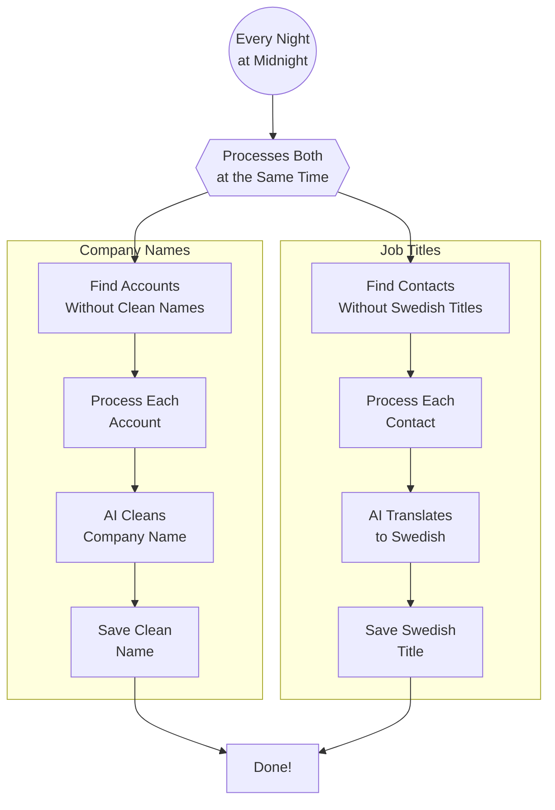

# Lead Data Cleaning

Clean and standardize company names and job titles automatically to improve email personalization quality.

## What This Does

**Problem:** LinkedIn scrapers give us messy data - company names like "Acme Corp, LLC™" and English job titles like "Chief Executive Officer" that don't work well in Swedish emails.

**Solution:** Every night, this automation uses AI to clean up your lead data automatically:
- Company names become clean and professional ("Acme Corp, LLC™" → "Acme Corp")
- Job titles get translated to natural Swedish ("Chief Executive Officer" → "VD")

**Result:** Better email personalization means higher open rates and fewer bounces from malformed data.

**Runs:** Every day at midnight (Stockholm time)

## How It Works

1. **Find Records to Clean** - Looks for accounts without cleaned names and contacts without Swedish titles
2. **AI Cleaning** - Uses GPT-4 to normalize company names and translate job titles
3. **Update Airtable** - Saves the cleaned data back to your Airtable

## What You'll See

When this automation runs successfully, you'll see in Airtable:

**In the Accounts table:**
- `Account Name (Cleaned)` field gets populated with clean company names
- Examples:
  - "Nike™" → "Nike"
  - "Acme Corp, LLC" → "Acme Corp"
  - "American Council of Learned Societies (ACLS)" → "ACLS"

**In the Contacts table:**
- `SL_title` field gets populated with Swedish job titles
- Examples:
  - "Chief Executive Officer" → "VD"
  - "Facility Manager" → "fastighetsansvarig"
  - "HR Director" → "HR-ansvarig"
  - "Procurement Specialist" → "inköpare"

**In the Dashboard:**
- Success notification with counts (e.g., "Cleaned 45 accounts, 120 contacts")
- Any failures are logged with details

## Example

### Before (Manual Process)
1. LinkedIn scraper imports 200 leads
2. Someone had to manually:
   - Remove "LLC", "Inc.", "™" from company names
   - Translate each job title to Swedish
   - Check grammar for email personalization
3. Took hours of manual work
4. Often had inconsistencies

### After (Automated)
1. LinkedIn scraper imports 200 leads at 3pm
2. At midnight, automation runs automatically
3. By morning, all 200 leads have:
   - Clean company names
   - Swedish job titles
   - Consistent formatting
4. Zero manual work needed

## Status Meanings

When you check the dashboard logs, you may see:

| Status | What It Means |
|--------|---------------|
| Success | All records cleaned successfully |
| Partial Success | Some records cleaned, some failed (check logs for details) |
| Failed | Automation encountered an error - team has been notified |

## Troubleshooting

### "No records cleaned"
This is normal if all your data is already clean. The automation only processes:
- Accounts where `Account Name (Cleaned)` is empty
- Contacts where `SL_title` is empty

### "Some records failed to clean"
Check the dashboard logs for specific errors. Common causes:
- Record has no company name or title to clean
- Temporary API issue (will retry tomorrow)

### "Company name looks wrong"
The AI occasionally over-simplifies. For example:
- "IBM Cloud Solutions" might become "IBM"
- You can manually correct these in Airtable

### "Job title translation is too generic"
For very specialized roles, the AI defaults to generic titles:
- "Diversity, Equity, and Inclusion Officer" → "HR-ansvarig"
- You can manually edit `SL_title` field if needed

### "Automation didn't run last night"
Check:
1. Dashboard logs for error messages
2. Railway service status (in case of downtime)
3. Contact technical support if issue persists

## What Gets Cleaned

**Company Names:**
- ✓ Removes: LLC, Inc., Corp., DBA
- ✓ Removes: ™, ©, ®, emojis
- ✓ Removes: Extra text after | or -
- ✓ Uses acronyms when appropriate (ACLS instead of full name)
- ✓ Keeps maximum 3 words
- ✓ Title case formatting

**Job Titles:**
- ✓ Translates to Swedish
- ✓ Grammatically correct for "Jag såg att du är {title} på företag XYZ"
- ✓ Uses lowercase (except HR, IT, DEI)
- ✓ Short and professional
- ✓ Context-aware (knows facilities vs. HR roles)

## Questions?

If you have questions about this automation:
- **Check the logs:** Dashboard shows recent activity and any errors
- **Airtable fields:** Look for `Account Name (Cleaned)` and `SL_title`
- **Contact support:** If something looks wrong or you need help

---
*This automation runs automatically - no action needed from you!*
*Last updated: 2026-01-22*
