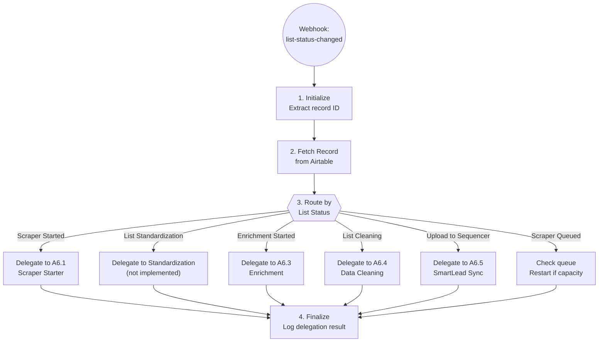

# List Building Orchestrator - Technical Documentation

## Overview

Pure orchestrator that watches Airtable record status changes and delegates to appropriate sub-automations for each stage of the list building pipeline. Contains no business logic - only routing and coordination.

| Field | Value |
|-------|-------|
| Spec | `specs/automations/a6-list-building.md` |
| Code | `app/automations/list_building_orchestrator.py` |
| Version | 2.0.0 |
| Status | Implemented |
| Automation ID | a6 |

## Architecture

The orchestrator acts as a pure router, receiving webhook events from Airtable when a list record's status changes, then delegating execution to the appropriate sub-automation:



### System Components

```
┌─────────────────────────────────────────────────────────────────────┐
│                           A6 Orchestrator                            │
│                    (Routing & Coordination Only)                     │
│                                                                      │
│  Watches: List Status field in Airtable                             │
│  Trigger: Webhook when status changes                                │
│  Action: Routes to appropriate sub-automation                        │
└─────────────────────────────────────────────────────────────────────┘
                                    │
                    ┌───────────────┼───────────────┐
                    │               │               │
                    ▼               ▼               ▼
        ┌───────────┐     ┌───────────┐     ┌───────────┐
        │   A6.1    │     │   A6.2    │     │   A6.3    │
        │  Scraper  │     │ Completion│     │Enrichment │
        │  Starter  │     │ Handler   │     │           │
        └───────────┘     └───────────┘     └───────────┘
                    │               │               │
                    ▼               ▼               ▼
        ┌───────────┐     ┌───────────┐     ┌───────────┐
        │   A6.4    │     │   A6.5    │     │   A7      │
        │  Cleaning │     │SmartLead  │     │Campaign   │
        │           │     │  Sync     │     │  Sync     │
        └───────────┘     └───────────┘     └───────────┘
```

## Dependencies

| Package | Version | Purpose |
|---------|---------|---------|
| httpx | 0.27.0 | HTTP client for Airtable and Apify APIs |
| pydantic | 2.5.0 | Data validation and settings management |
| fastapi | 0.109.0 | Webhook endpoint framework |

## Configuration

### Environment Variables

| Variable | Required | Description | Example |
|----------|----------|-------------|---------|
| AIRTABLE_TOKEN | Yes | Airtable personal access token | `pat...` |
| AIRTABLE_BASE_ID | Yes | Airtable base ID | `app4gZ66mB8m3Vvj0` |
| APIFY_API_TOKEN | Yes (for lead sourcing) | Apify API token for scraping | `apify_api_...` |

### Constants

Defined in `list_building_orchestrator.py`:

```python
AIRTABLE_BASE_ID = "app4gZ66mB8m3Vvj0"
AIRTABLE_TABLE_LIST_BUILDING = "tblcFFxDCN0788xjF"
AIRTABLE_TABLE_CONFIG = "tblOizkzkLtBjIpBt"
MAX_CONCURRENT_SCRAPERS = 4
LINKEDIN_SCRAPER_ID = "7Q2x4Chr5xNR5s4dP"
APOLLO_SCRAPER_ID = "3HXDJqKfVlhmEHt7A"
```

### Settings Configuration

Uses centralized settings from `app/config.py` via Pydantic Settings.

## API Endpoints Used

### Airtable

| Endpoint | Method | Purpose |
|----------|--------|---------|
| `/v0/{base_id}/{table_id}/{record_id}` | GET | Fetch list record details |
| `/v0/{base_id}/{table_id}/{record_id}` | PATCH | Update record status |
| `/v0/{base_id}/{table_id}` | GET | Search config records for credentials |

### Apify

| Endpoint | Method | Purpose |
|----------|--------|---------|
| `/v2/actor-runs` | GET | Check running actor count |
| `/v2/acts/{actor_id}/runs` | POST | Start scraper actor |

## Implementation Details

### Step 1: Initialize

**Location:** `run()` method, lines 218-229

```python
# Validate payload
if "recordId" not in payload:
    logger.error("Missing recordId in payload")
    exec_logger.finalize("failed", error="missing_record_id")
    return {"error": "missing_record_id", ...}

record_id = payload["recordId"]
logger.info(f"Processing list record: {record_id}")

# Initialize API clients
await self._init_clients()
```

**Validations:**
- Payload must contain `recordId` field
- Airtable token must be configured

**Output:** Clients initialized, record ID extracted

### Step 2: Fetch Record

**Location:** `run()` method, lines 232-238

```python
airtable_record = await self.airtable_client.get_record(
    AIRTABLE_TABLE_LIST_BUILDING,
    record_id,
)
record = ListRecord.from_airtable(record_id, airtable_record.fields)
```

**Data Extracted:**
- `list_name`: Display name for the list
- `list_status`: Current status (drives routing)
- `list_type`: Scraper type (Apollo or Sales Navigator)
- `list_url`: Source URL for scraping
- `max_results`: Optional result limit
- `scraper_id`: Apify run ID (if scraper running)

### Step 3: Route by Status

**Location:** `get_sub_flow()` function, lines 148-158

```python
def get_sub_flow(status: str) -> SubFlow | None:
    """Route status to appropriate sub-flow."""
    routing = {
        ListStatus.SCRAPER_STARTED.value: SubFlow.LEAD_SOURCING,
        ListStatus.SCRAPER_QUEUED.value: SubFlow.LEAD_SOURCING,
        ListStatus.LIST_STANDARDIZATION.value: SubFlow.STANDARDIZATION,
        ListStatus.ENRICHMENT_STARTED.value: SubFlow.ENRICHMENT,
        ListStatus.LIST_CLEANING.value: SubFlow.CLEANING,
        ListStatus.UPLOAD_TO_SEQUENCER.value: SubFlow.UPLOAD,
    }
    return routing.get(status)
```

**Routing Table:**

| List Status | Sub-Flow | Handler Method | Automation |
|-------------|----------|----------------|------------|
| Scraper Started | `LEAD_SOURCING` | `_handle_lead_sourcing()` | Inline (was A6.1) |
| Scraper Queued | `LEAD_SOURCING` | `_handle_lead_sourcing()` | Inline (check queue) |
| List Standardization | `STANDARDIZATION` | `_handle_standardization()` | Not implemented |
| Enrichment & Verification Started | `ENRICHMENT` | `_handle_enrichment()` | A6.3 ContactEnrichment |
| List Cleaning Started | `CLEANING` | `_handle_cleaning()` | A6.4 DataCleaning |
| Upload to Email Sequencer | `UPLOAD` | `_handle_upload()` | Not implemented |

**Unknown Status Handling:**
- Returns `None` from `get_sub_flow()`
- Orchestrator logs warning and returns `{"status": "skipped"}`
- No error thrown - graceful degradation

### Step 4: Execute Sub-Flow

**Location:** `run()` method, lines 252-267

```python
if sub_flow == SubFlow.LEAD_SOURCING:
    result = await self._handle_lead_sourcing(record, dry_run, exec_logger)
elif sub_flow == SubFlow.ENRICHMENT:
    result = await self._handle_enrichment(record, dry_run, exec_logger)
elif sub_flow == SubFlow.CLEANING:
    result = await self._handle_cleaning(record, dry_run, exec_logger)
# ... etc
```

Each handler:
1. Validates required fields for that sub-flow
2. Either executes inline logic or delegates to sub-automation
3. Updates Airtable record with results
4. Returns result dictionary

#### Lead Sourcing Handler (lines 279-372)

Handles scraper queue management and starting scrapers:

```python
async def _handle_lead_sourcing(
    self,
    record: ListRecord,
    dry_run: bool,
    exec_logger: ExecutionLogger,
) -> dict[str, Any]:
```

**Process:**
1. Validate `list_url` and `list_type` are present
2. Check Apify running actors against `MAX_CONCURRENT_SCRAPERS`
3. If at capacity: update status to "Scraper Queued", return
4. If capacity available:
   - Build scraper config based on `list_type`:
     - **Apollo**: Uses `build_apollo_config()` (line 56)
     - **Sales Navigator**: Fetches LinkedIn credentials from Airtable Configs, uses `build_sales_nav_config()` (line 65)
   - Start Apify actor with config
   - Update Airtable: status → "Scraper In Progress", save run ID
   - Return scraper run details

**LinkedIn Credentials Handling (lines 374-439):**

Sales Navigator scraping requires cookies and user agent. The orchestrator:
1. Queries Airtable Configs table for credential records
2. Tries each configured cookie field in order: `Linkedin_cookie_a`, `Linkedin_cookie_b`, etc.
3. Uses first valid JSON cookie array found
4. Returns cookies + user agent for scraper config

#### Enrichment Handler (lines 458-497)

Delegates to ContactEnrichment automation:

```python
enrichment = ContactEnrichment()
result = await enrichment.run(dry_run=dry_run, list_id=record.id)
```

Updates list status to "Enrichment Completed" on success.

#### Cleaning Handler (lines 499-536)

Delegates to DataCleaning automation:

```python
result = await run_data_cleaning(dry_run=dry_run, list_id=record.id)
```

Updates list status to "Cleaning Completed" on success.

### Step 5: Finalize

**Location:** `run()` method, lines 268-277

```python
exec_logger.finalize("success")
return result
```

**Exception Handling:**
- Catches all exceptions from sub-flows
- Logs error via `ExecutionLogger`
- Re-raises exception for webhook to handle
- Always closes API clients in `finally` block

**Logging:**
- Each step logged via `ExecutionLogger.step()`
- Execution summary stored in database
- Viewable in dashboard logs

## Error Handling

| Error Type | Handling | Recovery |
|------------|----------|----------|
| Missing `recordId` in payload | Return error response | Client should retry with valid payload |
| Airtable record not found | Exception raised, logged | Verify record ID in Airtable |
| Unknown status value | Return `{"status": "skipped"}` | Add status to routing table if needed |
| Missing required fields (`list_url`, `list_type`) | Return error response | User must fill in fields in Airtable |
| Apify not configured | Return error response | Set `APIFY_API_TOKEN` environment variable |
| LinkedIn credentials not found | Return error response | Add credentials to Airtable Configs table |
| Sub-automation failure | Exception bubbles up, logged | Check sub-automation logs for details |
| Airtable rate limit (429) | Retry with exponential backoff | Built into `AirtableClient` |

## Testing

### Run Tests

```bash
cd clients/herbox-sweden/automations
uv run pytest tests/test_list_building.py -v
```

### Test Coverage

**Unit Tests:**
- `test_route_scraper_started()` - Routes Scraper Started to LEAD_SOURCING
- `test_route_enrichment_started()` - Routes Enrichment to ENRICHMENT
- `test_route_unknown_status()` - Returns None for unknown status
- `test_should_queue_scraper()` - Capacity logic with various running counts
- `test_build_apollo_config()` - Apollo scraper config generation
- `test_build_sales_nav_config()` - Sales Nav config with/without max_results
- `test_from_airtable_full_fields()` - ListRecord parsing with all fields
- `test_from_airtable_minimal_fields()` - ListRecord with only some fields

**Integration Tests:**
- `test_run_missing_record_id()` - Validates error handling for missing recordId
- `test_run_dry_run_scraper_started()` - Dry run of full lead sourcing flow

### Dry Run Mode

Test orchestrator without making changes:

```bash
# Via Python
uv run python -m app.automations.list_building_orchestrator rec123abc --dry-run

# Via webhook (requires running server)
curl -X POST http://localhost:8000/webhooks/list-status-changed \
  -H "Content-Type: application/json" \
  -d '{"recordId": "rec123abc"}' \
  --get-query dry_run=true
```

### Manual Testing Checklist

- [ ] Webhook receives recordId from Airtable
- [ ] Fetches list record successfully
- [ ] Routes to correct sub-flow based on status
- [ ] Delegates to sub-automation
- [ ] Returns sub-automation result
- [ ] Updates Airtable record with results
- [ ] Logs execution to database
- [ ] Handles unknown statuses gracefully
- [ ] Handles missing fields gracefully
- [ ] Closes API clients after execution

## Monitoring

### Logs

- **Dashboard:** `https://{railway-url}/` → Logs section
- **Railway Logs:** `railway logs` command or Railway dashboard
- Each execution logged with:
  - Automation ID: `a6_list_building`
  - Trigger: `webhook`
  - Steps with output summaries
  - Final status: `success`, `failed`, or `skipped`

### Alerts

- Self-healing webhook configured via `SELF_HEALING_WEBHOOK` env var
- Triggered on automation failures
- Includes execution context and error details

### Metrics

Track in dashboard:
- Execution count per status type
- Success rate by sub-flow
- Average execution time
- Queue wait time (for scrapers)

## Maintenance Notes

### Rate Limiting

- **Airtable:** 5 requests/sec per base (handled by client retry logic)
- **Apify:** No strict rate limits, but actor concurrency managed by `MAX_CONCURRENT_SCRAPERS`

### Queue Management

The orchestrator implements queue-based concurrency control:
- Max 4 concurrent scrapers (configurable via `MAX_CONCURRENT_SCRAPERS`)
- When at capacity: status set to "Scraper Queued"
- Queued scrapers can be re-triggered by:
  - Manually changing status back to "Scraper Queued" in Airtable
  - Implementing periodic queue checker (not yet implemented)

### LinkedIn Credentials Rotation

Sales Navigator scraping uses cookies that expire. To rotate:
1. Export new cookies using Cookie-Editor Chrome extension
2. Add to Airtable Configs table (try next available field: `Linkedin_cookie_b`, `Linkedin_cookie_c`, etc.)
3. Orchestrator automatically tries each in order until finding valid cookies

### Common Issues

**Issue:** Scraper stuck in "Scraper Queued" status
- **Cause:** All 4 scraper slots occupied
- **Solution:** Wait for running scrapers to complete, or manually set status to "Scraper Started" to re-check queue

**Issue:** "linkedin_credentials_not_configured" error
- **Cause:** No valid LinkedIn cookies in Airtable Configs table
- **Solution:** Export fresh cookies and add to Configs table

**Issue:** "missing_list_url" or "missing_list_type" error
- **Cause:** Required fields not filled in Airtable
- **Solution:** Complete the list record in Airtable before triggering

## Changelog

| Version | Date | Changes |
|---------|------|---------|
| 2.0.0 | 2026-01-14 | **REFACTOR**: Extracted scraper logic to inline implementation (was separate A6.1 automation), now pure orchestrator with embedded lead sourcing |
| 1.0.0 | 2026-01-09 | Initial specification (converted from N8N workflow) |

---

*Last updated: 2026-01-22*
