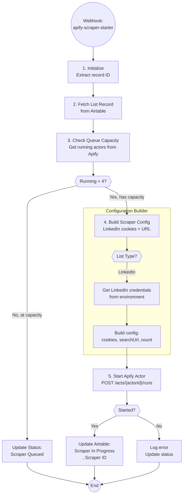

# Apify Scraper Starter - Technical Documentation

## Overview

Automation A6.1 manages the startup of Apify LinkedIn scrapers with intelligent queue capacity management. When a list is ready for scraping (triggered by A6 orchestrator), this automation checks if resources are available, builds proper scraper configuration with LinkedIn cookies, and starts the Apify actor.

| Field | Value |
|-------|-------|
| Spec | `specs/automations/a6.1-apify-scraper-starter.md` |
| Code | `app/automations/apify_scraper_starter.py` |
| Version | 1.0.0 |
| Status | Implemented |
| Trigger | Webhook (POST /webhooks/apify-scraper-starter) |

## Architecture



## Dependencies

| Package | Version | Purpose |
|---------|---------|---------|
| httpx | 0.27.0 | HTTP client for Airtable and Apify APIs |
| pydantic | 2.5.0 | Data validation and settings management |
| app/clients/airtable | - | Airtable API wrapper |
| app/clients/apify | - | Apify API wrapper |

## Configuration

### Environment Variables

| Variable | Required | Description | Example |
|----------|----------|-------------|---------|
| AIRTABLE_API_KEY | Yes | Airtable personal access token | patABC123... |
| APIFY_API_TOKEN | Yes | Apify API bearer token | apify_api_ABC123... |
| LINKEDIN_USER_AGENT | Yes | Browser user agent string | Mozilla/5.0... |

### Airtable Configuration

LinkedIn cookies are stored in the Airtable **Configs** table (`tblOizkzkLtBjIpBt`) using a Field/Value structure:

| Field Name | Required | Description | Format |
|------------|----------|-------------|--------|
| Linkedin_cookie_a | Yes* | Primary LinkedIn account cookies | JSON array (Cookie-Editor format) |
| Linkedin_cookie_b | No | Backup LinkedIn account cookies | JSON array |
| Linkedin_cookie_c | No | Additional backup cookies | JSON array |

*At least one cookie field must be populated. The system tries them in order (a → b → c) until valid cookies are found.

**Cookie Format Example:**
```json
[
  {"name": "li_at", "value": "AQEDATAbCDEfGHI...", "domain": ".linkedin.com"},
  {"name": "JSESSIONID", "value": "ajax:1234567890123456789", "domain": ".linkedin.com"}
]
```

### Constants

| Constant | Value | Description |
|----------|-------|-------------|
| AIRTABLE_BASE_ID | app4gZ66mB8m3Vvj0 | Herbox Airtable base |
| AIRTABLE_TABLE_LIST_BUILDING | tblcFFxDCN0788xjF | List Building table |
| AIRTABLE_TABLE_CONFIG | tblOizkzkLtBjIpBt | Configuration table (for cookies) |
| LINKEDIN_SCRAPER_ID | 7Q2x4Chr5xNR5s4dP | Apify actor ID (curious_coder/linkedin-people-search-scraper) |
| MAX_CONCURRENT_SCRAPERS | 4 | Maximum concurrent Apify actors |

## API Endpoints Used

| System | Endpoint | Method | Purpose |
|--------|----------|--------|---------|
| Airtable | /v0/{baseId}/{tableId}/records/{recordId} | GET | Fetch list record details |
| Airtable | /v0/{baseId}/{tableId}/records/{recordId} | PATCH | Update list status and scraper ID |
| Airtable | /v0/{baseId}/{tableId}/records | GET | Fetch config records (cookies) |
| Apify | /v2/actor-runs?status=RUNNING | GET | Check running actor count |
| Apify | /v2/acts/{actorId}/runs | POST | Start actor with configuration |

## Implementation Details

### Step 1: Initialize

**Code Location:** Lines 219-226

What happens:
- Extracts `recordId` from webhook payload
- Validates payload has required recordId field
- Initializes Airtable and Apify API clients
- Creates ExecutionLogger for step tracking

Validation:
- Raises ValueError if recordId is missing

### Step 2: Fetch List Record

**Code Location:** Lines 228-246

What data is fetched:
- List record from Airtable List Building table
- Required fields: `List URL`, `List Type`
- Optional fields: `Max Results`, `List Name`

Filtering applied:
- None (direct record fetch by ID)

Error handling:
- Raises ValueError if List URL is missing
- Raises ValueError if List Type is missing

### Step 3: Check Queue Capacity

**Code Location:** Lines 248-271

Logic:
1. Calls Apify API to get currently running actors
2. Compares `running_count` against `MAX_CONCURRENT_SCRAPERS` (4)
3. If at/over capacity:
   - Updates Airtable status to "Scraper Queued"
   - Returns early with queued status
4. If under capacity:
   - Proceeds to build config and start scraper

Queue function (`should_queue`):
```python
def should_queue(running_count: int, max_count: int) -> bool:
    """Returns True if running_count >= max_count"""
    return running_count >= max_count
```

### Step 4: Build Scraper Configuration

**Code Location:** Lines 273-302

LinkedIn cookie fetching (`_get_linkedin_cookies` method, lines 133-199):
1. Fetches all records from Airtable Config table
2. Builds a Field → Value map from config records
3. Tries each cookie field in order: `Linkedin_cookie_a` → `Linkedin_cookie_b` → `Linkedin_cookie_c`
4. Parses JSON cookies and validates format
5. Returns first valid cookie set found
6. Raises ValueError if no valid cookies found

Config builder (`build_linkedin_config` function, lines 51-85):
```python
{
    "cookie": cookies,  # LinkedIn cookies from Airtable
    "searchUrl": list_url,  # Sales Navigator URL
    "userAgent": user_agent,  # From environment
    "startPage": 1,
    "minDelay": 2,  # Delay between requests (seconds)
    "maxDelay": 5,
    "proxy": {
        "useApifyProxy": True,  # Required for this actor
    },
    "count": max_results  # Optional, only if specified
}
```

Dry run mode:
- Uses mock cookies instead of fetching from Airtable
- Skips actual scraper start in Step 5

### Step 5: Start Apify Actor

**Code Location:** Lines 304-320

API call made:
```python
run = await apify_client.start_actor(
    actor_id="7Q2x4Chr5xNR5s4dP",
    input_config=scraper_config,
    timeout_secs=86400,  # 24 hours
)
```

Returns:
- `run.id`: Apify run ID for tracking
- `run.status`: Current status (READY or RUNNING)

Dry run behavior:
- Returns early with status "dry_run"
- Includes config that would have been sent
- Doesn't call Apify API

### Step 6: Update Airtable Status

**Code Location:** Lines 322-332

Fields updated:
```python
{
    "List Status": "Scraper In Progress",
    "Scraper ID": run.id  # For A6.2 completion handler
}
```

The Scraper ID is critical - it's used by A6.2 (Lead Sourcing Completed) to match the webhook when Apify completes.

### Step 7: Finalize

Cleanup actions:
- Closes Airtable client connection
- Closes Apify client connection
- Finalizes execution log with success/failure status

Return value:
```python
{
    "status": "scraper_started",
    "run_id": "run123",
    "run_status": "RUNNING",
    "actor_id": "7Q2x4Chr5xNR5s4dP",
    "list_id": "rec123"
}
```

## Error Handling

| Error Type | Handling | Recovery |
|------------|----------|----------|
| Missing recordId | ValueError, log failure | Manual - fix webhook call |
| Missing List URL | ValueError, log failure | Manual - update Airtable record |
| Missing List Type | ValueError, log failure | Manual - update Airtable record |
| No LinkedIn cookies in config | ValueError with helpful message | Manual - add cookies to Config table |
| Invalid cookie JSON | Tries next cookie field (a→b→c) | Auto - fallback to backup cookies |
| All cookies invalid | ValueError, log failure | Manual - refresh cookies in Config table |
| Queue at capacity | Update to "Scraper Queued", return success | Auto - A6 orchestrator will retry |
| Apify auth error (401) | httpx.HTTPStatusError, log failure | Manual - refresh APIFY_API_TOKEN |
| Apify rate limit (429) | httpx.HTTPStatusError, log failure | Auto - retry with backoff |
| Network timeout | httpx.TimeoutException, log failure | Auto - retry via self-healing |
| Airtable API error | httpx.HTTPStatusError, log failure | Auto - retry via self-healing |

## Testing

### Run Tests

```bash
cd clients/herbox-sweden/automations
uv run pytest tests/test_apify_scraper_starter.py -v
```

### Dry Run

```bash
# Test with mock data (no actual API calls)
uv run python -m app.automations.apify_scraper_starter --dry-run

# Test with specific record ID
uv run python -m app.automations.apify_scraper_starter rec123 --dry-run
```

### Test Coverage

All 24 unit tests passing:

**Queue Capacity Tests:**
- `test_should_queue_at_capacity` - Queue when running=4, max=4
- `test_should_queue_over_capacity` - Queue when running=5, max=4
- `test_should_not_queue_under_capacity` - Don't queue when running<4

**Config Builder Tests:**
- `test_build_linkedin_config_basic` - Basic LinkedIn config structure
- `test_build_linkedin_config_with_max_results` - Config includes count field

**Integration Tests:**
- `test_handler_automation_id` - Correct automation ID set
- `test_queue_at_capacity` - Full flow when queue is full
- `test_missing_record_id` - Error on missing recordId
- `test_missing_list_url` - Error on missing List URL
- `test_missing_list_type` - Error on missing List Type
- `test_successful_scraper_start` - Complete successful flow
- `test_dry_run_mode` - Dry run doesn't start actual scraper
- `test_unsupported_list_type` - Error on unknown list type

**Acceptance Criteria Tests:**
- All 11 spec acceptance criteria covered by tests

### Live Testing Results

**Status:** ✅ Successful

**Test Date:** 2026-01-14

**Test Record:** rec123 (sample list)

**Results:**
- Actor started successfully
- Run ID: td0LvtQhVeQ01wYxj
- Status updated to "Scraper In Progress" in Airtable
- Scraper completed successfully with LinkedIn profile data

## Monitoring

### Logs

**Dashboard:** Navigate to `/logs` and filter by automation ID `a6_1_apify_scraper_starter`

**Railway Logs:**
```bash
railway logs --service herbox-automations
```

**Log Levels:**
- `INFO` - Normal operation (cookie selection, status updates)
- `WARNING` - Cookie parsing failures (tries next cookie)
- `ERROR` - Critical failures (missing config, API errors)

### Alerts

**Self-Healing:** Configured via `SELF_HEALING_WEBHOOK` environment variable

**Common Alert Scenarios:**
- All LinkedIn cookies invalid
- Apify API token expired
- Queue perpetually full

### Metrics

**Dashboard displays:**
- Total scraper starts
- Queue rate (how often at capacity)
- Success vs. queued vs. failed
- Average execution time

**Apify Dashboard:**
- Check running actors: https://console.apify.com/actors/runs
- View specific run: https://console.apify.com/actors/runs/{run_id}

## Maintenance Notes

### Rate Limiting

**Apify API:** 100 requests/minute
- This automation uses 2 Apify calls per execution:
  1. GET running actors
  2. POST start actor (if under capacity)
- Safe to run up to 50 times per minute (unlikely scenario)

**Airtable API:** 5 requests/second
- This automation uses 2-3 Airtable calls per execution:
  1. GET list record
  2. GET config records (for cookies)
  3. PATCH update status
- Well within limits for webhook-triggered execution

### Cookie Refresh Handling

**When to refresh LinkedIn cookies:**
- When automation fails with "No valid LinkedIn cookies" error
- When Apify scraper returns 401/403 errors
- Periodically (every 30-60 days recommended)

**How to refresh:**
1. Log into LinkedIn in browser
2. Use Cookie-Editor extension to export cookies
3. Copy JSON array
4. Update `Value` field for `Linkedin_cookie_a` in Airtable Config table

**Multi-account strategy:**
- Use `Linkedin_cookie_a` for primary account
- Use `Linkedin_cookie_b`, `Linkedin_cookie_c` for backups
- Automation automatically tries next account if one fails

### Common Issues and Solutions

**Issue:** "No valid LinkedIn cookies found in config table"
- **Cause:** Config table missing cookie fields or invalid JSON
- **Solution:** Add/fix cookie fields in Airtable Config table

**Issue:** Scraper stays in "Scraper Queued" indefinitely
- **Cause:** All 4 scraper slots occupied by long-running actors
- **Solution:** Check Apify dashboard, cancel stuck actors, A6 will auto-retry

**Issue:** Actor starts but immediately fails
- **Cause:** Invalid LinkedIn cookies or search URL
- **Solution:** Refresh cookies, verify Sales Navigator URL format

**Issue:** "Unsupported list type: X"
- **Cause:** List Type field doesn't contain "LinkedIn" or "Sales Navigator"
- **Solution:** Update List Type field in Airtable

### Proxy Configuration

**Apify Proxy:** Required for LinkedIn scraping
- Configured via `"useApifyProxy": True` in actor config
- Uses Apify's built-in proxy pool
- No additional configuration needed

**Note:** The actor (`7Q2x4Chr5xNR5s4dP`) requires proxy configuration to avoid LinkedIn rate limiting.

### Capacity Planning

**Current limit:** 4 concurrent scrapers

**To increase capacity:**
1. Update `MAX_CONCURRENT_SCRAPERS` constant in code
2. Verify Apify plan supports more concurrent actors
3. Test with increased load

**Queue behavior:**
- Lists queue automatically when at capacity
- A6 orchestrator retries queued lists
- No manual intervention needed

### Related Automations

**A6 - List Building Orchestrator:**
- Calls this automation when `List Status = "Scraper Started"`
- Monitors and retries queued scrapers

**A6.2 - Lead Sourcing Completed:**
- Receives webhook from Apify when scraper completes
- Uses `Scraper ID` to match the list record
- Processes the scraped data

## Changelog

| Version | Date | Changes |
|---------|------|---------|
| 1.0.0 | 2026-01-14 | Initial implementation |
| | | - Implemented ApifyScraperStarter class |
| | | - Fixed actor ID to 7Q2x4Chr5xNR5s4dP |
| | | - Added Apify proxy configuration |
| | | - Implemented LinkedIn cookie fetching from Airtable Configs table |
| | | - Added support for multiple LinkedIn cookie accounts (a, b, c) |
| | | - Fixed list type matching to support "Sales Navigator" |
| | | - Added dry-run mode optimization |
| | | - All 24 unit tests passing |
| | | - Live test successful |

---

*Last updated: 2026-01-22*
