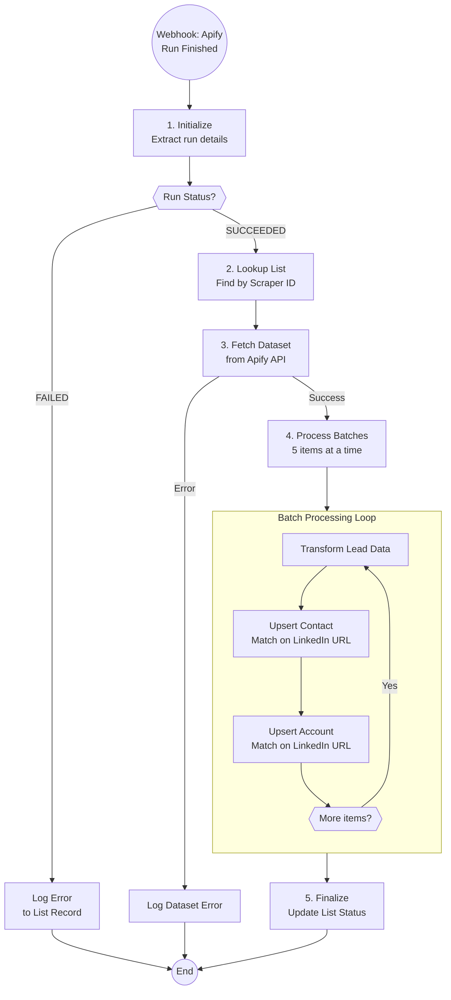

# Lead Sourcing Completed Handler - Technical Documentation

## Overview

Automation A6.2 handles Apify scraper completion webhooks, fetching scraped datasets and importing leads/accounts into Airtable with deduplication and cross-linking.

| Field | Value |
|-------|-------|
| Spec | `specs/automations/a6.2-lead-sourcing-completed.md` |
| Code | `app/automations/lead_sourcing_completed.py` |
| Version | 1.0.0 |
| Status | tested_locally |
| Trigger | Webhook POST |

## Architecture



## Dependencies

| Package | Version | Purpose |
|---------|---------|---------|
| httpx | 0.27.0 | Async HTTP client for API calls |
| pydantic | 2.5.0 | Data validation and settings |
| pydantic-settings | 2.1.0 | Environment variable management |

## Configuration

### Environment Variables

| Variable | Required | Description | Example |
|----------|----------|-------------|---------|
| AIRTABLE_TOKEN | Yes | Airtable personal access token | `pat...` |
| AIRTABLE_BASE_ID | Yes | Airtable base ID | `apppGZKPtSKo2H41f` |
| APIFY_API_TOKEN | Yes | Apify API bearer token | `apify_api_...` |

### Settings

Configured in `app/config.py`:

```python
# Airtable tables
AIRTABLE_TABLE_LIST_BUILDING = "tblcFFxDCN0788xjF"
AIRTABLE_TABLE_CONTACTS = "tblsI8jeqv1B16MTk"
AIRTABLE_TABLE_ACCOUNTS = "tblIJVWxf1QbpowuS"

# Processing configuration
BATCH_SIZE = 5  # Respects Airtable rate limits
```

## API Endpoints Used

| System | Endpoint | Method | Purpose |
|--------|----------|--------|---------|
| Apify | `/v2/datasets/{datasetId}/items` | GET | Fetch scraped dataset items |
| Airtable | `/v0/{baseId}/{tableId}` (search) | GET | Find list by Scraper ID |
| Airtable | `/v0/{baseId}/{tableId}` (upsert) | PATCH | Upsert contacts/accounts with `performUpsert` |
| Airtable | `/v0/{baseId}/{tableId}/{recordId}` | PATCH | Update list status |

## Implementation Details

### Step 1: Initialize

**Lines 152-164:** Parse webhook payload and extract run details.

```python
webhook = ApifyWebhookPayload(**payload)
proc_settings = ProcessingSettings(
    apify_actor_run_id=event_data.get("actorRunId"),
    apify_actor_dataset_id=resource.get("defaultDatasetId"),
    apify_actor_status=resource.get("status"),
)
```

**Validation:** Pydantic models ensure payload structure is correct before processing.

### Step 2: Lookup List Record

**Lines 184-204:** Find the list record that initiated this scraper run.

```python
list_records = await self.airtable_client.search_records(
    AIRTABLE_TABLE_LIST_BUILDING,
    formula=f"{{Scraper ID}}='{proc_settings.apify_actor_run_id}'",
    max_records=1,
)
```

**Error Handling:** Returns `failed` status if list not found - prevents orphaned data.

### Step 3: Fetch Dataset

**Lines 206-224:** Retrieve all items from the Apify dataset.

```python
items = await self.apify_client.get_dataset_items(
    proc_settings.apify_actor_dataset_id
)
```

**Edge Case:** Empty datasets are handled gracefully - status updated but no processing.

### Step 4: Process Batches (3-Phase Approach)

**Lines 237-335:** Transform and upsert in three phases to handle account-contact linking.

#### Phase 1: Upsert Unique Accounts (Lines 252-279)

Deduplicate accounts by LinkedIn URL, then upsert in batches:

```python
# Deduplicate by LinkedIn URL
account_records_map = {}
for lead in all_transformed:
    if lead["organization_linkedin_url"]:
        url = lead["organization_linkedin_url"]
        if url not in account_records_map:
            account_records_map[url] = {...}

# Upsert in batches
for batch in chunks(account_records, BATCH_SIZE):
    await self.airtable_client.upsert_records(
        AIRTABLE_TABLE_ACCOUNTS,
        batch,
        merge_on=["Linkedin URL"],
    )
```

**Why:** Prevents duplicate account creation when multiple contacts work at the same company.

#### Phase 2: Query Account Record IDs (Lines 281-298)

Query each account individually to get Airtable record IDs for linking:

```python
for url in account_records_map.keys():
    escaped_url = url.replace("'", "\\'")
    formula = f"{{Linkedin URL}} = '{escaped_url}'"

    records = await self.airtable_client.search_records(
        AIRTABLE_TABLE_ACCOUNTS,
        formula=formula,
        max_records=1,
    )

    if records:
        account_id_map[url] = records[0].id
```

**Why Individual Queries:** Batch formula queries fail with special characters in LinkedIn URLs (parentheses, ampersands). Individual queries are more reliable.

#### Phase 3: Upsert Contacts with Account Links (Lines 300-333)

Link contacts to their accounts:

```python
contact_record = {
    "Linkedin URL": lead["linkedin_url"],
    "First Name": lead["first_name"],
    "Last Name": lead["last_name"],
    "Account": [account_id_map[account_url]],  # Link!
    "List": [list_id],
}

await self.airtable_client.upsert_records(
    AIRTABLE_TABLE_CONTACTS,
    contact_records,
    merge_on=["Linkedin URL"],
)
```

### Step 5: Finalize

**Lines 337-340:** Update list status to indicate scraping is complete.

```python
await self._update_list_status(list_id, "Scraper Completed")
```

**Output:** List ready for next stage (enrichment).

## Data Transformation

### transform_lead() Function

**Lines 49-84:** Normalizes data from different scraper formats (Apollo vs Sales Navigator).

| Apollo Format | Sales Navigator Format | Output Field |
|---------------|------------------------|--------------|
| `first_name` | `firstName` | `first_name` |
| `last_name` | `lastName` | `last_name` |
| `linkedin_url` | `publicUrl` | `linkedin_url` |
| `title` | `jobTitle` | `job_title` |
| `organization.name` | `companyName` | `organization_name` |
| `organization.linkedin_url` | `companyLinkedinUrl` | `organization_linkedin_url` |

**Handling Missing Data:** Uses `item.get(key, "")` pattern to avoid KeyErrors, returns empty strings for missing fields.

## Error Handling

| Error Type | Handling | Recovery | Code Location |
|------------|----------|----------|---------------|
| Run status FAILED | Log to Scraper Log field, skip processing | Manual retry in Apify | Lines 166-181 |
| Dataset not found (404) | Log error, raise exception | Check Apify console | Lines 210-221 |
| List record not found | Return failed status | Manual investigation | Lines 191-198 |
| Empty dataset | Update status, return success | No action needed | Lines 225-234 |
| Airtable rate limit (429) | Exponential backoff (in client) | Auto-retry | Airtable client |
| Invalid LinkedIn URL | Skip that field | Data logged for review | Lines 255, 305 |
| Auth error (401) | Fail fast with clear message | Refresh API token | Client initialization |

### Error Logging to Airtable

**Lines 366-406:** Appends errors to the list record's "Scraper Log" field with timestamps.

```python
timestamp = datetime.now().strftime("%Y-%m-%d %H:%M")
new_log = f"{existing_log}\n{timestamp} - Error: {error_message}"

await self.airtable_client.update_record(
    AIRTABLE_TABLE_LIST_BUILDING,
    list_record.id,
    {"Scraper Log": new_log},
)
```

## Testing

### Run Tests

```bash
cd clients/herbox-sweden/automations
uv run pytest tests/test_lead_sourcing_completed.py -v
```

### Dry Run

```bash
uv run python -m app.automations.lead_sourcing_completed --dry-run

# With specific payload file
uv run python -m app.automations.lead_sourcing_completed payload.json --dry-run
```

### Test Coverage

| Test Class | Coverage |
|------------|----------|
| `TestTransformLead` | Data transformation from both scraper formats |
| `TestBatchChunking` | Batch size logic with various list sizes |
| `TestWebhookPayloadParsing` | Pydantic validation of webhook payloads |
| `TestLeadSourcingCompletedHandler` | Integration tests with mocked API clients |
| `TestAcceptanceCriteria` | Placeholder tests for spec requirements |

**Key Tests:**
- `test_transform_lead_apollo_format` - Apollo scraper data format
- `test_transform_lead_sales_nav_format` - Sales Navigator format
- `test_batch_chunking_remainder` - Batch processing with remainder
- `test_handler_skips_failed_runs` - Failed run handling

### Test Data

Real test performed with:
- **Dataset:** 438 leads from Apify
- **Result:** 171 unique accounts, 438 contacts
- **Success:** All contacts linked to accounts correctly

## Monitoring

- **Logs:** Dashboard at `/herbox/logs` or Railway logs
- **Metrics:** Execution count, success rate in dashboard
- **Alerts:** Self-healing webhook (if configured) for failures

## Maintenance Notes

### Rate Limiting
- Batch size of 5 respects Airtable 5 req/sec limit
- 2-second delay between batches in production (configurable)
- Apify has 100 req/min limit (not a concern with current usage)

### Common Issues

**Issue:** Duplicate accounts created
- **Cause:** Same company with slightly different LinkedIn URLs
- **Solution:** Manual cleanup in Airtable, update scraper to normalize URLs

**Issue:** Contacts not linked to accounts
- **Cause:** Account query failed due to special characters in URL
- **Solution:** Individual queries now used (fixed in v1.0.0)

**Issue:** Empty dataset processed successfully but no leads added
- **Cause:** Scraper configuration issue
- **Solution:** Check scraper settings in Apify, verify search criteria

### Webhook Setup

Configure in Apify Console:

1. Go to actor's Integrations tab
2. Add webhook for "Run succeeded" event
3. URL: `{RAILWAY_URL}/webhooks/lead-sourcing-finished`
4. Add webhook for "Run failed" event (same URL)
5. Payload template: Default (includes full resource)

## Conversion Notes

**Original N8N Workflow:** `n8n-lead-sourcing-ended.json`

**Improvements vs N8N:**

1. **Unified data transformation** - Single function handles both Apollo and Sales Navigator formats
2. **3-phase processing** - Proper account deduplication and contact-to-account linking
3. **Better error handling** - Explicit error logging to Airtable field with timestamps
4. **Rate limit protection** - Built-in batch processing with configurable size
5. **Type safety** - Pydantic models for payload validation
6. **Testability** - Dry run mode and comprehensive unit tests
7. **Observability** - Integrated logging via ExecutionLogger

## Changelog

| Version | Date | Changes |
|---------|------|---------|
| 1.0.0 | 2026-01-12 | Initial specification (converted from N8N) |
| 1.0.0 | 2026-01-14 | Fixed account deduplication, implemented 3-phase contact linking |

---
*Last updated: 2026-01-22*
