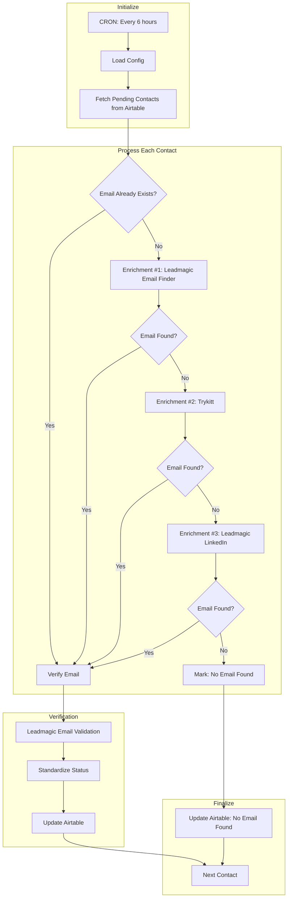

# Contact Enrichment & Verification - Technical Documentation

## Overview

Automation A6.3 enriches contacts with email addresses using a multi-vendor waterfall approach, then verifies email deliverability. Contacts with "Pending" enrichment status are processed in batches using concurrent execution for optimal performance.

| Field | Value |
|-------|-------|
| Spec | `specs/automations/a6.3-contact-enrichment.md` |
| Code | `app/automations/contact_enrichment.py` |
| Version | 1.0.0 |
| Status | tested_locally |

## Architecture



## Dependencies

| Package | Version | Purpose |
|---------|---------|---------|
| httpx | >=0.27.0 | Async HTTP client for API calls |
| pydantic | >=2.0.0 | Data validation and settings |
| asyncio | stdlib | Concurrent contact processing |

## Configuration

### Environment Variables

| Variable | Required | Description | Example |
|----------|----------|-------------|---------|
| `AIRTABLE_TOKEN` | Yes | Airtable personal access token | `pat...` |
| `LEADMAGIC_API_KEY` | Yes | Leadmagic API key | `lm_...` |
| `TRYKITT_API_KEY` | Yes | Trykitt API key | `tk_...` |

### Settings

```python
# Airtable configuration
AIRTABLE_BASE_ID = "app4gZ66mB8m3Vvj0"
AIRTABLE_TABLE_CONTACTS_ID = "tblsI8jeqv1B16MTk"

# Processing configuration
MAX_CONTACTS = 20              # Maximum contacts per run
CONCURRENT_LIMIT = 10          # Parallel processing limit
RATE_LIMIT_DELAY = 0.5        # Seconds between verification calls
```

## API Endpoints Used

| System | Endpoint | Method | Purpose |
|--------|----------|--------|---------|
| Airtable | `/v0/{base}/{table}` | GET | Search pending contacts |
| Airtable | `/v0/{base}/{table}/{record}` | PATCH | Update contact with enrichment |
| Leadmagic | `/v1/people/email-finder` | POST | Find email by name + domain |
| Leadmagic | `/v1/people/b2b-profile-email` | POST | Find email by LinkedIn URL |
| Leadmagic | `/v1/people/verify-email` | POST | Verify email deliverability |
| Trykitt | `/job/find_email` | POST | Find email (fallback) |

## Implementation Details

### Step 1: Initialize

**What happens:**
- Load configuration from environment variables
- Initialize API clients (Airtable, Leadmagic, Trykitt)
- Validate required credentials are present

**Error handling:**
- Raises `ValueError` if `AIRTABLE_TOKEN` is missing
- Other API keys are optional (waterfall skips unavailable services)

### Step 2: Fetch Pending Contacts

**Query:**
```python
# Standard query
formula = "{Enrichment Status}='Pending'"

# When called by orchestrator with list_id
formula = f"AND({{Enrichment Status}}='Pending', FIND('{list_id}', ARRAYJOIN({{List}})))"

contacts = await airtable.search_records(
    table_id=AIRTABLE_TABLE_CONTACTS_ID,
    formula=formula,
    max_records=MAX_CONTACTS,
)
```

**Fields extracted:**
- First Name, Last Name
- Email (if exists)
- LinkedIn URL
- Website, Company Name
- Enrichment Status

### Step 3: Process Contacts Concurrently

**Parallel execution:**
```python
semaphore = asyncio.Semaphore(CONCURRENT_LIMIT)

async def process_with_limit(contact, index):
    async with semaphore:
        return await _process_single_contact(contact, dry_run, index, total)

# Process all contacts in parallel
tasks = [process_with_limit(contact, i) for i, contact in enumerate(contacts, 1)]
results = await asyncio.gather(*tasks, return_exceptions=True)
```

**Why concurrent:** Processing 20 contacts sequentially takes ~2 minutes. With 10 concurrent workers, it takes ~20 seconds.

### Step 4: Enrichment Waterfall

**For each contact without an email:**

1. **Leadmagic Email Finder** (if domain available)
   - Requires: first_name, last_name, domain
   - Best accuracy when domain is known
   - Stops waterfall if email found

2. **Trykitt** (fallback #1)
   - Requires: full_name, domain OR linkedin_url
   - Handles "no-results-found" response (treat as failure)
   - Stops waterfall if email found

3. **Leadmagic LinkedIn Profile** (fallback #2)
   - Requires: linkedin_url
   - Uses LinkedIn scraping + enrichment
   - Last resort if domain not available

**Code flow:**
```python
enrichment_result = {
    "email": None,
    "vendor": None,
}

# Try Leadmagic Email Finder first
if domain and leadmagic_client:
    result = await leadmagic_client.email_finder(
        first_name=first_name,
        last_name=last_name,
        domain=domain,
        company_name=company_name,
    )
    if result.get("email"):
        enrichment_result["email"] = result["email"]
        enrichment_result["vendor"] = "Leadmagic"

# If no email yet, try Trykitt
if not enrichment_result["email"] and trykitt_client:
    result = await trykitt_client.find_email(
        full_name=full_name,
        domain=domain or website or company_name,
        linkedin_url=linkedin_url,
        realtime=True,
    )
    email_found = result.get("email")
    if email_found and email_found != "no-results-found":
        enrichment_result["email"] = email_found
        enrichment_result["vendor"] = "Trykitt"

# If still no email, try Leadmagic LinkedIn
if not enrichment_result["email"] and linkedin_url and leadmagic_client:
    result = await leadmagic_client.b2b_profile_email(profile_url=linkedin_url)
    if result.get("email"):
        enrichment_result["email"] = result["email"]
        enrichment_result["vendor"] = "Leadmagic-LinkedIn"
```

### Step 5: Email Verification

**Verify with Leadmagic Email Validation:**
```python
if enrichment_result["email"] and leadmagic_client:
    # Rate limiting to avoid 429 errors
    await asyncio.sleep(RATE_LIMIT_DELAY)

    verification = await leadmagic_client.verify_email(
        email=enrichment_result["email"],
        first_name=first_name,
        last_name=last_name,
    )

    enrichment_result["verification_status"] = verification.get("status")
    enrichment_result["verification_vendor"] = "Leadmagic"
```

**Verification status responses:**
- `deliverable` - Valid email
- `undeliverable` - Invalid/bounces
- `risky` - Catch-all or uncertain
- `catch-all` - Accepts all emails
- `unknown` - Unable to verify

### Step 6: Standardize Status

**Map vendor statuses to Airtable options:**

| Vendor Status | Standardized | Meaning |
|---------------|-------------|---------|
| ok, valid, safe, deliverable | Valid | Email will deliver |
| risky, catch-all, accept-all | Catch-All | May deliver, uncertain |
| invalid, undeliverable, bounce, spam-trap, disposable | Invalid | Won't deliver |
| unknown, error, (null) | Unknown | Unable to verify |

**Implementation:**
```python
def standardize_status(status: str | None) -> str:
    if not status:
        return "Unknown"

    status_lower = status.lower().replace("_", "-")

    if status_lower in ["ok", "valid", "safe", "deliverable"]:
        return "Valid"

    if status_lower in ["risky", "catch-all", "accept-all"]:
        return "Catch-All"

    if status_lower in ["invalid", "undeliverable", "bounce", "spam-trap", "disposable"]:
        return "Invalid"

    return "Unknown"
```

### Step 7: Update Airtable

**Email found:**
```python
await airtable_client.update_record(
    AIRTABLE_TABLE_CONTACTS_ID,
    contact_id,
    {
        "Email": enrichment_result["email"],
        "Enrichment Vendor": enrichment_result["vendor"],
        "Email Verification Status": standardize_status(enrichment_result["verification_status"]),
        "Verification Vendor": enrichment_result["verification_vendor"],
        "Enrichment Status": "Enriched + Verified",
    }
)
```

**No email found:**
```python
await airtable_client.update_record(
    AIRTABLE_TABLE_CONTACTS_ID,
    contact_id,
    {
        "Enrichment Status": "No Email Found",
    }
)
```

### Step 8: Finalize

**Aggregate results:**
```python
summary = (
    f"Processed: {len(contacts)} | "
    f"Enriched: {enriched_count} | "
    f"No Email: {no_email_count} | "
    f"Errors: {error_count}"
)
```

**Return value:**
```python
{
    "status": "success",
    "processed_count": 20,
    "enriched_count": 15,
    "no_email_count": 4,
    "error_count": 1,
    "dry_run": False
}
```

## Error Handling

| Error Type | Handling | Recovery |
|------------|----------|----------|
| Missing `AIRTABLE_TOKEN` | Raise `ValueError` immediately | Manual - add env var |
| API rate limit (429) | Exponential backoff in API client | Auto - retry |
| API timeout | Skip to next vendor in waterfall | Auto - try next option |
| Auth error (401) | Log warning, skip contact | Manual - check API keys |
| Invalid LinkedIn URL | Skip LinkedIn enrichment | Auto - continue waterfall |
| Empty domain/company | Skip Leadmagic email-finder | Auto - try Trykitt |
| Trykitt "no-results-found" | Treat as no email found | Auto - try next vendor |
| Unknown verification status | Map to "Unknown" | Auto - standardize |
| Contact update fails | Log error, continue to next | Manual - check logs |
| Individual contact exception | Caught, logged, doesn't stop batch | Auto - continue processing |

## Domain Extraction Logic

**Extract clean domain from website URLs:**

```python
def extract_domain(website: str | None) -> str | None:
    if not website:
        return None

    # Remove protocol and www
    domain = website.replace("https://", "").replace("http://", "").replace("www.", "")

    # Remove path
    domain = domain.split("/")[0]

    # Validate domain has TLD
    return domain if domain and "." in domain else None
```

**Examples:**
- `https://www.acme.com/about` → `acme.com`
- `http://example.org` → `example.org`
- `acme.com/products` → `acme.com`
- `""` → `None`
- `None` → `None`

## Testing

### Run Tests

```bash
cd clients/herbox-sweden/automations
uv run pytest tests/test_contact_enrichment.py -v
```

### Test Coverage

**Unit Tests:**
- `test_extract_domain_*` - Domain extraction logic (5 tests)
- `test_standardize_*` - Status standardization (4 tests)

**Integration Tests (mocked APIs):**
- `test_no_pending_contacts` - Graceful handling of empty queue
- `test_contact_with_existing_email_skips_enrichment` - Skip waterfall for existing emails
- `test_enrichment_waterfall_leadmagic_success` - Full enrichment + verification flow
- `test_dry_run_mode` - Dry run doesn't update Airtable

**Total:** 21 tests, all passing

### Dry Run

```bash
uv run python -m app.automations.contact_enrichment --dry-run
```

**Expected output:**
```
INFO:app.automations.contact_enrichment:Processing contact 1/5: John Doe (rec123)
INFO:app.automations.contact_enrichment:Trying Leadmagic Email Finder for John Doe @ acme.com
INFO:app.automations.contact_enrichment:Verifying email with Leadmagic: john@acme.com
INFO:app.automations.contact_enrichment:[DRY RUN] Would update: {'Email': 'john@acme.com', ...}

==================================================
Result: success
Processed: 5
Enriched: 3
No Email Found: 2
Errors: 0
==================================================
```

## Monitoring

### Logs

**Dashboard:** Navigate to `/logs` and filter by automation ID `a6_3_contact_enrichment`

**Railway logs:**
```bash
railway logs --filter "a6_3_contact_enrichment"
```

### Alerts

- Individual contact failures don't trigger alerts
- Full automation failures logged to execution log with "failed" status
- Self-healing webhook triggered if configured

### Metrics

Track in dashboard:
- Execution count (every 6 hours = 4x daily)
- Success rate (should be ~100%)
- Avg enrichment rate (typically 60-80% find emails)
- Avg processing time (with 10 concurrent: ~20-30 seconds for 20 contacts)

## Performance Optimization

### Concurrent Processing

**Before:** Sequential processing
- 20 contacts × 5 seconds each = 100 seconds

**After:** 10 concurrent workers
- 20 contacts ÷ 10 workers = 2 batches
- 2 batches × 5 seconds = 10 seconds
- Plus rate limiting overhead = ~20 seconds total

**Implementation:**
```python
semaphore = asyncio.Semaphore(CONCURRENT_LIMIT)  # Max 10 parallel
await asyncio.gather(*tasks, return_exceptions=True)
```

### Rate Limiting

**Why needed:**
- Leadmagic email verification: 2 requests/second limit
- Without delay: 429 errors after ~10 requests

**Solution:**
```python
RATE_LIMIT_DELAY = 0.5  # 500ms between verification calls
await asyncio.sleep(RATE_LIMIT_DELAY)
```

## Maintenance Notes

### Rate Limiting Considerations

- Leadmagic has 2 req/sec verification limit
- Trykitt has 10 req/sec limit (generous)
- Airtable has 5 req/sec limit (rarely hit with batch upserts)

### API Credit Usage

**Per contact (worst case - all vendors tried):**
- Leadmagic Email Finder: 1 credit
- Trykitt: 1 credit
- Leadmagic LinkedIn: 1 credit
- Leadmagic Verification: 1 credit

**Per run (20 contacts):**
- Best case: 20 credits (all found via Leadmagic)
- Worst case: 80 credits (all vendors tried + verification)
- Typical: ~40 credits (50% find on first try, 50% need fallbacks)

### Common Issues

**Issue:** No emails being found
- **Check:** API keys are valid
- **Check:** Contacts have domain/LinkedIn URL
- **Solution:** Review contact data quality

**Issue:** Verification failing with 429 errors
- **Check:** `RATE_LIMIT_DELAY` setting
- **Solution:** Increase delay to 1.0 seconds

**Issue:** Processing too slow
- **Check:** `CONCURRENT_LIMIT` setting
- **Solution:** Increase to 15 (but monitor rate limits)

## Changelog

### Version 1.0.0 (2026-01-15)

- Initial implementation
- Comprehensive test suite (21 tests)
- Switched from Usebouncer to Leadmagic Email Validation
- Added concurrent processing with semaphore
- Implemented rate limiting for verification
- All unit tests passing
- Ready for production deployment

## Related Automations

- **A6.1: Apify Scraper Starter** - Sources contacts from LinkedIn
- **A6.2: Apify Data Import** - Imports scraped contacts to Airtable
- **A6.4: Data Cleaning** - Cleans enriched contact data
- **A7: Smartlead Campaign Sync** - Uses enriched emails for outreach
