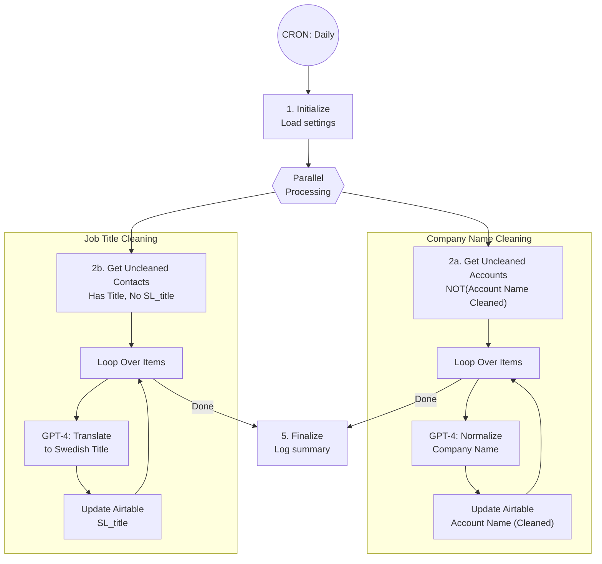

# Lead Data Cleaning - Technical Documentation

## Overview

Automation A6.4 cleans and normalizes lead data from LinkedIn scrapers using AI-powered transformations. It processes company names and job titles to improve email personalization quality.

| Field | Value |
|-------|-------|
| **Spec** | `specs/automations/a6.4-data-cleaning.md` |
| **Code** | `app/automations/data_cleaning.py` |
| **Version** | 1.0.0 |
| **Status** | Planned |
| **Trigger** | CRON (daily at midnight) |

## Architecture



## Dependencies

| Package | Version | Purpose |
|---------|---------|---------|
| httpx | 0.27.0 | Async HTTP client for API calls |
| pydantic | 2.5.0 | Data validation and settings |
| asyncio | stdlib | Parallel processing and concurrency control |

## Configuration

### Environment Variables

| Variable | Required | Description | Example |
|----------|----------|-------------|---------|
| `AIRTABLE_TOKEN` | Yes | Airtable personal access token | `patAbC123...` |
| `OPENROUTER_API` | Yes | OpenRouter API key for AI models | `sk-or-v1-...` |
| `AI_MODEL_COMPANY_CLEANING` | No | AI model for company name cleaning | `openai/gpt-4o-mini` |
| `AI_MODEL_TITLE_TRANSLATION` | No | AI model for title translation | `openai/gpt-4o-mini` |

### Settings

**Airtable Configuration:**
```python
AIRTABLE_BASE_ID = "app4gZ66mB8m3Vvj0"  # Herbox Base
AIRTABLE_TABLE_ACCOUNTS_ID = "tblIJVWxf1QbpowuS"  # Accounts table
AIRTABLE_TABLE_CONTACTS_ID = "tblsI8jeqv1B16MTk"  # Contacts table
```

**Processing Configuration:**
```python
CONCURRENT_LIMIT = 5  # Max concurrent API operations
GPT_DELAY_SECONDS = 0.3  # 300ms delay between GPT calls
```

**AI Models:**
- Company Cleaning: `settings.get_ai_model("company_cleaning")`
- Title Translation: `settings.get_ai_model("title_translation")`

## API Endpoints Used

| System | Endpoint | Method | Purpose |
|--------|----------|--------|---------|
| Airtable | `/bases/{baseId}/tables/{tableId}/records` | GET | Fetch uncleaned accounts/contacts |
| Airtable | `/bases/{baseId}/tables/{tableId}/records/{recordId}` | PATCH | Update cleaned values |
| OpenRouter | `/v1/chat/completions` | POST | AI-powered cleaning via GPT-4 |

## Implementation Details

### Step 1: Initialize
**Lines 124-129**

- Creates OpenRouter client with API key from settings
- Creates Airtable client with base ID and token
- Validates that required API keys are configured
- Raises `ValueError` if `OPENROUTER_API_KEY` or `AIRTABLE_TOKEN` is missing

### Step 2: Fetch Data
**Lines 131-152**

Fetches two datasets in parallel:

**Accounts (2a):**
- Formula: `NOT({Account Name (Cleaned)})`
- Returns all accounts without cleaned company names
- Includes fields: `Name`, `Account Name`, `Website`

**Contacts (2b):**
- Formula: `AND({Title}, NOT({SL_title}))`
- Returns all contacts with job titles but no Swedish translation
- Includes fields: `Title`

**Optional List Filtering:**
If `list_id` parameter is provided, formulas filter to specific list:
- Accounts: `AND(NOT({Account Name (Cleaned)}), FIND('rec123', ARRAYJOIN({List})))`
- Contacts: `AND({Title}, NOT({SL_title}), FIND('rec123', ARRAYJOIN({List})))`

### Step 3: Clean Data (Parallel Processing)
**Lines 172-281**

**Concurrency Control:**
- Uses `asyncio.Semaphore(CONCURRENT_LIMIT)` to limit concurrent operations to 5
- Prevents Airtable rate limiting (5 requests/sec per base)
- 300ms delay between GPT calls to avoid API throttling

**Account Cleaning Process:**
1. Extract `Name` and `Website` fields
2. Skip if no account name exists
3. Call `openrouter_client.clean_company_name()` with GPT-4 prompt
4. In production: Update Airtable `Account Name (Cleaned)` field
5. In dry-run: Log what would be updated
6. Track success/failure in separate lists

**Contact Cleaning Process:**
1. Extract `Title` field
2. Skip if no title exists
3. Call `openrouter_client.translate_job_title_to_swedish()` with GPT-4 prompt
4. In production: Update Airtable `SL_title` field
5. In dry-run: Log what would be updated
6. Track success/failure in separate lists

**Parallel Execution:**
- All account tasks execute concurrently (up to CONCURRENT_LIMIT)
- After accounts complete, all contact tasks execute concurrently
- Each task includes error handling to prevent one failure from stopping others

### Step 4: AI Prompts

**Company Name Cleaning (lines 184-198 in openrouter/client.py):**
```
Objective:
Normalize the provided Company Name by eliminating any extraneous words...

Instructions:
- Remove words not reinforced by Website Domain
- Use acronyms when commonly recognized (ACLS)
- Strip legal suffixes: LLC, Inc., Corp., DBA.
- Strip special chars: ™, ©, ®, emojis, |, -
- Maximum 3 words
- Title case (except abbreviations)

Company Name: {company_name}
Company Website: {website}
```

**Job Title Translation (lines 223-246 in openrouter/client.py):**
```
Du är en assistent som omvandlar jobbtitlar från LinkedIn...
"Jag såg att du är {job} på företag XYZ."

Regler:
- Svara endast med svenska jobbtiteln
- Använd gemener (except HR, IT)
- Kort och neutral

Logik:
- Facility/real estate → fastighetsansvarig/fastighetskoordinator
- Procurement → inköpare
- HR/Talent → HR-ansvarig
- CEO/VD → VD
- CFO → ekonomichef
```

### Step 5: Finalize
**Lines 287**

- Logs execution summary via `ExecutionLogger`
- Records counts: accounts found/cleaned/failed, contacts found/cleaned/failed
- Returns detailed results dictionary with cleaned/failed records

## Error Handling

| Error Type | Handling | Recovery |
|------------|----------|----------|
| Missing API keys | Raise `ValueError` immediately | Manual - set environment variables |
| Airtable rate limit (429) | Exponential backoff in client | Auto-retry (3 attempts) |
| OpenRouter rate limit | 300ms delay between calls | Prevents hitting limits |
| OpenRouter timeout | Catch exception, log error, skip record | Record added to failed list, retry next run |
| Empty company name | Skip record with warning | Record added to failed list |
| Empty job title | Skip record with warning | Record added to failed list |
| GPT unexpected format | Log warning, store as-is | Record cleaned with raw GPT output |
| Network errors | Exponential backoff, retry 3x | Auto-retry then fail |

**Error Tracking:**
- Failed records tracked in `accounts_failed` and `contacts_failed` lists
- Each failure includes record ID and error message
- Failures don't stop processing of other records
- All failures logged to database via `ExecutionLogger`

## Testing

### Run Unit Tests
```bash
cd clients/herbox-sweden/automations
uv run pytest tests/test_data_cleaning.py -v
```

### Run Dry-Run Mode
```bash
cd clients/herbox-sweden/automations
uv run python -m app.automations.data_cleaning --dry-run
```

### Test Coverage

**Initialization Tests:**
- `test_init_with_defaults` - Default settings loaded
- `test_init_with_custom_values` - Custom API keys
- `test_missing_openrouter_key` - Validates required env vars
- `test_missing_airtable_token` - Validates required env vars

**Core Functionality Tests:**
- `test_no_data_to_clean` - Returns zero counts when nothing to clean
- `test_dry_run_mode` - Dry run doesn't update Airtable
- `test_successful_cleaning` - End-to-end cleaning flow
- `test_skip_account_without_name` - Handles missing data
- `test_skip_contact_without_title` - Handles missing data
- `test_handle_gpt_error` - GPT errors don't crash automation

**Acceptance Criteria Tests:**
- `test_clean_company_name_removes_llc` - Legal suffix removal
- `test_translate_job_title_to_swedish` - Title translation
- `test_process_accounts_and_contacts_in_parallel` - Parallel execution

**Formula Tests:**
- `test_accounts_formula` - Correct Airtable query
- `test_contacts_formula` - Correct Airtable query

## Monitoring

**Logs:**
- Dashboard: `https://herbox-automations.up.railway.app/`
- Railway logs: `railway logs --service herbox-automations`
- Execution history stored in SQLite database

**Key Metrics:**
- `accounts_found` - Total accounts needing cleaning
- `accounts_cleaned` - Successfully cleaned accounts
- `accounts_failed` - Failed account cleanings
- `contacts_found` - Total contacts needing cleaning
- `contacts_cleaned` - Successfully cleaned contacts
- `contacts_failed` - Failed contact cleanings

**Alerts:**
- Self-healing webhook triggers on failures (if configured)
- Check `error` field in execution logs for details

## Maintenance Notes

**Rate Limiting:**
- Airtable: 5 requests/sec per base
  - Controlled via `CONCURRENT_LIMIT = 5`
  - Each operation includes one search + N updates
- OpenRouter: Tier-based limits
  - 300ms delay between calls prevents throttling
  - Exponential backoff on 429 errors

**AI Model Updates:**
To change AI models without code changes:
```bash
# Via Railway dashboard or CLI
railway variables set AI_MODEL_COMPANY_CLEANING=anthropic/claude-3-haiku
railway variables set AI_MODEL_TITLE_TRANSLATION=google/gemini-flash
```

**Common Issues:**

1. **"GPT API error"** - Check OpenRouter API key and credits
2. **"AIRTABLE_TOKEN not configured"** - Set environment variable
3. **High failure rate** - Check GPT prompts still match data format
4. **Slow processing** - Normal; processes ~200 records/minute due to rate limits

**Data Quality:**
- Company names occasionally over-cleaned (e.g., "IBM" when should be "IBM Cloud")
- Job title translations may be too generic for specialized roles
- Review `cleaned_accounts` and `cleaned_contacts` output periodically

**Related Automations:**
- **A6 (List Building Orchestrator)** - Triggers this automation as part of pipeline
- **A7 (SmartLead Sync)** - Uses cleaned data for campaign personalization

## Conversion Notes

**Original N8N Workflow:** `n8n-cleaning-n-smartlead.json`

**Improvements over N8N:**
1. **Parallel Processing** - Accounts and contacts cleaned concurrently
2. **Better Error Handling** - Per-record error tracking, doesn't fail entire run
3. **Rate Limiting** - Built-in semaphore prevents API throttling
4. **Centralized Prompts** - GPT prompts in dedicated client methods
5. **Detailed Logging** - Tracks cleaning statistics and failures
6. **Dry-Run Mode** - Test without modifying Airtable
7. **List Filtering** - Can clean specific lists instead of all records

**Prompt Changes:**
- Original Dutch prompts updated to Swedish for Herbox market
- Company cleaning prompt preserved exactly from N8N
- Title translation prompt adapted from Dutch grammar rules to Swedish

## Changelog

| Version | Date | Changes |
|---------|------|---------|
| 1.0.0 | 2026-01-12 | Initial specification (converted from N8N) |

---
*Last updated: 2026-01-22*
