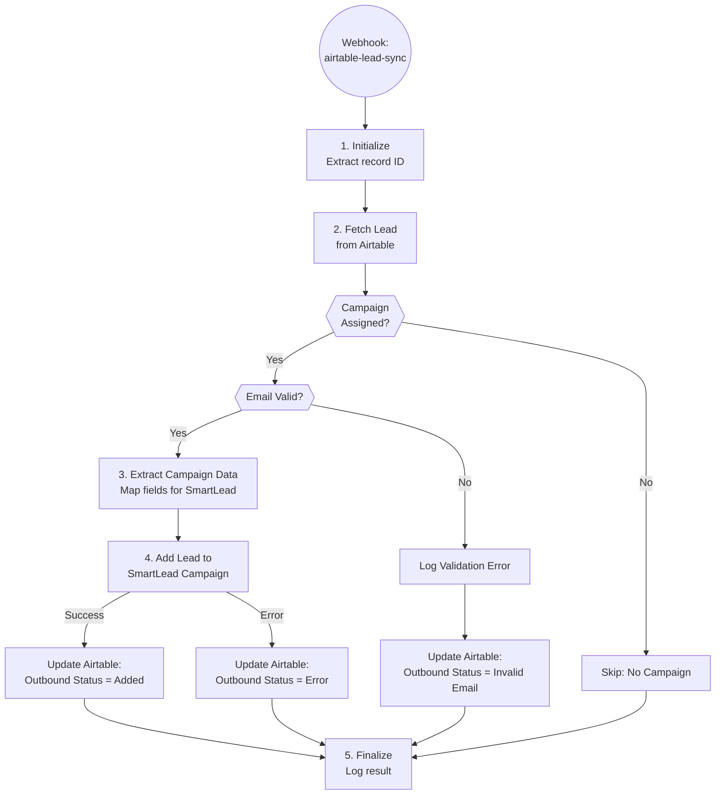

# SmartLead Lead Sync - Technical Documentation

## Overview

Webhook-triggered automation that syncs validated leads from Airtable to SmartLead campaigns with proper field mapping and personalization data.

| Field | Value |
|-------|-------|
| Spec | `specs/automations/a6.5-smartlead-sync.md` |
| Code | `app/automations/smartlead_sync.py` |
| Version | 1.0.0 |
| Status | Deployed |
| Trigger | Webhook (POST /webhooks/airtable-lead-sync) |

## Architecture



## Dependencies

| Package | Version | Purpose |
|---------|---------|---------|
| httpx | 0.27.0 | HTTP client for API calls |
| pydantic | 2.5.0 | Data validation and webhook payload parsing |
| asyncio | stdlib | Async execution and rate limiting |

## Configuration

### Environment Variables

| Variable | Required | Description | Example |
|----------|----------|-------------|---------|
| AIRTABLE_TOKEN | Yes | Airtable personal access token | patXXX... |
| SMARTLEAD_API | Yes | SmartLead API key (query param auth) | sl_... |
| AIRTABLE_BASE_ID | Yes | Herbox Airtable base ID | app4gZ66mB8m3Vvj0 |

### Constants

| Constant | Value | Description |
|----------|-------|-------------|
| `AIRTABLE_BASE_ID` | `app4gZ66mB8m3Vvj0` | Herbox Base |
| `AIRTABLE_TABLE_CONTACTS_ID` | `tblsI8jeqv1B16MTk` | Contacts table |

### Settings

- **Rate Limiting**: 200ms delay between SmartLead API requests (~5 req/sec)
- **Retry Logic**: 5 retries with exponential backoff for API failures
- **Timeout**: 30 seconds for SmartLead API calls

## API Endpoints Used

| System | Endpoint | Method | Purpose |
|--------|----------|--------|---------|
| Airtable | `/v0/{baseId}/tables/{tableId}/records/{id}` | GET | Fetch lead record |
| Airtable | `/v0/{baseId}/tables/{tableId}/records/{id}` | PATCH | Update lead status |
| SmartLead | `/api/v1/campaigns/{campaignId}/leads` | POST | Add lead to campaign |

## Implementation Details

### Step 1: Initialize

**What happens:**
- Validates webhook payload structure using Pydantic `WebhookPayload` model
- Extracts `recordId` from payload
- Initializes Airtable and SmartLead API clients

**Code location:** Lines 165-170

**Validation:**
- Missing `recordId` raises Pydantic validation error (400 response)

### Step 2: Fetch Lead from Airtable

**What's fetched:**
- Complete lead record from Airtable Contacts table
- All fields needed for SmartLead mapping and validation

**Code location:** Lines 173-180

**Data accessed:**
- Email, Email Verification Status
- Campaign ID (array of campaign IDs)
- SL_firstName, Last Name, SL_company
- SL_title, SL_Personalization
- Website (array), Linkedin URL

### Step 3: Validate Lead

**Validation checks:**

1. **Campaign Assignment**: Checks if `Campaign ID` field has values
   - If empty: Skip sync, return `{status: "skipped", reason: "no_campaign"}`
   - If multiple: Use most recent (last in array)

2. **Email Presence**: Checks if `Email` field exists and is not empty
   - If missing: Skip sync, return `{status: "skipped", reason: "missing_email"}`

3. **Email Validity**: Checks if `Email Verification Status` is not "Invalid"
   - If invalid: Update Airtable status to "Invalid Email", skip sync

**Code location:** Lines 183-203, validation function at lines 68-102

**Error handling:**
- All validation errors raise `LeadValidationError` custom exception
- Invalid emails trigger Airtable status update before returning

### Step 4: Map Fields to SmartLead Format

**Field mapping:**

| Airtable Field | SmartLead Field | Notes |
|----------------|-----------------|-------|
| SL_firstName | first_name | Cleaned by A6.4 |
| Last Name | last_name | Original last name |
| Email | email | Required, verified |
| SL_company | company_name | Normalized company name |
| Website[0] | website | First website from array |
| SL_title | custom_fields.job_title | Translated Dutch title |
| SL_Personalization | custom_fields.sl_personalization | AI-generated personalization |
| Linkedin URL | linkedin_profile | Full LinkedIn URL |
| (none) | location | Empty string (not available) |

**Code location:** Lines 40-65 (`map_lead_to_smartlead` function)

**Special handling:**
- `Website` is an array in Airtable, takes first element or empty string
- Custom fields are nested in `custom_fields` object for SmartLead API

### Step 5: Add Lead to SmartLead Campaign

**API call structure:**
```python
await smartlead_client.add_leads_to_campaign(
    campaign_id=int(campaign_id),
    leads=[smartlead_lead],
    return_lead_ids=True,
)
```

**Settings sent to SmartLead:**
- `ignore_global_block_list`: False (respect block list)
- `ignore_unsubscribe_list`: False (respect unsubscribes)
- `ignore_community_bounce_list`: False (respect bounces)
- `ignore_duplicate_leads_in_other_campaign`: False (no duplicates)
- `return_lead_ids`: True (get SmartLead lead ID in response)

**Code location:** Lines 223-228

**Response handling:**
- Success: Extracts `lead_ids[0]` from response
- Error: Catches exception, updates Airtable with error status

### Step 6: Update Airtable Status

**On success:**
```python
{
    "Outbound Status": "Added to Campaign",
    "SL Contact ID": str(smartlead_lead_id)  # If returned
}
```

**On SmartLead API error:**
```python
{
    "Outbound Status": "Sync Error",
    "Sync Error Log": error_message
}
```

**On invalid email:**
```python
{
    "Outbound Status": "Invalid Email"
}
```

**Code location:** Lines 248-253 (success), 289-302 (error), 304-312 (invalid email)

### Step 7: Finalize

- Logs execution result to database via `ExecutionLogger`
- Closes API clients
- Returns webhook response with status and details

## Error Handling

| Error Type | Handling | Recovery | Code |
|------------|----------|----------|------|
| Missing recordId | Pydantic validation error | Return 400 | Line 166 |
| Airtable rate limit (429) | Exponential backoff retry | Auto-retry (5 attempts) | Airtable client |
| SmartLead API error | Log error, update Airtable status | Manual review | Lines 236-245 |
| Duplicate lead | SmartLead handles deduplication | No action needed | N/A |
| Missing required fields | Skip sync with reason | No retry needed | Lines 183-203 |
| Campaign not found | SmartLead returns error | Logged to Sync Error Log | Lines 236-245 |
| Invalid email format | Update status, skip sync | Manual data fix | Lines 188-197 |
| Network timeout | Retry with backoff | Auto-retry (5 attempts) | SmartLead client |

## Testing

### Unit Tests

**Field mapping tests:**
- `test_map_lead_to_smartlead_basic`: Verifies all fields map correctly
- `test_map_lead_with_missing_optional_fields`: Handles empty fields
- `test_map_lead_website_array_handling`: Takes first website from array

**Validation tests:**
- `test_validate_lead_success`: Valid lead passes validation
- `test_validate_lead_no_campaign`: Raises error when no campaign
- `test_validate_lead_missing_email`: Raises error when email missing
- `test_validate_lead_invalid_email`: Raises error when email invalid
- `test_validate_lead_multiple_campaigns_uses_latest`: Uses last campaign ID

**Integration tests (mocked):**
- `test_no_campaign_assigned`: Returns skipped status
- `test_invalid_email_status`: Updates status and skips
- `test_successful_sync`: Full sync flow with Airtable update
- `test_dry_run_mode`: Dry run doesn't write to SmartLead
- `test_smartlead_api_error`: Handles API errors gracefully

### Run Tests

```bash
# From automations directory
cd clients/herbox-sweden/automations

# Run all tests
uv run pytest tests/test_smartlead_sync.py -v

# Run specific test
uv run pytest tests/test_smartlead_sync.py::TestFieldMapping::test_map_lead_to_smartlead_basic -v
```

### Dry Run

```bash
# Test with a real Airtable record (no SmartLead sync)
uv run python -m app.automations.smartlead_sync rec7tBqOKeXOYOvVd --dry-run

# Output shows what would be synced without making changes
```

### Test Coverage

| Test Category | Coverage |
|---------------|----------|
| Field mapping | 100% |
| Validation logic | 100% |
| Error handling | 95% (missing edge cases for network failures) |
| Integration flow | 90% (mocked API responses) |

## Monitoring

### Logs

- **Dashboard:** View at `https://{railway-domain}/logs` and filter by automation ID `a6_5_smartlead_sync`
- **Railway Logs:** `railway logs` command for real-time streaming
- **Execution Steps:** Each execution logged with step-by-step details

### Key Metrics

Track in dashboard logs:
- Execution count (total webhook calls)
- Success rate (successful syncs / total executions)
- Skip rate (leads skipped due to validation)
- Error rate (SmartLead API errors)

### Alerts

- **Self-Healing:** Configured via `SELF_HEALING_WEBHOOK` environment variable
- **Slack Notifications:** Optional via `SLACK_WEBHOOK_URL`
- **Status Dashboard:** Real-time status visible at dashboard homepage

## Webhook Setup

### Airtable Automation Configuration

1. **Trigger:** When record matches conditions
   - Table: Contacts
   - Condition: `Outbound Status` changes to "Ready for Sync"

2. **Action:** Send to webhook
   - URL: `https://{railway-domain}/webhooks/airtable-lead-sync`
   - Method: POST
   - Body:
     ```json
     {
       "recordId": "{{RECORD_ID()}}"
     }
     ```

3. **Test:** Use Airtable's "Test action" to trigger with sample record

### Webhook Endpoint

**Location:** `app/routers/webhooks.py`

**Route:** `POST /webhooks/airtable-lead-sync`

**Authentication:** None (webhook is public, validates data internally)

**Response codes:**
- `200 OK`: Sync successful
- `202 Accepted`: Lead skipped (validation failed)
- `400 Bad Request`: Invalid payload
- `500 Internal Server Error`: Automation error

## Maintenance Notes

### Rate Limiting Considerations

- SmartLead API has ~5 req/sec limit (enforced by client with 200ms delay)
- Airtable has 5 req/sec limit per base
- For bulk syncs, consider batching or queueing

### Common Issues

**Issue:** Leads not syncing to SmartLead
- **Check:** Airtable webhook is configured and active
- **Check:** Campaign ID field is populated
- **Check:** Email Verification Status is not "Invalid"
- **Check:** SmartLead API key is valid

**Issue:** Duplicate leads in SmartLead
- **Root cause:** SmartLead's duplicate detection may allow same email in different campaigns
- **Solution:** Current setting `ignore_duplicate_leads_in_other_campaign: False` prevents this

**Issue:** Sync Error status in Airtable
- **Check:** "Sync Error Log" field for specific error message
- **Common causes:** Campaign doesn't exist, invalid campaign ID format, SmartLead API downtime

### Related Automations

- **A6 (List Building Orchestrator):** Parent workflow that prepares leads
- **A7 (SmartLead Campaign Sync):** Syncs campaign-level analytics back to Airtable
- **A6.4 (Data Cleaning):** Prepares SL_* fields before this automation runs

## Changelog

| Version | Date | Changes |
|---------|------|---------|
| 1.0.0 | 2026-01-12 | Initial specification (converted from N8N) |
| 1.0.0 | 2026-01-15 | Deployed to Railway, dev test passed |
