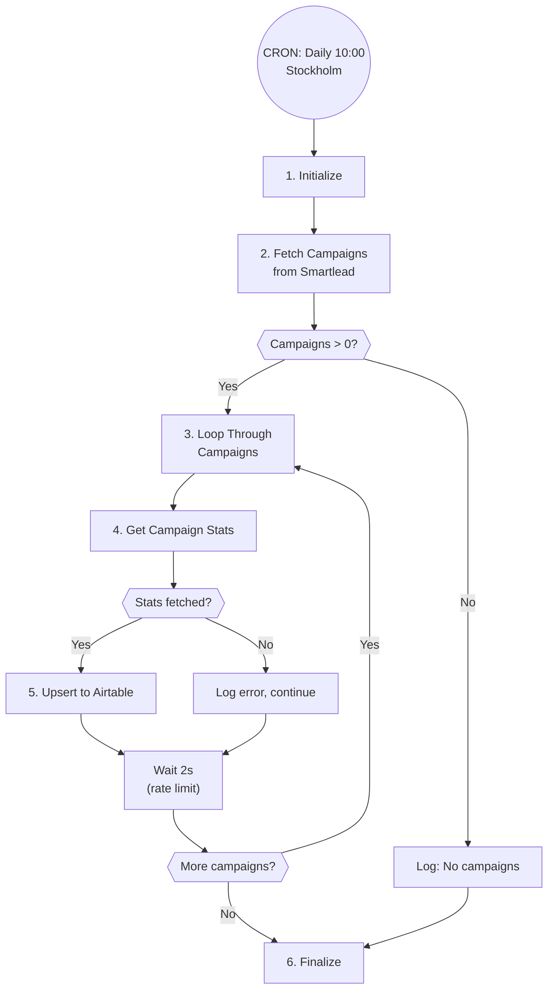

# Smartlead Campaign Sync - Technical Documentation

## Overview

Daily synchronization of Smartlead campaign analytics to Airtable Campaigns table, enabling real-time campaign visibility in the CRM and eliminating manual data entry.

| Field | Value |
|-------|-------|
| Spec | `specs/automations/a7-smartlead-campaign-sync.md` |
| Code | `app/automations/smartlead_campaign_sync.py` |
| Version | 1.0.0 |
| Status | tested_locally |
| Last Updated | 2026-01-15 |

## Architecture



### Data Flow

```
Smartlead API → Python Transform → Airtable Upsert
```

**Components:**
- **Trigger:** CRON daily at 10:00 Stockholm time
- **Source:** Smartlead API (campaigns + analytics endpoints)
- **Destination:** Airtable Campaigns table
- **Match Key:** Campaign ID (upsert on this field)

## Dependencies

| Package | Version | Purpose |
|---------|---------|---------|
| httpx | 0.27.0 | HTTP client for Smartlead and Airtable APIs |
| pydantic | 2.5.0 | Data validation and type safety |
| asyncio | stdlib | Async processing and rate limiting |

## Configuration

### Environment Variables

| Variable | Required | Description | Example |
|----------|----------|-------------|---------|
| SMARTLEAD_API_KEY | Yes | Smartlead API key for authentication | `sk_...` |
| AIRTABLE_TOKEN | Yes | Airtable personal access token | `pat...` |

### Settings

**Airtable Configuration:**
```python
AIRTABLE_BASE_ID = "app4gZ66mB8m3Vvj0"  # Herbox Base
AIRTABLE_TABLE_ID = "tbl78Dq8VtWYjxsya"  # Campaigns table
AIRTABLE_MATCH_FIELD = "Campaign ID"     # Upsert match key
```

**Rate Limiting:**
```python
CAMPAIGN_DELAY_SECONDS = 2  # Delay between campaigns (Smartlead rate limit)
```

## API Endpoints Used

| System | Endpoint | Method | Purpose |
|--------|----------|--------|---------|
| Smartlead | `/api/v1/campaigns` | GET | List all campaigns (including drafts) |
| Smartlead | `/api/v1/campaigns/{id}/analytics` | GET | Get detailed campaign analytics |
| Airtable | `/v0/{baseId}/{tableId}` | PATCH | Upsert records with performUpsert |

## Implementation Details

### Step 1: Initialize
**File:** `smartlead_campaign_sync.py:111-122`

- Validates `SMARTLEAD_API_KEY` and `AIRTABLE_TOKEN` environment variables
- Initializes `SmartleadClient` with API key
- Initializes `AirtableClient` with token and base ID
- Raises `ValueError` if required credentials are missing

### Step 2: Fetch Campaign List
**File:** `smartlead_campaign_sync.py:124-133`

- Calls Smartlead `/campaigns` endpoint with `include_drafts=True` (default)
- Returns list of `CampaignListItem` objects containing:
  - `id`: Campaign identifier
  - `name`: Campaign name
  - `status`: Current status (ACTIVE, DRAFTED, COMPLETED, etc.)
- Validates response structure using Pydantic models
- Returns empty list if no campaigns found

### Step 3: Loop Through Campaigns
**File:** `smartlead_campaign_sync.py:145-209`

- Processes campaigns sequentially (one at a time)
- Maintains 2-second delay between campaigns (`asyncio.sleep(2)`)
- Continues processing on individual campaign errors
- Tracks synced and failed campaigns in separate lists
- Logs progress: "Processing campaign 1/N: Campaign Name"

### Step 4: Get Campaign Analytics
**File:** `smartlead_campaign_sync.py:171`

- Calls Smartlead `/campaigns/{id}/analytics` endpoint
- Retrieves detailed performance metrics:
  - **campaign_lead_stats**: total, inprogress, completed, interested, notStarted
  - **unique_sent_count**: Prospects contacted
  - **sent_count**: Total emails sent
  - **open_count**: Emails opened
  - **reply_count**: Emails replied
  - **bounce_count**: Emails bounced
  - **sequence_count**: Number of sequences
- Returns `CampaignAnalytics` Pydantic model
- Raises exception on API error (caught and logged)

### Step 5: Transform and Upsert
**File:** `smartlead_campaign_sync.py:51-80, 174-181`

**Transformation:**
- `transform_status()`: Converts status to sentence case
  - `"ACTIVE"` → `"Active"`
  - `"ramp_up"` → `"Ramp Up"`
  - Empty/None → `"Unknown"`
- `map_to_airtable()`: Maps Smartlead fields to Airtable field names

**Field Mapping:**
```python
{
    "Campaign ID": str(campaign_id),           # Primary key
    "Campaign Name": analytics.name,
    "Status": transform_status(analytics.status),
    "Total Leads": lead_stats.total,
    "Leads In Progress": lead_stats.inprogress,
    "Leads Completed": lead_stats.completed,
    "Leads Not Started": lead_stats.notStarted,
    "Email Replied (Positive)": lead_stats.interested,
    "Prospects Contacted": analytics.unique_sent_count,
    "Email Sent": analytics.sent_count,
    "Email Opened": analytics.open_count,
    "Email Replied": analytics.reply_count,
    "Email Bounced": analytics.bounce_count,
    "Total Emails": lead_stats.total,
    "Number Of Sequences": analytics.sequence_count,
}
```

**Upsert:**
- Uses Airtable `performUpsert` API feature
- Matches on `Campaign ID` field
- Creates new record if Campaign ID doesn't exist
- Updates existing record if Campaign ID matches
- Batch size: 1 record per request (sequential processing)

### Step 6: Finalize
**File:** `smartlead_campaign_sync.py:211-230`

- Closes HTTP clients (`smartlead_client.close()`, `airtable_client.close()`)
- Logs sync summary:
  - Total campaigns found
  - Campaigns synced successfully
  - Campaigns failed
- Logs warning with failed campaign details if any failures occurred
- Updates dashboard execution log with status

## Error Handling

| Error Type | Handling | Recovery |
|------------|----------|----------|
| Smartlead 401 Unauthorized | Immediate failure, log auth error | Manual: Check API key |
| Smartlead API timeout | Retry with exponential backoff (httpx default) | Auto: Max 5 retries |
| Smartlead rate limit (429) | Sleep 2s between campaigns | Auto: Built-in delay |
| Airtable rate limit | Handled by client retry logic | Auto: Exponential backoff |
| Campaign analytics fetch fails | Log error, skip campaign, continue | Auto: Continue with next |
| Empty campaign list | Log info, exit cleanly | Auto: No action needed |
| Invalid status value | Default to "Unknown" | Auto: Logged as warning |
| Missing field in analytics | Default to 0 or empty string | Auto: Safe defaults |

**Error Continuation:**
- Individual campaign failures do NOT stop the entire sync
- Failed campaigns are tracked and reported in the summary
- Sync completes with partial success status

## Testing

### Run Tests
```bash
cd clients/herbox-sweden/automations

# Full test suite (18 tests)
uv run pytest tests/test_smartlead_campaign_sync.py -v

# Specific test categories
uv run pytest tests/test_smartlead_campaign_sync.py::TestTransformStatus -v
uv run pytest tests/test_smartlead_campaign_sync.py::TestMapToAirtable -v
uv run pytest tests/test_smartlead_campaign_sync.py::TestSmartleadClient -v
```

### Dry Run
```bash
# Dry run mode (no writes to Airtable)
uv run python -m app.automations.smartlead_campaign_sync --dry-run
```

Expected output:
```
Running Smartlead Campaign Sync (dry_run=True)...
Processing 1/5: Campaign Name
[DRY RUN] Would upsert: Campaign Name
...

Result:
  Campaigns found: 5
  Campaigns synced: 5
  Campaigns failed: 0
```

### Test Coverage

| Test Class | Test Count | Coverage |
|------------|------------|----------|
| TestTransformStatus | 6 tests | Status normalization edge cases |
| TestMapToAirtable | 3 tests | Field mapping, missing fields, type conversion |
| TestSmartleadClient | 4 tests | API response parsing, draft filtering |
| TestAirtableUpsert | 2 tests | Single record, batching |
| TestSmartleadCampaignSyncAutomation | 4 tests | End-to-end, dry run, error handling |
| TestConfigValidation | 2 tests | Missing credentials |

**Total:** 18 unit tests, all passing (as of 2026-01-15)

### Manual Testing Checklist

- [ ] Dry run executes without errors
- [ ] Campaign list fetched from Smartlead
- [ ] Analytics retrieved for each campaign
- [ ] Status values transformed to sentence case
- [ ] All fields mapped correctly
- [ ] Draft campaigns included in sync
- [ ] Failed campaigns don't stop sync
- [ ] Rate limiting respected (2s delay visible in logs)
- [ ] Summary logged with counts

## Monitoring

### Logs
- **Dashboard:** Navigate to `/logs` and filter by automation ID `a7_smartlead_campaign_sync`
- **Railway:** `railway logs --service herbox-automations`
- **Log Level:** INFO for normal operation, ERROR for failures

### Metrics Tracked
- Campaigns found
- Campaigns synced successfully
- Campaigns failed
- Execution time
- API errors

### Alerts
- Self-healing webhook triggers on automation failure
- Failed campaigns logged but don't trigger alerts (partial success)

### Health Checks
Monitor for:
- Repeated failures on same campaign ID (data issue)
- All campaigns failing (API key or connectivity)
- Slow execution times (>5 min for 50 campaigns = rate limit issue)

## Maintenance Notes

### Rate Limiting
- **Smartlead:** ~5 req/sec limit, handled by 2s delay between campaigns
- **Airtable:** 5 req/sec, handled by client retry logic
- Current config: Safe for up to 100 campaigns (200s execution time)
- If campaign count grows >100, consider batching analytics requests

### Token Refresh
- Smartlead API key: Static, no refresh needed
- Airtable token: Personal access token, manually rotate if needed
- No OAuth flows required

### Common Issues

**"No campaigns to sync" but campaigns exist in Smartlead:**
- Check `include_drafts` parameter (default: True)
- Verify API key has access to campaigns
- Check Smartlead account status

**Campaigns not updating in Airtable:**
- Verify "Campaign ID" field exists in Airtable table
- Check field type (must be text/string)
- Review upsert match field configuration

**High failure rate:**
- Check Smartlead API status
- Verify network connectivity
- Review rate limiting logs

### Performance
- Average execution time: ~2s per campaign
- 50 campaigns: ~100 seconds
- 100 campaigns: ~200 seconds
- Memory usage: <100MB

## Changelog

| Version | Date | Changes |
|---------|------|---------|
| 1.0.0 | 2026-01-09 | Initial implementation (converted from N8N workflow) |
| 1.0.0 | 2026-01-15 | All 18 unit tests passing, validated field mapping, ready for production deployment |

## Related Documentation

- **Spec:** `specs/automations/a7-smartlead-campaign-sync.md`
- **Client Docs:** `docs/client/a7-smartlead-sync.md`
- **Smartlead API Client:** `app/clients/smartlead/client.py`
- **Airtable API Client:** `app/clients/airtable/client.py`
- **Test Suite:** `tests/test_smartlead_campaign_sync.py`
