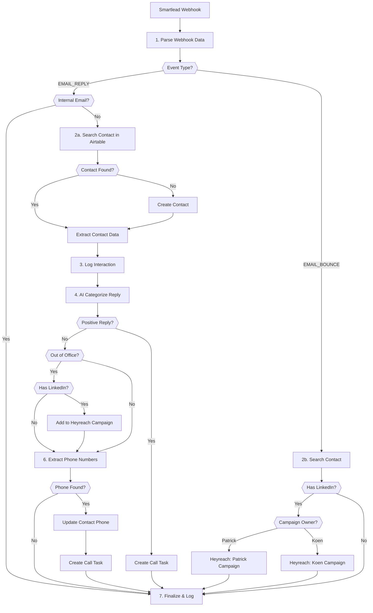

# Email Reply Handler - Technical Documentation

## Overview

Automation A8 processes Smartlead email reply and bounce webhooks, automatically categorizing responses using AI, updating CRM records, and triggering appropriate follow-up actions.

| Field | Value |
|-------|-------|
| Spec | `specs/automations/a8-email-reply-handler.md` |
| Code | `app/automations/email_reply_handler.py` |
| Version | 1.1.0 |
| Status | tested_locally |

## Architecture



## Dependencies

| Package | Version | Purpose |
|---------|---------|---------|
| httpx | 0.27.0 | Async HTTP client for API calls |
| pydantic | 2.5.0 | Data validation and settings |
| fastapi | 0.115.0 | Webhook endpoint |

## Configuration

### Environment Variables

| Variable | Required | Description | Example |
|----------|----------|-------------|---------|
| `SMARTLEAD_WEBHOOK_SECRET` | Yes | Validate incoming Smartlead webhooks | `secret_abc123` |
| `AIRTABLE_TOKEN` | Yes | Airtable API access | `pat...` |
| `AIRTABLE_BASE_ID` | Yes | Herbox Airtable base | `apppGZKPtSKo2H41f` |
| `OPENAI_API_KEY` | Yes | For AI categorization & phone extraction | `sk-...` |
| `HERBOX_DOMAINS` | No | Comma-separated internal domains | `herbox.se,herbox.com` |
| `HEYREACH_API_KEY` | No | LinkedIn campaign integration | `hr_...` |
| `HEYREACH_CAMPAIGN_PATRICK` | No | Patrick's LinkedIn campaign ID | `camp_patrick_123` |
| `HEYREACH_CAMPAIGN_KOEN` | No | Koen's LinkedIn campaign ID | `camp_koen_456` |

### AI Model Configuration

The automation uses OpenAI for email categorization and phone extraction. The model is configured in `app/config.py`:

```python
ai_model_email_reply: str = "openai/gpt-4o-mini"  # A8: Email classification/drafting
```

Override via environment variable:
```bash
AI_MODEL_EMAIL_REPLY=anthropic/claude-3-haiku
```

### Airtable Constants

| Table | ID | Purpose |
|-------|-----|---------|
| Contacts | tblsI8jeqv1B16MTk | Lead/contact records |
| Interactions | tbl1ZihAu8yPKKfJC | Email interaction log |
| Tasks | tbl9K9CDQCuk3XYKj | Follow-up tasks |

## API Endpoints Used

| System | Endpoint | Method | Purpose |
|--------|----------|--------|---------|
| Smartlead | Webhook (inbound) | POST | Receive EMAIL_REPLY and EMAIL_BOUNCE events |
| Airtable | /v0/{base}/Contacts | GET | Search for existing contacts |
| Airtable | /v0/{base}/Contacts | POST | Create new contacts |
| Airtable | /v0/{base}/Contacts | PATCH | Update contact with phone number |
| Airtable | /v0/{base}/Interactions | POST | Log email interactions |
| Airtable | /v0/{base}/Tasks | POST | Create call tasks |
| OpenAI | /v1/chat/completions | POST | Categorize emails & extract phone numbers |
| Heyreach | /campaigns/{id}/leads | POST | Add leads to LinkedIn campaigns |

## Implementation Details

### Step 1: Parse Webhook Data

**Code:** Lines 240-266 in `email_reply_handler.py`

Extracts and normalizes webhook payload fields:
- Event type (EMAIL_REPLY or EMAIL_BOUNCE)
- Campaign metadata (ID, status)
- Email addresses (from, to, sl_lead_email)
- Message content (sent and reply text)
- Timestamps and sequence number

### Step 2: Check Internal Email

**Code:** Lines 268-284

Filters out internal Herbox emails to prevent false signals. Checks if `from_email` matches any configured internal domains (default: `herbox.se`, `herbox.com`).

If internal email detected:
- Sets `is_internal_email = True`
- Logs as "internal_email_filtered"
- Returns early with 200 OK

### Step 3: Find or Create Contact

**Code:** Lines 286-336

For EMAIL_REPLY events:
1. Searches Airtable Contacts by email (uses `sl_lead_email` or falls back to `to_email`)
2. If found: returns existing contact ID
3. If not found: creates new contact with:
   - Name parsing (Swedish convention: split on space, `[1]` = First Name, `[0]` = Last Name)
   - Email, enrichment status, verification status
   - Last replied date from webhook timestamp

For EMAIL_BOUNCE events:
- Only searches for contact, returns full record with LinkedIn status

### Step 4: Log Interaction

**Code:** Lines 352-377

Creates a record in Airtable Interactions table with:
- Linked contact ID
- Channel: "Cold Email"
- Interaction Type: "Email Reply"
- Message Sent (original outbound email)
- Message Received (reply text)
- Interaction Date (parsed from webhook timestamp)

### Step 5: AI Categorize Reply

**Code:** `app/clients/openai/client.py` lines 105-196

Sends original email and reply to OpenAI with structured prompt. Categories map to Smartlead taxonomy:

| Category | ID | Trigger |
|----------|-----|---------|
| Interested | 1 | Shows interest, mentions pricing/demo |
| Meeting Request | 2 | Explicitly requests meeting/call |
| Not Interested | 3 | Clearly declines |
| Do Not Contact | 4 | Requests removal |
| Information Request | 5 | Asks questions/details |
| Out Of Office | 6 | Auto-reply, temporary unavailability |
| Wrong Person | 7 | Not the right contact |
| Uncategorizable by AI | 8 | Unclear/ambiguous |
| Sender Originated Bounce | 9 | Delivery failure |

Uses JSON mode with temperature 0 for consistent categorization. Falls back to "Uncategorizable" on errors.

### Step 6: Handle Out of Office

**Code:** Lines 378-414

If categorized as "Out Of Office" AND contact has LinkedIn URL:
1. Determines campaign based on sender name (Patrick vs Koen)
2. Adds lead to appropriate Heyreach LinkedIn campaign
3. Non-blocking - logs errors but continues flow

### Step 7: Extract Phone Numbers

**Code:** `app/clients/openai/client.py` lines 197-276

Intelligently extracts phone numbers from email body:
- Filters out internal Herbox domains
- Filters out sender's own contact info
- Normalizes to international format (+31 6 1234 5678)
- Returns array of `{name, phone}` objects

Prompt instructs AI to identify external contact vs Herbox sender based on email context.

### Step 8: Create Follow-up Tasks

**Code:** Lines 424-457

Creates call tasks in Airtable based on:
- **Positive replies** (Interested or Meeting Request): Always create task
- **Phone extracted**: Create task if phone number found

Task fields:
- Linked Contact ID
- Task Type: "Call"
- Status: "To Do"

## Error Handling

| Error Type | Handling | Recovery |
|------------|----------|----------|
| Webhook secret mismatch | Return 401, log attempt | Block request |
| Internal email detected | Skip processing, log as filtered | Return 200 OK |
| Contact not found | Create new contact record | Auto-continue |
| Airtable API error | Retry with exponential backoff | Auto-retry 3x |
| OpenAI timeout | Retry 3x, fall back to "Uncategorizable" | Auto-fallback |
| OpenAI categorization fails | Fall back to "Uncategorizable" (ID: 8) | Auto-fallback |
| Phone extraction fails | Return empty array, log warning | Continue flow |
| Heyreach API error | Log error, continue flow | Non-blocking |
| Empty reply message | Process normally, may categorize as "Uncategorizable" | Continue flow |
| Name parsing error | Use full name or empty string | Continue flow |

## Testing

### Run Tests

```bash
cd clients/herbox-sweden/automations
uv run pytest tests/test_email_reply_handler.py -v
```

### Test Coverage

**Unit Tests:**
- `test_parse_webhook_payload_a8` - Webhook parsing
- `test_is_internal_email_a8_herbox_se` - Internal email detection (@herbox.se)
- `test_is_internal_email_a8_herbox_com` - Internal email detection (@herbox.com)
- `test_is_internal_email_a8_external` - External email validation
- `test_categorize_interested_reply_a8` - AI categorization
- `test_extract_phone_numbers_a8` - Phone extraction
- `test_filter_herbox_phones_a8` - Internal phone filtering

**Integration Tests:**
- `test_a8_email_reply_full_flow` - Complete EMAIL_REPLY flow
- `test_a8_internal_email_filtered` - Internal email filtering
- `test_a8_email_bounce_linkedin_flow` - EMAIL_BOUNCE with LinkedIn
- `test_a8_email_bounce_no_linkedin` - EMAIL_BOUNCE without LinkedIn

**Edge Cases:**
- `test_a8_empty_reply_message` - Empty reply handling
- `test_a8_name_parsing_single_name` - Single-word names
- `test_a8_contact_not_found_creates_new` - Auto-create contacts
- `test_positive_reply_creates_task` - Task creation validation
- `test_bounce_routes_to_linkedin` - Bounce LinkedIn routing

**Test Status:** All 18 tests passing ✅

### Dry Run

Testing in production is not applicable - this automation is webhook-triggered only. Use unit tests with mocked webhooks instead.

## Monitoring

### Logs

View execution logs at:
- Dashboard: `/logs?automation=a8_email_reply_handler`
- Railway: `railway logs` from automations directory

### Key Metrics

Track in dashboard:
- Total webhooks processed
- Internal emails filtered
- Contacts created vs found
- Categorization distribution
- Tasks created
- Heyreach campaigns triggered

### Alerts

Self-healing webhook configured to notify on:
- Repeated authentication failures
- OpenAI API quota exceeded
- Airtable rate limit errors

## Maintenance Notes

### Rate Limiting

- **OpenAI:** 60 requests/minute - two calls per webhook (categorize + extract phones)
- **Airtable:** 5 requests/second - uses exponential backoff on 429
- **Heyreach:** Rate limit TBD - non-blocking to prevent webhook failures

### Token Management

- OpenAI uses `gpt-4o-mini` by default for cost efficiency
- Average token usage: ~500 tokens per webhook (categorize + phone extraction)
- Monitor OpenAI usage dashboard for quota tracking

### Common Issues

**Issue:** Internal team replies creating false interactions
**Solution:** Check `HERBOX_DOMAINS` environment variable includes all internal domains

**Issue:** Phone numbers not extracted
**Solution:** Verify email body contains formatted phone numbers in signature. AI may miss unformatted numbers.

**Issue:** Wrong Heyreach campaign selected
**Solution:** Check sender name contains "patrick" or "koen" (case-insensitive). Configure fallback campaign if needed.

**Issue:** Contacts created with reversed names
**Solution:** Name parsing follows Swedish convention (`[1]` = First, `[0]` = Last). Adjust logic in lines 302-310 if needed.

### API Client Details

**OpenAI Client:** `app/clients/openai/client.py`
- Auto-retries on timeouts (3x with exponential backoff)
- JSON mode for structured responses
- Graceful fallbacks on failures

**Heyreach Client:** `app/clients/heyreach/client.py`
- Placeholder implementation - API docs pending
- Non-blocking to prevent webhook failures
- Returns None on errors

**Airtable Client:** `app/clients/airtable/client.py`
- Shared client across all automations
- Built-in retry logic for 429 rate limits
- Formula-based search for contact lookup

## Conversion Notes

**Original N8N Workflow:** `n8n-email-replied-n-bounced.json`

**Improvements Over N8N:**
1. Internal email filtering prevents false signals
2. Intelligent phone extraction filters out Herbox team numbers
3. Centralized error handling with automatic retries
4. Dry-run capability for testing
5. Dashboard visibility for execution history
6. Self-healing capability on failures
7. Structured logging with step-by-step breakdown

**Name Parsing Quirk:**
N8N had reversed name parsing (`[1]` for First, `[0]` for Last), which suggests Swedish naming convention. Maintained in Python implementation for consistency.

## Changelog

| Version | Date | Changes |
|---------|------|---------|
| 1.0.0 | 2026-01-09 | Initial specification (converted from N8N) |
| 1.1.0 | 2026-01-15 | Removed Slack notifications<br>Added internal email detection<br>Updated phone extraction filtering<br>18 unit tests passing |

---

**Last Updated:** 2026-01-15
