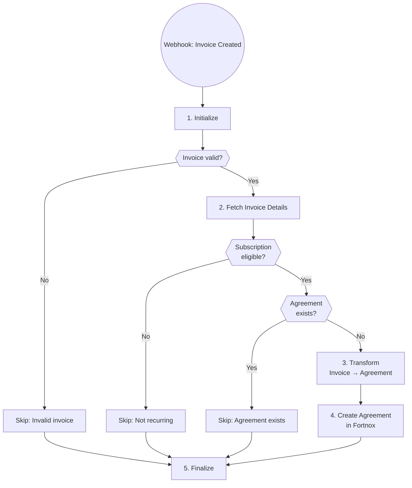

# A4: Subscription Agreement Creator

## Goal

**Problem:** Manual creation of subscription agreements for recurring customers.

**Solution:** Auto-create subscription agreement when first invoice is created for eligible customers.

**Business Value:** Automated recurring revenue setup, reduced manual work, consistent agreement terms.

## Flow Diagram



## API References

| System | Endpoints | Auth | Rate Limit |
|--------|-----------|------|------------|
| Fortnox | GET /invoices/{id}, GET /contracts, POST /contracts | OAuth2 | 4 req/sec |

**API Clients:**
- `app/clients/fortnox/client.py`

## Step Details

### 1. Initialize
- Validate Fortnox webhook
- Parse invoice number from payload
- **Output:** Invoice number

### 2. Fetch Data
- Fetch invoice details from Fortnox
- Check if invoice has recurring product codes (marks subscription eligibility)
- Check if subscription agreement already exists for this customer
- **Output:** Invoice data + eligibility + exists flag

### 3. Transform
- Map invoice fields to contract fields:
  - `Invoice.CustomerNumber` → `Contract.CustomerNumber`
  - `Invoice.InvoiceRows` → `Contract.ContractRows`
  - `Invoice.Currency` → `Contract.Currency`
  - Set `Contract.InvoiceInterval` based on product (monthly/quarterly/yearly)
  - Set `Contract.Active` = true
  - Calculate `Contract.PeriodStart` from invoice date
- **Output:** Contract payload

### 4. Execute
- Create contract/subscription agreement in Fortnox
- Store mapping (customer → contract) in local database
- **Output:** Contract document number

### 5. Finalize
- Log creation to database
- Update dashboard stats
- **Output:** Creation complete

## Edge Cases & Error Handling

| Scenario | Handling | Recovery |
|----------|----------|----------|
| Invoice not found | Log error, skip | Manual review |
| Non-recurring product | Skip silently | N/A |
| Agreement already exists | Skip, log as existing | Continue |
| Invalid invoice data | Log error, skip | Manual review |
| Contract creation fails | Log error | Manual creation |

## Testing

### Unit Tests

```python
def test_identify_subscription_eligible():
    """Test subscription eligibility detection."""
    invoice_recurring = {"InvoiceRows": [{"ArticleNumber": "SUB-001"}]}
    invoice_onetime = {"InvoiceRows": [{"ArticleNumber": "PROD-001"}]}
    assert is_subscription_eligible(invoice_recurring) is True
    assert is_subscription_eligible(invoice_onetime) is False

def test_transform_invoice_to_contract():
    """Test invoice-to-contract field mapping."""
    invoice = {
        "CustomerNumber": "1001",
        "InvoiceRows": [...],
        "Currency": "SEK"
    }
    contract = transform_invoice_to_contract(invoice)
    assert contract["CustomerNumber"] == "1001"
    assert contract["Active"] is True

def test_skip_existing_agreement():
    """Test duplicate agreement detection."""
    pass
```

### Integration Tests

```python
def test_a4_dry_run():
    """Full automation in dry-run mode."""
    automation = SubscriptionCreator()
    result = automation.run(dry_run=True, payload=sample_webhook)
    assert result["dry_run"] is True
```

### Acceptance Criteria

- [ ] Agreement created with correct terms from invoice
- [ ] No duplicate agreements for same customer
- [ ] Non-recurring invoices skipped
- [ ] Dashboard shows creation count
- [ ] Dry run mode works without side effects

## Implementation Notes

**Code Location:** `app/automations/subscription_creator.py`

**Webhook Route:** `app/routers/webhooks.py` → POST /webhooks/fortnox-invoice

**Product Codes Configuration:**
```python
SUBSCRIPTION_PRODUCTS = ["SUB-001", "SUB-002", "MONTHLY-*"]
```

**Environment Variables:**
| Variable | Required | Description |
|----------|----------|-------------|
| FORTNOX_CLIENT_ID | Yes | Fortnox OAuth client ID |
| FORTNOX_CLIENT_SECRET | Yes | Fortnox OAuth client secret |
| FORTNOX_REFRESH_TOKEN | Yes | Fortnox refresh token |

## Changelog

| Version | Date | Changes |
|---------|------|---------|
| 1.0.0 | 2026-01-09 | Initial specification (migrated from combined spec) |