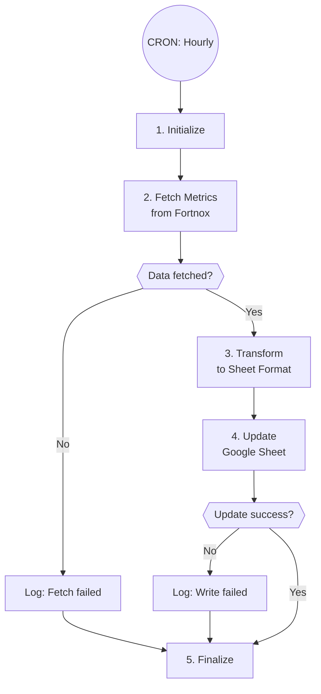

# A5: Reporting Sync

## Goal

**Problem:** Manual data export from Fortnox to reporting spreadsheets.

**Solution:** Sync key metrics to Google Sheets automatically every hour.

**Business Value:** Real-time reporting, eliminates manual exports, consistent data format.

## Flow Diagram



## API References

| System | Endpoints | Auth | Rate Limit |
|--------|-----------|------|------------|
| Fortnox | GET /invoices, GET /orders, GET /customers | OAuth2 | 4 req/sec |
| Google Sheets | PUT /spreadsheets/{id}/values | OAuth2 | 100 req/100sec |

**API Clients:**
- `app/clients/fortnox/client.py`
- `app/clients/google/sheets_client.py`

## Step Details

### 1. Initialize
- Validate Fortnox credentials
- Validate Google Sheets credentials
- Load sheet configuration (ID, ranges)
- **Output:** Clients ready

### 2. Fetch Data
- Fetch key metrics from Fortnox:
  - Total invoices this month (count + amount)
  - Total orders this month (count + amount)
  - Outstanding invoices (overdue)
  - New customers this month
  - Revenue by product category
- **Output:** Metrics dictionary

### 3. Transform
- Format metrics for spreadsheet:
  - Numbers with proper formatting (currency, percentages)
  - Dates in ISO format
  - Calculate deltas vs last sync
- Structure data for target sheet ranges
- **Output:** Formatted data arrays

### 4. Execute
- Update Google Sheet ranges:
  - `Summary!A1:B10` - Key metrics
  - `Details!A:Z` - Detailed breakdown
  - `Trends!A:Z` - Historical data (append)
- **Output:** Update confirmation

### 5. Finalize
- Log sync timestamp
- Update dashboard with last sync time
- **Output:** Sync complete

## Edge Cases & Error Handling

| Scenario | Handling | Recovery |
|----------|----------|----------|
| Fortnox API error | Log error, skip sync | Retry next hour |
| Google auth expired | Refresh token, retry | Auto-retry |
| Sheet not found | Log error | Manual fix needed |
| Rate limit hit | Batch requests | Auto-retry |
| Partial data | Sync available data | Log warning |

## Testing

### Unit Tests

```python
def test_fetch_monthly_metrics():
    """Test metrics aggregation logic."""
    pass

def test_transform_currency_format():
    """Test currency formatting for sheets."""
    amount = 12345.67
    result = format_currency(amount, "SEK")
    assert result == "12 345,67 kr"

def test_calculate_delta():
    """Test delta calculation vs previous value."""
    current = 100
    previous = 80
    delta = calculate_delta(current, previous)
    assert delta == 0.25  # 25% increase
```

### Integration Tests

```python
def test_a5_dry_run():
    """Full automation in dry-run mode."""
    automation = ReportingSync()
    result = automation.run(dry_run=True)
    assert result["dry_run"] is True
    assert "metrics" in result

def test_a5_sandbox():
    """Full automation against test sheet."""
    pass
```

### Acceptance Criteria

- [ ] Data synced correctly to all sheet ranges
- [ ] Sheet formatted properly (numbers, dates)
- [ ] Historical data appended (not overwritten)
- [ ] Dashboard shows last sync time
- [ ] Dry run mode works without side effects
- [ ] Handles partial failures gracefully

## Implementation Notes

**Code Location:** `app/automations/reporting_sync.py`

**Sheet Configuration:**
```python
SHEET_CONFIG = {
    "spreadsheet_id": "1ABC...",
    "ranges": {
        "summary": "Summary!A1:B10",
        "details": "Details!A:Z",
        "trends": "Trends!A:Z"
    }
}
```

**Environment Variables:**
| Variable | Required | Description |
|----------|----------|-------------|
| FORTNOX_CLIENT_ID | Yes | Fortnox OAuth client ID |
| FORTNOX_CLIENT_SECRET | Yes | Fortnox OAuth client secret |
| GOOGLE_CREDENTIALS_JSON | Yes | Google service account JSON |
| GOOGLE_SHEET_ID | Yes | Target spreadsheet ID |

## Changelog

| Version | Date | Changes |
|---------|------|---------|
| 1.0.0 | 2026-01-09 | Initial specification (migrated from combined spec) |