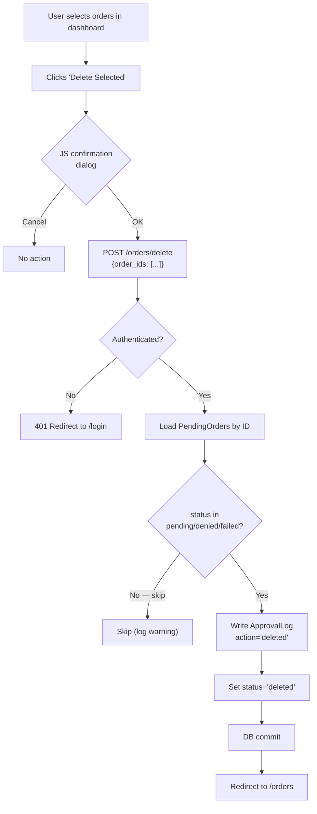

# Fix2: Dashboard Delete Orders

**Parent Automation:** [A2 — Upsales Order Enrichment Pipeline](../2-build/a2-crm-erp-sync.md)

## Problem

**Symptom:** There is no way to delete pending or recurring orders from the dashboard. When a test order is generated incorrectly, or an old `denied` order needs to be cleaned up, the only option is to reset the database — a destructive operation that wipes all history.

**Impact:**
- Dev/test cycles are painful: every bad test order requires a DB reset
- Denied and failed orders accumulate and clutter the dashboard
- No way to remove orders that were generated by mistake before they can be accidentally approved

## Solution

Add soft-delete support to the orders dashboard:

- New status value `'deleted'` on `PendingOrder`
- `POST /orders/delete` endpoint (batch, mirrors approve/deny pattern)
- Delete button on the orders list (bulk selection) and on individual order detail pages
- Only `pending`, `denied`, and `failed` orders can be deleted (never `approved` or `created` — those already exist in Fortnox)
- Audit log entry written before status change (action = `'deleted'`)
- Deleted orders are hidden from all default views

> **Soft delete chosen over hard delete** so that the ApprovalLog FK is preserved and accidental deletions can be manually recovered via direct DB query if needed.

---

## Flow Diagram



---

## Step Details

### 1. Model Change — Add `'deleted'` Status

**File:** `app/models/pending_orders.py`

No schema change needed — `status` is a plain `String` column. The new value `'deleted'` is just used by convention.

Update any docstring or comment that lists valid values:
```python
# status values: 'pending', 'approved', 'denied', 'created', 'failed', 'deleted'
```

### 2. Query Filter — Exclude Deleted Orders Everywhere

**File:** `app/routers/orders.py`

Every query that returns orders should exclude `status='deleted'` from results. Add this filter to all existing order queries:

```python
# Existing query (example from orders list):
query = db.query(PendingOrder).filter(
    PendingOrder.status != "deleted"  # ← ADD THIS to every order query
)
```

Affected queries to update:
- Orders list (`GET /orders`) — tab filters + stats counts
- JSON API (`GET /api/orders`)
- Any count queries used for stats (pending count, approved count, etc.)

### 3. New Delete Endpoint

**File:** `app/routers/orders.py`

Add after the existing `/orders/deny` endpoint:

```python
@router.post("/orders/delete")
async def delete_orders(
    request: Request,
    db: Session = Depends(get_db)
):
    if not request.session.get("authenticated"):
        return RedirectResponse("/login", status_code=302)

    form = await request.form()
    order_ids = form.getlist("order_ids")

    if not order_ids:
        return RedirectResponse("/orders", status_code=302)

    DELETABLE_STATUSES = {"pending", "denied", "failed"}
    deleted_count = 0

    for order_id in order_ids:
        order = db.query(PendingOrder).filter(PendingOrder.id == order_id).first()
        if not order:
            continue
        if order.status not in DELETABLE_STATUSES:
            # Already sent to Fortnox — do not delete
            continue

        # Audit trail before soft-delete
        log = ApprovalLog(
            order_id=order.id,
            action="deleted",
            performed_by="dashboard",
            details={"previous_status": order.status},
        )
        db.add(log)

        order.status = "deleted"
        order.updated_at = datetime.utcnow()
        deleted_count += 1

    db.commit()

    # Redirect back preserving the current tab
    tab = form.get("tab", "recurring")
    return RedirectResponse(f"/orders?tab={tab}", status_code=302)
```

### 4. Orders List Template — Delete Button

**File:** `app/templates/orders.html`

**4a. Add "Delete Selected" button** alongside Approve / Deny buttons in the bulk-action toolbar:

```html
<!-- Add inside the same <form> that wraps the order checkboxes -->
<!-- Place after the Deny button, styled in red -->
<button
  type="submit"
  formaction="/orders/delete"
  formmethod="post"
  onclick="return confirm('Delete ' + selectedCount() + ' selected order(s)? They will be hidden from the dashboard.')"
  class="btn btn-danger"
  id="delete-btn"
  disabled>
  Delete Selected
</button>

<!-- Pass the current tab so the redirect preserves it -->
<input type="hidden" name="tab" value="{{ tab }}">
```

> The `selectedCount()` helper should already exist for the approve/deny buttons. If not, a simple inline count is fine: `"Delete selected orders? They will be hidden from the dashboard."`.

**4b.** Ensure the same `order_ids` checkboxes used by approve/deny are reused — no extra markup needed.

### 5. Order Detail Template — Single Delete Button

**File:** `app/templates/order_detail.html`

Add a Delete button in the actions section. Show only when status is `pending`, `denied`, or `failed`:

```html

<form method="post" action="/orders/delete" style="display:inline;"
      onsubmit="return confirm('Delete this order for {{ order.customer_name }}? It will be hidden from the dashboard.')">
  <input type="hidden" name="order_ids" value="{{ order.id }}">
  <input type="hidden" name="tab" value="{{ 'recurring' if order.source == 'recurring' else 'new' }}">
  <button type="submit" class="btn btn-danger">Delete Order</button>
</form>

```

---

## Files to Change

| File | Change |
|------|--------|
| `app/models/pending_orders.py` | Update status value comment to include `'deleted'` |
| `app/routers/orders.py` | Add `status != 'deleted'` filter to all order queries; add `POST /orders/delete` endpoint |
| `app/templates/orders.html` | Add "Delete Selected" button with JS confirmation |
| `app/templates/order_detail.html` | Add single-order Delete button (visible for pending/denied/failed only) |

---

## Edge Cases & Error Handling

| Scenario | Handling |
|----------|----------|
| Delete `approved` or `created` order | Silently skipped — order stays unchanged |
| No orders selected | Redirect back to `/orders` immediately |
| Order not found (stale ID) | Silently skipped |
| Unauthenticated request | Redirect to `/login` |
| Delete then re-run A1 | A1 checks `your_order_number` uniqueness — if order was deleted (soft), column still exists → re-run will detect duplicate and skip. To re-generate, hard-delete via DB if needed. |

> **Note on A1 re-runs:** `your_order_number` has a unique constraint. A soft-deleted order still occupies that slot. For normal cleanup this is fine (deleted = intentional). If a re-generation is needed after deletion, manual DB intervention is required — this is an acceptable edge case.

---

## Testing

### Verification Steps

- [ ] Generate a test pending order via A1 or A2
- [ ] Delete it from the orders list (select checkbox → Delete Selected → confirm)
- [ ] Verify order disappears from all views (pending, all tabs)
- [ ] Verify `ApprovalLog` entry with `action='deleted'` was written
- [ ] Verify order is still in DB with `status='deleted'` (direct query)
- [ ] Attempt to delete an `approved` or `created` order — verify it is skipped (no status change)
- [ ] Open order detail for a denied order — verify Delete button is visible
- [ ] Open order detail for a created order — verify Delete button is NOT visible
- [ ] After deletion, confirm stats counts (pending count, total) are updated correctly

### Acceptance Criteria

- [ ] `pending`, `denied`, and `failed` orders can be deleted from both the list and detail views
- [ ] `approved` and `created` orders cannot be deleted
- [ ] Deleted orders disappear from all default dashboard views
- [ ] Audit log entry (`action='deleted'`) is written before soft-delete
- [ ] JS confirmation dialog shown before any deletion
- [ ] Stats counts exclude deleted orders
- [ ] No DB reset required for dev/test cleanup

## Changelog

| Version | Date | Changes |
|---------|------|---------|
| 1.0.0 | 2026-02-18 | Initial fix spec |
