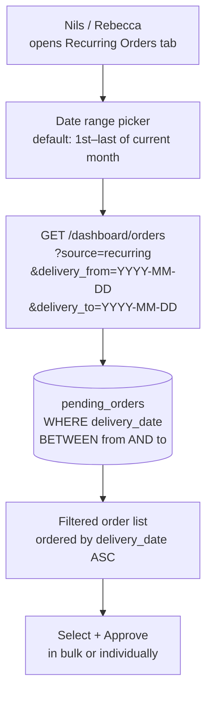

# Fix5: Dashboard — Recurring Orders Date Filter

**Parent Automation:** [A1 — Recurring Order Generator](../3-test/a1-recurring-orders.md)

## Problem

**Symptom:** The Recurring Orders tab in the dashboard shows all pending orders with no way to narrow by date. As the number of orders grows (especially once the A1 look-ahead window is expanded), the list becomes unwieldy to review.

Nils needs to be able to filter by date range — e.g. "show me everything due in March" — to review and approve orders in batches by month.

**Requested in:** Herbox Test call, 2026-02-18 (~24:20)

> *"If we could have like a setting here that I can choose maybe an interval of dates between. Maybe I can choose all possible dates within March or April or January or February, whatever."* — Nils

---

## Solution

Add a **date range picker** with quick presets above the Recurring Orders table.

- **No default** — blank dates shows all orders (no date filter applied)
- **Quick presets** — 3M, 6M, 12M buttons set from today → last day of Nth month from now
- **Clear button** — appears when a date filter is active; resets to no filter
- User can also set either boundary manually; re-loads on change
- The order list re-loads filtered by the selected `delivery_date` range
- No model changes needed — `delivery_date` is already stored on `PendingOrder`

---

## Flow Diagram



---

## Implementation

### Backend — `app/routers/dashboard.py`

Add two optional query params to the recurring orders list view:

```python
from datetime import date

@router.get("/orders")
async def list_orders(
    source: str | None = None,
    delivery_from: date | None = None,   # ADD — inclusive lower bound
    delivery_to: date | None = None,     # ADD — inclusive upper bound
    db: Session = Depends(get_db),
):
    query = db.query(PendingOrder).filter(
        PendingOrder.status != "deleted"
    )

    if source:
        query = query.filter(PendingOrder.source == source)

    if delivery_from:
        query = query.filter(PendingOrder.delivery_date >= delivery_from.isoformat())

    if delivery_to:
        query = query.filter(PendingOrder.delivery_date <= delivery_to.isoformat())

    return query.order_by(PendingOrder.delivery_date.asc()).all()
```

The view function also needs to compute the default date range and pass it to the template:

```python
from datetime import date
import calendar

def get_current_month_range():
    today = date.today()
    first = today.replace(day=1)
    last = today.replace(day=calendar.monthrange(today.year, today.month)[1])
    return first, last
```

Pass `delivery_from` and `delivery_to` back to the template context so the picker shows the active selection.

---

### Frontend — `app/templates/orders.html`

Add a date range picker inside the **Recurring Orders** tab section only (not the New Orders tab).

```html
<!-- Date range filter — Recurring Orders tab only -->
<form method="GET" action="" class="date-filter-form">
  <input type="hidden" name="tab" value="recurring">
  <label for="delivery_from">From</label>
  <input
    type="date"
    id="delivery_from"
    name="delivery_from"
    value="{{ delivery_from }}"
    onchange="this.form.submit()"
  >
  <label for="delivery_to">To</label>
  <input
    type="date"
    id="delivery_to"
    name="delivery_to"
    value="{{ delivery_to }}"
    onchange="this.form.submit()"
  >
</form>
```

- The form auto-submits on date change (`onchange`) so no submit button is needed
- `delivery_from` and `delivery_to` default to the first and last day of the current month (set in the view)
- The active filter values are preserved when navigating back from order detail (passed as query params in the Back link)

---

## Files to Change

| File | Change |
|------|--------|
| `app/routers/dashboard.py` | Add `delivery_from`, `delivery_to` query params; compute current-month default; pass to template |
| `app/templates/orders.html` | Add date range picker form to Recurring Orders tab |

No DB migration needed — `delivery_date` already exists on `PendingOrder`.

---

## Edge Cases & Error Handling

| Scenario | Handling |
|----------|----------|
| No orders in selected date range | Show empty state: "No orders due in this period" |
| `delivery_from` > `delivery_to` | Backend returns empty list; no error. Consider frontend validation to prevent this |
| `delivery_date` stored as ISO string | String comparison `>=` / `<=` works correctly for `YYYY-MM-DD` format |
| Filter active while approving an order | After approve/deny, redirect back preserving `delivery_from`/`delivery_to` params |
| New Orders tab | Date filter is NOT applied to the New Orders tab — it's Recurring Orders only |

---

## Testing

- [ ] Open Recurring Orders tab — date picker shows with current month pre-selected
- [ ] Verify only orders with `delivery_date` in current month are listed by default
- [ ] Change `delivery_from` to first of next month — list updates to next month's orders
- [ ] Set a date range spanning two months — orders from both months appear
- [ ] Set a range with no orders — empty state message shown
- [ ] Approve an order — redirected back to filtered list with same date range active
- [ ] Switch to New Orders tab — date filter is absent (not applicable to new orders)
- [ ] Bulk selection + approve works with filter active

### Acceptance Criteria

- [ ] Date range picker visible on Recurring Orders tab, defaulting to current month
- [ ] Orders list filtered by `delivery_date` between selected dates
- [ ] Filter preserved when returning from order detail view
- [ ] No impact on New Orders tab
- [ ] No regression on approve/deny/edit flows

---

## Changelog

| Version | Date | Changes |
|---------|------|---------|
| 1.2.0 | 2026-02-23 | Removed current-month default; added 3M/6M/12M presets + Clear button |
| 1.1.0 | 2026-02-23 | Removed Part 1 (A1 look-ahead); switched to date range picker defaulting to current month |
| 1.0.0 | 2026-02-23 | Initial spec from Herbox Test call (2026-02-18) |
