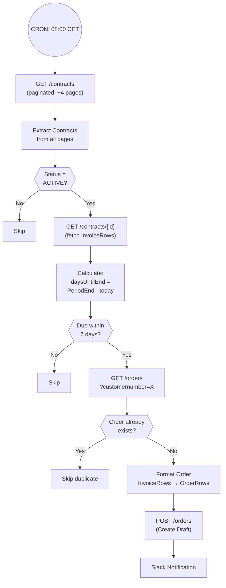

# A1: Recurring Order Generator

## Goal

**Problem:** Rebecca spends 60% of her time manually checking due dates and creating orders from contracts.

**Solution:** Auto-generate draft orders for contracts due within 7 days.

**Business Value:** Saves ~20 hours/week of manual work, reduces missed renewals.

## Flow Diagram

## API References

| System | Endpoints | Auth | Rate Limit |
|--------|-----------|------|------------|
| Fortnox | `GET /3/contracts` | OAuth2 | 4 req/sec |
| Fortnox | `GET /3/contracts/{id}` | OAuth2 | 4 req/sec |
| Fortnox | `GET /3/orders` | OAuth2 | 4 req/sec |
| Fortnox | `POST /3/orders` | OAuth2 | 4 req/sec |

## Step Details

### 1. Fetch Contracts (Paginated)
- Fetch all contracts from Fortnox: `GET /3/contracts?limit=500&page={page}`
- Pagination: ~1828 contracts across 4 pages (500 per page)
- Stops when `MetaInformation.@CurrentPage >= MetaInformation.@TotalPages`
- **Output:** All contracts from all pages (~1828 items)

### 2. Filter Active Contracts
- Filter contracts where `Status === "ACTIVE"`
- Inactive/finished contracts are dropped
- **Output:** Active contracts only

### 3. Fetch Contract Details
- For each active contract: `GET /3/contracts/{DocumentNumber}`
- Retrieves full contract data including `InvoiceRows` (not available in list endpoint)
- **Output:** Full contract objects with InvoiceRows

### 4. Calculate Timing
- Calculate `daysUntilEnd = PeriodEnd - today`
- Filter: `daysUntilEnd <= 7 && daysUntilEnd >= 0`
- Contracts not due within 7 days are dropped
- **Output:** Contracts due for order generation

### 5. Duplicate Detection
- Query existing orders: `GET /3/orders?customernumber={CustomerNumber}`
- Check for orders with matching `YourOrderNumber` pattern: `C{DocumentNumber}-{PeriodEnd}`
- Fallback: check if any order has matching `DeliveryDate` + `CustomerNumber`
- Duplicates are skipped
- **Output:** Contracts that need new orders

### 6. Format Order
- Map contract fields to order fields:
  - `Contract.CustomerNumber` → `Order.CustomerNumber`
  - `Contract.InvoiceRows` → `Order.OrderRows` (ArticleNumber, Description, DeliveredQuantity, Price, VAT, Unit, Discount, AccountNumber, CostCenter, Project)
  - `Contract.PeriodEnd` → `Order.DeliveryDate`
  - `Contract.YourReference` → `Order.YourReference`
  - `Contract.OurReference` → `Order.OurReference`
  - `Contract.Currency` → `Order.Currency`
  - `Contract.TermsOfDelivery/Payment` → `Order.TermsOfDelivery/Payment`
- Set `YourOrderNumber` to `C{DocumentNumber}-{PeriodEnd}` (for duplicate detection)
- Set `Comments` to `Auto-generated from contract #{DocumentNumber}`
- **Output:** Fortnox Order payload

### 7. Create Draft Order
- `POST /3/orders` with formatted order payload
- Creates draft order in Fortnox
- **Output:** Created order with DocumentNumber

### 8. Notify
- Format Slack message with order details (number, customer, delivery date, amount)
- POST to Slack webhook URL
- **Output:** Notification sent

## Edge Cases & Error Handling

| Scenario | Handling | Recovery |
|----------|----------|----------|
| Rate limit (429) | Node retry (3 attempts) | Auto-retry |
| Auth expired (401) | N8N OAuth2 auto-refresh | Automatic |
| Contract not found (404) | Continue on fail, skip | Continue |
| Duplicate order detected | Skip via YourOrderNumber check | Continue |
| Invalid contract data | Continue on fail, skip | Continue |
| Fortnox server error (5xx) | Node retry (3 attempts) | Auto-retry |
| Pagination stops early | Max 10 pages safety limit | Check execution log |

## Testing

### Manual Testing in N8N

1. **Add Limit node** (set to 2) between "Filter Active" and "GET Contract Details"
2. **Disable CREATE node** to prevent real orders
3. **Run manually** via N8N UI and inspect each node's output
4. **Check:** Contract details fetched, timing calculated, duplicates detected
5. **Enable CREATE** with Limit=1 to test single order creation
6. **Verify** order appears in Fortnox as draft
7. **Remove Limit** for production

### Acceptance Criteria

- [ ] All contract pages fetched (check Extract Contracts output count ≈ 1828)
- [ ] Only ACTIVE contracts processed
- [ ] Only contracts due within 7 days generate orders
- [ ] Duplicate orders prevented (re-run creates no new orders)
- [ ] Draft order fields match contract data exactly
- [ ] YourOrderNumber set to `C{DocNum}-{PeriodEnd}` pattern
- [ ] Slack notification sent per created order
- [ ] Workflow completes without errors

## N8N Workflow

**Workflow file:** `context/a1-n8n-workflow.json`

**Credential:** "Herbox - OAuth2 Credentials" (OAuth2 API type, configured in N8N)

**Key Configuration:**
- Schedule: Daily at 08:00 (configurable in Schedule Trigger node)
- Pagination: Built into GET Contracts node via Options → Pagination
- Error handling: All HTTP nodes set to "Continue on Fail"
- Notification: Replace Slack webhook URL in "Send Notification" node

## Changelog

| Version | Date | Changes |
|---------|------|---------|
| 2.0.0 | 2026-02-11 | Migrated to N8N. Added pagination, duplicate detection, OAuth2, error handling, notifications |
| 1.0.0 | 2026-01-09 | Initial specification (planned, not implemented) |