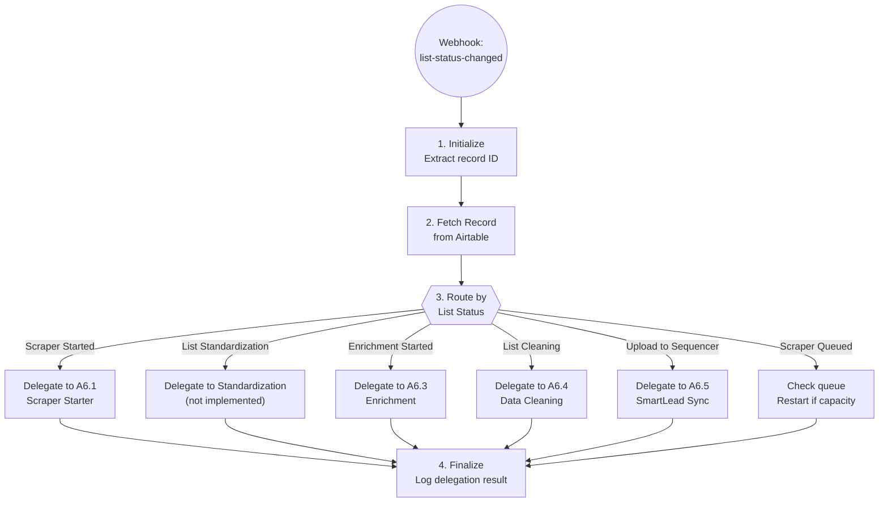

# A6: List Building Orchestrator

## Goal

**Problem:** Lead list building requires multiple sequential stages (scraping, standardization, enrichment, cleaning, upload) with manual monitoring and status tracking between each stage.

**Solution:** Pure orchestrator that watches Airtable record status changes and delegates to the appropriate sub-automation for each stage. Each sub-automation is independently responsible for its domain.

**Business Value:** Clean separation of concerns - orchestrator handles routing only, while sub-automations own their business logic. Makes the system modular, testable, and maintainable.

## Architecture

```
┌─────────────────────────────────────────────────────────────────────┐
│                           A6 Orchestrator                            │
│                    (Routing & Coordination Only)                     │
│                                                                      │
│  Watches: List Status field in Airtable                             │
│  Trigger: Webhook when status changes                                │
│  Action: Routes to appropriate sub-automation                        │
└─────────────────────────────────────────────────────────────────────┘
                                    │
                    ┌───────────────┼───────────────┐
                    │               │               │
                    ▼               ▼               ▼
        ┌───────────┐     ┌───────────┐     ┌───────────┐
        │   A6.1    │     │   A6.2    │     │   A6.3    │
        │  Scraper  │     │ Completion│     │Enrichment │
        │  Starter  │     │ Handler   │     │           │
        └───────────┘     └───────────┘     └───────────┘
                    │               │               │
                    ▼               ▼               ▼
        ┌───────────┐     ┌───────────┐     ┌───────────┐
        │   A6.4    │     │   A6.5    │     │   A7      │
        │  Cleaning │     │SmartLead  │     │Campaign   │
        │           │     │  Sync     │     │  Sync     │
        └───────────┘     └───────────┘     └───────────┘
```

## Flow Diagram



## Status Routing Table

| List Status | Delegate To | Automation File | Purpose |
|-------------|-------------|-----------------|---------|
| Scraper Started | A6.1 | `apify_scraper_starter.py` | Start Apify scraper |
| Scraper Queued | (internal) | `_check_and_restart()` | Re-check queue, start if capacity |
| List Standardization | (not implemented) | - | Standardize lead data |
| Enrichment & Verification Started | A6.3 | `contact_enrichment.py` | Enrich emails + verify |
| List Cleaning Started | A6.4 | `data_cleaning.py` | GPT-4 cleaning |
| Upload to Email Sequencer | A6.5 | `smartlead_sync.py` | Sync to SmartLead |
| Scraper In Progress | (ignore) | - | Already running |
| Scraper Completed | (ignore) | - | A6.2 handles via Apify webhook |

## Step Details

### 1. Initialize

- Extract `recordId` from webhook payload body
- Load settings:
  - `airtable_base_id`: app4gZ66mB8m3Vvj0
  - `airtable_table_list_building_id`: tblcFFxDCN0788xjF
- **Output:** Settings loaded, record ID ready

### 2. Fetch Record

```python
airtable_record = await airtable_client.get_record(
    table_id="tblcFFxDCN0788xjF",
    record_id=payload["recordId"]
)

list_status = airtable_record.fields.get("List Status")
list_name = airtable_record.fields.get("List Name")
```

### 3. Route by Status

```python
def get_sub_automation(status: str) -> str | None:
    """Map status to sub-automation."""
    routing = {
        "Scraper Started": "a6_1_scraper_starter",
        "Scraper Queued": "a6_1_scraper_starter",  # Re-check queue
        "Enrichment & Verification Started": "a6_3_enrichment",
        "List Cleaning Started": "a6_4_data_cleaning",
        "Upload to Email Sequencer": "a6_5_smartlead_sync",
    }
    return routing.get(status)

sub_automation = get_sub_automation(list_status)

if not sub_automation:
    return {
        "status": "skipped",
        "reason": f"No handler for status: {list_status}"
    }
```

### 4. Delegate to Sub-Automation

```python
# Import and instantiate the sub-automation
if sub_automation == "a6_1_scraper_starter":
    from app.automations.apify_scraper_starter import ApifyScraperStarter
    handler = ApifyScraperStarter()
    result = await handler.run(payload)

elif sub_automation == "a6_3_enrichment":
    from app.automations.contact_enrichment import ContactEnrichment
    handler = ContactEnrichment()
    result = await handler.run(payload)

# ... other sub-automations
```

### 5. Finalize

- Log delegation result to database
- Return result to webhook caller
- **Output:** Delegation complete

## Special Handling: Scraper Queued

When status is "Scraper Queued", the orchestrator should:

1. Check current queue capacity
2. If capacity available, delegate to A6.1 to start the scraper
3. If still at capacity, leave as queued (will retry next time)

```python
async def _handle_queued(self, record: ListRecord) -> dict:
    """Re-check queue for queued scrapers."""
    running = await apify_client.get_running_actors()

    if running.total < MAX_CONCURRENT_SCRAPERS:
        # Capacity available - try to start
        return await self._delegate_to_a6_1(record)

    # Still at capacity
    return {
        "status": "still_queued",
        "reason": "max_concurrent_reached",
        "running_count": running.total
    }
```

## Edge Cases & Error Handling

| Scenario | Handling | Recovery |
|----------|----------|----------|
| Unknown status | Skip, log warning | Add to routing table |
| Sub-automation not found | Log error, return 500 | Implement missing automation |
| Sub-automation throws error | Catch, log, return 500 | Check sub-automation logs |
| Airtable record not found | Log error, return 404 | Verify record ID |
| Airtable rate limit (429) | Retry with backoff | Built into client |

## Testing

### Unit Tests

```python
def test_route_scraper_started():
    """Routes to A6.1 scraper starter."""
    result = get_sub_automation("Scraper Started")
    assert result == "a6_1_scraper_starter"

def test_route_enrichment_started():
    """Routes to A6.3 enrichment."""
    result = get_sub_automation("Enrichment & Verification Started")
    assert result == "a6_3_enrichment"

def test_route_unknown_status():
    """Returns None for unknown status."""
    result = get_sub_automation("Unknown Status")
    assert result is None
```

### Integration Tests

```python
@pytest.mark.asyncio
async def test_a6_orchestrator_delegates_to_a6_1():
    """Test orchestrator delegates to A6.1 for Scraper Started."""
    orchestrator = ListBuildingOrchestrator()

    # Mock A6.1
    with patch('app.automations.apify_scraper_starter.ApifyScraperStarter') as mock_a6_1:
        mock_instance = AsyncMock()
        mock_instance.run.return_value = {"status": "scraper_started", "run_id": "run123"}
        mock_a6_1.return_value = mock_instance

        result = await orchestrator.run({"recordId": "rec123"})

    assert result["status"] == "scraper_started"
    mock_instance.run.assert_called_once()

@pytest.mark.asyncio
async def test_a6_orchestrator_skips_unknown_status():
    """Test orchestrator skips unknown statuses."""
    orchestrator = ListBuildingOrchestrator()

    # Mock Airtable to return unknown status
    with patch.object(orchestrator, 'airtable_client') as mock_airtable:
        mock_airtable.get_record.return_value = MagicMock(
            fields={"List Status": "Unknown Status"}
        )

        result = await orchestrator.run({"recordId": "rec123"})

    assert result["status"] == "skipped"
    assert "No handler" in result["reason"]
```

### Acceptance Criteria

- [ ] Webhook receives record ID from Airtable
- [ ] Fetches list record from Airtable
- [ ] Routes to correct sub-automation based on status
- [ ] Delegates execution to sub-automation
- [ ] Returns sub-automation result to caller
- [ ] Logs delegation for observability
- [ ] Handles unknown statuses gracefully
- [ ] Handles sub-automation errors without crashing

## Implementation Notes

**Code Location:** `app/automations/list_building_orchestrator.py`

**Key Design Principle:**
> **A6 is a pure orchestrator.** It does NOT contain business logic for scraping, enrichment, cleaning, or syncing. It ONLY routes to the appropriate sub-automation.

**Dependencies:**
- `app/clients/airtable/client.py` - Airtable API
- Sub-automations are imported dynamically

**Environment Variables:**

| Variable | Required | Description |
|----------|----------|-------------|
| AIRTABLE_API_KEY | Yes | Airtable personal access token |
| AIRTABLE_BASE_ID | Yes | Base ID (app4gZ66mB8m3Vvj0) |

**Webhook Setup:**
1. In Airtable, create automation triggered on "List Status" field change
2. Action: Send webhook to `{RAILWAY_URL}/webhooks/list-status-changed`
3. Payload: `{"recordId": "{{record.id}}"}`

**Sub-Automations:**
| ID | Name | Status | File |
|----|------|--------|------|
| A6.1 | Apify Scraper Starter | Planned | `apify_scraper_starter.py` |
| A6.2 | Lead Sourcing Completed | Implemented | `lead_sourcing_completed.py` |
| A6.3 | Contact Enrichment | Draft | `contact_enrichment.py` |
| A6.4 | Data Cleaning | Planned | `data_cleaning.py` |
| A6.5 | SmartLead Sync | Planned | `smartlead_sync.py` |

## Changelog

| Version | Date | Changes |
|---------|------|---------|
| 2.0.0 | 2026-01-14 | **REFACTOR**: Extracted scraper logic to A6.1, now pure orchestrator |
| 1.0.0 | 2026-01-09 | Initial specification (converted from N8N) |