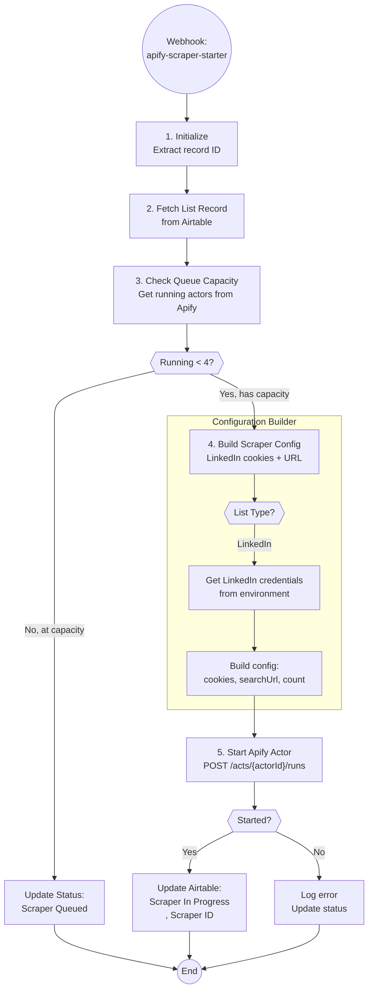

# A6.1: Apify Scraper Starter

## Goal

**Problem:** When a list is ready for scraping, the Apify actor needs to be started with proper configuration, but we must respect queue capacity limits to avoid overwhelming resources.

**Solution:** Check current scraper queue, build scraper configuration (LinkedIn cookies, search URL, limits), start the Apify actor, and update Airtable with the run ID.

**Business Value:** Prevents resource exhaustion by limiting concurrent scrapers while ensuring reliable scraper starts with proper credentials.

## Flow Diagram



## API References

| System | Endpoints | Auth | Rate Limit |
|--------|-----------|------|------------|
| Airtable | GET /bases/{baseId}/tables/{tableId}/records/{recordId} | Bearer Token | 5 req/sec |
| Airtable | PATCH /bases/{baseId}/tables/{tableId}/records/{recordId} | Bearer Token | 5 req/sec |
| Apify | GET /v2/actor-runs?status=RUNNING | Bearer Token | 100 req/min |
| Apify | POST /v2/acts/{actorId}/runs | Bearer Token | 100 req/min |

**API Clients:**
- `app/clients/airtable/client.py`
- `app/clients/apify/client.py`

## Step Details

### 1. Initialize

- Extract `recordId` from webhook payload body
- Load global settings:
  - `airtable_base_id`: app4gZ66mB8m3Vvj0
  - `airtable_table_list_building_id`: tblcFFxDCN0788xjF
  - `max_concurrent_scrapers`: 4
- **Output:** Settings loaded, record ID ready

### 2. Fetch List Record

```python
list_record = await airtable_client.get_record(
    table_id="tblcFFxDCN0788xjF",
    record_id=record_id
)

# Extract required fields
list_url = list_record.fields.get("List URL")
list_type = list_record.fields.get("List Type")
max_results = list_record.fields.get("Max Results")  # Optional
```

**Validation:**
- Must have `List URL` - error if missing
- Must have `List Type` - error if missing

### 3. Check Queue Capacity

```python
running_actors = await apify_client.get_running_actors()
running_count = running_actors.total

if running_count >= max_concurrent_scrapers:
    # Queue the scraper
    await airtable_client.update_record(
        table_id="tblcFFxDCN0788xjF",
        record_id=record_id,
        fields={"List Status": "Scraper Queued"}
    )
    return {
        "status": "queued",
        "reason": "max_concurrent_reached",
        "running_count": running_count
    }
```

### 4. Build Scraper Configuration

**LinkedIn Scraper (curious_coder/linkedin-people-search-scraper):**

```python
# Actor ID
LINKEDIN_SCRAPER_ID = "7Q2x4Chr5xNR5s4dP"

# Get cookies from Airtable config table (supports multiple accounts)
# Checks: linkedin_cookie_a → linkedin_cookie_b → linkedin_cookie_c
linkedin_cookies = await get_linkedin_cookies_from_airtable()
user_agent = settings.linkedin_user_agent  # Still from environment

# Build config
scraper_config = {
    "cookie": linkedin_cookies,
    "searchUrl": list_url,
    "userAgent": user_agent,
    "startPage": 1,
    "minDelay": 2,
    "maxDelay": 5,
    # Proxy configuration (required for this actor)
    "proxy": {
        "useApifyProxy": True,
    },
}

# Add optional max results
if max_results:
    scraper_config["count"] = max_results
```

**LinkedIn Cookie Architecture:**

LinkedIn cookies are stored in Airtable `config` table to support multiple accounts and easy rotation:

| Field | Purpose | Format |
|-------|---------|--------|
| `linkedin_cookie_a` | Primary account | JSON array (Cookie-Editor format) |
| `linkedin_cookie_b` | Backup account 1 | JSON array (Cookie-Editor format) |
| `linkedin_cookie_c` | Backup account 2 | JSON array (Cookie-Editor format) |

The automation tries each cookie field in order (a → b → c) until it finds a valid set.

**Environment Variables Required:**
- `LINKEDIN_USER_AGENT` - Browser user agent string (non-secret, single value)

### 5. Start Apify Actor

```python
# Start the scraper
run = await apify_client.start_actor(
    actor_id=LINKEDIN_SCRAPER_ID,
    input_config=scraper_config,
    timeout_secs=86400  # 24 hours
)

# Returns ActorRun with:
# - run.id: The run ID for tracking
# - run.status: Current status (should be "READY" or "RUNNING")
```

### 6. Update Airtable Status

```python
await airtable_client.update_record(
    table_id="tblcFFxDCN0788xjF",
    record_id=record_id,
    fields={
        "List Status": "Scraper In Progress",
        "Scraper ID": run.id  # Store for A6.2 completion handler
    }
)
```

## Edge Cases & Error Handling

| Scenario | Handling | Recovery |
|----------|----------|----------|
| List URL missing | Return error, skip record | Manual fix in Airtable |
| List Type missing | Return error, skip record | Manual fix in Airtable |
| LinkedIn cookies missing in config | Return error, skip record | Add cookies to Airtable config table |
| All LinkedIn cookies invalid | Return error, skip record | Refresh cookies in Airtable |
| Queue at capacity | Update status to "Scraper Queued" | Auto-retry via A6 orchestrator |
| Apify auth error (401) | Log error, update status | Refresh APIFY_API_TOKEN |
| Scraper start fails | Log error, don't update status | Manual retry |
| Apify timeout | Scraper handles internally | Check Apify dashboard |

## Testing

### Unit Tests

```python
def test_should_queue_scraper():
    """Test queue capacity logic."""
    assert should_queue(running=4, max=4) is True
    assert should_queue(running=3, max=4) is False

def test_build_linkedin_config_basic():
    """Test LinkedIn config builder."""
    record = ListRecord(
        id="rec123",
        list_url="https://www.linkedin.com/sales/search/...",
    )
    cookies = [{"name": "li_at", "value": "ABC123"}]
    config = build_linkedin_config(record, cookies, "Mozilla/5.0...")

    assert config["searchUrl"] == record.list_url
    assert config["cookie"] == cookies
    assert config["minDelay"] == 2
    assert config["maxDelay"] == 5

def test_build_linkedin_config_with_max_results():
    """Test config includes count when max_results provided."""
    record = ListRecord(
        id="rec123",
        list_url="https://linkedin.com/...",
        max_results=250,
    )
    config = build_linkedin_config(record, cookies, ua)

    assert config["count"] == 250
```

### Integration Tests

```python
@pytest.mark.asyncio
async def test_a6_1_queue_at_capacity():
    """Test scraper queues when at capacity."""
    handler = ApifyScraperStarter(apify_token="test", airtable_token="test")

    # Mock Apify returning 4 running actors
    with patch.object(handler.apify_client, 'get_running_actors') as mock_running:
        mock_running.return_value = ActorRunsResponse(total=4, items=[])

        result = await handler.run({"recordId": "rec123"})

    assert result["status"] == "queued"
    assert result["reason"] == "max_concurrent_reached"

@pytest.mark.asyncio
async def test_a6_1_start_scraper_success():
    """Test successful scraper start."""
    handler = ApifyScraperStarter(apify_token="test", airtable_token="test")

    # Mock clients
    with patch.object(handler, '_init_clients'):
        with patch.object(handler, '_close_clients'):
            # Mock queue check (under capacity)
            with patch.object(handler.apify_client, 'get_running_actors') as mock_running:
                mock_running.return_value = ActorRunsResponse(total=1, items=[])

                # Mock Airtable record fetch
                with patch.object(handler.airtable_client, 'get_record') as mock_get:
                    mock_get.return_value = MagicMock(
                        id="rec123",
                        fields={
                            "List URL": "https://linkedin.com/sales/search/...",
                            "List Type": "Apify - LinkedIn",
                        }
                    )

                    # Mock actor start
                    with patch.object(handler.apify_client, 'start_actor') as mock_start:
                        mock_start.return_value = ActorRun(
                            id="run123",
                            status=RunStatus.RUNNING,
                        )

                        # Mock Airtable update
                        with patch.object(handler.airtable_client, 'update_record') as mock_update:
                            result = await handler.run({"recordId": "rec123"})

    assert result["status"] == "scraper_started"
    assert result["run_id"] == "run123"
```

### Acceptance Criteria

- [ ] Webhook receives record ID from A6 orchestrator
- [ ] Fetches list record from Airtable
- [ ] Validates required fields (List URL, List Type)
- [ ] Checks queue capacity (max 4 concurrent)
- [ ] Queues scraper when at capacity
- [ ] Builds LinkedIn scraper config with cookies
- [ ] Starts Apify actor with correct config
- [ ] Updates Airtable with Scraper ID
- [ ] Updates status to "Scraper In Progress"
- [ ] Handles errors gracefully
- [ ] Dry run mode works without starting scraper

## Implementation Notes

**Code Location:** `app/automations/apify_scraper_starter.py`

**Dependencies:**
- `httpx` - API calls
- `pydantic` - Data validation
- `app/clients/apify/client.py` - Apify API wrapper
- `app/clients/airtable/client.py` - Airtable API wrapper

**Environment Variables:**

| Variable | Required | Description |
|----------|----------|-------------|
| AIRTABLE_API_KEY | Yes | Airtable personal access token |
| APIFY_API_TOKEN | Yes | Apify API bearer token |
| LINKEDIN_USER_AGENT | Yes | Browser user agent string |

**Airtable Configuration (config table):**

| Field | Required | Description |
|-------|----------|-------------|
| linkedin_cookie_a | Yes* | Primary LinkedIn cookies (JSON array) |
| linkedin_cookie_b | No | Backup LinkedIn cookies |
| linkedin_cookie_c | No | Backup LinkedIn cookies |

*At least one cookie field must be populated. The system tries them in order (a → b → c).

**Integration:**
- Called by A6 orchestrator when `List Status = "Scraper Started"`
- A6.2 handles completion when Apify fires webhook

**Related Specs:**
- A6 (List Building Orchestrator) - Calls this automation
- A6.2 (Lead Sourcing Completed) - Handles scraper completion

## Changelog

| Version | Date | Changes |
|---------|------|---------|
| 1.0.0 | 2026-01-14 | Initial specification + Implementation |
| | | - Implemented ApifyScraperStarter class |
| | | - Fixed actor ID to 7Q2x4Chr5xNR5s4dP |
| | | - Added Apify proxy configuration |
| | | - Implemented LinkedIn cookie fetching from Airtable Configs table |
| | | - Added support for multiple LinkedIn cookie accounts (a, b, c) |
| | | - Fixed list type matching to support "Sales Navigator" |
| | | - Added dry-run mode optimization |
| | | - All 24 unit tests passing |
| | | - Live test successful |