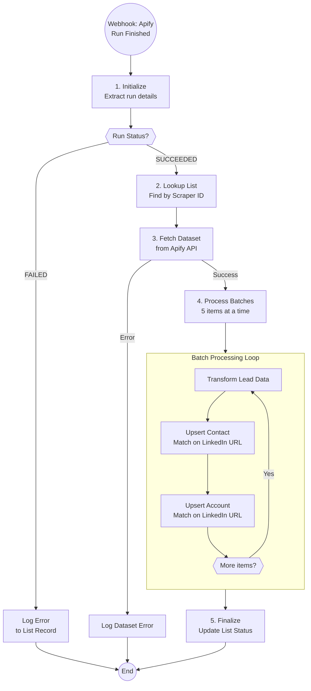

# A6.2: Lead Sourcing Completed Handler

## Goal

**Problem:** When Apify scrapers finish running, the scraped leads need to be imported into Airtable and the list status needs to be updated. This requires fetching datasets, normalizing data formats, and upserting records.

**Solution:** Webhook handler that receives Apify run completion callbacks, fetches the scraped dataset, transforms data to the standard format, and upserts leads/accounts to Airtable.

**Business Value:** Automatically imports scraped leads into the CRM the moment scraping completes, eliminating manual data import work and reducing time-to-campaign.

## Flow Diagram



## API References

| System | Endpoints | Auth | Rate Limit |
|--------|-----------|------|------------|
| Apify | GET /v2/datasets/{datasetId}/items | Bearer Token | 100 req/min |
| Airtable | GET /bases/{baseId}/tables/{tableId} (search) | Bearer Token | 5 req/sec |
| Airtable | PATCH /bases/{baseId}/tables/{tableId}/records | Bearer Token | 5 req/sec |

**API Clients:**
- `app/clients/airtable/client.py`
- `app/clients/apify/client.py`

## Step Details

### 1. Initialize

Parse the Apify webhook payload to extract run details:

```python
# Webhook payload structure (from Apify)
{
    "eventType": "ACTOR.RUN.SUCCEEDED",
    "eventData": {
        "actorRunId": "HkGyboNtTdIHkte4i"
    },
    "resource": {
        "id": "HkGyboNtTdIHkte4i",
        "status": "SUCCEEDED",
        "defaultDatasetId": "Pj8FRjHZu9KxRvMiZ"
    }
}

# Extract settings
settings = {
    "apify_actor_run_id": payload["eventData"]["actorRunId"],
    "apify_actor_dataset_id": payload["resource"]["defaultDatasetId"],
    "apify_actor_status": payload["resource"]["status"],
    "airtable_base_id": "apppGZKPtSKo2H41f",
    "airtable_table_list_building_id": "tblcFFxDCN0788xjF",
    "airtable_table_contacts_id": "tblsI8jeqv1B16MTk",
    "airtable_table_accounts_id": "tblIJVWxf1QbpowuS"
}
```

**Output:** Run settings extracted, ready for processing

### 2. Lookup List Record

Find the list record in Airtable that matches this scraper run:

```python
# Search for list by Scraper ID
list_record = await airtable_client.search(
    base_id=settings["airtable_base_id"],
    table_id=settings["airtable_table_list_building_id"],
    formula=f"{{Scraper ID}}='{settings['apify_actor_run_id']}'"
)

list_id = list_record["id"]
list_name = list_record["fields"]["List Name"]
list_type = list_record["fields"]["List Type"]
```

**Output:** List record ID and metadata

### 3. Fetch Dataset

Retrieve all items from the Apify dataset:

```python
# Fetch dataset items
response = await httpx_client.get(
    f"https://api.apify.com/v2/datasets/{settings['apify_actor_dataset_id']}/items",
    headers={"Authorization": f"Bearer {APIFY_TOKEN}"}
)
items = response.json()
```

**Output:** List of scraped lead records

### 4. Process Batches

Process items in batches of 5 to respect Airtable rate limits:

```python
BATCH_SIZE = 5

def chunks(lst, n):
    for i in range(0, len(lst), n):
        yield lst[i:i + n]

for batch in chunks(items, BATCH_SIZE):
    for item in batch:
        # Transform data
        lead = transform_lead(item)

        # Upsert contact
        await upsert_contact(lead)

        # Upsert account
        await upsert_account(lead)
```

**Data Transformation:**

```python
def transform_lead(item: dict) -> dict:
    """Normalize lead data from different scraper formats."""
    return {
        "first_name": item.get("first_name") or item.get("firstName", ""),
        "last_name": item.get("last_name") or item.get("lastName", ""),
        "linkedin_url": item.get("linkedin_url") or item.get("publicUrl", ""),
        "email": item.get("email", ""),
        "job_title": item.get("title") or item.get("jobTitle", ""),
        "phone_number": item.get("organization_phone", ""),
        "profile_summary": item.get("summary", ""),
        "profile_headline": item.get("headline", ""),
        "organization_name": (
            item.get("organization", {}).get("name") or
            item.get("companyName", "")
        ),
        "organization_industry": item.get("organization", {}).get("industry", ""),
        "organization_linkedin_url": (
            item.get("organization", {}).get("linkedin_url") or
            item.get("companyLinkedinUrl", "")
        ),
        "organization_employee_count": item.get("organization", {}).get("estimated_num_employees"),
        "organization_hq_address": (
            item.get("organization_raw_address") or
            (item.get("positions", [{}])[0].get("location") if item.get("positions") else "")
        ),
        "organization_city": item.get("organization_city", ""),
        "organization_website": (
            item.get("organization_website_url") or
            item.get("companyWebsite", "")
        )
    }
```

**Upsert Contact:**

```python
async def upsert_contact(lead: dict, list_id: str):
    """Upsert contact to Airtable, matching on LinkedIn URL."""
    await airtable_client.upsert(
        base_id=settings["airtable_base_id"],
        table_id=settings["airtable_table_contacts_id"],
        records=[{
            "fields": {
                "Email Verified": False,
                "Linkedin URL": lead["linkedin_url"],
                "First Name": lead["first_name"],
                "Last Name": lead["last_name"],
                "Email": lead["email"],
                "Title": lead["job_title"],
                "DEV - Account Name": lead["organization_name"],
                "List": [list_id]  # Link to list record
            }
        }],
        merge_on=["Linkedin URL"]
    )
```

**Upsert Account:**

```python
async def upsert_account(lead: dict, list_id: str):
    """Upsert account to Airtable, matching on LinkedIn URL."""
    if not lead["organization_linkedin_url"]:
        return  # Skip if no company LinkedIn URL

    await airtable_client.upsert(
        base_id=settings["airtable_base_id"],
        table_id=settings["airtable_table_accounts_id"],
        records=[{
            "fields": {
                "List": [list_id],
                "Linkedin URL": lead["organization_linkedin_url"],
                "Account Name": lead["organization_name"],
                "Industry": lead["organization_industry"],
                "Employee Count": lead["organization_employee_count"],
                "Website": lead["organization_website"],
                "HQ Address": lead["organization_hq_address"],
                "City": lead["organization_city"]
            }
        }],
        merge_on=["Linkedin URL"]
    )
```

**Output:** All leads and accounts upserted

### 5. Finalize

Update the list status to indicate scraping is complete:

```python
await airtable_client.update(
    base_id=settings["airtable_base_id"],
    table_id=settings["airtable_table_list_building_id"],
    record_id=list_id,
    fields={
        "List Status": "Scraper Completed"
    }
)
```

**Output:** List status updated, ready for next stage (enrichment)

## Edge Cases & Error Handling

| Scenario | Handling | Recovery |
|----------|----------|----------|
| Run status FAILED | Log error to Scraper Log field | Manual retry in Apify |
| Dataset not found (404) | Log error to Scraper Log field | Check Apify console |
| Dataset empty | Update status, log warning | Review scraper config |
| Airtable rate limit (429) | Retry with exponential backoff | Auto-retry (built into batch processing) |
| List record not found | Log error, skip processing | Manual investigation |
| Invalid LinkedIn URL | Skip upsert for that field | Data logged for review |
| Duplicate contacts | Upsert handles via merge_on | No action needed |
| Apify auth error (401) | Log error, fail fast | Refresh API token |

**Error Logging:**

```python
async def log_error(list_id: str, error_message: str):
    """Append error to Scraper Log field."""
    existing_log = list_record.get("Scraper Log", "")
    timestamp = datetime.now().strftime("%Y-%m-%d %H:%M")
    new_log = f"{existing_log}\n{timestamp} - Error: {error_message}" if existing_log else f"{timestamp} - Error: {error_message}"

    await airtable_client.update(
        record_id=list_id,
        fields={"Scraper Log": new_log}
    )
```

## Testing

### Unit Tests

```python
def test_transform_lead_apollo_format():
    """Test transformation from Apollo scraper format."""
    item = {
        "first_name": "John",
        "last_name": "Doe",
        "email": "john@example.com",
        "title": "CEO",
        "linkedin_url": "https://linkedin.com/in/johndoe",
        "organization": {
            "name": "Acme Corp",
            "industry": "Technology",
            "linkedin_url": "https://linkedin.com/company/acme"
        }
    }
    result = transform_lead(item)
    assert result["first_name"] == "John"
    assert result["organization_name"] == "Acme Corp"

def test_transform_lead_sales_nav_format():
    """Test transformation from Sales Navigator format."""
    item = {
        "firstName": "Jane",
        "lastName": "Smith",
        "publicUrl": "https://linkedin.com/in/janesmith",
        "jobTitle": "CTO",
        "companyName": "TechCo",
        "companyLinkedinUrl": "https://linkedin.com/company/techco"
    }
    result = transform_lead(item)
    assert result["first_name"] == "Jane"
    assert result["linkedin_url"] == "https://linkedin.com/in/janesmith"
    assert result["organization_name"] == "TechCo"

def test_batch_chunking():
    """Test batch size logic."""
    items = list(range(12))
    batches = list(chunks(items, 5))
    assert len(batches) == 3
    assert len(batches[0]) == 5
    assert len(batches[2]) == 2
```

### Integration Tests

```python
def test_a6_2_dry_run():
    """Full automation in dry-run mode."""
    payload = {
        "eventType": "ACTOR.RUN.SUCCEEDED",
        "eventData": {"actorRunId": "test123"},
        "resource": {
            "status": "SUCCEEDED",
            "defaultDatasetId": "dataset456"
        }
    }
    automation = LeadSourcingCompletedHandler()
    result = automation.run(payload=payload, dry_run=True)
    assert result["dry_run"] is True
    assert result["would_process_count"] >= 0

def test_a6_2_failed_status():
    """Test handling of failed scraper run."""
    payload = {
        "eventType": "ACTOR.RUN.FAILED",
        "eventData": {"actorRunId": "test123"},
        "resource": {
            "status": "FAILED",
            "defaultDatasetId": "dataset456"
        }
    }
    automation = LeadSourcingCompletedHandler()
    result = automation.run(payload=payload)
    assert result["status"] == "skipped"
    assert result["reason"] == "scraper_failed"
```

### Acceptance Criteria

- [ ] Webhook receives Apify run completion callback
- [ ] SUCCEEDED status triggers data import
- [ ] FAILED status logs error to list record
- [ ] List record found by Scraper ID
- [ ] Dataset items fetched from Apify
- [ ] Lead data transformed correctly (both formats)
- [ ] Contacts upserted with LinkedIn URL deduplication
- [ ] Accounts upserted with LinkedIn URL deduplication
- [ ] Batch processing respects rate limits
- [ ] List status updated to "Scraper Completed"
- [ ] Errors logged to Scraper Log field
- [ ] Dry run mode works without side effects

## Implementation Notes

**Code Location:** `app/automations/lead_sourcing_completed.py`

**Dependencies:**
- `httpx` - API calls
- `pydantic` - Data validation

**Environment Variables:**

| Variable | Required | Description |
|----------|----------|-------------|
| AIRTABLE_API_KEY | Yes | Airtable personal access token |
| APIFY_API_TOKEN | Yes | Apify API bearer token |

**Webhook Setup:**

1. In Apify, go to the actor's Integrations tab
2. Add webhook for "Run succeeded" and "Run failed" events
3. URL: `{RAILWAY_URL}/webhooks/lead-sourcing-finished`
4. Payload template: Default (includes full resource)

**Related Specs:**
- `a6-list-building.md` - Starts the scraper (Part 1)
- `a6.2-lead-sourcing-completed.md` - Handles completion (this spec)
- Enrichment & Verification flow - Next stage (TBD)

## Conversion Notes

**Original N8N Workflow:** `n8n-lead-sourcing-ended.json`

**Nodes Converted Successfully:**

| N8N Node | Python Equivalent |
|----------|-------------------|
| Scraper Finished2 (webhook) | FastAPI POST endpoint |
| Global Settings2 (set) | Python config dict |
| Scraper Statuses (switch) | Python if/else on status |
| Find List Name (airtable search) | Airtable search API |
| Airtable Fields1 (set) | Python variable extraction |
| Get Dataset Items (httpRequest) | httpx GET to Apify API |
| Loop Over Items (splitInBatches) | Python generator + for loop |
| Apify Data (set) | transform_lead() function |
| Add Lead (airtable upsert) | Airtable upsert API |
| Add Accounts (airtable upsert) | Airtable upsert API |
| Limit (limit) | N/A (handled by final update) |
| Update List Status & URL (airtable update) | Airtable update API |
| Find List Name1 (airtable update) | Error logging function |

**Expressions Converted:**

| N8N Expression | Python Equivalent |
|----------------|-------------------|
| `{{ $json.body.eventData.actorRunId }}` | `payload["eventData"]["actorRunId"]` |
| `{{ $json.first_name \|\| $json.firstName }}` | `item.get("first_name") or item.get("firstName", "")` |
| `{{ $json.organization?.name }}` | `item.get("organization", {}).get("name")` |
| `{{ $('Find List Name').first().json.id }}` | `list_record["id"]` |

**Improvements vs N8N Version:**

1. **Unified data transformation** - Single function handles both Apollo and Sales Nav formats
2. **Better error handling** - Explicit error logging to Airtable field
3. **Rate limit protection** - Built-in batch processing with configurable size
4. **Type safety** - Pydantic models for payload validation
5. **Testability** - Dry run mode and unit-testable functions
6. **Observability** - Integrated logging via BaseAutomation

## Changelog

| Version | Date | Changes |
|---------|------|---------|
| 1.0.0 | 2026-01-12 | Initial specification (converted from N8N) |