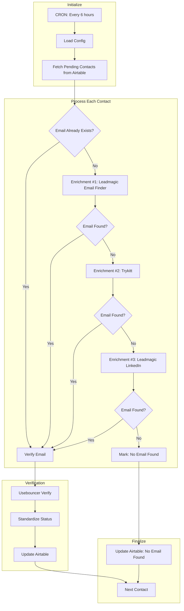

## Goal

Automatically enrich contacts with email addresses using a multi-vendor waterfall approach, then verify deliverability. Contacts with "Pending" enrichment status are processed in batches, trying multiple enrichment services until an email is found or all options exhausted.

## Flow



## API References

### Airtable

**Search Pending Contacts:**
```
GET /v0/{base_id}/{table_id}
filterByFormula: {Enrichment Status}='Pending'
limit: 20
```

**Update Contact:**
```
PATCH /v0/{base_id}/{table_id}
matchingColumns: ["First Name", "Last Name"]
```

### Leadmagic

**Email Finder (name + domain):**
```
POST https://api.leadmagic.io/v1/people/email-finder
Headers: X-API-Key: {api_key}
Body: {
  "first_name": string,
  "last_name": string,
  "domain": string,
  "company_name": string
}
Response: { "email": string | null }
```

**LinkedIn Profile Email:**
```
POST https://api.leadmagic.io/v1/people/b2b-profile-email
Headers: X-API-Key: {api_key}
Body: {
  "profile_url": string (LinkedIn URL)
}
Response: { "email": string | null }
```

### Trykitt

**Find Email:**
```
POST https://api.trykitt.ai/job/find_email
Headers: X-API-Key: {api_key}
Body: {
  "fullName": string,
  "domain": string,
  "linkedinStandardProfileURL": string,
  "realtime": true
}
Response: { "email": string | null }
```

### Usebouncer

**Verify Email:**
```
GET https://api.usebouncer.com/v1.1/email/verify?email={email}
Headers: X-API-Key: {api_key}
Response: {
  "status": string,
  "score": number
}
```

## Step Details

### 1. Initialize

Load configuration:
```python
config = {
    "airtable_base_id": "apppGZKPtSKo2H41f",
    "airtable_table_contacts_id": "tblsI8jeqv1B16MTk",
    "batch_size": 5,
    "max_contacts": 20
}
```

### 2. Fetch Pending Contacts

Query Airtable for contacts where `Enrichment Status = 'Pending'`:
```python
contacts = await airtable.search(
    base_id=config["airtable_base_id"],
    table_id=config["airtable_table_contacts_id"],
    filter_by_formula="{Enrichment Status}='Pending'",
    limit=20
)
```

### 3. Extract Enrichment Fields

For each contact, extract and normalize fields:
```python
enrichment_data = {
    "full_name": f"{contact['First Name']} {contact['Last Name']}",
    "first_name": contact["First Name"],
    "last_name": contact["Last Name"],
    "email": contact.get("Email"),
    "linkedin_url": contact.get("Linkedin URL"),
    "website": contact.get("Website", [None])[0],
    "company_name": contact.get("Company Name", [None])[0],
    "domain": extract_domain(contact.get("Website", [None])[0])
}
```

### 4. Enrichment Waterfall

If no email exists, try enrichment services in order:

**4a. Leadmagic Email Finder**
```python
if not enrichment_data["email"]:
    result = await leadmagic.email_finder(
        first_name=enrichment_data["first_name"],
        last_name=enrichment_data["last_name"],
        domain=enrichment_data["domain"] or "",
        company_name=enrichment_data["company_name"]
    )
    if result.get("email"):
        enrichment_data["email"] = result["email"]
        enrichment_data["vendor"] = "Leadmagic"
```

**4b. Trykitt (fallback #1)**
```python
if not enrichment_data["email"]:
    result = await trykitt.find_email(
        full_name=enrichment_data["full_name"],
        domain=enrichment_data["domain"] or enrichment_data["website"] or enrichment_data["company_name"],
        linkedin_url=enrichment_data["linkedin_url"],
        realtime=True
    )
    if result.get("email") and result["email"] != "no-results-found":
        enrichment_data["email"] = result["email"]
        enrichment_data["vendor"] = "Trykitt"
```

**4c. Leadmagic LinkedIn URL (fallback #2)**
```python
if not enrichment_data["email"] and enrichment_data["linkedin_url"]:
    result = await leadmagic.b2b_profile_email(
        profile_url=enrichment_data["linkedin_url"]
    )
    if result.get("email"):
        enrichment_data["email"] = result["email"]
        enrichment_data["vendor"] = "Leadmagic-LinkedIn"
```

### 5. Email Verification

If email found, verify with Usebouncer:
```python
if enrichment_data["email"]:
    verification = await usebouncer.verify(email=enrichment_data["email"])
    enrichment_data["verification_score"] = verification.get("score")
    enrichment_data["verification_status"] = verification.get("status")
    enrichment_data["verification_vendor"] = "Bouncer"
```

### 6. Standardize Email Status

Map vendor-specific statuses to standardized values:
```python
def standardize_status(status: str) -> str:
    status = status.lower()

    if status in ["ok", "valid", "safe", "deliverable"]:
        return "Valid"

    if status in ["risky", "catch_all", "catch-all", "accept_all", "accept-all"]:
        return "Catch-All"

    if status in ["invalid", "disposable", "error", "blocked",
                  "spamtrap", "undeliverable", "unknown"]:
        return "Invalid"

    return "Invalid"  # Default fallback
```

### 7. Update Airtable

**Email Found:**
```python
await airtable.upsert(
    base_id=config["airtable_base_id"],
    table_id=config["airtable_table_contacts_id"],
    matching_columns=["First Name", "Last Name"],
    fields={
        "Email": enrichment_data["email"],
        "Email Verification Score": enrichment_data["verification_score"],
        "Email Verification Status": standardize_status(enrichment_data["verification_status"]),
        "Verification Vendor": enrichment_data["verification_vendor"],
        "Enrichment Vendor": enrichment_data["vendor"],
        "Enrichment Status": "Enriched + Verified"
    }
)
```

**No Email Found:**
```python
await airtable.upsert(
    base_id=config["airtable_base_id"],
    table_id=config["airtable_table_contacts_id"],
    matching_columns=["First Name", "Last Name"],
    fields={
        "Enrichment Status": "No Email Found"
    }
)
```

## Edge Cases

| Scenario | Handling |
|----------|----------|
| API rate limit (429) | Exponential backoff, retry up to 3 times |
| API timeout | Retry once, then skip to next vendor |
| Auth error (401) | Log error, skip contact, alert on repeated failures |
| Invalid LinkedIn URL | Skip LinkedIn-based enrichment, continue waterfall |
| Empty domain/company | Skip Leadmagic email-finder, try Trykitt with LinkedIn |
| Trykitt returns "no-results-found" | Treat as no email found |
| Usebouncer returns unknown status | Map to "Invalid" |
| Contact already has email | Skip enrichment, go directly to verification |
| All enrichment fails | Set status to "No Email Found" |
| Airtable upsert fails | Log error, continue to next contact |

## Airtable Fields

| Field | Type | Values |
|-------|------|--------|
| Enrichment Status | Select | Pending, Enriched + Verified, No Email Found, Error |
| Email Verification Status | Select | Valid, Catch-All, Invalid, Unknown |
| Email Verification Score | Number | 0-100 |
| Enrichment Vendor | Text | Leadmagic, Trykitt, Leadmagic-LinkedIn |
| Verification Vendor | Text | Bouncer |

## Environment Variables

| Variable | Description |
|----------|-------------|
| `AIRTABLE_API_KEY` | Airtable personal access token |
| `LEADMAGIC_API_KEY` | Leadmagic API key |
| `TRYKITT_API_KEY` | Trykitt API key |
| `USEBOUNCER_API_KEY` | Usebouncer API key |

## Testing Criteria

### Unit Tests

- [ ] `standardize_status()` maps all vendor statuses correctly
- [ ] `extract_domain()` handles URLs with/without protocol
- [ ] Enrichment waterfall stops when email found
- [ ] Each API client handles errors gracefully

### Integration Tests

- [ ] Airtable search returns pending contacts
- [ ] Airtable upsert updates correct record
- [ ] Full waterfall executes for contact with no email
- [ ] Contact with existing email skips enrichment

### Dry Run

```bash
uv run python -m app.automations.contact_enrichment --dry-run
```

Expected output:
- Fetches pending contacts (read-only)
- Simulates enrichment calls
- Shows what would be updated

## Conversion Notes

**Source:** `n8n-enrichment.json`

**N8N → Python Mappings:**

| N8N Node | Python Implementation |
|----------|----------------------|
| Schedule Trigger | CRON trigger in config |
| Global Settings3 | Config dict |
| Get Pending Enrichment | `airtable.search()` |
| Loop Over Items1 | `async for` with batch processing |
| Enrichment Fields | Data extraction function |
| If Email Exists/Found | Python `if` conditionals |
| HTTP Request nodes | `httpx.AsyncClient` calls |
| Set (Standardize) | `standardize_status()` function |
| Airtable upsert | `airtable.upsert()` |

**Improvements over N8N version:**

1. Centralized error handling with retries
2. Structured logging for each step
3. Cleaner status standardization (no inline JS)
4. Explicit batch size control
5. Dry-run capability for testing
