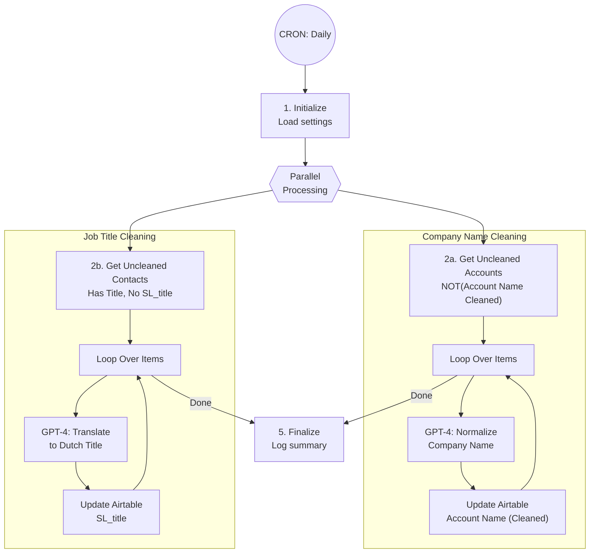

# A6.4: Lead Data Cleaning

## Goal

**Problem:** Lead data from scrapers contains messy company names (with LLC, Inc, special characters) and English job titles that don't work well for Dutch email personalization.

**Solution:** Daily batch process that uses GPT-4 to normalize company names and translate job titles to grammatically correct Dutch.

**Business Value:** Clean, consistent data enables better email personalization and improves campaign deliverability by reducing bounces from malformed data.

## Flow Diagram



## API References

| System | Endpoints | Auth | Rate Limit |
|--------|-----------|------|------------|
| Airtable | GET /bases/{baseId}/tables/{tableId}/records | Bearer Token | 5 req/sec |
| Airtable | PATCH /bases/{baseId}/tables/{tableId}/records | Bearer Token | 5 req/sec |
| OpenAI | POST /v1/chat/completions | Bearer Token | Tier-based |

**API Clients:**
- `app/clients/airtable/client.py`
- `app/clients/openai/client.py` (or OpenRouter)

## Step Details

### 1. Initialize

- Load configuration settings:
  - `airtable_base_id`: apppGZKPtSKo2H41f
  - `airtable_table_contacts_id`: tblsI8jeqv1B16MTk
  - `airtable_table_accounts_id`: tblIJVWxf1QbpowuS
- **Output:** Settings loaded

### 2a. Get Uncleaned Accounts

```python
accounts = await airtable_client.search(
    base_id=config["airtable_base_id"],
    table_id=config["airtable_table_accounts_id"],
    filter_by_formula="NOT({Account Name (Cleaned)})"
)
```

### 2b. Get Uncleaned Contacts

```python
contacts = await airtable_client.search(
    base_id=config["airtable_base_id"],
    table_id=config["airtable_table_contacts_id"],
    filter_by_formula="AND({Title},NOT({SL_title}))"
)
```

### 3a. Company Name Cleanup (GPT-4)

For each account, call GPT-4 with normalization prompt:

```python
COMPANY_NAME_PROMPT = """
Objective:
Normalize the provided Company Name by eliminating any extraneous words, phrases, or contexts while adhering strictly to the information given in both the Company Name and Website Domain.

Instructions:
- Primary Reference: Utilize the Company Name in conjunction with the Website Domain. Remove any words from the Company Name not reinforced by the Website Domain.
- Acronyms and Abbreviations: When an acronym or abbreviation is commonly recognized and supported by the domain, use it as the output. (e.g., 'American Council of Learned Societies (ACLS)' → 'ACLS')
- Legal Entity Suffixes: Strip away suffixes like 'LLC', 'Inc.', 'Corp.', 'DBA.'
- Special Characters: Strip '™', '©', '®', emojis, and characters like '|', '-' with spacing/text after (unless critical to the name)
- Word Limit: Restrict output to maximum 3 words
- Capitalization: Format to title case, except abbreviations stay uppercase

Company Name: {account_name}
Company Website: {website}
"""

response = await openai_client.chat(
    model="gpt-4.1-mini",
    messages=[{"role": "user", "content": prompt}],
    temperature=0
)
cleaned_name = response["choices"][0]["message"]["content"]
```

### 3b. Job Title Cleanup (GPT-4)

For each contact, call GPT-4 with Dutch translation prompt:

```python
JOB_TITLE_PROMPT = """
Je bent een assistent die functietitels uit LinkedIn Sales Navigator omzet naar korte, duidelijke, Nederlandse functietitels die grammaticaal passen in de zin:

"Ik zag dat u {job} bent bij company XYZ."

Regels:
- Antwoord uitsluitend met de gestandaardiseerde Nederlandse functietitel.
- Geen toelichting, geen zinnen, geen extra woorden.
- Gebruik lowercase, behalve voor standaardafkortingen zoals HR of DEI.
- Kies altijd de meest gangbare Nederlandse functietitel, kort en neutraal.

Logica:
- Facility/facilities/workplace/real estate/operations (facilitaire context):
  - Management/senior: "facilitair manager"
  - Coördinatie/ondersteunend: "facilitair medewerker"
- Inkoop-gerelateerd: "inkoper"
- HR/People/Talent/Recruitment: "hr medewerker"
- DEI/Diversity/Inclusion: "DEI medewerker"
- Ander vakgebied: korte generieke Nederlandse titel

Verwerk nu deze functietitel:
{title}
"""

response = await openai_client.chat(
    model="gpt-4.1-mini",
    messages=[{"role": "user", "content": prompt}],
    temperature=0
)
dutch_title = response["choices"][0]["message"]["content"]
```

### 4a. Update Account

```python
await airtable_client.update(
    base_id=config["airtable_base_id"],
    table_id=config["airtable_table_accounts_id"],
    record_id=account["id"],
    fields={"Account Name (Cleaned)": cleaned_name}
)
```

### 4b. Update Contact

```python
await airtable_client.update(
    base_id=config["airtable_base_id"],
    table_id=config["airtable_table_contacts_id"],
    record_id=contact["id"],
    fields={"SL_title": dutch_title}
)
```

### 5. Finalize

- Log execution summary (accounts cleaned, contacts cleaned)
- Report any GPT-4 errors
- **Output:** Run complete

## Edge Cases & Error Handling

| Scenario | Handling | Recovery |
|----------|----------|----------|
| Airtable rate limit (429) | Retry with exponential backoff | Auto-retry (3 attempts) |
| OpenAI rate limit | Add delay between requests | Auto-retry with backoff |
| OpenAI timeout | Log error, skip record | Retry next run |
| Empty company name | Skip record | Manual data fix |
| GPT returns unexpected format | Log warning, store as-is | Manual review |
| Missing website for company | Use company name only | Best-effort cleaning |

## Testing

### Unit Tests

```python
def test_company_name_cleaning():
    """Test company name normalization."""
    # Test legal suffix removal
    assert clean_company_name("Acme Corp, Inc.") == "Acme Corp"

    # Test acronym extraction
    assert clean_company_name("American Council of Learned Societies (ACLS)") == "ACLS"

    # Test special character removal
    assert clean_company_name("Nike™") == "Nike"
    assert clean_company_name("Alera Group | Relph Benefit Advisors") == "Alera Group"

def test_job_title_translation():
    """Test Dutch job title translation."""
    assert translate_job_title("Facility Manager") == "facilitair manager"
    assert translate_job_title("HR Director") == "hr medewerker"
    assert translate_job_title("Procurement Specialist") == "inkoper"

def test_prompt_formatting():
    """Test prompt templates."""
    prompt = format_company_prompt("Acme Inc.", "acme.com")
    assert "Acme Inc." in prompt
    assert "acme.com" in prompt
```

### Integration Tests

```python
def test_a6_4_dry_run():
    """Full automation in dry-run mode."""
    automation = DataCleaning()
    result = automation.run(dry_run=True)
    assert result["dry_run"] is True
    assert "accounts_to_clean" in result
    assert "contacts_to_clean" in result

def test_a6_4_parallel_processing():
    """Test parallel cleaning of accounts and contacts."""
    automation = DataCleaning()
    result = automation.run(dry_run=True, limit=5)
    assert result["accounts_processed"] <= 5
    assert result["contacts_processed"] <= 5
```

### Acceptance Criteria

- [ ] Fetches all accounts without cleaned name
- [ ] Fetches all contacts with title but no SL_title
- [ ] GPT-4 normalizes company names correctly
- [ ] GPT-4 translates job titles to Dutch
- [ ] Updates Airtable with cleaned values
- [ ] Handles rate limits gracefully
- [ ] Processes accounts and contacts in parallel
- [ ] Dry run mode works without side effects
- [ ] Runs daily via CRON

## Implementation Notes

**Code Location:** `app/automations/data_cleaning.py`

**Dependencies:**
- `httpx` - API calls
- `pydantic` - Data validation

**Environment Variables:**
| Variable | Required | Description |
|----------|----------|-------------|
| AIRTABLE_API_KEY | Yes | Airtable personal access token |
| OPENAI_API_KEY | Yes | OpenAI API key (or OPENROUTER_API_KEY) |
| AIRTABLE_BASE_ID | Yes | Base ID (apppGZKPtSKo2H41f) |

**Railway CRON Setup:**
```toml
# railway.toml
[[cron]]
schedule = "0 0 * * *"
command = "python -m app.automations.data_cleaning"
```

**Related Automations:**
- A6 (List Building Orchestrator) - Parent workflow, feeds raw data to be cleaned
- A6.5 (SmartLead Sync) - Uses cleaned data for campaign sync

## Conversion Notes

**Original N8N Workflow:** `n8n-cleaning-n-smartlead.json` (partial)

**Nodes Converted Successfully:**
- Every Day (Schedule Trigger) → Railway CRON
- Global Settings4 (Set node) → Python config dict
- Get Non Clean Contacts (Airtable) → Airtable client search
- Get Non Clean Job Titles (Airtable) → Airtable client search
- Loop Over Items2/3 (splitInBatches) → Python batch processing
- Company Name Cleanup (OpenAI) → OpenAI API call
- Job Title Cleanup (OpenAI) → OpenAI API call
- Update record/record1 (Airtable) → Airtable client update

**Improvements vs N8N Version:**
1. Parallel processing of accounts and contacts
2. Better error handling with per-record fallbacks
3. Rate limiting built into API client
4. Centralized prompt management
5. Unified logging tracks cleaning statistics

**GPT Prompts Preserved:**
- Company name normalization prompt (detailed rules)
- Dutch job title translation prompt (facilitair context-aware)

## Changelog

| Version | Date | Changes |
|---------|------|---------|
| 1.0.0 | 2026-01-12 | Initial specification (converted from N8N) |