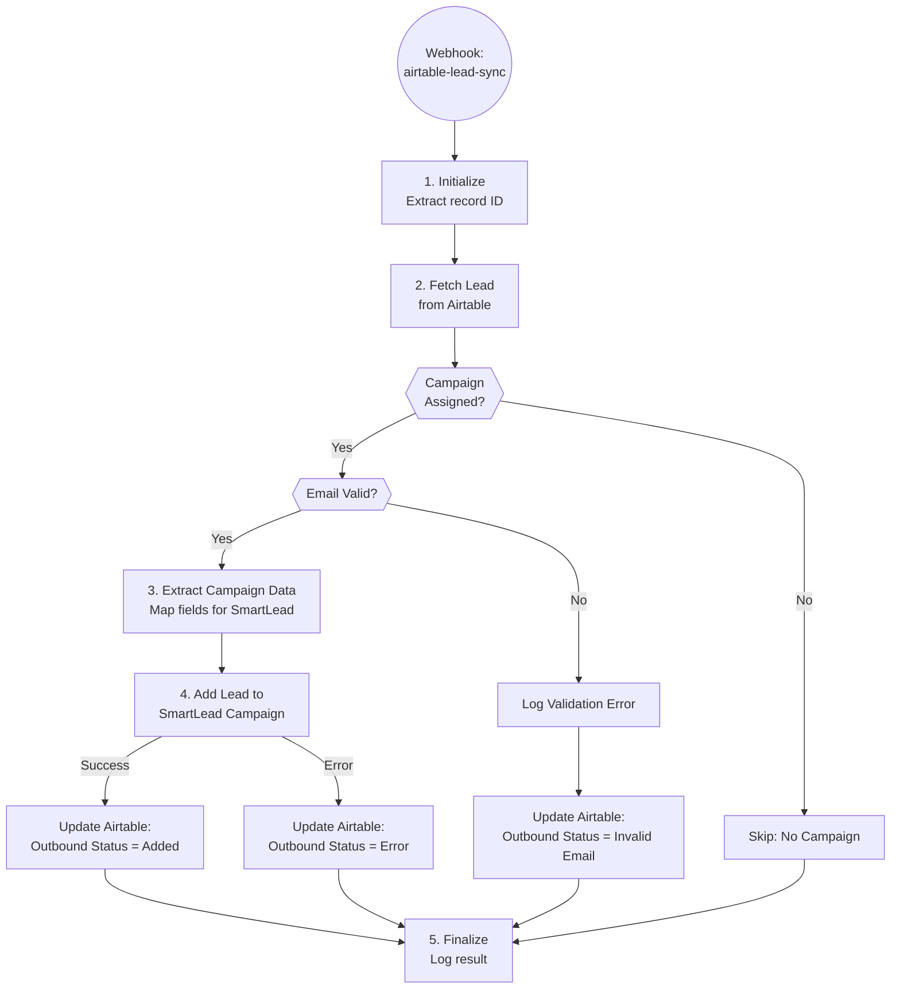

# A6.5: SmartLead Lead Sync

## Goal

**Problem:** When leads are ready for outreach (enriched, verified, cleaned), they need to be synced to SmartLead campaigns with proper field mapping and personalization data.

**Solution:** Webhook-triggered automation that receives Airtable record updates and syncs validated leads to their assigned SmartLead campaigns.

**Business Value:** Automated, real-time lead sync ensures campaigns always have fresh leads without manual CSV uploads, reducing time-to-contact and eliminating data entry errors.

## Flow Diagram



## API References

| System | Endpoints | Auth | Rate Limit |
|--------|-----------|------|------------|
| Airtable | GET /bases/{baseId}/tables/{tableId}/records/{id} | Bearer Token | 5 req/sec |
| Airtable | PATCH /bases/{baseId}/tables/{tableId}/records/{id} | Bearer Token | 5 req/sec |
| SmartLead | POST /api/v1/campaigns/{campaignId}/leads | Query param API key | ~100 req/min |

**API Clients:**
- `app/clients/airtable/client.py`
- `app/clients/smartlead/client.py` (new)

## Step Details

### 1. Initialize

- Extract `recordId` from webhook payload body
- Load configuration:
  - `airtable_base_id`: apppGZKPtSKo2H41f
  - `airtable_table_contacts_id`: tblsI8jeqv1B16MTk
- **Output:** Record ID ready

**Webhook payload format:**
```json
{
  "recordId": "rec7tBqOKeXOYOvVd"
}
```

### 2. Fetch Lead from Airtable

```python
lead = await airtable_client.get(
    base_id=config["airtable_base_id"],
    table_id=config["airtable_table_contacts_id"],
    record_id=payload["recordId"]
)
```

### 3. Validate Lead

**Check campaign assignment:**
```python
campaign_ids = lead.get("Campaign ID", [])
if not campaign_ids:
    self.log("No campaign assigned, skipping")
    return {"status": "skipped", "reason": "no_campaign"}

campaign_id = campaign_ids[-1]  # Use most recent campaign
```

**Check email validity:**
```python
email = lead.get("Email")
email_status = lead.get("Email Verification Status")

if not email or email_status == "Invalid":
    await log_validation_error(lead)
    return {"status": "error", "reason": "invalid_email"}
```

### 4. Extract Campaign Data

Map Airtable fields to SmartLead lead format:

```python
lead_data = {
    "lead_list": [{
        "first_name": lead.get("SL_firstName", ""),
        "last_name": lead.get("Last Name", ""),
        "email": lead["Email"],
        "company_name": lead.get("SL_company", ""),
        "website": lead.get("Website", [""])[0],
        "location": "",
        "custom_fields": {
            "job_title": lead.get("SL_title", ""),
            "sl_personalization": lead.get("SL_Personalization", "")
        },
        "linkedin_profile": lead.get("Linkedin URL", "")
    }],
    "settings": {
        "ignore_global_block_list": False,
        "ignore_unsubscribe_list": False,
        "ignore_community_bounce_list": False,
        "ignore_duplicate_leads_in_other_campaign": False,
        "return_lead_ids": True
    }
}
```

**Field mapping:**
| Airtable Field | SmartLead Field |
|----------------|-----------------|
| SL_firstName | first_name |
| Last Name | last_name |
| Email | email |
| SL_company | company_name |
| Website[0] | website |
| SL_title | custom_fields.job_title |
| SL_Personalization | custom_fields.sl_personalization |
| Linkedin URL | linkedin_profile |

### 5. Add Lead to SmartLead

```python
response = await smartlead_client.post(
    f"/api/v1/campaigns/{campaign_id}/leads",
    json=lead_data,
    timeout=30
)

if response.status_code == 200:
    lead_id = response.json().get("lead_ids", [None])[0]
    await update_success(lead["id"], lead_id)
else:
    await update_error(lead["id"], response.text)
```

### 6. Update Airtable Status

**On success:**
```python
await airtable_client.update(
    base_id=config["airtable_base_id"],
    table_id=config["airtable_table_contacts_id"],
    record_id=lead["id"],
    fields={
        "Outbound Status": "Added to Campaign",
        "SL Contact ID": smartlead_lead_id
    }
)
```

**On error:**
```python
await airtable_client.update(
    record_id=lead["id"],
    fields={
        "Outbound Status": "Sync Error",
        "Sync Error Log": error_message
    }
)
```

### 7. Finalize

- Log execution result
- Return webhook response
- **Output:** Sync complete

## Edge Cases & Error Handling

| Scenario | Handling | Recovery |
|----------|----------|----------|
| Airtable rate limit (429) | Retry with exponential backoff | Auto-retry (3 attempts) |
| SmartLead API error | Log error, update Airtable status | Manual review |
| Duplicate lead in SmartLead | SmartLead handles deduplication | No action needed |
| Missing required fields | Log validation error | Update status as invalid |
| Campaign not found | Log error | Manual campaign check |
| Invalid email format | Skip sync, update status | Manual data fix |
| Webhook timeout | Return 202 Accepted | Process async if needed |

## Testing

### Unit Tests

```python
def test_extract_campaign_data():
    """Test field mapping to SmartLead format."""
    lead = {
        "SL_firstName": "Jan",
        "Last Name": "de Vries",
        "Email": "jan@example.com",
        "SL_company": "Acme",
        "SL_title": "facilitair manager",
        "Website": ["https://acme.com"]
    }
    result = extract_campaign_data(lead)
    assert result["lead_list"][0]["first_name"] == "Jan"
    assert result["lead_list"][0]["custom_fields"]["job_title"] == "facilitair manager"

def test_validate_lead_no_campaign():
    """Test validation fails without campaign."""
    lead = {"Email": "test@example.com"}
    result = validate_lead(lead)
    assert result["valid"] is False
    assert result["reason"] == "no_campaign"

def test_validate_lead_invalid_email():
    """Test validation fails with invalid email."""
    lead = {
        "Email": "test@example.com",
        "Email Verification Status": "Invalid",
        "Campaign ID": ["campaign123"]
    }
    result = validate_lead(lead)
    assert result["valid"] is False
    assert result["reason"] == "invalid_email"
```

### Integration Tests

```python
def test_a6_5_dry_run():
    """Full automation in dry-run mode."""
    automation = SmartLeadSync()
    result = automation.run(
        payload={"recordId": "rec123"},
        dry_run=True
    )
    assert result["dry_run"] is True
    assert "would_sync" in result

def test_a6_5_webhook_validation():
    """Test webhook payload validation."""
    # Missing recordId should fail
    result = automation.run(payload={})
    assert result["error"] == "missing_record_id"
```

### Acceptance Criteria

- [ ] Webhook correctly extracts record ID from payload
- [ ] Fetches complete lead record from Airtable
- [ ] Validates campaign assignment
- [ ] Validates email exists and is not invalid
- [ ] Maps all fields correctly to SmartLead format
- [ ] Includes custom fields (job_title, sl_personalization)
- [ ] Syncs lead to SmartLead campaign
- [ ] Updates Airtable with "Added to Campaign" on success
- [ ] Updates Airtable with error status on failure
- [ ] Handles SmartLead API errors gracefully
- [ ] Returns appropriate webhook response

## Implementation Notes

**Code Location:** `app/automations/smartlead_sync.py`

**Dependencies:**
- `httpx` - API calls
- `pydantic` - Data validation

**Environment Variables:**
| Variable | Required | Description |
|----------|----------|-------------|
| AIRTABLE_API_KEY | Yes | Airtable personal access token |
| SMARTLEAD_API_KEY | Yes | SmartLead API key (query param) |
| AIRTABLE_BASE_ID | Yes | Base ID (apppGZKPtSKo2H41f) |

**Webhook Setup:**

1. In Airtable, create automation triggered on "Outbound Status" field change to "Ready for Sync"
2. Action: Send webhook to `{RAILWAY_URL}/webhooks/airtable-lead-sync`
3. Payload: `{"recordId": "{{record.id}}"}`

**Router code:**
```python
# app/routers/webhooks.py
@router.post("/airtable-lead-sync")
async def airtable_lead_sync(request: Request):
    """Sync lead from Airtable to SmartLead campaign."""
    data = await request.json()

    if "recordId" not in data:
        raise HTTPException(400, "Missing recordId")

    automation = SmartLeadSync()
    result = await automation.execute(data)

    return {"status": "processed", "result": result}
```

**Related Automations:**
- A6 (List Building Orchestrator) - Parent workflow, orchestrates lead readiness
- A7 (SmartLead Campaign Sync) - Campaign-level sync
- A6.4 (Data Cleaning) - Prepares SL_ fields

## Conversion Notes

**Original N8N Workflow:** `n8n-cleaning-n-smartlead.json` (partial)

**Nodes Converted Successfully:**
- Airtable Webhook Receiver → FastAPI webhook endpoint
- Set Global Variables (Set node) → Python config dict
- Fetch Lead from Airtable (Airtable) → Airtable client get
- Campaign is present (If node) → Python conditional
- If Email Exists and is Valid (If node) → Python validation
- Extract Campaign Data (Set node) → Python field mapping
- Add Lead to SmartLead Campaign (httpRequest) → httpx POST
- Update Airtable Sync Status (Airtable) → Airtable client update
- Log Email Validation Error → Python logging
- Update Airtable Error Status (Airtable) → Airtable client update

**Improvements vs N8N Version:**
1. Centralized validation logic
2. Better error messages in Airtable
3. Type-safe Pydantic models for lead data
4. Unified logging tracks sync statistics
5. SL Contact ID stored for future reference

**SmartLead API Notes:**
- Auth via query parameter: `?api_key={SMARTLEAD_API_KEY}`
- Returns `lead_ids` array on successful sync
- Handles duplicate detection automatically

## Changelog

| Version | Date | Changes |
|---------|------|---------|
| 1.0.0 | 2026-01-12 | Initial specification (converted from N8N) |
