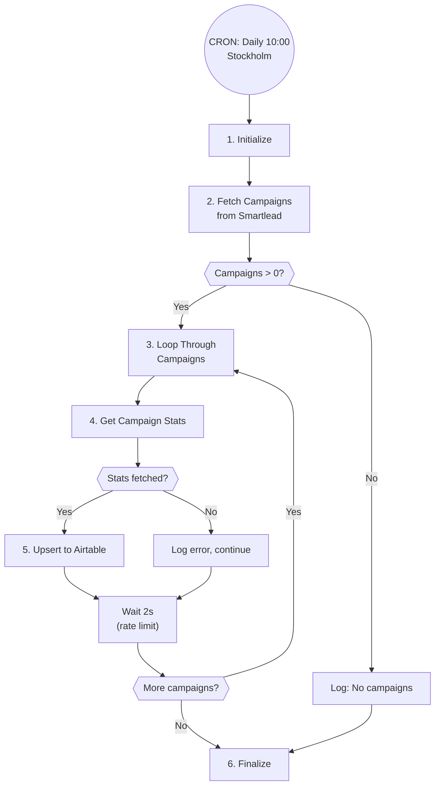

# A7: Smartlead Campaign Sync

## Goal

**Problem:** Campaign performance metrics in Smartlead are disconnected from the Sales CRM (Airtable), requiring manual data entry to track outreach effectiveness.

**Solution:** Daily sync of all Smartlead campaign analytics to Airtable Campaigns table, with automatic upsert on Campaign ID.

**Business Value:** Real-time campaign visibility in CRM, automated reporting, elimination of manual data entry.

## Flow Diagram



## API References

| System | Endpoints | Auth | Rate Limit |
|--------|-----------|------|------------|
| Smartlead | GET /api/v1/analytics/campaign/list | API Key (query param) | ~5 req/sec |
| Smartlead | GET /api/v1/campaigns/{id}/analytics | API Key (query param) | ~5 req/sec |
| Airtable | PATCH /v0/{base}/{table} (upsert) | Bearer token | 5 req/sec |

**API Clients:**
- `app/clients/smartlead/client.py`
- `app/clients/airtable/client.py`

## Step Details

### 1. Initialize
- Validate Smartlead API key
- Validate Airtable credentials
- Load configuration (base ID, table ID)
- **Output:** Clients ready

### 2. Fetch Campaign List
- Call Smartlead: `GET /api/v1/analytics/campaign/list`
- Extract `data.campaign_list[]`
- Check if list is non-empty
- **Output:** List of campaign objects with IDs

### 3. Loop Through Campaigns
- Process one campaign at a time (to respect rate limits)
- Maintain 2-second delay between iterations
- Continue on individual campaign errors
- **Output:** Current campaign context

### 4. Get Campaign Stats
- Call Smartlead: `GET /api/v1/campaigns/{id}/analytics`
- Extract campaign performance metrics:
  - `campaign_lead_stats` (total, inprogress, completed, interested, notStarted)
  - `unique_sent_count` (prospects contacted)
  - `sent_count` (emails sent)
  - `open_count` (emails opened)
  - `reply_count` (emails replied)
  - `bounce_count` (emails bounced)
  - `sequence_count` (number of sequences)
  - `status` (campaign status)
  - `name` (campaign name)
- **Output:** Campaign stats dictionary

### 5. Upsert to Airtable
- Upsert to Campaigns table using Campaign ID as match key
- Map fields:
  | Smartlead Field | Airtable Field |
  |-----------------|----------------|
  | `id` | Campaign ID |
  | `name` | Campaign Name |
  | `status` (sentence case) | Status |
  | `campaign_lead_stats.total` | Total Leads |
  | `campaign_lead_stats.inprogress` | Leads In Progress |
  | `campaign_lead_stats.completed` | Leads Completed |
  | `campaign_lead_stats.notStarted` | Leads Not Started |
  | `campaign_lead_stats.interested` | Email Replied (Positive) |
  | `unique_sent_count` | Prospects Contacted |
  | `sent_count` | Email Sent |
  | `open_count` | Email Opened |
  | `reply_count` | Email Replied |
  | `bounce_count` | Email Bounced |
  | `campaign_lead_stats.total` | Total Emails |
  | `sequence_count` | Number Of Sequences |
- **Output:** Upsert confirmation

### 6. Finalize
- Log total campaigns synced
- Log any campaigns that failed
- Update dashboard with sync status
- **Output:** Sync summary

## Edge Cases & Error Handling

| Scenario | Handling | Recovery |
|----------|----------|----------|
| Smartlead API 401 | Log auth error | Check API key |
| Smartlead API timeout | Retry with backoff | Max 5 retries |
| Airtable rate limit | 2s delay between requests | Auto-handled |
| Campaign stats fetch fails | Log error, skip campaign | Continue with others |
| Empty campaign list | Log info, exit cleanly | No action needed |
| New campaign (not in Airtable) | Auto-create via upsert | Handled by upsert |
| Invalid status value | Default to "Unknown" | Log warning |

## Testing

### Unit Tests

```python
def test_parse_campaign_list():
    """Test extracting campaigns from API response."""
    response = {"data": {"campaign_list": [{"id": 123}, {"id": 456}]}}
    campaigns = parse_campaign_list(response)
    assert len(campaigns) == 2
    assert campaigns[0]["id"] == 123

def test_transform_status():
    """Test status normalization to sentence case."""
    assert transform_status("ACTIVE") == "Active"
    assert transform_status("completed") == "Completed"
    assert transform_status("ramp_up") == "Ramp Up"

def test_map_to_airtable_fields():
    """Test field mapping for Airtable upsert."""
    stats = {
        "id": 123,
        "name": "Test Campaign",
        "status": "active",
        "campaign_lead_stats": {"total": 100, "completed": 50},
        "sent_count": 200
    }
    result = map_to_airtable(stats)
    assert result["Campaign ID"] == "123"
    assert result["Campaign Name"] == "Test Campaign"
    assert result["Total Leads"] == 100
```

### Integration Tests

```python
def test_a7_dry_run():
    """Full automation in dry-run mode."""
    automation = SmartleadCampaignSync()
    result = automation.run(dry_run=True)
    assert result["dry_run"] is True
    assert "campaigns_found" in result

def test_a7_single_campaign():
    """Test sync of a single campaign."""
    pass
```

### Acceptance Criteria

- [ ] All campaigns from Smartlead appear in Airtable
- [ ] Campaign ID used as unique key (no duplicates)
- [ ] All metric fields synced correctly
- [ ] Status values normalized to sentence case
- [ ] Rate limiting respected (2s between campaigns)
- [ ] Errors don't stop entire sync
- [ ] Dashboard shows last sync time
- [ ] Dry run mode works without side effects

## Implementation Notes

**Code Location:** `app/automations/smartlead_campaign_sync.py`

**Airtable Configuration:**
```python
AIRTABLE_CONFIG = {
    "base_id": "apppGZKPtSKo2H41f",  # Sales CRM
    "table_name": "Campaigns",
    "table_id": "tbl78Dq8VtWYjxsya",
    "match_field": "Campaign ID"
}
```

**Environment Variables:**
| Variable | Required | Description |
|----------|----------|-------------|
| SMARTLEAD_API_KEY | Yes | Smartlead API key |
| AIRTABLE_API_KEY | Yes | Airtable personal access token |
| AIRTABLE_BASE_ID | Yes | Target Airtable base ID |

## Conversion Notes

**Original N8N Workflow:** `n8n-sl-campaign-monitoring.json`

**Nodes Converted:**
| N8N Node | Python Equivalent |
|----------|-------------------|
| Schedule Trigger (10:00 daily) | CRON `0 10 * * *` |
| HTTP Request (campaign list) | `httpx` GET call |
| If (campaign_list.length > 0) | Python conditional |
| Split Out (campaign_list) | List iteration |
| Split In Batches (1 at a time) | Loop with counter |
| HTTP Request (campaign stats) | `httpx` GET call |
| Airtable Upsert | Airtable API PATCH |
| Wait (2 seconds) | `asyncio.sleep(2)` |

**Improvements over N8N:**
- Centralized error handling and logging
- Proper retry logic with exponential backoff
- Dashboard visibility into sync status
- Dry-run mode for testing
- Structured configuration management

## Changelog

| Version | Date | Changes |
|---------|------|---------|
| 1.0.0 | 2026-01-09 | Initial specification (converted from N8N workflow) |