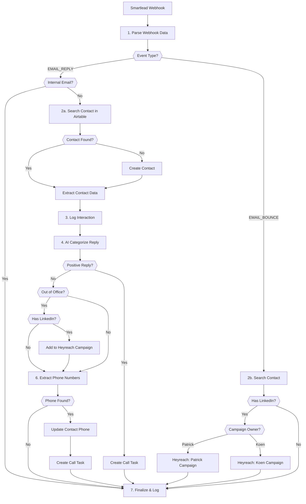

# A8: Email Reply Handler

## Goal

**Problem:** When leads reply to cold email campaigns in Smartlead, the sales team needs to manually check emails, categorize responses, update the CRM, and decide on follow-up actions. This creates delays in responding to hot leads.

**Solution:** Automatically process email replies and bounces from Smartlead webhooks. Categorize responses using AI, update CRM records, and trigger appropriate follow-up actions (call tasks, LinkedIn outreach).

**Business Value:**
- AI-powered categorization reduces manual triage time
- Automatic CRM updates ensure data consistency
- Phone number extraction enables faster follow-up calls
- Intelligent internal email recognition avoids false signals

## Flow Diagram



## API References

| System | Endpoints | Auth | Rate Limit |
|--------|-----------|------|------------|
| Smartlead | Webhook (inbound only) | Secret key validation | N/A |
| Airtable | GET /v0/{base}/Contacts, POST /v0/{base}/Contacts, PATCH /v0/{base}/Contacts, POST /v0/{base}/Interactions, POST /v0/{base}/Tasks | Bearer token | 5 req/sec |
| OpenAI | POST /v1/chat/completions | API key | 60 req/min |
| Heyreach | POST /campaigns/{id}/leads | API key | TBD |

**API Clients:**
- `app/clients/airtable/client.py`
- `app/clients/openai/client.py`
- `app/clients/heyreach/client.py`

**Airtable Tables:**
| Table | ID | Purpose |
|-------|-----|---------|
| Contacts | tblsI8jeqv1B16MTk | Lead/contact records |
| Interactions | tbl1ZihAu8yPKKfJC | Email interaction log |
| Tasks | tbl9K9CDQCuk3XYKj | Follow-up tasks |

## Step Details

### 1. Parse Webhook Data
- Validate webhook secret key
- Extract fields from webhook body:
  - `event_type`: EMAIL_REPLY or EMAIL_BOUNCE
  - `campaign_id`, `campaign_status`
  - `from_email`, `to_email`, `to_name`
  - `subject`, `sent_message.text`, `reply_message.text`
  - `reply_message.time`, `sequence_number`
  - `sl_lead_email` (original email)
- **Output:** Parsed webhook payload with normalized fields

### 1b. Check Internal Email (Reply Flow)
- **IMPORTANT:** Check if the reply is from an internal Herbox email address
- **Internal domains:** Any email from `@herbox.se`, `@herbox.com`, or other known Herbox domains
- **Alternative method:** Check if the `from_email` or `to_email` belongs to known internal team members
- If internal email detected: skip all processing, log as "internal_email_filtered", return 200 OK
- **Output:** Boolean `is_internal_email`

### 2a. Search Contact (Reply Flow)
- Query Airtable Contacts table: `{Email}='{email}'`
- Use `sl_lead_email` field (original email) or fall back to `to_email`
- If no contact found AND emails match, create new contact:
  - First Name: `lead_name.split(" ")[1]` (note: N8N had this reversed)
  - Last Name: `lead_name.split(" ")[0]`
  - Email: `to_email`
  - Enrichment Status: "Enriched + Verified"
  - Email Verification Status: "Valid"
  - Last Replied Date: reply timestamp
- **Output:** Airtable contact record ID

### 2b. Search Contact (Bounce Flow)
- Query Airtable Contacts table by email
- Check if contact has LinkedIn URL
- **Output:** Contact record with LinkedIn status

### 3. Log Interaction
- Create record in Interactions table:
  - Contact: linked to contact ID
  - Channel: "Cold Email"
  - Interaction Type: "Email Reply"
  - Interaction Date: reply timestamp
  - Message Sent: original email text
  - Message Received: reply text
- **Output:** Interaction record created

### 4. AI Categorize Reply
- Send to OpenAI (gpt-4-mini or equivalent):
  - System prompt: Email categorization specialist
  - Include original email and reply
- Categories (Smartlead taxonomy):
  1. **Interested** (ID: 1) - Shows interest, mentions pricing/demo
  2. **Meeting Request** (ID: 2) - Explicitly requests meeting/call
  3. **Not Interested** (ID: 3) - Clearly declines
  4. **Do Not Contact** (ID: 4) - Requests removal
  5. **Information Request** (ID: 5) - Asks questions/details
  6. **Out Of Office** (ID: 6) - Temporary unavailability
  7. **Wrong Person** (ID: 7) - Not the right contact
  8. **Uncategorizable by AI** (ID: 8) - Unclear/ambiguous
  9. **Sender Originated Bounce** (ID: 9) - Delivery failure
- **Output:** `{"CategoryName": "...", "CategoryID": N}`

### 5. Handle Out of Office
- If category is "Out Of Office" AND contact has LinkedIn URL:
  - Add lead to Heyreach LinkedIn campaign
  - Campaign selection based on original sender (Patrick vs Koen)
- **Output:** Lead added to LinkedIn campaign

### 6. Extract Phone Numbers
- Send reply body to OpenAI for phone extraction
- **Prompt instructions:** Extract phone numbers with associated names from the email reply. The prompt should intelligently identify which person is the lead/external contact vs which is the Herbox sender.
- **Recognition logic:** The prompt should understand the email thread context - identify the original recipient's contact info, not the Herbox sender's info
- Filter out any phone numbers associated with Herbox email domains (@herbox.se, @herbox.com)
- Normalize to international format (e.g., +31 6 4695 9939)
- **Output:** Array of `{name, phone}` objects from the lead/external contact only

### 7. Update Contact & Create Tasks
- If phone numbers extracted:
  - Update Airtable contact with first phone number
  - Create Task in Tasks table:
    - Contact: linked to contact ID
    - Task Type: "Call"
    - Status: "To Do"
- For positive replies: also create call task
- **Output:** Contact updated, task(s) created

## Edge Cases & Error Handling

| Scenario | Handling | Recovery |
|----------|----------|----------|
| Webhook secret mismatch | Return 401, log attempt | Block request |
| Internal email detected | Skip all processing, log as filtered | Return 200 OK |
| Contact not found | Create new contact record | Continue flow |
| Airtable rate limit (429) | Retry with 5s backoff, max 5 attempts | Auto-retry |
| OpenAI timeout | Retry 3x, fall back to "Uncategorizable" | Continue with default |
| Invalid phone format | Skip phone, log warning | Continue |
| Duplicate interaction | Check timestamp, skip if recent | Skip |
| Heyreach API error | Log error, continue flow | Non-blocking |
| Empty reply message | Log warning, skip categorization | Continue |
| Name parsing error | Use full name or "Unknown" | Continue |

## Testing

### Unit Tests

```python
def test_parse_webhook_payload_a8():
    """Test webhook payload parsing extracts all required fields."""
    payload = {"body": {"event_type": "EMAIL_REPLY", ...}}
    result = parse_webhook(payload)
    assert result["event_type"] == "EMAIL_REPLY"
    assert "email_to" in result

def test_check_internal_email_a8():
    """Test internal email detection filters Herbox emails."""
    internal_email = "patrick@herbox.se"
    assert is_internal_email(internal_email) == True
    external_email = "john@example.com"
    assert is_internal_email(external_email) == False

def test_categorize_interested_reply_a8():
    """Test AI categorization identifies interested replies."""
    reply = "Yes, please send me pricing information."
    category = await categorize_reply(original_email, reply)
    assert category["CategoryName"] == "Interested"

def test_extract_phone_numbers_a8():
    """Test phone extraction from email signatures."""
    body = "Best regards,\nJohn\n+31 6 1234 5678"
    phones = await extract_phones(body)
    assert len(phones) == 1
    assert phones[0]["phone"].startswith("+31")

def test_filter_herbox_phones_a8():
    """Test Herbox team phone numbers are filtered out intelligently."""
    body = """
    From: john@external.com
    Best regards,
    John Smith
    +31 6 1234 5678

    On behalf of:
    Patrick Bosma
    Herbox
    +31 6 9999 9999
    """
    phones = await extract_phones(body)
    assert len(phones) == 1
    assert phones[0]["phone"] == "+31 6 1234 5678"
```

### Integration Tests

```python
def test_a8_email_reply_full_flow():
    """Test complete EMAIL_REPLY flow with mocked APIs."""
    webhook = create_test_webhook("EMAIL_REPLY")
    result = await automation.execute(webhook, dry_run=True)
    assert result["contact_found_or_created"]
    assert result["interaction_logged"]
    assert result["category"] in VALID_CATEGORIES

def test_a8_internal_email_filtered():
    """Test internal Herbox emails are filtered out."""
    webhook = create_test_webhook("EMAIL_REPLY", from_email="patrick@herbox.se")
    result = await automation.execute(webhook, dry_run=True)
    assert result["internal_email_filtered"] == True
    assert result["contact_created"] == False

def test_a8_email_bounce_linkedin_flow():
    """Test EMAIL_BOUNCE with LinkedIn fallback."""
    webhook = create_test_webhook("EMAIL_BOUNCE")
    result = await automation.execute(webhook, dry_run=True)
    assert "heyreach_campaign" in result or result["no_linkedin"]
```

### Acceptance Criteria

- [ ] Webhook validates Smartlead secret key
- [ ] Internal Herbox emails are filtered out before processing
- [ ] EMAIL_REPLY creates/updates contact in Airtable
- [ ] Interaction record logged with message content
- [ ] AI categorization returns valid Smartlead category
- [ ] Phone numbers extracted intelligently (excluding Herbox contacts)
- [ ] Call tasks created for actionable replies
- [ ] EMAIL_BOUNCE routes to Heyreach when LinkedIn available
- [ ] Errors logged but don't break flow
- [ ] Dry run mode processes without side effects

## Implementation Notes

**Code Location:** `app/automations/a8_email_reply_handler.py`

**Dependencies:**
- `httpx` - Async HTTP client
- `pydantic` - Request/response validation

**Environment Variables:**
| Variable | Required | Description |
|----------|----------|-------------|
| `SMARTLEAD_WEBHOOK_SECRET` | Yes | Validate incoming webhooks |
| `AIRTABLE_API_KEY` | Yes | Airtable API access |
| `AIRTABLE_BASE_ID` | Yes | Base: apppGZKPtSKo2H41f |
| `OPENAI_API_KEY` | Yes | For categorization & phone extraction |
| `HERBOX_DOMAINS` | No | Comma-separated internal domains (default: herbox.se,herbox.com) |
| `HEYREACH_API_KEY` | No | LinkedIn campaign integration |
| `HEYREACH_CAMPAIGN_PATRICK` | No | Patrick's LinkedIn campaign ID |
| `HEYREACH_CAMPAIGN_KOEN` | No | Koen's LinkedIn campaign ID |

**Airtable Field Mappings:**
| Webhook Field | Airtable Field |
|---------------|----------------|
| `to_email` | Email |
| `to_name` (split) | First Name, Last Name |
| `reply_message.time` | Last Replied Date |
| `campaign_id` | DEV - Campaign ID |

## Conversion Notes

**Original N8N Workflow:** `n8n-email-replied-n-bounced.json`

**Nodes Converted Successfully:**
- Webhook trigger → FastAPI POST endpoint
- Global Settings (Set node) → Config parsing function
- Switch node → Python match/case statement
- Airtable search/create/update → httpx API calls
- OpenAI nodes → httpx calls to OpenAI API
- If conditions → Python conditionals

**Nodes Requiring Manual Review:**
- Heyreach integration - N8N used a custom node, needs API documentation
- Name parsing - N8N split `lead_name` as `[1]` for First, `[0]` for Last (Swedish naming convention?)

**Expression Conversions:**
| N8N Expression | Python Equivalent |
|----------------|-------------------|
| `$json.body.event_type` | `data["body"]["event_type"]` |
| `$('Global Settings').item.json.email_to` | `settings["email_to"]` |
| `$json.body.reply_message.time.toDateTime().format('yyyy-MM-dd HH:mm')` | `datetime.fromisoformat(data["body"]["reply_message"]["time"]).strftime("%Y-%m-%d %H:%M")` |

**Improvements Over N8N Version:**
1. Centralized error handling with logging
2. Dry-run capability for testing
3. Configurable via environment variables
4. Dashboard visibility for execution history
5. Self-healing capability on failures

## Changelog

| Version | Date | Changes |
|---------|------|---------|
| 1.0.0 | 2026-01-09 | Initial specification (converted from N8N) |