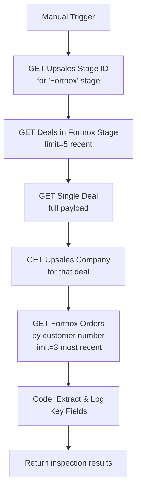

# A2-Test: Upsales-Fortnox Discovery Workflow

## Purpose

Before building the full A2 enrichment pipeline, we need to answer these questions:

1. What Upsales API endpoint/filter fetches deals in the "Fortnox" stage?
2. What does the Upsales deal payload look like — what fields are available?
3. Does the native Upsales→Fortnox integration put any Upsales reference on the Fortnox order (e.g. `YourOrderNumber`, `ExternalReference`, `OurReference`)?
4. What filter parameter does the Upsales API accept for `updatedAt` / `modifiedSince`?
5. Is the customer Fortnox `CustomerNumber` directly available on the Upsales deal/company?

**This is a read-only inspection workflow — no data is modified.**

---

## Flow Diagram



---

## Nodes

### Node 1: Manual Trigger
- Type: `n8n-nodes-base.manualTrigger`
- No input required — run from n8n UI

### Node 2: GET Upsales Pipeline Stages
Fetch all pipeline stages to find the ID of the "Fortnox" stage.

```
GET https://api.upsales.com/api/v2/salesProcesses
Authorization: Bearer {UPSALES_API_KEY}
```

**Look for:** Stage with name containing "Fortnox" or "Fortnox" — note the `id` field.

### Node 3: GET Deals in Fortnox Stage
Fetch recent deals in the Fortnox stage.

```
GET https://api.upsales.com/api/v2/opportunities
  ?stage={fortnoxStageId}
  &limit=5
  &sort=-date
Authorization: Bearer {UPSALES_API_KEY}
```

**Note:** Try also with `modifiedSince` or `updatedAt` parameter — document which filters are accepted.

### Node 4: GET Single Deal (full payload)
Fetch complete detail of the first result.

```
GET https://api.upsales.com/api/v2/opportunities/{dealId}
Authorization: Bearer {UPSALES_API_KEY}
```

**Look for:** `id`, `client.id`, `client.name`, `client.orgNo`, `user.id`, any Fortnox reference fields.

### Node 5: GET Upsales Company
Fetch the company linked to the deal.

```
GET https://api.upsales.com/api/v2/accounts/{companyId}
Authorization: Bearer {UPSALES_API_KEY}
```

**Look for:** Fortnox customer number field (if any), phone, address fields.

### Node 6: GET Fortnox Orders by Customer Number
Search Fortnox for recent orders for this customer.

```
GET https://api.fortnox.se/3/orders
  ?customernumber={CustomerNumber}
  &sortby=documentnumber
  &sortorder=descending
  &limit=3
Authorization: Bearer {FORTNOX_ACCESS_TOKEN}
Content-Type: application/json
Accept: application/json
```

**Look for:** `YourOrderNumber`, `ExternalReference`, `OurReference`, `YourReference` — any field that might link back to the Upsales deal.

### Node 7: Code — Extract & Log Key Fields

```javascript
const stages = $('GET Upsales Stages').first().json;
const deals = $('GET Deals in Fortnox Stage').first().json;
const deal = $('GET Single Deal').first().json.Opportunity || $('GET Single Deal').first().json;
const company = $('GET Upsales Company').first().json.Account || $('GET Upsales Company').first().json;
const orders = $('GET Fortnox Orders').first().json.Orders || [];

return {
  json: {
    // Upsales deal fields
    deal_id: deal.id,
    deal_description: deal.description,
    deal_date: deal.date,
    deal_modified: deal.modDate || deal.modifiedDate || deal.updatedAt,
    deal_stage: deal.stage,

    // Company/client fields
    company_id: company.id,
    company_name: company.name,
    company_orgNo: company.orgNo,
    company_phone: company.phone,
    // Check for any Fortnox reference on the company:
    company_fortnox_ref: company.fortnoxId || company.externalId || company.customerId || 'NOT FOUND',

    // Fortnox order reference fields (critical question)
    fortnox_orders_count: orders.length,
    fortnox_order_references: orders.map(o => ({
      document_number: o.DocumentNumber,
      your_order_number: o.YourOrderNumber,
      our_reference: o.OurReference,
      your_reference: o.YourReference,
      external_reference: o.ExternalReference,
      customer_number: o.CustomerNumber,
      order_date: o.OrderDate,
    })),

    // API filter capabilities (try these manually)
    note: 'Check if Upsales deals API supports: modifiedSince, updatedAfter, modifiedAfter parameters',
  }
};
```

---

## What to Document After Running

Fill in [docs/open-questions.md](../../../docs/open-questions.md) with answers to:

| Question | Where to find the answer |
|----------|--------------------------|
| Upsales `modifiedSince` filter param name | Try `modifiedSince`, `updatedAt`, `modDate` as query params |
| Fortnox stage ID in Upsales | Node 2 output — note the `id` of the "Fortnox" stage |
| Which field on Fortnox order links to Upsales | Node 7 `fortnox_order_references` — any non-null reference field |
| Upsales company → Fortnox customer number mapping | Node 7 `company_fortnox_ref` — check all possible fields |
| Full Upsales deal payload structure | Node 4 raw output |

---

## Environment Variables Required

| Variable | Description |
|----------|-------------|
| `UPSALES_API_KEY` | Upsales API key (Bearer token) |
| `FORTNOX_ACCESS_TOKEN` | Fortnox OAuth2 access token |
