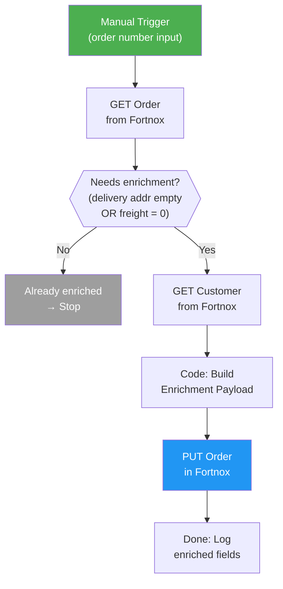
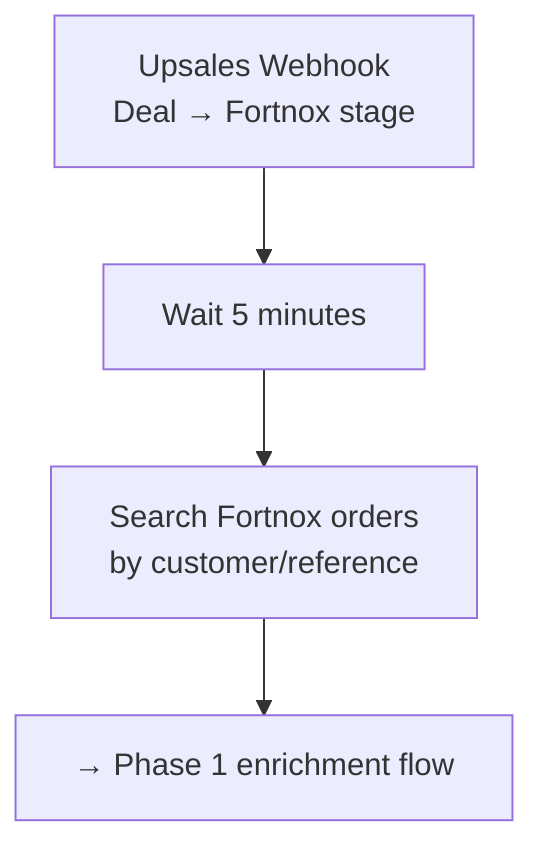

# A3: Order Field Enrichment

## Goal

**Problem:** The native Upsales-to-Fortnox integration creates orders with ~80% of fields populated. The remaining ~20% (phone, delivery address, shipping costs, warehouse, order text) must be filled in manually by Rebecca for every order.

**Solution:** n8n workflow that detects new Fortnox orders from Upsales and automatically fills in the missing fields.

**Business Value:** Eliminates 5-10 min manual work per order, ensures complete order data, reduces errors.

## Phased Approach

| Phase | Trigger | What | When |
|-------|---------|------|------|
| **1 (now)** | Manual / Form | GET order → enrich missing fields → PUT order back | Build first |
| **2 (later)** | Upsales webhook | Webhook fires on deal stage change → wait 5 min → enrich | After Phase 1 works |

Phase 1 validates the enrichment logic. Phase 2 wraps it with automation.

## The 20% Gap — Fields to Enrich

| # | Field | Source | Fortnox API Field | Notes |
|---|-------|--------|-------------------|-------|
| 1 | Phone number | Customer record | `Order.Phone1` | Copy from customer if missing |
| 2 | Invoice company name | Customer record | `Order.CustomerName` | Verify populated correctly |
| 3 | Delivery address | Customer record | `Order.DeliveryAddress1`, `.DeliveryCity`, `.DeliveryZipCode`, `.DeliveryName`, `.DeliveryCountry` | Full address; fallback to billing address |
| 4 | Price list | Default value | `Order.PriceList` | TBD: confirm code with Nils |
| 5 | Shipping cost | Fixed: 499 SEK | `Order.Freight` | **Order-level field** (not an order row) |
| 6 | Shipping VAT | Fixed: 30% | `Order.FreightVAT` | **Order-level field** alongside Freight |
| 7 | Warehouse | Fixed: "1" | `Order.StockPointCode` | May not be available in all API versions |
| 8 | Order text | Default template | `Order.Remarks` | Swedish: Ordertext |

### Key Finding: Shipping is NOT an Order Row

Fortnox has dedicated `Freight` and `FreightVAT` fields at the order level. Shipping must be set there, not as an article/order row.

## Flow Diagram



### Phase 2 Addition (later)



## API References

| System | Endpoint | Method | Auth | Purpose |
|--------|----------|--------|------|---------|
| Fortnox | `/3/orders/{DocumentNumber}` | GET | OAuth2 Bearer | Fetch order |
| Fortnox | `/3/orders/{DocumentNumber}` | PUT | OAuth2 Bearer | Update order |
| Fortnox | `/3/customers/{CustomerNumber}` | GET | OAuth2 Bearer | Fetch customer (phone, address) |

**Rate limit:** 4 requests/second (Fortnox)

### Fortnox Order Fields (writable, relevant)

| Field | Type | Description |
|-------|------|-------------|
| `Phone1` | string | Phone number |
| `DeliveryAddress1` | string | Delivery street |
| `DeliveryAddress2` | string | Delivery line 2 |
| `DeliveryCity` | string | Delivery city |
| `DeliveryZipCode` | string | Delivery postal code |
| `DeliveryCountry` | string | Delivery country |
| `DeliveryName` | string | Delivery recipient |
| `Freight` | float | Shipping cost amount |
| `FreightVAT` | float | Shipping VAT % |
| `PriceList` | string | Price list code |
| `Remarks` | string | Order text |
| `Comments` | string | Internal comments |
| `OurReference` | string | Sales rep |
| `YourReference` | string | Customer reference |
| `OrderRows` | array | Line items |

**PUT body format:** `{ "Order": { "Phone1": "...", "Freight": 499, ... } }`

**Important:** When updating OrderRows, you must send ALL rows. Omitted rows get deleted.

## Step Details

### 1. Trigger (Manual / Form)
- Accept Fortnox order number as input
- Phase 2: Upsales webhook with deal ID → wait 5 min → search for order
- **Output:** Order number

### 2. Fetch Order
- GET `/3/orders/{DocumentNumber}` from Fortnox
- Check response is valid
- **Output:** Full order object

### 3. Check: Needs Enrichment?
- Condition: `DeliveryAddress1` is empty OR `Freight` is 0/null
- If already enriched → skip (idempotent)
- **Output:** Boolean

### 4. Fetch Customer
- GET `/3/customers/{CustomerNumber}` from Fortnox
- Extract phone, delivery address, billing address
- **Output:** Customer object

### 5. Build Enrichment Payload
- For each of the 8 fields: check if empty on order, fill from customer/defaults
- Only set fields that are missing (never overwrite existing values)
- Track which fields were enriched for logging
- **Output:** Partial order update + enriched field list

### 6. Update Order
- PUT `/3/orders/{DocumentNumber}` with enrichment payload
- Do NOT touch OrderRows (shipping handled via Freight field)
- **Output:** Updated order confirmation

## Enrichment Logic (Code Node)

```javascript
const order = $('GET Order').first().json.Order;
const customer = $('GET Customer').first().json.Customer;
const update = {};

// 1. Phone
if (!order.Phone1 && customer.Phone1) {
  update.Phone1 = customer.Phone1;
}

// 3. Delivery address
if (!order.DeliveryAddress1) {
  if (customer.DeliveryAddress1) {
    update.DeliveryAddress1 = customer.DeliveryAddress1;
    update.DeliveryCity = customer.DeliveryCity;
    update.DeliveryZipCode = customer.DeliveryZipCode;
    update.DeliveryCountry = customer.DeliveryCountry || 'SE';
  } else {
    // Fallback: billing address
    update.DeliveryAddress1 = customer.Address1;
    update.DeliveryCity = customer.City;
    update.DeliveryZipCode = customer.ZipCode;
    update.DeliveryCountry = 'SE';
  }
}

// 4. Price list
if (!order.PriceList) {
  update.PriceList = 'A';  // TBD: confirm with Nils
}

// 5+6. Shipping (order-level fields)
if (!order.Freight || order.Freight === 0) {
  update.Freight = 499;
  update.FreightVAT = 30;
}

// 7. Warehouse (test if field is accepted)
// update.StockPointCode = '1';

// 8. Order text
if (!order.Remarks) {
  update.Remarks = 'Order synkad från Upsales';
}

return {
  Order: update,
  orderNumber: order.DocumentNumber,
  enrichedFields: Object.keys(update),
  enrichedCount: Object.keys(update).length
};
```

## Edge Cases & Error Handling

| Scenario | Handling | Recovery |
|----------|----------|----------|
| Order already enriched | IF node skips, returns "already enriched" | Idempotent |
| Order not found in Fortnox | HTTP 404 → error handler → log | Manual review |
| Customer not found | Use empty defaults, skip address enrichment | Log warning |
| Field already has value | Skip that field (never overwrite) | Continue |
| Fortnox rate limit (429) | n8n HTTP retry with backoff | Auto-retry |
| Fortnox OAuth token expired | Token refresh flow in n8n credentials | Auto-refresh |
| PUT fails (400 Bad Request) | Log payload + error for debugging | Manual fix |

## Testing

### Manual Test Steps
1. Pick an existing Fortnox order synced from Upsales (note the DocumentNumber)
2. Run the workflow with that order number
3. Verify in Fortnox UI:
   - Phone1 populated
   - Delivery address filled in
   - Freight = 499, FreightVAT = 30
   - Remarks has text
4. Run workflow again on same order — should skip ("already enriched")

### Acceptance Criteria
- [ ] All 8 enrichment fields updated correctly on empty orders
- [ ] Existing field values NOT overwritten
- [ ] Already-enriched orders skipped (idempotent)
- [ ] Freight set at order level (not as order row)
- [ ] Customer phone copied to order phone
- [ ] Delivery address falls back to billing address when no delivery address on customer

## Open Questions for Nils/Rebecca

| # | Question | Impact |
|---|----------|--------|
| 1 | Is 499 SEK + 30% VAT standard for ALL orders? | Fixed vs conditional Freight |
| 2 | Is warehouse "1" always correct? Does StockPointCode work? | Field #7 |
| 3 | Default price list code? | PriceList value |
| 4 | Do we have Fortnox OAuth2 API credentials? | n8n auth setup |
| 5 | How does native Upsales sync store its reference in Fortnox? | Phase 2 order detection |
| 6 | What should order text (Remarks) say? | Field #8 template |

## Implementation Notes

**Orchestrator:** n8n (HTTP Request nodes — no native Fortnox/Upsales nodes)

**Credentials needed:**
| Credential | Type | Description |
|------------|------|-------------|
| Fortnox OAuth2 | Bearer token | For all Fortnox API calls |

**Environment Variables:**
| Variable | Required | Description |
|----------|----------|-------------|
| FORTNOX_ACCESS_TOKEN | Yes | Fortnox OAuth2 access token |
| FORTNOX_CLIENT_ID | Yes | Fortnox OAuth2 client ID |
| FORTNOX_CLIENT_SECRET | Yes | Fortnox OAuth2 client secret |

## Changelog

| Version | Date | Changes |
|---------|------|---------|
| 1.0.0 | 2026-01-09 | Initial specification (migrated from combined spec) |
| 2.0.0 | 2026-02-11 | Complete rewrite: 8-field mapping from original process docs, n8n orchestrator, phased approach, corrected Freight handling, added Fortnox API reference |