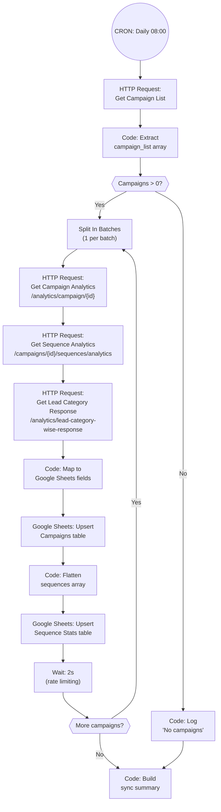

# A1: Daily Campaign Sync

## Goal

**Problem:** Campaign performance metrics in Smartlead are disconnected from the Google Sheets Business OS, requiring manual data entry to track outreach effectiveness across campaigns and sequences.

**Solution:** Daily automated sync of all Smartlead campaign analytics and sequence-level stats to Google Sheets, with automatic upsert on Campaign ID.

**Business Value:** Real-time campaign visibility in Google Sheets, automated reporting, elimination of manual data entry. Estimated 5+ hours/week saved on manual reporting.

## Flow Diagram



## API References

| System | Endpoints | Auth | Rate Limit |
|--------|-----------|------|------------|
| Smartlead | `GET /analytics/campaign/list` | API key (query param) | ~5 req/sec |
| Smartlead | `GET /analytics/campaign/{id}` | API key (query param) | ~5 req/sec |
| Smartlead | `GET /campaigns/{id}/sequences/analytics` | API key (query param) | ~5 req/sec |
| Smartlead | `GET /analytics/lead-category-wise-response` | API key (query param) | ~5 req/sec |
| Google Sheets | Upsert records | Service account | 5 req/sec |

**Node Strategy:**
- **Native nodes:** Google Sheets (upsert)
- **HTTP Request nodes:** Smartlead (no native n8n node)
- **Code nodes:** Extract campaign list, map fields, flatten sequences

## N8N Workflow

**Workflow Information:**
- **Status:** New workflow
- **n8n Instance:** TBD (needs provisioning)
- **Workflow File:** `context/a1-n8n-workflow.json`

**Credentials Required:**
| Credential Name | Type | Description |
|----------------|------|-------------|
| Google Sheets | Service Account | Read/write to Kunde Inc. spreadsheet |

**Key Configuration:**
- **Trigger:** Schedule Trigger (daily at 08:00, client timezone)
- **Error Handling:** All HTTP nodes → Continue on Fail
- **Rate Limiting:** 2s Wait between campaigns (3 API calls per campaign)

**Node Types Used:**
| Node | Purpose | Count |
|------|---------|-------|
| Schedule Trigger | Daily execution | 1 |
| HTTP Request | Smartlead API calls | 4 |
| Code | Transform/extract data | 4 |
| IF | Check campaigns exist | 1 |
| Split In Batches | Process 1 campaign at a time | 1 |
| Google Sheets | Upsert records | 2 |
| Wait | Rate limiting (2s) | 1 |

## Step Details

### 1. Fetch Campaign List
- `GET /analytics/campaign/list?api_key={{$env.SMARTLEAD_API_KEY}}`
- Response: `{ data: { campaign_list: [...] } }`

### 2. Extract Campaign Array
Code node extracts `data.campaign_list` into individual items:
```javascript
const response = $input.first().json;
const campaigns = response.data?.campaign_list || [];
return campaigns.map(c => ({ json: { campaign_id: c.id, campaign_name: c.name, campaign_status: c.status } }));
```

### 3. Get Campaign Analytics (per campaign)
- `GET /analytics/campaign/{{$json.campaign_id}}?api_key={{$env.SMARTLEAD_API_KEY}}`
- Returns: sent_count, open_count, reply_count, bounce_count, unique_sent_count, sequence_count, campaign_lead_stats (total, inprogress, completed, interested, notStarted)

### 4. Get Sequence Analytics (per campaign)
- `GET /campaigns/{{$json.campaign_id}}/sequences/analytics?api_key={{$env.SMARTLEAD_API_KEY}}`
- Returns: array of sequence objects with per-step sent/open/reply/bounce counts

### 5. Get Lead Category Response (per campaign)
- `GET /analytics/lead-category-wise-response?api_key={{$env.SMARTLEAD_API_KEY}}&campaign_ids={{$json.campaign_id}}`
- Returns: categories including "Meeting Booked" count

### 6. Map to Google Sheets Fields
Code node maps raw API data to Google Sheets column names:

| Smartlead Field | Google Sheets Field |
|----------------|----------------|
| `id` | Campaign ID |
| `name` | Campaign Name |
| `status` | Status |
| `campaign_lead_stats.total` | Total Leads |
| `campaign_lead_stats.inprogress` | Leads In Progress |
| `campaign_lead_stats.completed` | Leads Completed |
| `campaign_lead_stats.interested` | Leads Interested |
| `unique_sent_count` | Prospects Contacted |
| `sent_count` | Emails Sent |
| `open_count` | Emails Opened |
| `reply_count` | Emails Replied |
| `bounce_count` | Emails Bounced |
| `sequence_count` | Sequence Count |
| `Meeting Booked` category count | Meetings Booked |
| `new Date().toISOString()` | Last Synced |

### 7. Upsert to Google Sheets Campaigns
- Operation: Upsert
- Table: Campaigns
- Match field: Campaign ID

### 8. Flatten & Upsert Sequence Stats
Code node flattens sequence array into individual items, then upserts each to Sequence Stats table with Campaign ID + Sequence Number as composite key.

## Edge Cases & Error Handling

| Scenario | Handling | n8n Config |
|----------|----------|------------|
| Rate limit (429) | Wait 2s between campaigns | Wait node |
| Smartlead API error on single campaign | Skip campaign, continue | Continue On Fail |
| Google Sheets rate limit | 10 records per batch | Split In Batches |
| No campaigns returned | Log and exit cleanly | IF node |
| Missing sequence analytics | Upsert campaign only, skip sequences | Continue On Fail |
| Duplicate campaigns in API response | Google Sheets upsert handles idempotently | Upsert on Campaign ID |

## Manual Testing in N8N

**Setup:**
1. Add Limit node (set to 2) after Code: Extract campaign array
2. Disable Google Sheets upsert nodes
3. Run with Manual Trigger

**Test Execution:**
1. Run manually via n8n UI
2. Inspect HTTP Request outputs: verify campaign data structure
3. Inspect Code node outputs: verify field mapping correctness
4. Enable Google Sheets upserts for single campaign (Limit = 1)
5. Verify in Google Sheets: fields populated correctly

**Production Run:**
1. Remove Limit node
2. Enable all nodes
3. Switch to Schedule Trigger
4. Monitor first full execution

### Acceptance Criteria

- [ ] All active campaigns synced to Google Sheets Campaigns table
- [ ] Sequence stats synced per campaign per step
- [ ] Upsert on Campaign ID (no duplicates on re-run)
- [ ] Meetings Booked count populated from lead categories
- [ ] Rate limiting prevents API errors (2s between campaigns)
- [ ] Single campaign failure doesn't stop entire sync

## Implementation Notes

**Orchestrator:** n8n (HTTP Request for Smartlead, Google Sheets node for data layer)

**Environment Variables:**
| Variable | Required | Description |
|----------|----------|-------------|
| SMARTLEAD_API_KEY | Yes | Smartlead API key (query param auth) |
| DASHBOARD_TOKEN | Yes | Shared secret for webhook API auth |

**Reference:** Herbox Sweden A7 spec (`workspace/clients/herbox-sweden/specs/4-live/a7-smartlead-campaign-sync.md`) — identical Smartlead→Google Sheets pattern in FastAPI. Reuse field mapping logic.

## Changelog

| Version | Date | Changes |
|---------|------|---------|
| 1.0.0 | 2026-02-26 | Initial specification |
