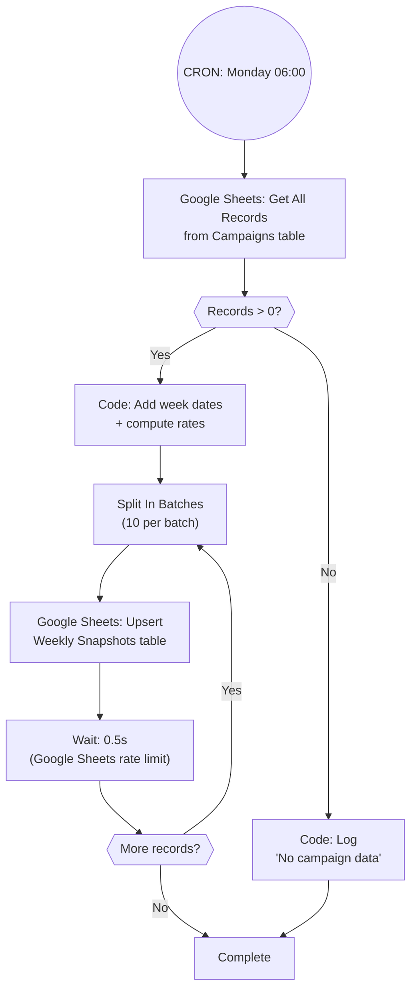

# A2: Weekly Snapshot

## Goal

**Problem:** Campaign metrics in Google Sheets only show current totals. There's no historical trend data to track week-over-week performance changes.

**Solution:** Weekly snapshot of all campaign metrics into a Weekly Snapshots table, enabling trend analysis and weekly reporting charts.

**Business Value:** Enables weekly trend charts in the dashboard (open rate over time, lead growth, etc.). Supports the "Weekly Reporting Stats" deliverable from Module #1.

## Flow Diagram



## API References

| System | Endpoints | Auth | Rate Limit |
|--------|-----------|------|------------|
| Google Sheets | List records (Campaigns) | Service account | 5 req/sec |
| Google Sheets | Upsert records (Weekly Snapshots) | Service account | 5 req/sec |

**Node Strategy:**
- **Native nodes:** Google Sheets (read + upsert)
- **Code nodes:** Compute week dates, rates, snapshot key

## N8N Workflow

**Workflow Information:**
- **Status:** New workflow
- **n8n Instance:** TBD
- **Workflow File:** `context/a2-n8n-workflow.json`

**Credentials Required:**
| Credential Name | Type | Description |
|----------------|------|-------------|
| Google Sheets | Service Account | Read/write to Kunde Inc. spreadsheet |

**Key Configuration:**
- **Trigger:** Schedule Trigger (Monday at 06:00, before daily sync)
- **Error Handling:** Google Sheets nodes → Continue on Fail

**Node Types Used:**
| Node | Purpose | Count |
|------|---------|-------|
| Schedule Trigger | Weekly execution | 1 |
| Google Sheets | Read campaigns / Upsert snapshots | 2 |
| Code | Compute dates and rates | 1 |
| IF | Check records exist | 1 |
| Split In Batches | Batch Google Sheets writes | 1 |
| Wait | Google Sheets rate limiting | 1 |

## Step Details

### 1. Read All Campaign Records
- Google Sheets node: Get All Records from Campaigns table
- Returns all fields including Emails Sent, Opened, Replied, Bounced, Meetings Booked, Total Leads

### 2. Compute Weekly Snapshot Data
Code node adds week metadata and computes rates:
```javascript
const items = $input.all();
const now = new Date();
const monday = new Date(now);
monday.setDate(now.getDate() - now.getDay() + 1);
const sunday = new Date(monday);
sunday.setDate(monday.getDate() + 6);
const weekStart = monday.toISOString().split('T')[0];
const weekEnd = sunday.toISOString().split('T')[0];

return items.map(item => {
  const f = item.json;
  const sent = f["Emails Sent"] || 0;
  return {
    json: {
      "Campaign ID": f["Campaign ID"],
      "Campaign Name": f["Campaign Name"],
      "Week Start Date": weekStart,
      "Week End Date": weekEnd,
      "Total Leads": f["Total Leads"] || 0,
      "Emails Sent": sent,
      "Emails Opened": f["Emails Opened"] || 0,
      "Emails Replied": f["Emails Replied"] || 0,
      "Emails Bounced": f["Emails Bounced"] || 0,
      "Meetings Booked": f["Meetings Booked"] || 0,
      "Open Rate": sent > 0 ? ((f["Emails Opened"] || 0) / sent * 100).toFixed(1) : 0,
      "Reply Rate": sent > 0 ? ((f["Emails Replied"] || 0) / sent * 100).toFixed(1) : 0,
      "Bounce Rate": sent > 0 ? ((f["Emails Bounced"] || 0) / sent * 100).toFixed(1) : 0
    }
  };
});
```

### 3. Upsert to Weekly Snapshots
- Operation: Upsert
- Table: Weekly Snapshots
- Match field: Snapshot Key (formula field = `{Campaign ID} & "-" & {Week Start Date}`)
- Upsert ensures re-running on same Monday overwrites, not duplicates

## Edge Cases & Error Handling

| Scenario | Handling | n8n Config |
|----------|----------|------------|
| Campaigns table empty | Log and exit cleanly | IF node |
| Re-run on same Monday | Upsert overwrites existing snapshot | Upsert on Snapshot Key |
| Campaign added mid-week | Captured in next Monday snapshot | No special handling |
| Google Sheets rate limit | 10 records per batch with 0.5s wait | Split In Batches + Wait |

## Manual Testing in N8N

**Setup:**
1. Ensure A1 has run at least once (Campaigns table populated)
2. Add Limit node (set to 3) after Google Sheets read
3. Disable Google Sheets upsert

**Test Execution:**
1. Run manually, inspect Code node output for correct week dates and rates
2. Enable upsert, verify in Google Sheets: Weekly Snapshots table has rows with correct data
3. Re-run: verify no duplicate rows (upsert on Snapshot Key)

### Acceptance Criteria

- [ ] Weekly snapshot created for all campaigns
- [ ] Week Start/End dates are correct Monday-Sunday
- [ ] Rates computed correctly (Open Rate = Opened/Sent * 100)
- [ ] No duplicate snapshots on re-run (same week)
- [ ] Runs before daily sync (06:00 vs 08:00)

## Implementation Notes

**Orchestrator:** n8n (Google Sheets nodes only)

**Dependencies:** Requires A1 (Daily Campaign Sync) to populate the Campaigns table first.

## Changelog

| Version | Date | Changes |
|---------|------|---------|
| 1.0.0 | 2026-02-26 | Initial specification |
