# A3: Dashboard API Endpoints

## Goal

**Problem:** The static dashboard frontend needs to read data from Google Sheets, but cannot safely embed API keys in client-side JavaScript.

**Solution:** Three n8n webhook endpoints that act as an authenticated API proxy — the dashboard calls them, n8n reads from Google Sheets and returns JSON.

**Business Value:** Keeps all secrets server-side in n8n. The dashboard is a zero-secret static site that can be hosted on any CDN.

## Flow Diagram

```mermaid
flowchart TD
    subgraph "Endpoint 1: /dashboard-campaigns"
        W1["Webhook GET"] --> AUTH1{{"Token valid?"}}
        AUTH1 -->|No| R401_1["Respond 401"]
        AUTH1 -->|Yes| READ1["Google Sheets: Get All<br/>Campaigns"]
        READ1 --> FMT1["Code: Format JSON"]
        FMT1 --> RESP1["Respond to Webhook<br/>200 JSON"]
    end

    subgraph "Endpoint 2: /dashboard-sequences"
        W2["Webhook GET"] --> AUTH2{{"Token valid?"}}
        AUTH2 -->|No| R401_2["Respond 401"]
        AUTH2 -->|Yes| READ2["Google Sheets: Get All<br/>Sequence Stats"]
        READ2 --> FMT2["Code: Format +<br/>filter by campaign_id"]
        FMT2 --> RESP2["Respond to Webhook<br/>200 JSON"]
    end

    subgraph "Endpoint 3: /dashboard-weekly"
        W3["Webhook GET"] --> AUTH3{{"Token valid?"}}
        AUTH3 -->|No| R401_3["Respond 401"]
        AUTH3 -->|Yes| READ3["Google Sheets: Get All<br/>Weekly Snapshots"]
        READ3 --> FMT3["Code: Format as<br/>chart-ready arrays"]
        FMT3 --> RESP3["Respond to Webhook<br/>200 JSON"]
    end
```



## API References

| System | Endpoints | Auth | Rate Limit |
|--------|-----------|------|------------|
| Google Sheets | List records (3 tables) | Service account | 5 req/sec |

**Node Strategy:**
- **Native nodes:** Google Sheets (read), Respond to Webhook
- **Code nodes:** Format JSON, filter, group by campaign

## N8N Workflow

**Note:** These are 3 separate n8n workflows (one per endpoint), not one workflow with 3 paths. Each webhook path needs its own workflow in n8n.

**Credentials Required:**
| Credential Name | Type | Description |
|----------------|------|-------------|
| Google Sheets | Service Account | Read from Kunde Inc. spreadsheet |

**Key Configuration:**
- **Trigger:** Webhook (GET, responseMode: lastNode)
- **Auth:** Query param `?token=` checked against `$env.DASHBOARD_TOKEN`
- **CORS:** Must accept requests from dashboard domain

**Node Types Used (per endpoint):**
| Node | Purpose | Count |
|------|---------|-------|
| Webhook | Receive GET request | 1 |
| IF | Token validation | 1 |
| Google Sheets | Read records | 1 |
| Code | Format response JSON | 1 |
| Respond to Webhook | Return JSON | 2 (200 + 401) |

## Endpoint Details

### GET /webhook/dashboard-campaigns

**Query params:** `token` (required)
**Response (200):**
```json
{
  "campaigns": [
    {
      "id": 123,
      "name": "Campaign Alpha",
      "status": "Active",
      "totalLeads": 250,
      "emailsSent": 1200,
      "emailsOpened": 540,
      "emailsReplied": 96,
      "emailsBounced": 24,
      "meetingsBooked": 5,
      "prospectsContacted": 250,
      "openRate": 45.0,
      "replyRate": 8.0,
      "bounceRate": 2.0,
      "campaignCost": null,
      "revenue": null,
      "costPerLead": null,
      "lastSynced": "2026-02-26T08:00:00Z"
    }
  ],
  "lastUpdated": "2026-02-26T10:00:00Z"
}
```

### GET /webhook/dashboard-sequences

**Query params:** `token` (required), `campaign_id` (optional filter)
**Response (200):**
```json
{
  "sequences": [
    {
      "campaignId": 123,
      "campaignName": "Campaign Alpha",
      "sequenceNumber": 1,
      "subject": "Re: Quick question",
      "emailsSent": 250,
      "emailsOpened": 130,
      "emailsReplied": 8,
      "emailsBounced": 5,
      "openRate": 52.0,
      "replyRate": 3.2
    }
  ]
}
```

### GET /webhook/dashboard-weekly

**Query params:** `token` (required), `weeks` (optional, default 12)
**Response (200):**
```json
{
  "trends": {
    "123": {
      "name": "Campaign Alpha",
      "weeks": [
        {
          "weekStart": "2026-02-17",
          "sent": 1200,
          "opened": 540,
          "replied": 96,
          "bounced": 24,
          "booked": 5,
          "openRate": 45.0,
          "replyRate": 8.0
        }
      ]
    }
  }
}
```

## Edge Cases & Error Handling

| Scenario | Handling | n8n Config |
|----------|----------|------------|
| Invalid/missing token | Return 401 Unauthorized | IF node |
| Google Sheets empty | Return empty array (200) | Code node handles gracefully |
| CORS preflight | n8n handles OPTIONS automatically | Webhook config |
| Large dataset (100+ campaigns) | Return all, let frontend paginate if needed | No pagination for now |

## Manual Testing in N8N

**Test Execution:**
1. Activate each workflow
2. Test with curl: `curl "https://{n8n}/webhook/dashboard-campaigns?token=XXX"`
3. Verify JSON structure matches spec above
4. Test invalid token: should return 401
5. Test from browser console: `fetch(url)` — verify CORS works

### Acceptance Criteria

- [ ] All 3 endpoints return valid JSON
- [ ] Invalid token returns 401
- [ ] Campaign data matches what's in Google Sheets
- [ ] Sequence endpoint filters by campaign_id when provided
- [ ] Weekly endpoint returns data grouped by campaign with weeks sorted chronologically
- [ ] CORS headers allow requests from dashboard domain

## Implementation Notes

**Orchestrator:** n8n (3 separate webhook workflows)

**Environment Variables:**
| Variable | Required | Description |
|----------|----------|-------------|
| DASHBOARD_TOKEN | Yes | Shared secret for dashboard auth |

## Changelog

| Version | Date | Changes |
|---------|------|---------|
| 1.0.0 | 2026-02-26 | Initial specification |
