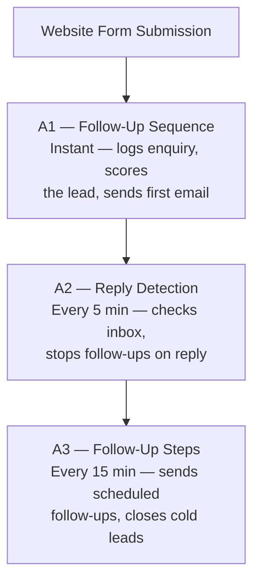

# Meji Media — Automated Follow-Up System

### Complete Guide

**Version 2.0 | February 2026**

> Your automated follow-up system is live and running. This guide explains how it works, what you'll see, and how to make changes.

---

**In this guide:**

1. [What We Built](#what-we-built)
2. [How It Works — The Big Picture](#how-it-works--the-big-picture)
3. [The Enquiry Lifecycle](#the-enquiry-lifecycle)
4. [Your Google Sheet](#your-google-sheet--what-youll-see)
5. [Email Templates](#email-templates)
6. [Lead Scoring & Priority](#lead-scoring--priority)
7. [Follow-Up Cadence](#follow-up-cadence)
8. [What You Can Configure](#what-you-can-configure)
9. [Troubleshooting — Quick Reference](#troubleshooting--quick-reference)
10. [A1: Enquiry Follow-Up Sequence — Detailed](#a1-enquiry-follow-up-sequence)
11. [A2: Reply Detection & Stop — Detailed](#a2-reply-detection--stop)
12. [A3: Scheduled Follow-Up Steps — Detailed](#a3-scheduled-follow-up-steps)
13. [Key Contacts](#key-contacts)

---

## What We Built

Your website receives 20–30 enquiries per day (up to 100 over a weekend). Previously, every follow-up email was sent manually — slow, inconsistent, and easy to lose track of.

We built an automated follow-up pipeline that:

- **Responds instantly** when someone submits an enquiry on your website
- **Prioritises high-value leads** — hot leads get a personalised email and your team gets notified immediately
- **Personalises every email with AI** — each email opens with a unique, AI-generated sentence that references the enquirer's specific topic, so nothing feels templated
- **Sends timed follow-ups** — a sequence of 2–3 emails over ~9 days, spaced based on lead priority
- **Stops automatically** when someone replies — no awkward double-sends
- **Tracks everything** in a Google Sheet you can view at any time

The system runs 24/7 without any manual work. You only need to step in when a lead replies and the conversation becomes human-to-human.

---

## How It Works — The Big Picture

Three automations work together:



> **Plain-text summary:** Website Form → **A1** (instant: log, score, send first email) → **A2** (every 5 min: detect replies, stop follow-ups) → **A3** (every 15 min: send scheduled follow-ups, close cold leads)

**A1** handles the initial response. **A2** watches for replies. **A3** sends the follow-ups. They share the same Google Sheet as their source of truth.

---

## The Enquiry Lifecycle

Here's what happens from the moment someone fills in your website form:

1. **Form submitted** — A1 receives the enquiry instantly
2. **Logged to Google Sheet** — A new row appears with the person's name, email, topic, and a priority score
3. **First email sent** — Within seconds. Hot leads get a warmer, more personalised email; your team also gets a notification. Standard leads get a friendly acknowledgement.
4. **Waiting for reply** — A2 checks the inbox every 5 minutes
5. **If they reply** — A2 marks the enquiry as "replied" and all follow-ups stop. You take over the conversation.
6. **If they don't reply** — A3 sends a follow-up the next day (Step 2), then another a few days later (Step 3)
7. **Still no reply after ~9 days** — The enquiry is marked as "cold" and follow-ups stop

---

## Your Google Sheet — What You'll See

The "Meji Media — Enquiry Tracker" spreadsheet is where everything is tracked. Here's what each column means:

| Column | What It Shows |
|--------|---------------|
| **Enquiry ID** | A unique reference for each enquiry (e.g., `ENQ-20260224-143022`) |
| **Received At** | When the form was submitted |
| **Name** | The enquirer's full name |
| **Email** | Their email address (used for reply matching) |
| **Phone** | Phone number, if provided |
| **Discussion Topic** | What they enquired about (from the form) |
| **Organisation** | Their company name, if provided |
| **Message** | The free-text message from the form |
| **Priority** | `hot`, `warm`, or `standard` — set automatically based on lead scoring |
| **Status** | Where this enquiry is in the pipeline (see below) |
| **Stopped** | `TRUE` or `FALSE` — whether follow-ups are still active |
| **Current Step** | Which follow-up step they're on (1 = initial email done) |
| **Next Step Due** | When the next follow-up is scheduled |
| **Last Email Sent** | When the last email went out |
| **Source** | Where the enquiry came from |
| **Lead Score** | A numeric score based on their enquiry details |

### Status Meanings

| Status | What It Means |
|--------|---------------|
| **new** | Enquiry just received, initial email sent, waiting for next step |
| **handoff** | Hot lead — team has been notified, personalised email sent. **All further activity is managed by your team, not the automation.** |
| **following_up** | Automated follow-up sequence is active (step 2 or 3) |
| **replied** | They replied to an email — follow-ups stopped, you're handling it now |
| **cold** | No reply after the full sequence (~9 days) — follow-ups stopped |

### How Statuses Progress

```
new → following_up → replied     (they replied during follow-ups)
new → following_up → cold        (no reply after all steps)
new → replied                    (they replied before follow-ups started)
new → handoff                    (hot lead — immediate team notification, no automated follow-ups)
```

---

## Email Templates

The system sends 4 different emails depending on the situation:

| Email | When It's Sent | Purpose |
|-------|---------------|---------|
| **Initial — Standard** | Immediately (A1) | Friendly acknowledgement for standard/warm leads |
| **Initial — High Priority** | Immediately (A1) | Warmer, more personalised email for hot leads |
| **Follow-Up #2** | ~24 hours later (A3) | Friendly nudge if no reply yet |
| **Follow-Up #3** | ~4 days later (A3) | Final follow-up before closing out |

All emails are sent from your shared Gmail inbox with your company domain. Each email includes an AI-generated opening sentence that references the enquirer's specific topic — so even though the emails are automated, they read as if someone on your team wrote them personally.

### Editing Email Templates

Templates are stored in Make.com — the automation platform that powers your follow-up system (think of it as the engine running behind the scenes). They live in a section called "Email Templates", and you can update the wording at any time without touching the automations themselves:

1. Log in to [eu1.make.com](https://eu1.make.com)
2. Go to **Data Stores** in the left sidebar
3. Open the **"Email Templates"** data store
4. Click on the template you want to edit
5. Update the `subject` or `body_html` fields
6. Save

Templates use placeholders like `##name##` and `##topic##` that get replaced with the enquirer's actual details when the email is sent. The AI-generated opening line is handled automatically — you don't need to add anything for it.

---

## Lead Scoring & Priority

Every enquiry is automatically scored when it arrives. The score determines how quickly follow-ups are sent and whether your team gets an immediate notification.

| Priority | What It Means | What Happens |
|----------|---------------|--------------|
| **Hot** | High-scoring lead (score 50+) | Your team gets an instant email notification with full details. The enquirer gets a personalised acknowledgement. No automated follow-ups — you handle it directly. |
| **Warm** | Mid-scoring lead (score 25–49) | Standard acknowledgement email, followed by slightly faster follow-ups |
| **Standard** | Lower-scoring lead (below 25) | Standard acknowledgement email, followed by regular-pace follow-ups |

The scoring weights and the threshold for "hot lead" notifications are configurable — ask us if you'd like to adjust them.

---

## Follow-Up Cadence

How quickly follow-ups are sent depends on the enquiry's priority:

| Step | Hot Leads | Warm Leads | Standard Leads | What Happens |
|------|-----------|------------|----------------|--------------|
| 1 (Initial) | Immediate | Immediate | Immediate | A1 sends first email |
| 2 (First follow-up) | +6 hours | +12 hours | +24 hours | A3 sends follow-up #2 |
| 3 (Final follow-up) | +30 hours | +60 hours | +96 hours | A3 sends follow-up #3 |
| 4 (Close out) | — | — | — | A3 marks enquiry as cold |

*All times are measured from when the initial email was sent.*

These timings are configurable — ask us if you'd like to adjust them.

**Note:** Hot leads marked as "handoff" skip the automated sequence entirely. Your team handles those directly.

---

## What You Can Configure

Most settings can be changed without touching the automations. Here's what you can adjust and where:

### In Make.com Data Stores (Pipeline Config)

Log in to [eu1.make.com](https://eu1.make.com) → Data Stores → Pipeline Config → click the "main" record.

| Setting | Field Name | Current Default | What It Does |
|---------|-----------|----------------|--------------|
| Handoff score threshold | `handoff_threshold` | 50 | Leads scoring above this get an immediate team notification |
| Handoff on/off | `handoff_enabled` | true | Turn off to send all leads through the standard follow-up sequence |
| Handoff notification email | `handoff_email` | (your team email) | Who gets notified when a hot lead comes in |
| Hot lead follow-up timing | `cadence_hot_step2`, `cadence_hot_step3` | 6h, 24h | Hours before step 2 and step 3 emails for hot leads |
| Warm lead follow-up timing | `cadence_warm_step2`, `cadence_warm_step3` | 12h, 48h | Hours before step 2 and step 3 emails for warm leads |
| Standard lead follow-up timing | `cadence_standard_step2`, `cadence_standard_step3` | 24h, 72h | Hours before step 2 and step 3 emails for standard leads |
| Cold grace period | `cadence_cold_grace_hours` | 72h | Hours after the final follow-up before marking an enquiry as cold |
| AI personalisation on/off | `ai_enabled` | true | Whether emails include an AI-generated personalised opening line |
| AI model | `ai_model` | gpt-4o-mini | Which AI model generates the opening lines |
| Company name | `company_name` | Meji Media | Displayed as the sender name on all automated emails |
| Email signature | `email_signature_html` | (HTML block) | The sign-off and company links at the bottom of every email. Edit this once to update all templates. |
| Scoring weights | `weight_*` fields | Various | How much each factor contributes to the lead score |

### In Make.com Data Stores (Email Templates)

Go to Data Stores → Email Templates. Click any template to edit its subject line or body text.

### In Make.com Scenario Settings

| Setting | Where | Current Default |
|---------|-------|----------------|
| How often replies are checked | A2 scenario → Scheduling tab | Every 5 minutes |
| How often follow-ups are sent | A3 scenario → Scheduling tab | Every 15 minutes |

To change these: open the scenario in Make.com, click the clock icon (Scheduling), and adjust the interval.

---

## Troubleshooting — Quick Reference

| Issue | What to Check |
|-------|---------------|
| Enquiry not appearing in the sheet | Check the form is submitting correctly. Look at the A1 automation in Make.com — is it running? |
| No email was sent | Check the Gmail connection in Make.com — go to Connections → find Gmail → click "Reauthorize" if expired. Also check the A1 run history for errors. |
| Follow-ups didn't stop after a reply | Check A2 is running (every 5 minutes). The reply must come from the same email address listed in the sheet. |
| Follow-up sent after someone replied | There can be up to a 5-minute delay between a reply and A2 detecting it. If A3 ran in that window, one extra follow-up may have gone out. |
| Enquiry marked as cold too quickly | Check the cadence settings. The timings depend on priority — hot leads move faster through the sequence. |
| All automations stopped working | Check Make.com — the automations may have been paused. Log in and verify they're active (green toggle). |
| Emails feel generic / no personalised opening | The AI that generates the opening line may have had a temporary issue. Check the AI settings in Pipeline Config (see "What You Can Configure" above). If `ai_enabled` is `true` and the issue persists, contact your automation specialist. |

For any issues not covered here, contact your automation support team. Detailed troubleshooting for each automation is in the sections below.

---

## A1: Enquiry Follow-Up Sequence

### What It Does

When someone submits an enquiry through your website, this automation kicks in instantly. It logs the enquiry to your Google Sheet, scores the lead, generates a personalised AI opening line, and sends an appropriate first email — all within seconds of the form being submitted.

**Runs:** Instantly, every time a form is submitted.

### What Happens Step by Step

1. **Enquiry received** — The automation receives the form data the moment someone submits it on your website
2. **Logged to Google Sheet** — A new row is created in your tracking sheet with all the enquirer's details (name, email, phone, topic, organisation, message), a unique enquiry ID, and a timestamp
3. **Lead scored** — The system calculates a lead score based on 9 configurable factors from the enquiry details. This determines the priority: hot, warm, or standard
4. **AI personalisation** — The system generates a unique opening sentence for the email, referencing the enquirer's specific topic. If the AI is temporarily unavailable, the email still sends — just without the personalised opener
5. **Email sent** — Based on the priority:

| Priority | What Gets Sent |
|----------|----------------|
| **Hot** (score 50+) | **Your team** receives an instant notification email with full enquiry details, priority score, and a prompt to follow up quickly. **The enquirer** receives a warm, personalised acknowledgement. Follow-ups are stopped — your team handles it from here. |
| **Warm / Standard** | The enquirer receives a friendly acknowledgement email. The system schedules the next follow-up (A3 handles this). |

6. **Done** — The website form receives a confirmation that everything went through successfully

### What You'll See

When A1 runs successfully:

- **In the Google Sheet:** A new row with all fields filled in. The `status` column will show `new` (or `handoff` for hot leads). The `priority` column will show `hot`, `warm`, or `standard`.
- **In your Gmail inbox:** The sent email will appear in your Sent folder (since it's sent from your shared inbox). The email will have a personalised opening sentence that references the enquirer's specific topic.
- **For hot leads:** Your team will receive a separate notification email with a subject like "HOT LEAD: Sarah Thompson - Wedding DJ (Score: 85)"

### Before and After

**Before (Manual Process)**

1. Enquiry arrives via form → CRM logs it
2. SendGrid sends a generic auto-confirmation
3. Staff manually reads the enquiry
4. Staff decides priority
5. Staff writes and sends a personalised email
6. **Hours or days pass** before the first real response

**After (Automated)**

1. Enquiry arrives via form
2. Within seconds: logged, scored, AI-personalised email sent (opening line references their specific enquiry)
3. Hot leads: team notified immediately with full context
4. Staff only needs to step in when someone replies

### A1 Troubleshooting

**"An enquiry came in but no email was sent"**
- Check the A1 automation in Make.com — click on it and look at the run history. If the most recent run shows an error (red), the issue will be described there.
- Most common cause: the Gmail connection expired and needs to be reconnected. Go to Make.com → Connections → find Gmail → click "Reauthorize".

**"The enquiry isn't in the Google Sheet"**
- Check that the form is actually submitting to the automation. The submission link in your website form must match the one configured in A1.
- If the form is correct, check the A1 run history — if Google Sheets was temporarily unavailable, the email may still have been sent even though the row wasn't created.

**"The lead was scored as standard but should have been hot"**
- Lead scoring is based on the information provided in the form. If the enquiry details didn't meet the scoring thresholds, it will be scored lower.
- The scoring weights and thresholds can be adjusted — contact your automation specialist.

**"I got a team notification for a lead that isn't actually high-value"**
- The scoring system uses the information available at submission time. You can adjust the handoff threshold to be more or less sensitive.

---

## A2: Reply Detection & Stop

### What It Does

This automation watches your Gmail inbox for new emails. Every 5 minutes, it checks whether any incoming email is a reply from someone in your tracking sheet. If it finds a match, it immediately stops all automated follow-ups for that enquiry — so you never send an automated email to someone who's already in conversation with you.

**Runs:** Every 5 minutes, automatically.

### What Happens Step by Step

1. **Inbox check** — Every 5 minutes, the automation looks at any new emails that have arrived in your shared Gmail inbox
2. **Sender lookup** — For each new email, it checks whether the sender's email address matches anyone in your tracking sheet
3. **Match found?**
   - **Yes, and follow-ups are still active** → The enquiry is marked as "replied" and follow-ups are stopped
   - **Yes, but already stopped** → No action (already handled)
   - **No match** → Ignored (it's an email from someone not in the tracking sheet — a colleague, a supplier, etc.)

### What You'll See

When A2 detects a reply:

- **In the Google Sheet:** The matching enquiry row will update:
  - `stopped` changes from `FALSE` to `TRUE`
  - `status` changes to `replied`
- **In your inbox:** Nothing changes — you'll see the reply as normal. The only difference is that the system won't send any more automated follow-ups to that person.

### Why This Matters

Without reply detection, the system would keep sending follow-up emails even after someone has already replied and started a conversation with your team. That would feel impersonal and spammy — the opposite of what you want.

With A2 running every 5 minutes, the maximum delay between someone replying and follow-ups stopping is 5 minutes. In practice, it's usually faster.

### A2 Troubleshooting

**"Someone replied but they still got another follow-up"**
- There's a small window (up to 5 minutes) between when a reply arrives and when A2 detects it. If the follow-up automation (A3) happened to run in that exact window, one extra email may have gone out. This is rare and unavoidable with a polling interval.
- Check the Google Sheet — if `stopped` is now `TRUE` and `status` is `replied`, A2 did its job. The extra email was sent before the detection happened.

**"Follow-ups didn't stop even though the person replied"**
- **Check the email address.** The reply must come from the exact same email address listed in the Email column of the tracking sheet. If someone replies from a different address (e.g., a personal email instead of their work email), A2 won't match it.
- **Check A2 is running.** Log in to Make.com and verify the A2 automation is active (green toggle). Look at the run history — is it running every 5 minutes?
- **Check the Gmail connection.** If the connection expired, A2 can't read the inbox. Go to Connections → Gmail → Reauthorize if needed.

**"A2 shows errors in the run history"**
- If Google Sheets is temporarily unavailable, A2 will skip that cycle and try again in 5 minutes. One missed cycle isn't a problem.
- If errors persist, check that the Google Sheets connection is still active and that the spreadsheet hasn't been moved or renamed.

---

## A3: Scheduled Follow-Up Steps

### What It Does

This automation handles the timed follow-up sequence. Every 15 minutes, it checks the tracking sheet for enquiries that are due for their next follow-up email. If one is due, it generates a personalised AI opening line and sends the appropriate follow-up, then schedules the next step. After the final follow-up, it marks the enquiry as "cold" and stops.

**Runs:** Every 15 minutes, automatically.

### The Follow-Up Sequence

After the initial email (sent by A1), the follow-up sequence works like this:

| Step | What Happens | Email Sent? |
|------|-------------|-------------|
| **Step 1** | Initial email sent by A1 | Yes — handled by A1, not A3 |
| **Step 2** | First follow-up — a friendly nudge with AI-personalised opening | Yes — from editable template |
| **Step 3** | Final follow-up — a last check-in with AI-personalised opening | Yes — from editable template |
| **Step 4** | Close-out — marked as cold | No — the enquiry is simply closed |

If the person replies at any point during this sequence, A2 detects it and stops everything. No more automated emails.

### Timing — How Quickly Follow-Ups Are Sent

The timing between steps depends on the enquiry's priority. Higher-priority leads get follow-ups sooner:

| Step | Hot Leads | Warm Leads | Standard Leads |
|------|-----------|------------|----------------|
| Step 2 (first follow-up) | 6 hours after initial | 12 hours after initial | 24 hours after initial |
| Step 3 (final follow-up) | 30 hours after initial | 60 hours after initial | 96 hours after initial |
| Step 4 (close-out) | ~3 days after step 3 | ~3 days after step 3 | ~3 days after step 3 |

*All times are measured from when the initial email was sent.*

These timings are configurable — ask your automation specialist if you'd like to adjust them.

**Note:** Hot leads marked as "handoff" (where your team was notified immediately) skip the automated sequence entirely. A3 won't send follow-ups for those.

### What You'll See

When A3 sends a follow-up:

- **In the Google Sheet:** The row updates:
  - `current_step` increases by 1 (e.g., 2 → 3)
  - `next_step_due` is set to the next follow-up time
  - `status` changes to `following_up`
  - `last_email_sent` shows when the email went out
- **In your Gmail Sent folder:** The follow-up email will appear as a sent message
- **In the enquirer's inbox:** They receive a follow-up that looks like a natural, personal email — each one opens with an AI-generated sentence referencing their specific enquiry topic

When A3 marks an enquiry as cold:

- **In the Google Sheet:** The row updates:
  - `status` changes to `cold`
  - `stopped` changes to `TRUE`
- **No email is sent** — the enquiry is simply closed out

### What "Marked as Cold" Means

When an enquiry reaches step 4 without a reply, it's marked as "cold". This means:

- The person didn't respond to any of the 3 emails (initial + 2 follow-ups)
- All automated follow-ups are stopped
- The row stays in the Google Sheet for your records
- You can still reach out to them manually if you wish — the automation won't interfere

Being marked as cold is a normal part of the process. Not every enquiry turns into a conversation, and the system handles that gracefully.

### A3 Troubleshooting

**"A follow-up wasn't sent when I expected it"**
- A3 checks every 15 minutes, so there can be up to a 15-minute delay after a follow-up becomes due.
- Check the `next_step_due` column in the sheet — the follow-up won't be sent until that time has passed.
- Verify A3 is running: log in to Make.com and check the A3 automation is active (green toggle).

**"An enquiry was marked as cold too quickly"**
- Check the `priority` column. Hot leads move through the sequence faster than standard leads.
- If the cadence feels too aggressive, the timing can be adjusted. Contact your automation specialist.

**"A follow-up went out after someone replied"**
- This can happen if the reply arrived in the few minutes between A2's last check and A3's run. See the A2 troubleshooting section above for details.
- It's rare and limited to at most one extra email.

**"The follow-up email didn't have a personalised opening"**
- The AI that generates the opening line occasionally has temporary issues. When this happens, the email still sends — it just skips the personalised opening sentence. This is by design (better to send a slightly less personal email than to delay the follow-up).
- If it happens consistently, check the AI settings in Pipeline Config (see the "What You Can Configure" section above).

**"I see errors in the A3 run history"**
- If a single email fails to send (e.g., temporary Gmail issue), A3 skips that enquiry and will retry on its next run (15 minutes later).
- If the Google Sheet update fails, A3 retries up to 3 times to make sure the step tracking stays accurate.
- If errors persist, check that both the Gmail and Google Sheets connections are active in Make.com.

---

## Key Contacts

| Role | Who | Contact |
|------|-----|---------|
| Decision maker / Technical setup | Gurmej Pawar | Via Upwork or email |
| Operations / Day-to-day questions | Jess Harrar | Via Upwork or email |
| Automation support | Your automation specialist | Via Upwork |

---

*Version 2.0 | Last updated: 25 February 2026*
