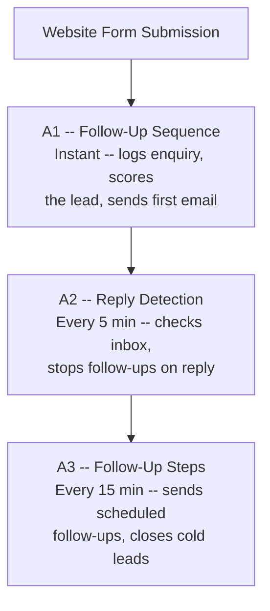

# Meji Media -- Automated Follow-Up System

> Your automated follow-up system is live and running. This guide explains how it works, what you'll see, and how to make changes.

**In this guide:** [How It Works](#how-it-works--the-big-picture) · [Your Google Sheet](#your-google-sheet--what-youll-see) · [Email Templates](#email-templates) · [Lead Scoring](#lead-scoring--priority) · [Follow-Up Cadence](#follow-up-cadence) · [A/B Testing](#ab-testing) · [What You Can Configure](#what-you-can-configure) · [Troubleshooting](#troubleshooting--quick-reference) · [Key Contacts](#key-contacts)

## What We Built

Your website receives 20-30 enquiries per day (up to 100 over a weekend). Previously, every follow-up email was sent manually -- slow, inconsistent, and easy to lose track of.

We built an automated follow-up pipeline that:

- **Responds instantly** when someone submits an enquiry on your website
- **Prioritises high-value leads** -- hot leads get a personalised email and your team gets notified immediately
- **Personalises every email with AI** -- each email opens with a unique, AI-generated sentence that references the enquirer's specific topic, so nothing feels templated
- **Sends timed follow-ups** -- a sequence of 2-3 emails over ~9 days, spaced based on lead priority
- **Stops automatically** when someone replies -- no awkward double-sends
- **Tracks everything** in a Google Sheet you can view at any time
- **A/B tests your emails** -- split enquiries 50/50 between two email variants and see which gets more replies (see the A/B Testing Guide for details)

The system runs 24/7 without any manual work. You only need to step in when a lead replies and the conversation becomes human-to-human.

---

## How It Works -- The Big Picture

Three automations work together:



> **Plain-text summary:** Website Form -> **A1** (instant: log, score, send first email) -> **A2** (every 5 min: detect replies, stop follow-ups) -> **A3** (every 15 min: send scheduled follow-ups, close cold leads)

**A1** handles the initial response. **A2** watches for replies. **A3** sends the follow-ups. They share the same Google Sheet as their source of truth.

---

## The Enquiry Lifecycle

Here's what happens from the moment someone fills in your website form:

1. **Form submitted** -- A1 receives the enquiry instantly
2. **Logged to Google Sheet** -- A new row appears with the person's name, email, topic, and a priority score
3. **First email sent** -- Within seconds. Hot leads get a warmer, more personalised email; your team also gets a notification. Standard leads get a friendly acknowledgement.
4. **Waiting for reply** -- A2 checks the inbox every 5 minutes
5. **If they reply** -- A2 marks the enquiry as "replied" and all follow-ups stop. You take over the conversation.
6. **If they don't reply** -- A3 sends a follow-up the next day (Step 2), then another a few days later (Step 3)
7. **Still no reply after ~9 days** -- The enquiry is marked as "cold" and follow-ups stop

---

## Your Google Sheet -- What You'll See

The "Meji Media -- Enquiry Tracker" spreadsheet is where everything is tracked. Here's what each column means:

| Column | What It Shows |
|--------|---------------|
| **Enquiry ID** | A unique reference for each enquiry (e.g., `ENQ-20260224-143022`) |
| **Received At** | When the form was submitted |
| **Name** | The enquirer's full name |
| **Email** | Their email address (used for reply matching) |
| **Phone** | Phone number, if provided |
| **Discussion Topic** | What they enquired about (from the form) |
| **Organisation** | Their company name, if provided |
| **Message** | The free-text message from the form |
| **Priority** | `hot`, `warm`, or `standard` -- set automatically based on lead scoring |
| **Status** | Where this enquiry is in the pipeline (see below) |
| **Stopped** | `TRUE` or `FALSE` -- whether follow-ups are still active |
| **Current Step** | Which follow-up step they're on (1 = initial email done) |
| **Next Step Due** | When the next follow-up is scheduled |
| **Last Email Sent** | When the last email went out |
| **Source** | Where the enquiry came from |
| **Lead Score** | A numeric score based on their enquiry details |
| **A/B Variant** | Which email version this enquiry receives (`A` or `B`) -- only used when A/B testing is enabled |

### Status Meanings

| Status | What It Means |
|--------|---------------|
| **new** | Enquiry just received, initial email sent, waiting for next step |
| **handoff** | Hot lead -- team has been notified, personalised email sent. **All further activity is managed by your team, not the automation.** |
| **following_up** | Automated follow-up sequence is active (step 2 or 3) |
| **replied** | They replied to an email -- follow-ups stopped, you're handling it now |
| **cold** | No reply after the full sequence (~9 days) -- follow-ups stopped |

### How Statuses Progress

```
new -> following_up -> replied     (they replied during follow-ups)
new -> following_up -> cold        (no reply after all steps)
new -> replied                    (they replied before follow-ups started)
new -> handoff                    (hot lead -- immediate team notification, no automated follow-ups)
```

---

## Email Templates

The system sends 4 different emails depending on the situation:

| Email | When It's Sent | Purpose |
|-------|---------------|---------|
| **Initial -- Standard** | Immediately (A1) | Friendly acknowledgement for standard/warm leads |
| **Initial -- High Priority** | Immediately (A1) | Warmer, more personalised email for hot leads |
| **Follow-Up #2** | ~24 hours later (A3) | Friendly nudge if no reply yet |
| **Follow-Up #3** | ~4 days later (A3) | Final follow-up before closing out |

All emails are sent from your shared Gmail inbox with your company domain. Each email includes an AI-generated opening sentence that references the enquirer's specific topic -- so even though the emails are automated, they read as if someone on your team wrote them personally.

### Editing Email Templates

Templates are stored in Make.com -- the automation platform that powers your follow-up system (think of it as the engine running behind the scenes). They live in a section called "Email Templates", and you can update the wording at any time without touching the automations themselves:

1. Log in to [eu2.make.com](https://eu2.make.com)
2. Go to **Data Stores** in the left sidebar
3. Open the **"Email Templates"** data store
4. Click on the template you want to edit
5. Update the `subject` or `body_html` fields
6. Save

Templates use placeholders like `##name##` and `##topic##` that get replaced with the enquirer's actual details when the email is sent. The AI-generated opening line is handled automatically -- you don't need to add anything for it.

---

## Lead Scoring & Priority

Every enquiry is automatically scored when it arrives. The score determines how quickly follow-ups are sent and whether your team gets an immediate notification.

| Priority | What It Means | What Happens |
|----------|---------------|--------------|
| **Hot** | High-scoring lead (score 50+) | Your team gets an instant email notification with full details. The enquirer gets a personalised acknowledgement. No automated follow-ups -- you handle it directly. |
| **Warm** | Mid-scoring lead (score 25-49) | Standard acknowledgement email, followed by slightly faster follow-ups |
| **Standard** | Lower-scoring lead (below 25) | Standard acknowledgement email, followed by regular-pace follow-ups |

The scoring weights and the threshold for "hot lead" notifications are configurable -- ask us if you'd like to adjust them.

---

## Follow-Up Cadence

How quickly follow-ups are sent depends on the enquiry's priority:

| Step | Hot Leads | Warm Leads | Standard Leads | What Happens |
|------|-----------|------------|----------------|--------------|
| 1 (Initial) | Immediate | Immediate | Immediate | A1 sends first email |
| 2 (First follow-up) | +6 hours | +12 hours | +24 hours | A3 sends follow-up #2 |
| 3 (Final follow-up) | +30 hours | +60 hours | +96 hours | A3 sends follow-up #3 |
| 4 (Close out) | -- | -- | -- | A3 marks enquiry as cold |

*All times are measured from when the initial email was sent.*

These timings are configurable -- ask us if you'd like to adjust them.

**Note:** Hot leads marked as "handoff" skip the automated sequence entirely. Your team handles those directly.

---

## A/B Testing

The system can split enquiries between two versions of each email to help you find what works best. When A/B testing is enabled:

- Each new enquiry is randomly assigned to **Group A** or **Group B** (50/50 split)
- Group A receives Version A of each email; Group B receives Version B
- The assignment sticks for the entire follow-up sequence
- The **AB_Analytics** tab in your spreadsheet automatically calculates reply rates for each group

To enable, edit the Pipeline Config data store and set `ab_testing_enabled` to `true`. To customise the email variants, edit the templates in the Email Templates data store (each template has an `_a` and `_b` version).

For full details -- including how to read your results, test specific subject lines, and roll back -- see the **A/B Testing Guide**.

---

## What You Can Configure

Most settings can be changed without touching the automations. Here's what you can adjust and where:

### In Make.com Data Stores (Pipeline Config)

Log in to [eu2.make.com](https://eu2.make.com) -> Data Stores -> Pipeline Config -> click the "main" record.

| Setting | Field Name | Current Default | What It Does |
|---------|-----------|----------------|--------------|
| Handoff score threshold | `handoff_threshold` | 50 | Leads scoring above this get an immediate team notification |
| Handoff on/off | `handoff_enabled` | true | Turn off to send all leads through the standard follow-up sequence |
| Handoff notification email | `handoff_email` | (your team email) | Who gets notified when a hot lead comes in |
| Hot lead follow-up timing | `cadence_hot_step2`, `cadence_hot_step3` | 6h, 24h | Hours before step 2 and step 3 emails for hot leads |
| Warm lead follow-up timing | `cadence_warm_step2`, `cadence_warm_step3` | 12h, 48h | Hours before step 2 and step 3 emails for warm leads |
| Standard lead follow-up timing | `cadence_standard_step2`, `cadence_standard_step3` | 24h, 72h | Hours before step 2 and step 3 emails for standard leads |
| Cold grace period | `cadence_cold_grace_hours` | 72h | Hours after the final follow-up before marking an enquiry as cold |
| AI personalisation on/off | `ai_enabled` | true | Whether emails include an AI-generated personalised opening line |
| AI model | `ai_model` | gpt-4o-mini | Which AI model generates the opening lines |
| Company name | `company_name` | Meji Media | Displayed as the sender name on all automated emails |
| Email signature | `email_signature_html` | (HTML block) | The sign-off and company links at the bottom of every email. Edit this once to update all templates. |
| A/B testing on/off | `ab_testing_enabled` | false | When enabled, new enquiries are randomly split between email Version A and Version B (see the A/B Testing Guide) |
| Scoring weights | `weight_*` fields | Various | How much each factor contributes to the lead score |

### In Make.com Data Stores (Email Templates)

Go to Data Stores -> Email Templates. Click any template to edit its subject line or body text.

### In Make.com Scenario Settings

| Setting | Where | Current Default |
|---------|-------|----------------|
| How often replies are checked | A2 scenario -> Scheduling tab | Every 5 minutes |
| How often follow-ups are sent | A3 scenario -> Scheduling tab | Every 15 minutes |

To change these: open the scenario in Make.com, click the clock icon (Scheduling), and adjust the interval.

---

## Troubleshooting -- Quick Reference

| Issue | What to Check |
|-------|---------------|
| Enquiry not appearing in the sheet | Check the form is submitting correctly. Look at the A1 automation in Make.com -- is it running? |
| No email was sent | Check the Gmail connection in Make.com -- go to Connections -> find Gmail -> click "Reauthorize" if expired. Also check the A1 run history for errors. |
| Follow-ups didn't stop after a reply | Check A2 is running (every 5 minutes). The reply must come from the same email address listed in the sheet. |
| Follow-up sent after someone replied | There can be up to a 5-minute delay between a reply and A2 detecting it. If A3 ran in that window, one extra follow-up may have gone out. |
| Enquiry marked as cold too quickly | Check the cadence settings. The timings depend on priority -- hot leads move faster through the sequence. |
| All automations stopped working | Check Make.com -- the automations may have been paused. Log in and verify they're active (green toggle). |
| Emails feel generic / no personalised opening | The AI that generates the opening line may have had a temporary issue. Check the AI settings in Pipeline Config (see "What You Can Configure" above). If `ai_enabled` is `true` and the issue persists, contact your automation specialist. |

For any issues not covered here, contact your automation support team.

---

## Key Contacts

| Role | Who | Contact |
|------|-----|---------|
| Decision maker / Technical setup | Gurmej Pawar | Via Upwork or email |
| Operations / Day-to-day questions | Jess Harrar | Via Upwork or email |
| Automation support | Your automation specialist | Via Upwork |

---

*Version 3.0 | Last updated: 6 March 2026*
