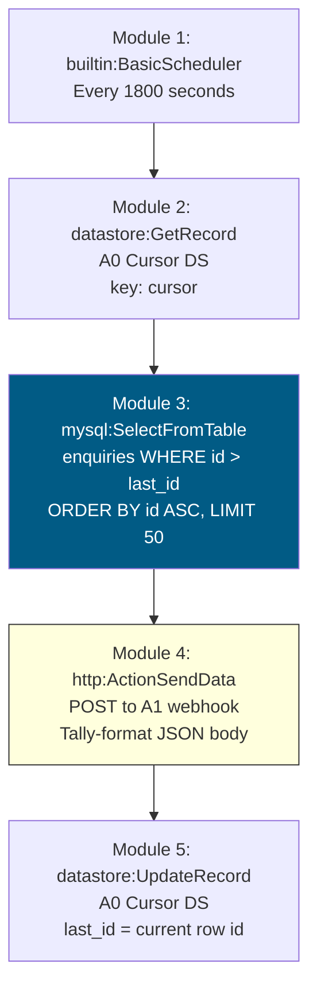

# A0: MySQL Enquiry Poller

## Goal

**Problem:** The automation pipeline (A1/A2/A3) uses a webhook trigger, but the client's website stores enquiries directly in a MySQL database. There is no webhook on form submission -- the only way to detect new enquiries is to poll the database.

**Solution:** Scheduled scenario that polls the client's MySQL database (`xmas_2020.enquiries`) every 30 minutes for new rows, transforms each row into flat JSON with direct field names, and POSTs to A1's webhook endpoint. A1 processes the data identically to a direct form submission.

**Business Value:** Connects the client's website to the automation pipeline without modifying any of the client's existing infrastructure. Zero changes to the tested A1/A2/A3 scenarios.

**Read-only guarantee:** The MySQL connection user (`make`) has SELECT-only privileges. A0 executes only SELECT queries. No writes, updates, or alterations to the client's database.

## Architecture

```
Website Form → MySQL (xmas_2020.enquiries) → [A0 polls every 30min] → POST to A1 webhook → existing pipeline
```

## Flow Diagram



## Field Mapping (MySQL → Flat JSON)

A0 transforms each MySQL row into flat JSON with direct field names that A1's webhook expects:

| JSON Field | MySQL Column | Type | IML Escaping | Notes |
|---|---|---|---|---|
| `source` | (constant) | string | — | Always `"website"` |
| `mysql_id` | `id` | number | — | Row PK |
| `created` | `created` | number | `ifempty(; 0)` | Unix timestamp |
| `name` | `name` | string | `replace(ifempty(; ""); newline; " ")` | Contact name |
| `phone` | `phone` | string | — | Phone number |
| `email` | `email` | string | — | Email address |
| `size` | `size` | number | `ifempty(; 0)` | Party size |
| `leader` | `leader` | string | `replace(ifempty(; ""); newline; " ")` | Booking contact |
| `level` | `level` | number | `ifempty(; 0)` | Tier/priority |
| `event_id` | `event_id` | number | `ifempty(; 0)` | FK to events table |
| `notes` | `notes` | string | `replace(ifempty(; ""); newline; " ")` | Free-text details |
| `enquiry_type` | `enquiry_type` | string | — | 0=office, 1=family |
| `hear_about` | `hear_about` | string | `replace(ifempty(; ""); newline; " ")` | Referral source |
| `address` | `address` | string | `replace(ifempty(; ""); newline; " ")` | Address |
| `hotel_required` | `hotel_required` | number | `ifempty(; 0)` | Hotel needed |
| `hotel_rooms` | `hotel_rooms` | number | `ifempty(; 0)` | Room count |

### Output JSON (per row)

```json
{
  "source": "website",
  "mysql_id": 14258,
  "created": 1773200000,
  "name": "John Smith",
  "phone": "07700900000",
  "email": "john@example.com",
  "size": 50,
  "leader": "ACME Corp",
  "level": 0,
  "event_id": 42,
  "notes": "Looking for Christmas party venue",
  "enquiry_type": "0",
  "hear_about": "Google",
  "address": "123 High Street",
  "hotel_required": 1,
  "hotel_rooms": 5
}
```

String fields use `replace(ifempty(field; ""); newline; " ")` to escape newlines that would break the raw JSON body construction.

## MySQL Table Schema (xmas_2020.enquiries)

| Column | Type | Key | Notes |
|---|---|---|---|
| id | int(11) UNSIGNED | PK, AUTO_INCREMENT | Change detection column |
| event_id | int(11) | | FK to events table |
| level | int(11) | | Tier/priority |
| size | int(11) | | Party size |
| name | varchar(500) | | Contact name |
| leader | varchar(50) | | Booking contact |
| email | varchar(255) | | Email address |
| phone | varchar(255) | | Phone number |
| address | longtext | | Address |
| notes | longtext | | Free-text notes |
| created | int(11) | | Unix timestamp |
| updated | int(11) | | Unix timestamp |
| hear_about | varchar(255) | | Referral source |
| reference | varchar(11) | | Reference code |
| discount | int(11) | | Discount value |
| dead | int(1) | | 0=active, 1=dead |
| hotel_required | tinyint(1) | | Hotel needed |
| hotel_rooms | int(4) | | Room count |
| enquiry_status | varchar(100) | | CRM status |
| last_contact | date | | Last contact date |
| next_contact | date | | Next contact date |
| enquiry_type | char(3) | | 0=office party, 1=family party |

## Deduplication

A0 uses a cursor-based approach to avoid processing the same row twice:

1. **A0 Cursor data store** — single record with key `"cursor"`, field `last_id` (number)
2. Before each MySQL query, read `last_id` from cursor
3. Query: `SELECT * FROM enquiries WHERE id > {{last_id}} ORDER BY id ASC LIMIT 50`
4. After each row is POSTed to A1, update `last_id` to the current row's `id`
5. Next poll starts from where we left off

**Initial seeding:** Set `last_id` to the current max ID in the `enquiries` table so A0 only processes NEW enquiries going forward (not the existing 2,805 rows).

## Make.com Scenario

**Scenario Information:**
- **Status:** Live (active, 5-minute polling)
- **Organization:** Meji Media (org 5473701, team 2826470, eu2.make.com)
- **Scheduling:** Every 1800 seconds (5 minutes)

**Connections Required:**

| Connection | App | ID | Type |
|---|---|---|---|
| MySQL - christmasofficeparty | MySQL | 13875518 | Basic (host/user/pass) |

**Module Types Used:**

| Module | App | Purpose |
|---|---|---|
| `builtin:BasicScheduler` | Built-in | Trigger: fire every 30 minutes |
| `datastore:GetRecord` | Make Data Store | Read cursor (last processed ID) |
| `mysql:Query` | MySQL | Select new rows from enquiries table (raw SQL) |
| `http:ActionSendData` | HTTP | POST row data to A1 webhook as flat JSON |
| `datastore:UpdateRecord` | Make Data Store | Update cursor with latest processed ID |

**Total: 5 modules**

## Data Stores

### A0 Cursor (new, to be created)

Single record tracking the last-processed MySQL row ID.

| Key | Field | Value | Purpose |
|---|---|---|---|
| cursor | last_id | (set to current max ID) | Deduplication cursor |

## Acceptance Criteria

- [x] A0 deployed and active in eu2 Make.com org (scenario 8841775)
- [x] MySQL connection verified (SELECT-only, no writes)
- [x] Polls every 30 minutes for new rows in `enquiries` table
- [x] Each new row POSTed to A1 webhook as flat JSON with 16 fields
- [x] A1 processes the forwarded data (11 operations, status 1)
- [x] No duplicate processing (cursor tracks last ID in data store 153982)
- [x] Google Sheet row created with all 20 columns populated (A-T)
- [x] Initial email sent to the enquirer
- [x] Zero changes to A1/A2/A3 scenarios
- [x] Zero writes to client's MySQL database

## Changelog

| Version | Date | Changes |
|---|---|---|
| 2.1.0 | 2026-03-12 | Fix `continueWhenNoRes` bug: changed from `true` to `false` on MySQL module. Scenario now stops cleanly when no new rows, preventing junk POSTs to A1. |
| 2.0.0 | 2026-03-12 | Flat JSON format (replaced Tally wrapper), replace() IML escaping for string fields, data store collection wrapper fix, production activation. |
| 1.0.0 | 2026-03-11 | Initial build: MySQL polling → A1 webhook bridge. 4-module scenario with cursor-based deduplication. |
