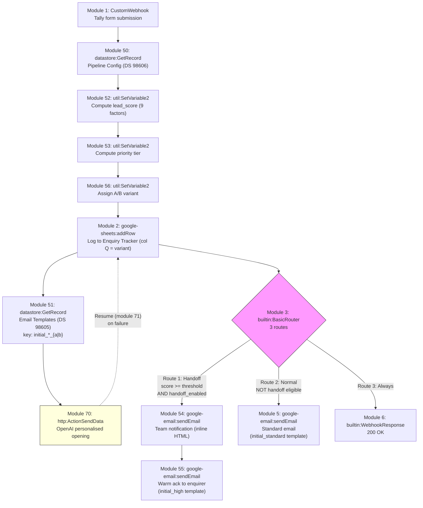

# A1: Enquiry Follow-Up Sequence

## Goal

**Problem:** Meji Media receives 20-30 website enquiries per day (up to 100 over a weekend) and manually follows up with each one. This is slow, inconsistent, and higher-value leads don't get priority attention.

**Solution:** Webhook-triggered automation that instantly logs each enquiry to a tracking sheet, scores the lead across 9 configurable factors, and routes to either a handoff path (hot leads get team notification + warmer acknowledgement, then enter the follow-up sequence with fastest cadence) or a normal path (standard/warm leads get a standard initial email and enter the follow-up sequence). AI-generated personalised opening lines are injected into emails with graceful degradation.

**Business Value:** Immediate response to every enquiry (previously hours/days), consistent follow-up, hot leads trigger instant team notification with full context, and AI personalisation makes templated emails feel hand-written.

## Flow Diagram



## Make.com Scenario

**Scenario Information:**
- **Scenario ID:** 4596203
- **Status:** Active (live, Tally webhook trigger)
- **Make.com Organization:** Meji Media (org 6475885, team 964106, eu1.make.com)
- **Connections:** Google (5461799), Gmail (5461821)

**Connections Required:**

| Connection Name | App | ID | Type | Description |
|----------------|-----|-----|------|-------------|
| Google Sheets | Google Sheets | 5461799 | OAuth2 | Read/write tracking table |
| Gmail | Gmail (google-email) | 5461821 | OAuth2 | Send emails from shared inbox |
| Custom Webhook | Built-in | N/A | N/A | Receive Tally form submissions |

**Key Configuration:**
- **Trigger:** Instant webhook (Tally form submission POST)
- **Error Handling:** `builtin:Resume` on OpenAI HTTP call (module 70 -> 71); `ifempty()` degradation ensures emails send without AI content if the API fails
- **Rate Limiting:** N/A (webhook-triggered, one execution per submission)

**Module Types Used:**

| Module | App | Purpose | Count |
|--------|-----|---------|-------|
| `gateway:CustomWebhook` | Built-in | Trigger: receive Tally form data | 1 |
| `datastore:GetRecord` | Make Data Store | Fetch Pipeline Config (DS 98606) | 1 |
| `datastore:GetRecord` | Make Data Store | Fetch email template (DS 98605) | 1 |
| `util:SetVariable2` | Built-in | Compute lead_score (9-factor weighted) | 1 |
| `util:SetVariable2` | Built-in | Compute priority tier (hot/warm/standard) | 1 |
| `util:SetVariable2` | Built-in | Assign A/B variant (module 56) | 1 |
| `http:ActionSendData` | HTTP | OpenAI API call for AI opening line | 1 |
| `builtin:Resume` | Error handler | Catch OpenAI failures gracefully | 1 |
| `google-sheets:addRow` | Google Sheets | Log enquiry to tracking table | 1 |
| `builtin:BasicRouter` | Flow control | Branch: handoff / normal / always | 1 |
| `google-email:sendEmail` | Gmail | Handoff: team notification (inline HTML) | 1 |
| `google-email:sendEmail` | Gmail | Handoff: warm ack to enquirer | 1 |
| `google-email:sendEmail` | Gmail | Normal: standard initial email | 1 |
| `builtin:WebhookResponse` | Built-in | Respond 200 OK (always route) | 1 |

**Total: ~14 modules** (excluding error handler attachment)

## Webhook Payload Schema (Tally Format)

The webhook receives a Tally form submission with nested `data.fields[]` array. Each field is a label-value pair:

```json
{
  "data": {
    "fields": [
      { "label": "What's your name?", "value": "Sarah Thompson" },
      { "label": "Phone", "value": "+447700900123" },
      { "label": "Email address", "value": "sarah@example.com" },
      { "label": "Discussion Topic", "value": "Wedding DJ" },
      { "label": "Organisation Name", "value": "Thompson Events Ltd" },
      { "label": "A brief description about your project/request/consultation", "value": "Looking for a DJ and lighting setup for our wedding reception." }
    ]
  }
}
```

**Field access pattern (IML):**
```
{{first(map(1.data.fields; "value"; "label"; "What's your name?"))}}
```

**Note on webhook data structure (`udt`):** When the webhook has no learned data structure (`udt: null`), parsed JSON is accessed at `1.data.*`. When `udt` is set, use `1.body.*`. Always check `hooks_get(hookId)` before building mappers.

## Step Details

### 1. Receive Webhook (Module 1: gateway:CustomWebhook)
- Receives POST from Tally form submission
- Payload is nested `data.fields[]` with label-value pairs (see schema above)
- **Output:** Webhook body data accessible via `{{1.data.fields}}` and the `first(map(...))` IML pattern

### 2. Fetch Pipeline Config (Module 50: datastore:GetRecord)
- Reads from Pipeline Config data store (DS 98606), key `"main"`
- Returns all 31 configuration fields: scoring weights, thresholds, cadence values, AI config, handoff settings
- **Must set `returnWrapped: false`** explicitly (API-deployed blueprints don't auto-fill defaults)
- **Output:** `{{50.weight_discussion_topic}}`, `{{50.handoff_threshold}}`, `{{50.ai_model}}`, etc.

### 3. Fetch Email Template (Module 51: datastore:GetRecord)
- Reads from Email Templates data store (DS 98605)
- Dynamic key based on handoff eligibility + A/B variant suffix:
  ```
  key: {{if(52.lead_score >= parseNumber(50.handoff_threshold; "."); "initial_high"; "initial_standard") + "_" + lower(56.ab_variant)}}
  ```
- Example keys: `initial_standard_a`, `initial_high_b`
- **Output:** `{{51.subject}}`, `{{51.body_html}}`

### 4. Compute Lead Score (Module 52: util:SetVariable2)
- **Variable name:** `lead_score`
- **Scope:** `roundtrip` (must be explicit)
- Computes a weighted score from 9 factors using Pipeline Config weights
- Score is immutable -- computed once at submission, never recalculated
- **Output:** `{{52.lead_score}}` (numeric, e.g. 85)

**9-Factor Scoring Model:**

The scoring factors and their weights are stored in Pipeline Config DS 98606. Each factor maps a form field or derived value to a configurable weight. The lead score is the sum of all applicable factor weights.

### 5. Compute Priority Tier (Module 53: util:SetVariable2)
- **Variable name:** `priority`
- **Scope:** `roundtrip`
- Maps score to tier using configurable thresholds from Pipeline Config:
  - `hot`: score >= 50 (default `hot_threshold`)
  - `warm`: score >= 25 (default `warm_threshold`)
  - `standard`: below 25
- **Output:** `{{53.priority}}` (string: `hot`, `warm`, or `standard`)

### 6. Assign A/B Variant (Module 56: util:SetVariable2)
- **Variable name:** `ab_variant`
- **Scope:** `roundtrip` (must be explicit)
- Pseudo-random assignment based on current second:
  ```
  {{if(50.ab_testing_enabled = "true"; if(parseNumber(formatDate(now; "s")) < 30; "A"; "B"); "A")}}
  ```
- When `ab_testing_enabled` = `false` (default), all leads get variant `A` (backward-compatible)
- When enabled, ~50/50 split: seconds 0-29 -> A, seconds 30-59 -> B
- **Output:** `{{56.ab_variant}}` (string: `A` or `B`)

### 7. AI Personalised Opening (Module 70: http:ActionSendData)
- Calls OpenAI Chat Completions API (`POST https://api.openai.com/v1/chat/completions`)
- Authorization: `Bearer {{50.ai_api_key}}` (key stored in Pipeline Config DS)
- Model: `{{50.ai_model}}` (default `gpt-4o-mini`)
- System prompt: stored in `{{50.ai_system_prompt}}` -- instructs AI to write one warm, natural opening sentence referencing the person's specific enquiry
- User prompt: includes name, topic, organisation, and context "initial acknowledgement email"
- Temperature: `{{50.ai_temperature}}` (default 0.7), max tokens: `{{50.ai_max_tokens}}` (default 80)
- **Output:** `{{70.data.choices[1].message.content}}` (Make.com uses 1-based array indexing)
- **Error handler:** `builtin:Resume` (module 71) -- if API fails, downstream `ifempty()` resolves `##ai_opening##` to empty string

### 7. Log to Tracking Table (Module 2: google-sheets:addRow)
- Adds a new row to the "Leads" worksheet
- Column mapping:

| Column | Value |
|--------|-------|
| A: enquiry_id | `ENQ-{YYYYMMDD}-{HHmmss}` |
| B: received_at | `{{now}}` |
| C: name | `{{first(map(1.data.fields; "value"; "label"; "What's your name?"))}}` |
| D: email | `{{first(map(1.data.fields; "value"; "label"; "Email address"))}}` |
| E: phone | `{{first(map(1.data.fields; "value"; "label"; "Phone"))}}` |
| F: discussion_topic | `{{first(map(1.data.fields; "value"; "label"; "Discussion Topic"))}}` |
| G: organisation | `{{first(map(1.data.fields; "value"; "label"; "Organisation Name"))}}` |
| H: message | `{{first(map(1.data.fields; "value"; "label"; "A brief description..."))}}` |
| I: priority | `{{53.priority}}` |
| J: status | `new` (always -- both handoff and normal routes) |
| K: stopped | `FALSE` (always -- all leads enter the follow-up sequence) |
| L: current_step | `1` |
| M: next_step_due | Priority-based cadence from Pipeline Config |
| N: last_email_sent | `{{now}}` |
| O: source | `tally_form` |
| P: lead_score | `{{52.lead_score}}` |
| Q: ab_variant | `{{56.ab_variant}}` |

### 8. Route by Eligibility (Module 3: builtin:BasicRouter)

Three routes, evaluated in order:

**Route 1 -- Handoff** (Modules 54, 55):
- **Filter:** `{{52.lead_score}} >= {{parseNumber(50.handoff_threshold; ".")}}` AND `{{50.handoff_enabled}} = true`
- **Module 54** (`google-email:sendEmail`): Team notification to `{{50.handoff_email}}`
  - Subject: `HOT LEAD: {{NAME}} - {{TOPIC}} (Score: {{52.lead_score}})`
  - Body: Inline HTML table with name, email, phone, org, topic, message, score, priority, urgency hours
  - This is NOT from a template -- it is inline HTML in the module config
- **Module 55** (`google-email:sendEmail`): Warm acknowledgement to the enquirer
  - Uses `initial_high` template from DS 98605
  - Placeholder resolution: `replace(replace(replace(replace(51.body_html; "##name##"; NAME); "##topic##"; TOPIC); "##organisation##"; ORG); "##ai_opening##"; ifempty(70.data.choices[1].message.content; ""))`
- Row written with `status=new`, `stopped=FALSE` (enters follow-up sequence with hot cadence timing)

**Route 2 -- Normal** (Module 5):
- **Filter:** NOT handoff eligible (fallback)
- **Module 5** (`google-email:sendEmail`): Standard initial email to the enquirer
  - Uses `initial_standard` template from DS 98605
  - Same placeholder resolution pattern as Route 1
- Row written with `status=new`, `stopped=FALSE` (enters follow-up sequence)

**Route 3 -- Always** (Module 6):
- **No filter** (always executes)
- **Module 6** (`builtin:WebhookResponse`): Returns `200 OK` with `{"status": "ok"}`
- Must execute within 30s to avoid webhook timeout

### Placeholder Resolution (Gmail Modules 5, 55)

```
subject: {{replace(replace(51.subject; "##name##"; NAME); "##topic##"; TOPIC)}}
html:    {{replace(replace(replace(replace(51.body_html; "##name##"; NAME); "##topic##"; TOPIC); "##organisation##"; ORG); "##ai_opening##"; ifempty(70.data.choices[1].message.content; ""))}}
```

Where `NAME`, `TOPIC`, `ORG` are resolved from the Tally `first(map(...))` pattern.

## Data Stores

### Pipeline Config (DS 98606)

Single record with key `"main"`. Contains 31 fields covering:

| Category | Fields | Examples |
|----------|--------|---------|
| Scoring weights | `weight_discussion_topic`, `weight_organisation`, etc. | 9 weight fields |
| Priority thresholds | `hot_threshold`, `warm_threshold` | 50, 25 |
| Handoff config | `handoff_threshold`, `handoff_enabled`, `handoff_email` | 50, true, team@mejimedia.co.uk |
| Cadence timing | `cadence_hot_step2`, `cadence_warm_step2`, `cadence_standard_step2`, etc. | 6, 12, 24 (hours) |
| AI config | `ai_api_key`, `ai_model`, `ai_system_prompt`, `ai_temperature`, `ai_max_tokens`, `ai_enabled` | gpt-4o-mini, 0.7, 80 |

### Email Templates (DS 98605)

| Key | Used By | Description |
|-----|---------|-------------|
| `initial_standard` | A1 (standard/warm leads) | Initial acknowledgment email |
| `initial_high` | A1 (hot leads via handoff) | Warmer initial email for high-scoring leads |
| `step_2` | A3 (step 2) | First follow-up |
| `step_3` | A3 (step 3) | Final follow-up |

Structure: `key` (PK), `subject`, `body_html`, `active`, `updated_at`. Templates use `##name##`, `##topic##`, `##organisation##`, `##ai_opening##` placeholders.

## Edge Cases & Error Handling

| Scenario | Handling | Make.com Handler |
|----------|----------|------------------|
| OpenAI API fails | Resume handler catches; `ifempty()` resolves `##ai_opening##` to empty string; email sends cleanly without AI line | `builtin:Resume` (module 71) on module 70 |
| Google Sheets unavailable | Skip sheet write, still send email and respond | `builtin:Resume` on addRow |
| Gmail send fails | Log error, still respond to webhook | `builtin:Resume` on sendEmail |
| Missing email field | Webhook response 400, skip processing | Filter: `email` exists |
| Pipeline Config DS unavailable | Scenario fails (intentional -- scoring requires config) | No handler (fail-fast) |
| Email Templates DS unavailable | Scenario fails (intentional -- template required) | No handler (fail-fast) |
| Handoff disabled | All leads go through normal route regardless of score | `handoff_enabled = false` in Pipeline Config |
| Duplicate submission | Allowed (dedup is not critical for initial email) | N/A |
| Webhook timeout (>30s) | Route 3 (always) sends 200 OK in parallel with routes 1/2 | Router parallelism |

## Manual Testing in Make.com

**Setup:**
1. Scenario 4596203 is already live with Tally webhook trigger
2. Connections: Google (5461799), Gmail (5461821)
3. Pipeline Config DS 98606 and Email Templates DS 98605 must have records

**Test Execution:**
1. Submit a Tally form with fields that would score above handoff threshold (e.g., high-value discussion topic + organisation)
2. Verify: row in sheet with `priority=hot`, `status=new`, `stopped=FALSE`; team notification email received at handoff_email; warm ack email received by enquirer with AI opening line
3. Submit a form with fields that score below threshold
4. Verify: row in sheet with `priority=standard` or `warm`, `status=new`, `stopped=FALSE`; standard email received with AI opening line
5. Temporarily break the OpenAI API key in Pipeline Config
6. Submit a form -- verify email still sends (without AI line), Resume handler fires

**Verifying scoring:** Compare `lead_score` values in the sheet against expected weights from Pipeline Config. Adjust weights in DS 98606 and re-test.

**Verifying routing:** Compare ops count between handoff and normal executions. Handoff path fires ~2 extra modules (team notification + warm ack vs. single standard email).

### Acceptance Criteria

- [x] Webhook receives Tally POST and returns 200 OK
- [x] Row added to Google Sheets with all 17 columns populated (A-Q)
- [x] `enquiry_id` generated with correct format (`ENQ-YYYYMMDD-HHmmss`)
- [x] 9-factor lead score computed using Pipeline Config weights
- [x] `priority` set correctly: hot (>=50), warm (>=25), standard (<25)
- [x] Hot leads above handoff threshold trigger team notification email
- [x] Hot leads above handoff threshold receive warm ack (initial_high template)
- [x] Handoff leads written with `status=new`, `stopped=FALSE` (enter follow-up sequence with hot cadence)
- [x] Standard/warm leads receive standard email (initial_standard template)
- [x] Normal leads written with `status=new`, `stopped=FALSE`
- [x] AI opening line injected into emails via `##ai_opening##` placeholder
- [x] AI failure degrades gracefully (empty string, email still sends)
- [x] `next_step_due` set using priority-based cadence from Pipeline Config
- [x] Email arrives from shared Gmail inbox
- [x] Templates fetched from Email Templates data store (not hardcoded)
- [ ] A/B variant assigned (A or B) and written to column Q
- [ ] Template key includes A/B suffix (`initial_standard_a`, `initial_high_b`, etc.)
- [ ] A/B toggle: `ab_testing_enabled=false` -> all leads get variant A (backward-compatible)

## Implementation Notes

**Orchestrator:** Make.com (scenario 4596203, eu1.make.com)

**Module Strategy:**
- **Data store modules:** `datastore:GetRecord` for Pipeline Config and Email Templates (with explicit `returnWrapped: false`)
- **Compute modules:** `util:SetVariable2` for lead_score, priority, and ab_variant (with explicit `scope: "roundtrip"`)
- **HTTP module:** `http:ActionSendData` for OpenAI API (with `builtin:Resume` error handler)
- **Native app modules:** `google-email:sendEmail` (Gmail), `google-sheets:addRow`
- **Flow control modules:** Router (3-route: handoff/normal/always), WebhookResponse

**IML Patterns:**
- Tally field access: `first(map(1.data.fields; "value"; "label"; "Field Label"))`
- Numeric parsing: `parseNumber(value; ".")` (not `toNumber()`)
- Template placeholders: `replace(replace(...; "##name##"; NAME); "##topic##"; TOPIC)`
- AI degradation: `ifempty(70.data.choices[1].message.content; "")`

**Connections:**

| Connection | App | ID | Notes |
|------------|-----|-----|-------|
| Google | Google Sheets | 5461799 | Shared across A1/A2/A3 |
| Gmail | Gmail (google-email) | 5461821 | Shared inbox, same account |

## Changelog

| Version | Date | Changes |
|---------|------|---------|
| 1.0.0 | 2026-02-24 | Initial specification (binary scoring, fixed cadence, no AI) |
| 2.0.0 | 2026-02-25 | Updated to match live implementation: 9-factor lead scoring, priority tiers (hot/warm/standard), handoff system with team notification, AI personalisation via OpenAI, Pipeline Config + Email Templates data stores, Tally webhook payload format, 3-route router |
| 3.0.0 | 2026-03-03 | A/B testing: module 56 (variant assignment), column Q (`ab_variant`), template key suffix (`_a`/`_b`), `ab_testing_enabled` toggle in Pipeline Config, 8 variant template records |
| 3.1.0 | 2026-03-23 | Hot lead fix: all leads now written with `status=new`, `stopped=FALSE` regardless of handoff eligibility. Hot leads enter the follow-up sequence with fastest cadence instead of being excluded. Team notification (Module 54) still fires for hot leads. |
