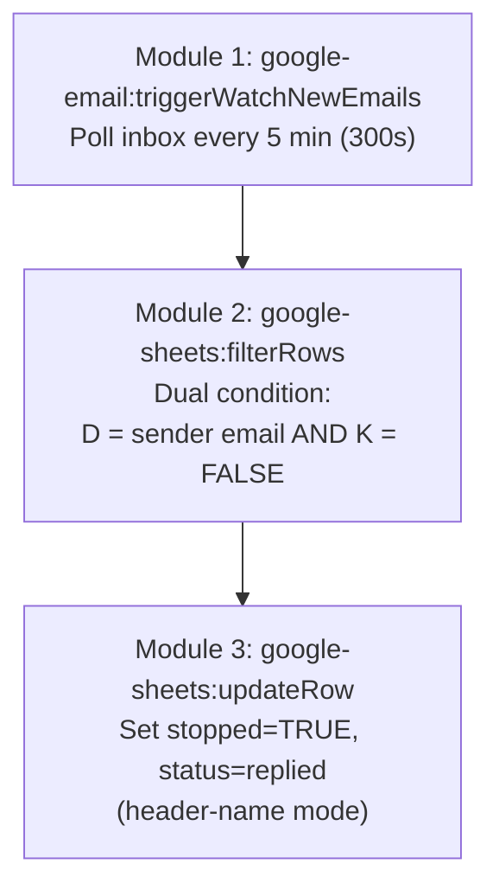

# A2: Reply Detection & Stop

## Goal

**Problem:** When a prospect replies to a follow-up email, automated emails must stop immediately. Without this, the system would keep sending follow-ups to people who are already in conversation -- feeling spammy and unprofessional.

**Solution:** Poll the Gmail inbox every 5 minutes (300 seconds) for new emails. When a reply is detected, look up the sender in the tracking table using `filterRows` with a dual condition (email match AND stopped=FALSE), then update the row to halt all further follow-ups.

**Business Value:** Prevents embarrassing double-sends after a prospect replies. Critical for maintaining the "personal, not automated" feel.

## Flow Diagram

## Make.com Scenario

**Scenario Information:**
- **Scenario ID:** 4595921
- **Status:** Active (live, polling every 5 minutes)
- **Make.com Organization:** Meji Media (org 6475885, team 964106, eu1.make.com)
- **Connections:** Google (5461799), Gmail (5461821)

**Connections Required:**

| Connection Name | App | ID | Type | Description |
|----------------|-----|-----|------|-------------|
| Gmail | Gmail (google-email) | 5461821 | OAuth2 | Watch inbox for new emails |
| Google Sheets | Google Sheets | 5461799 | OAuth2 | Search and update tracking table |

**Key Configuration:**
- **Trigger:** `google-email:triggerWatchNewEmails` (polling every 5 minutes / 300 seconds)
- **Scheduling:** 300 seconds interval, configured in Make.com scenario scheduling settings
- **Error Handling:** Resume on filterRows failure (non-critical), Break+retry on updateRow failure
- **Rate Limiting:** N/A (polling-based, low volume)

**Module Types Used:**

| Module | App | Purpose | Count |
|--------|-----|---------|-------|
| `google-email:triggerWatchNewEmails` | Gmail | Trigger: detect new inbox emails | 1 |
| `google-sheets:filterRows` | Google Sheets | Find matching enquiry by sender email + stopped=FALSE | 1 |
| `google-sheets:updateRow` | Google Sheets | Set stopped=TRUE, status=replied | 1 |

**Total: 3 modules**

**Important module clarifications:**
- The trigger module is `google-email:triggerWatchNewEmails`, NOT `gmail:watchEmails`. These are different app modules in Make.com.
- The search module is `google-sheets:filterRows`, NOT `google-sheets:searchRows`. `filterRows` supports multiple filter conditions directly; `searchRows` does not.

## Step Details

### 1. Watch Inbox (Module 1: google-email:triggerWatchNewEmails)
- Polls Gmail inbox every 5 minutes (300 seconds) for new emails
- Returns all new emails since last poll
- **Output:** Email metadata -- `from`, `subject`, `date`, `threadId`
- Sender email accessed via `{{1.from.0.address}}` or similar path depending on Gmail module output structure

### 2. Filter Rows (Module 2: google-sheets:filterRows)
- Searches the "Leads" worksheet with a **dual condition filter**:
  - Column D (`email`) = sender's email address
  - AND Column K (`stopped`) = `FALSE`
- This combines the search and filter into a single module -- no separate filter module needed
- Returns matching rows (if any). If no match, the scenario ends naturally (no downstream modules fire).
- **Output:** Matching row data including row number for the update

**Why filterRows instead of searchRows:**
`filterRows` supports multiple filter conditions in a single module, which eliminates the need for a separate filter step. `searchRows` only supports a single search column.

### 3. Update Tracking Table (Module 3: google-sheets:updateRow)
- Updates the matched row using **header-name mode**:
  - `mode: select`
  - `useColumnHeaders: true`
- Fields updated:
  - `stopped` = `TRUE`
  - `status` = `replied`
- Uses the row number from the filterRows result
- **Output:** Row updated; follow-ups for this enquiry will no longer fire (A3 checks `stopped=FALSE`)

**Why header-name mode:**
Setting `mode: select` with `useColumnHeaders: true` allows the updateRow module to reference columns by their header names (e.g., `stopped`, `status`) instead of column letters. This is more maintainable and survives column reordering.

## Edge Cases & Error Handling

| Scenario | Handling | Make.com Handler |
|----------|----------|------------------|
| Email from unknown sender | filterRows returns empty, no downstream modules fire | Normal behavior (no match) |
| Already stopped enquiry | filterRows dual condition excludes it (K=FALSE check) | Built into filter condition |
| Multiple enquiries from same email | filterRows returns first match; subsequent polls catch remaining | filterRows returns array |
| Gmail Watch returns no new emails | Scenario ends immediately | Normal behavior |
| Google Sheets filterRows fails | Skip this poll cycle, retry next | `builtin:Resume` |
| Google Sheets update fails | Critical -- retry to prevent duplicate sends | `builtin:Break` (retry 3x) |
| Spam/marketing emails | No match in tracking table, filtered out | filterRows returns empty |
| Handoff leads (stopped=TRUE already) | filterRows excludes them (K=FALSE check) | Built into filter condition |
| Race condition with A3 | Up to 5-min window where A3 may send one extra email before A2 detects reply | Acceptable trade-off |

## Manual Testing in Make.com

**Setup:**
1. Scenario 4595921 is already live
2. Connections: Google (5461799), Gmail (5461821)
3. Ensure tracking table has at least one row with `stopped = FALSE` and a known email address

**Test Execution:**
1. Send an email TO the shared inbox FROM the email address in the tracking table
2. Click "Run once" on the A2 scenario (or wait for 5-min poll)
3. Check module outputs:
   - Module 1 (triggerWatchNewEmails): should show the incoming email
   - Module 2 (filterRows): should return the matching row (dual condition: email match AND stopped=FALSE)
   - Module 3 (updateRow): should update stopped=TRUE, status=replied
4. Verify in Google Sheet: row now has `stopped=TRUE`, `status=replied`

**Edge Case Tests:**
1. Send email from an address NOT in the tracking table -- verify scenario ends after filterRows (no match, no error)
2. Run again on already-stopped row -- verify filterRows returns empty (dual condition excludes stopped=TRUE rows)
3. Send email from a handoff lead (already stopped=TRUE) -- verify filterRows returns empty

### Acceptance Criteria

- [x] `google-email:triggerWatchNewEmails` detects new emails in the inbox
- [x] Sender email matched against tracking table column D via `filterRows`
- [x] Dual condition filter: column D = email AND column K = FALSE
- [x] Only proceeds when filterRows returns a match
- [x] Row updated via `updateRow` with header-name mode: `stopped=TRUE`, `status=replied`
- [x] Unknown senders are ignored (no error, filterRows returns empty)
- [x] Already-stopped rows are excluded by the dual condition filter
- [x] Error on update triggers retry (Break handler)
- [x] Polling interval: 300 seconds (5 minutes)

## Implementation Notes

**Orchestrator:** Make.com (scenario 4595921, eu1.make.com)

**Module Strategy:**
- **Trigger:** `google-email:triggerWatchNewEmails` (NOT `gmail:watchEmails` -- different app module)
- **Search:** `google-sheets:filterRows` (NOT `google-sheets:searchRows` -- filterRows supports dual conditions)
- **Update:** `google-sheets:updateRow` with `mode: select`, `useColumnHeaders: true` (header-name mode)

**Connections:**

| Connection | App | ID | Notes |
|------------|-----|-----|-------|
| Google | Google Sheets | 5461799 | Same sheet as A1/A3 tracker |
| Gmail | Gmail (google-email) | 5461821 | Same inbox that sends follow-up emails |

**Scheduling:** 300 seconds (5 minutes), configured in Make.com scenario scheduling settings (not in the blueprint).

## Changelog

| Version | Date | Changes |
|---------|------|---------|
| 1.0.0 | 2026-02-24 | Initial specification |
| 2.0.0 | 2026-02-25 | Updated to match live implementation: corrected trigger to `google-email:triggerWatchNewEmails`, corrected search to `google-sheets:filterRows` with dual condition (email + stopped=FALSE), confirmed `updateRow` header-name mode, added scenario/connection IDs, confirmed 300s polling interval |
