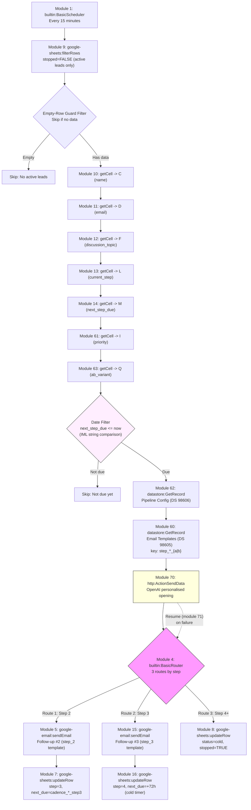

# A3: Scheduled Follow-Up Steps

## Goal

**Problem:** After the initial email (A1), prospects need follow-up emails at timed intervals -- but only if they haven't replied. This requires a scheduler that checks which enquiries are due for their next follow-up step, personalises each email with AI, and spaces follow-ups based on lead priority.

**Solution:** Run every 15 minutes. Use `filterRows` to find active leads, read individual cell values via 6x `getCell` modules (IML workaround), look up templates and config from data stores, generate AI-personalised opening lines, then route to step-appropriate actions: send follow-up email (steps 2-3) or mark as cold (step 4+). Follow-up cadence is priority-based and configurable via Pipeline Config data store.

**Business Value:** Automated, timed follow-up sequence without manual tracking. Prospects get 2-3 touchpoints with priority-based spacing, AI personalisation makes each email feel hand-written, and the system gracefully closes out unresponsive leads. Handles 100+ concurrent follow-up sequences during peak periods.

## Flow Diagram



## Make.com Scenario

**Scenario Information:**
- **Scenario ID:** 4596220
- **Status:** Active (live, scheduled every 15 minutes)
- **Make.com Organization:** Meji Media (org 6475885, team 964106, eu1.make.com)
- **Connections:** Google (5461799), Gmail (5461821)

**Connections Required:**

| Connection Name | App | ID | Type | Description |
|----------------|-----|-----|------|-------------|
| Google Sheets | Google Sheets | 5461799 | OAuth2 | Read/update tracking table |
| Gmail | Gmail (google-email) | 5461821 | OAuth2 | Send follow-up emails |

**Key Configuration:**
- **Trigger:** Scheduled (every 15 minutes)
- **Error Handling:** `builtin:Resume` on OpenAI HTTP call (module 70 -> 71); `builtin:Resume` on individual email failures (continue with next lead); `builtin:Break` (retry 3x) on sheet update failures
- **Rate Limiting:** Sequential processing (process follow-ups in order)
- **Sequential:** `true`

**Module Types Used:**

| Module | App | Purpose | Count |
|--------|-----|---------|-------|
| `builtin:BasicScheduler` | Built-in | Trigger: every 15 min | 1 |
| `google-sheets:filterRows` | Google Sheets | Find active leads (stopped=FALSE) | 1 |
| `google-sheets:getCell` | Google Sheets | Read individual cell values | 7 |
| `datastore:GetRecord` | Make Data Store | Fetch Pipeline Config (DS 98606) | 1 |
| `datastore:GetRecord` | Make Data Store | Fetch email template (DS 98605) | 1 |
| `http:ActionSendData` | HTTP | OpenAI API call for AI opening line | 1 |
| `builtin:Resume` | Error handler | Catch OpenAI failures gracefully | 1 |
| `builtin:BasicRouter` | Flow control | Branch by step number (3 routes) | 1 |
| `google-email:sendEmail` | Gmail | Send follow-up #2 (step 2) | 1 |
| `google-email:sendEmail` | Gmail | Send follow-up #3 (step 3) | 1 |
| `google-sheets:updateRow` | Google Sheets | Update step/timing (step 2 path) | 1 |
| `google-sheets:updateRow` | Google Sheets | Update step/timing (step 3 path) | 1 |
| `google-sheets:updateRow` | Google Sheets | Mark as cold (step 4+ path) | 1 |

**Total: ~19 modules** (including error handler attachment and filters)

## Architecture: Why getCell Instead of searchRows + Iterator

The original spec described a `searchRows` + `BasicFeeder` (iterator) pattern. The live implementation uses `filterRows` followed by 6 individual `getCell` modules. This is a deliberate architectural choice:

**The IML numeric key limitation:**
When `google-sheets:searchRows` or `google-sheets:filterRows` returns row data, the column values are keyed by numeric column indices (e.g., `0`, `1`, `2`...). In Make.com's IML expression language, referencing these numeric keys in downstream modules is unreliable -- IML can confuse them with module IDs, array indices, or other numeric references. This creates hard-to-debug mapping failures.

**The getCell workaround:**
Instead of parsing the filterRows output directly, 6 `getCell` modules each read a single cell value from a specific column. Each module has a stable module ID, and downstream modules reference the value as `{{moduleId.value}}` (e.g., `{{10.value}}` for name, `{{11.value}}` for email). This provides:
- Unambiguous references in downstream IML expressions
- Each module ID is unique and meaningful
- No risk of numeric key confusion
- Self-documenting: the module ID-to-column mapping is explicit

**getCell Module ID Mapping:**

| Module ID | Column | Header | Used For |
|-----------|--------|--------|----------|
| 10 | C | `name` | Email personalisation, AI prompt |
| 11 | D | `email` | Email recipient address |
| 12 | F | `discussion_topic` | Email subject/body, AI prompt |
| 13 | L | `current_step` | Router filter conditions, template lookup |
| 14 | M | `next_step_due` | Date comparison filter |
| 61 | I | `priority` | Priority-based cadence timing |
| 63 | Q | `ab_variant` | A/B test variant (A or B) |

These outputs are referenced as `{{10.value}}`, `{{11.value}}`, etc. throughout the scenario.

## Step Details

### 1. Scheduled Trigger (Module 1: builtin:BasicScheduler)
- Fires every 15 minutes
- **Output:** Trigger event (no data payload)

### 2. Find Active Leads (Module 9: google-sheets:filterRows)
- Searches "Leads" worksheet where column K (`stopped`) = `FALSE`
- Returns all rows that are not stopped
- **Output:** Array of row references (row numbers) for getCell modules to read
- **Note:** Uses `filterRows` (not `searchRows`) for consistency with A2

### 3. Empty-Row Guard Filter
- Blocks execution if filterRows returned no data / empty rows
- Prevents getCell modules from failing on non-existent row references
- **Output:** Only rows with actual data proceed

### 4. Read Cell Values (Modules 10, 11, 12, 13, 14, 61, 63: google-sheets:getCell)
- Seven sequential getCell calls, each reading one specific column for the current row
- See "getCell Module ID Mapping" table above for the column assignments
- **Output:** Individual cell values accessible as `{{10.value}}`, `{{11.value}}`, etc.

### 5. Date Comparison Filter: Is This Follow-Up Due?
- Compares `{{14.value}}` (next_step_due) against current time
- **Uses IML string comparison, NOT `date:before`**
- The `date:before` IML function is broken/unreliable in Make.com. Instead, dates are compared as ISO 8601 strings which sort lexicographically:
  ```
  {{14.value}} <= {{formatDate(now; "YYYY-MM-DDTHH:mm:ssZ")}}
  ```
- Blocks rows where the next step isn't due yet
- **Output:** Only due follow-ups proceed

### 6. Fetch Pipeline Config (Module 62: datastore:GetRecord)
- Reads from Pipeline Config data store (DS 98606), key `"main"`
- Provides cadence values: `cadence_hot_step2`, `cadence_hot_step3`, `cadence_warm_step2`, `cadence_warm_step3`, `cadence_standard_step2`, `cadence_standard_step3`
- Also provides AI configuration: `ai_api_key`, `ai_model`, `ai_system_prompt`, `ai_temperature`, `ai_max_tokens`
- **Must set `returnWrapped: false`** explicitly
- **Output:** `{{62.cadence_hot_step3}}`, `{{62.ai_model}}`, etc.

### 7. Fetch Email Template (Module 60: datastore:GetRecord)
- Reads from Email Templates data store (DS 98605)
- Dynamic key based on current step + A/B variant suffix:
  ```
  key: {{if(13.value = "2"; "step_2"; "step_3") + "_" + lower(ifempty(63.value; "a"))}}
  ```
- `ifempty` fallback: pre-A/B leads with empty column Q default to variant `a` (no regression)
- Example keys: `step_2_a`, `step_3_b`
- Step 4+ rows also fetch `step_3_*` but don't use it (no email sent on that path)
- **Output:** `{{60.subject}}`, `{{60.body_html}}`

### 8. AI Personalised Opening (Module 70: http:ActionSendData)
- Same pattern as A1 (see A1 spec for full details)
- Calls OpenAI Chat Completions API
- User prompt includes: name (`{{10.value}}`), topic (`{{12.value}}`), and step context:
  - Step 2: "first follow-up"
  - Step 3: "final follow-up"
- **Output:** `{{70.data.choices[1].message.content}}`
- **Error handler:** `builtin:Resume` (module 71) -- degrades gracefully

### 9. Route by Step Number (Module 4: builtin:BasicRouter)

Three routes:

**Route 1 -- Step 2** (Modules 5, 7):
- **Filter:** `{{13.value}} = "2"`
- **Module 5** (`google-email:sendEmail`): Sends follow-up #2 using `step_2` template
- **Module 7** (`google-sheets:updateRow`): Updates row:
  - `current_step` = `3`
  - `next_step_due` = now + priority-based cadence from Pipeline Config:
    ```
    {{addHours(now; if(61.value = "hot"; parseNumber(62.cadence_hot_step3; "."); if(61.value = "warm"; parseNumber(62.cadence_warm_step3; "."); parseNumber(62.cadence_standard_step3; "."))))}}
    ```
  - `status` = `following_up`
  - `last_email_sent` = `{{now}}`

**Route 2 -- Step 3** (Modules 15, 16):
- **Filter:** `{{13.value}} = "3"`
- **Module 15** (`google-email:sendEmail`): Sends follow-up #3 (final) using `step_3` template
- **Module 16** (`google-sheets:updateRow`): Updates row:
  - `current_step` = `4`
  - `next_step_due` = now + 72 hours (fixed cold timer)
  - `status` = `following_up`
  - `last_email_sent` = `{{now}}`

**Route 3 -- Step 4+** (Module 8):
- **Filter:** `{{parseNumber(13.value; ".")}} >= 4`
- **No email sent**
- **Module 8** (`google-sheets:updateRow`): Updates row:
  - `stopped` = `TRUE`
  - `status` = `cold`

### Placeholder Resolution (Gmail Modules 5, 15)

```
subject: {{replace(replace(60.subject; "##name##"; ifempty(10.value; "there")); "##topic##"; ifempty(12.value; "your enquiry"))}}
html:    {{replace(replace(replace(60.body_html; "##name##"; ifempty(10.value; "there")); "##topic##"; ifempty(12.value; "your enquiry")); "##ai_opening##"; ifempty(70.data.choices[1].message.content; ""))}}
```

Note the `ifempty()` fallbacks: if name is missing, uses "there" (as in "Hi there"); if topic is missing, uses "your enquiry". AI opening degrades to empty string on failure.

## Follow-Up Cadence (Priority-Based)

Cadence timing is configurable via Pipeline Config data store (DS 98606). Values below are defaults.

| Step | Hot | Warm | Standard | Action |
|------|-----|------|----------|--------|
| 1 | Immediate | Immediate | Immediate | A1 sends initial email |
| 2 | +6 hours | +12 hours | +24 hours | A3 sends follow-up #2 |
| 3 | +6h + 24h = +30h | +12h + 48h = +60h | +24h + 72h = +96h | A3 sends follow-up #3 |
| 4+ | -- | -- | -- | A3 marks as cold (72h fixed timer after step 3) |

**Config fields:** `cadence_hot_step2`, `cadence_warm_step2`, `cadence_standard_step2`, `cadence_hot_step3`, `cadence_warm_step3`, `cadence_standard_step3`.

**Handoff exception:** Hot leads marked as `handoff` by A1 have `stopped=TRUE` from the start, so A3 never processes them. The cadence above only applies to hot leads that scored below the handoff threshold but above the hot priority threshold (if such a gap exists in the configuration).

## Data Stores

### Pipeline Config (DS 98606)
- Key `"main"`, fetched by module 62
- Provides cadence timing, AI configuration, and scoring weights
- See A1 spec for full field listing

### Email Templates (DS 98605)
- Fetched by module 60 with dynamic key based on `current_step`
- `step_2` and `step_3` templates used by A3
- See A1 spec for template structure and placeholder convention

## Edge Cases & Error Handling

| Scenario | Handling | Make.com Handler |
|----------|----------|------------------|
| No active leads (all stopped) | filterRows returns empty, empty-row guard blocks | Guard filter |
| No due follow-ups | Date comparison filter blocks all rows | Filter: next_step_due <= now |
| OpenAI API fails | Resume handler catches; `ifempty()` resolves to empty string | `builtin:Resume` (module 71) |
| Gmail send fails | Skip this lead, continue with next | `builtin:Resume` on sendEmail |
| Sheet update fails | Critical -- retry to prevent duplicate sends | `builtin:Break` (retry 3x) on updateRow |
| Pipeline Config DS unavailable | Scenario fails for this cycle | No handler (fail-fast) |
| Step number out of range | Route 3 catches step >= 4, marks cold | Fallback route |
| `next_step_due` is empty/null | Date comparison filter blocks (empty string < now fails) | Filter condition |
| Empty getCell values | `ifempty()` fallbacks in placeholder resolution | "there" for name, "your enquiry" for topic |
| Concurrent A2 and A3 execution | A3 checks `stopped=FALSE` via filterRows -- if A2 just set TRUE, A3 may still have stale row reference but getCell re-reads | Race condition window ~5 min max |
| Priority field empty/missing | Cadence defaults to standard timing | `ifempty(61.value; "standard")` or similar |

## Manual Testing in Make.com

**Setup:**
1. Scenario 4596220 is already live
2. Connections: Google (5461799), Gmail (5461821)
3. Pipeline Config DS 98606 and Email Templates DS 98605 must have records
4. Disable scheduling and use "Run once" for testing

**Test Step 2:**
1. Add/modify a row in the tracking table with:
   - `stopped = FALSE`, `current_step = 2`
   - `next_step_due` = a timestamp in the past (e.g., yesterday)
   - `priority` = `standard` (or `hot`/`warm` to test different cadence)
   - A valid email address you can check
2. Click "Run once"
3. Verify:
   - Module 9 (filterRows): returns the row
   - Modules 10-14, 61 (getCell): each returns correct cell value
   - Module 62 (Pipeline Config): returns cadence values
   - Module 60 (Email Templates): returns `step_2` template
   - Module 70 (OpenAI): returns AI opening line
   - Module 5 (sendEmail): follow-up #2 sent with personalised content
   - Module 7 (updateRow): `current_step=3`, `next_step_due` set per priority cadence

**Test Step 3:**
1. Set the same row to `current_step = 3`, `next_step_due` = past
2. Run once
3. Verify: step 3 email sent, row updated to `current_step = 4`, `next_step_due` = +72h

**Test Step 4 (Cold):**
1. Set the same row to `current_step = 4`, `next_step_due` = past
2. Run once
3. Verify: no email sent, row updated to `stopped = TRUE`, `status = cold`

**Test Not-Yet-Due:**
1. Set a row with `next_step_due` = tomorrow
2. Run once
3. Verify: filterRows returns the row, but date comparison filter blocks it

**Test AI Degradation:**
1. Temporarily set an invalid `ai_api_key` in Pipeline Config DS 98606
2. Run once on a due step 2 row
3. Verify: Resume handler fires on module 70, email still sends (without AI opening line)

**Test Priority-Based Cadence:**
1. Set up two due step 2 rows: one with `priority=hot`, one with `priority=standard`
2. Run once
3. Compare `next_step_due` values after update: hot should be `now + cadence_hot_step3`, standard should be `now + cadence_standard_step3`

### Acceptance Criteria

- [x] Scenario runs on schedule (every 15 min) without errors
- [x] `filterRows` finds active leads where `stopped=FALSE`
- [x] Empty-row guard prevents downstream failures on empty results
- [x] 7x `getCell` modules correctly read name, email, topic, step, next_due, priority, ab_variant
- [x] Date comparison filter: only processes rows where `next_step_due <= now`
- [x] Date comparison uses IML string comparison (not broken `date:before`)
- [x] Pipeline Config fetched from DS 98606 with `returnWrapped: false`
- [x] Email template fetched from DS 98605 with dynamic key (`step_2` or `step_3`)
- [x] AI personalised opening line generated via OpenAI HTTP call
- [x] AI failure degrades gracefully (empty string, email still sends)
- [x] Step 2: follow-up #2 sent, step incremented to 3, next_due set per priority cadence
- [x] Step 3: follow-up #3 sent, step incremented to 4, next_due set to +72h
- [x] Step 4+: no email sent, marked as cold (`stopped=TRUE`, `status=cold`)
- [x] Placeholder resolution includes `ifempty()` fallbacks for missing cell values
- [x] Priority-based cadence: hot leads get faster follow-ups than standard leads
- [x] Templates fetched from Email Templates data store (not hardcoded)
- [x] Template key includes A/B variant suffix (`step_2_a`, `step_3_b`, etc.)
- [x] Pre-A/B leads (empty column Q) default to variant A via `ifempty(63.value; "a")`

## Implementation Notes

**Orchestrator:** Make.com (scenario 4596220, eu1.make.com)

**Module Strategy:**
- **Search:** `google-sheets:filterRows` (not `searchRows`) for active leads
- **Cell reading:** 7x `google-sheets:getCell` modules (IML numeric key workaround, including Q for A/B variant)
- **Data store modules:** `datastore:GetRecord` for Pipeline Config (module 62) and Email Templates (module 60), both with explicit `returnWrapped: false`
- **HTTP module:** `http:ActionSendData` for OpenAI API (module 70) with `builtin:Resume` error handler (module 71)
- **Native app modules:** `google-email:sendEmail` (Gmail modules 5, 15)
- **Flow control:** Router (3-route: step 2/step 3/step 4+), filters (empty-row guard, date comparison)
- **Update modules:** 3x `google-sheets:updateRow` (one per route)

**IML Patterns:**
- Date comparison: string comparison of ISO 8601 dates (not `date:before`)
- Cadence expression: `addHours(now; if(61.value = "hot"; parseNumber(62.cadence_hot_step3; "."); ...))`
- Template key: `if(13.value = "2"; "step_2"; "step_3") + "_" + lower(ifempty(63.value; "a"))`
- Placeholder fallbacks: `ifempty(10.value; "there")`, `ifempty(12.value; "your enquiry")`
- AI degradation: `ifempty(70.data.choices[1].message.content; "")`
- Numeric parsing: `parseNumber(value; ".")` (not `toNumber()`)

**Connections:**

| Connection | App | ID | Notes |
|------------|-----|-----|-------|
| Google | Google Sheets | 5461799 | Same sheet as A1/A2 tracker |
| Gmail | Gmail (google-email) | 5461821 | Same inbox as A1 |

**Scheduling:** Every 15 minutes, configured in Make.com scenario scheduling settings (not in the blueprint). Sequential processing enabled.

## Changelog

| Version | Date | Changes |
|---------|------|---------|
| 1.0.0 | 2026-02-24 | Initial specification (searchRows + iterator, fixed cadence, no AI, no data stores) |
| 2.0.0 | 2026-02-25 | Updated to match live implementation: filterRows + 6x getCell architecture (IML workaround), Pipeline Config + Email Templates data stores, AI personalisation via OpenAI, priority-based cadence (configurable), date comparison via IML string comparison (date:before is broken), empty-row guard filter, 3-route router with per-route updateRow, added scenario/connection IDs |
| 3.0.0 | 2026-03-03 | A/B testing: module 63 (getCell Q for ab_variant), template key suffix (`_a`/`_b`) with `ifempty` fallback for legacy leads, 7x getCell (was 6x) |
