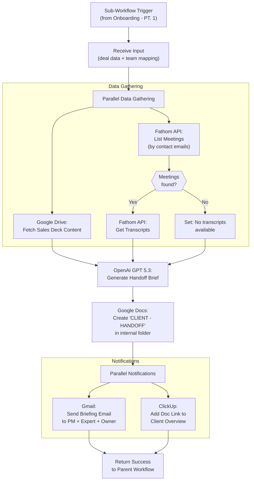

# A2: Client Handover — Sales to Delivery

## Goal

**Problem:** When a deal closes in HubSpot, someone manually gathers project details from the sales deck (Google Drive), reviews Fathom call recordings (discovery, demo, eval), creates a Loom video briefing, and sends an email with the video link, sales deck link, and text intro. Takes 15-30 minutes per deal, ~2.5 deals/week.

**Solution:** A sub-workflow called from the existing "Onboarding - PT. 1" workflow that automatically generates an AI-powered handoff briefing from the sales deck and Fathom meeting transcripts, creates a Google Doc with the structured brief, emails it to the delivery team, and links it to the ClickUp Client Overview.

**Business Value:** ~48 hrs/year saved (22 min x 2.5 deals/week x 52 weeks). Consistent, thorough briefings every time — no knowledge lost between sales and delivery.

## Flow Diagram



## API References

| System | Endpoint | Method | Auth | n8n Node |
|--------|----------|--------|------|----------|
| Fathom | `GET /external/v1/meetings?recorded_by[]=email&include_transcript=true` | GET | API Key (Bearer) | HTTP Request |
| Fathom | `POST /recordings/{id}/get-transcript` | POST | API Key (Bearer) | HTTP Request |
| Fathom | `POST /recordings/{id}/get-summary` | POST | API Key (Bearer) | HTTP Request |
| Google Drive | Read file content | — | OAuth2 | Native: Google Drive |
| Google Docs | Create document | — | OAuth2 | Native: Google Docs |
| OpenAI | Chat Completions | POST | API Key | Native: OpenAI |
| Gmail | Send email | — | OAuth2 | Native: Gmail |
| ClickUp | Add task link/comment | — | OAuth2/API Key | Native: ClickUp |
| HubSpot | Get associated contacts | GET | OAuth2 | Native: HubSpot |

## N8N Workflow

**Workflow Information:**
- **Status:** New sub-workflow (called from "Onboarding - PT. 1")
- **n8n Instance:** n8n-peakora
- **Parent Workflow:** `x791p6DZTCiLJzUl` — will add Execute Workflow node to call this

**Credentials Required:**
| Credential Name | Type | Description |
|----------------|------|-------------|
| Fathom API Key | API Key (Header) | `Authorization: Bearer {key}` — access team meetings |
| Google OAuth2 | OAuth2 API | Drive (read sales deck) + Docs (create handoff doc) |
| Gmail OAuth2 | OAuth2 API | Send briefing email |
| OpenAI API Key | API Key | GPT 5.3 for summarization |
| ClickUp OAuth2 | OAuth2 API / API Token | Add link to Client Overview task |
| HubSpot OAuth2 | OAuth2 API | Get deal's associated contacts |

**Key Configuration:**
- **Trigger:** Execute Workflow Trigger (sub-workflow, receives input from parent)
- **Error Handling:** Continue On Fail on Fathom nodes (meetings may not exist), Retry On Fail on OpenAI (rate limits)
- **Rate Limiting:** Fathom API: 60 calls/min — not a concern for single-deal processing

**Node Types Used:**
| Node | Purpose | Count |
|------|---------|-------|
| Execute Workflow Trigger | Receive input from parent | 1 |
| HubSpot | Get associated contacts for deal | 1 |
| HTTP Request | Fathom API calls (list meetings + get transcripts) | 2-3 |
| Google Drive | Read sales deck content | 1 |
| OpenAI | Generate AI handoff brief | 1 |
| Google Docs | Create handoff document | 1 |
| Gmail | Send briefing email | 1 |
| ClickUp | Add link to Client Overview task | 1 |
| Code | Build AI prompt, format email body, parse responses | 2-3 |
| IF | Check if meetings found, check if sales deck exists | 2 |
| Set | Consolidate data for AI prompt | 1-2 |

## Step Details

### 1. Receive Input from Parent Workflow

Sub-workflow receives the following data from "Onboarding - PT. 1":
- All `hubspot_*` fields from the Hubspot Fields Set node
- All `peakora_*` fields from the Peakora Team Mapping Set node

**Key fields used:**
| Field | Source | Purpose |
|-------|--------|---------|
| `hubspot_deal_id` | Hubspot Fields | Look up associated contacts |
| `hubspot_company_name` | Hubspot Fields | Doc naming, email subject |
| `hubspot_product` | Hubspot Fields | Include in briefing |
| `hubspot_start_date` | Hubspot Fields | Include in briefing |
| `hubspot_briefing` | Hubspot Fields | Short briefing text from HubSpot |
| `hubspot_project_lead` | Hubspot Fields | Client champion |
| `hubspot_deal_type` | Hubspot Fields | Type of engagement |
| `hubspot_plan` | Hubspot Fields | Plan details |
| `peakora_pm_name` / `_email` | Team Mapping | Email recipient |
| `peakora_expert_name` / `_email` | Team Mapping | Email recipient |
| `peakora_deal_owner_name` / `_email` | Team Mapping | Email recipient |

**HubSpot properties to verify/add for handover:**

These 10 fields are specified in the proposal. Some may need new HubSpot properties or mapping:

| Handover Field | Likely HubSpot Property | Status |
|----------------|------------------------|--------|
| Project Start | `project_start_date` → `hubspot_start_date` | Already mapped |
| Onboarding Responsible | TBD — may be same as PM | Verify |
| PM | `rgh_pm` → resolved via Google Sheets | Already mapped |
| Expert | `peakora_expert_lead` → resolved via Google Sheets | Already mapped |
| Support Role | TBD — verify property name | Verify |
| Type of Engagement | `dealtype` → `hubspot_deal_type` | Already mapped |
| Miro Link | TBD — verify property name | Verify |
| Language | TBD — verify property name | Verify |
| Client Champion | `client_project_lead` → `hubspot_project_lead` | Already mapped |
| Special Terms | TBD — verify property name | Verify |
| Sales Deck Link | TBD — Google Drive link | Verify |

### 2. Get Deal Contacts from HubSpot

Fetch contacts associated with the deal to match against Fathom meetings.

- **Node:** HubSpot → Get Deal Associations (contacts)
- **Input:** `hubspot_deal_id`
- **Output:** List of contact emails associated with the deal

### 3. Fetch Sales Deck from Google Drive

- **Node:** Google Drive → Download File
- **Input:** Sales deck link from HubSpot property (TBD — verify property name)
- **IF check:** Does the property contain a valid Google Drive link?
- **Fallback:** If no sales deck link, skip this step (AI summary will use only Fathom + deal properties)
- **Output:** Sales deck content (text extracted from the document)

**Note:** If the sales deck is a Google Slides presentation, we may need to export it as text or use the Google Slides API to extract content. If it's a PDF, we'll need to extract text.

### 4. Fetch Fathom Meeting Transcripts

- **Node:** HTTP Request → `GET https://fathom.video/external/v1/meetings`
- **Parameters:**
  - `recorded_by[]` = Peakora team emails (or use Fathom team account)
  - `include_transcript` = `true`
  - `created_after` = deal creation date (or reasonable lookback window)
- **Filter:** Match meetings where participants include any of the deal's contact emails
- **IF check:** Were any matching meetings found?
- **Fallback:** If no meetings found, proceed with sales deck + deal properties only
- **Output:** Array of meeting transcripts and summaries

**Alternative matching strategy:** If Fathom-HubSpot integration is active, meetings may already be linked to deals. Check if meetings have CRM match data.

### 5. AI Summarization (OpenAI GPT 5.3)

- **Node:** OpenAI → Chat Completions (or Code node with HTTP Request)
- **Model:** GPT 5.3
- **Input:** Concatenated context from:
  1. HubSpot deal properties (all 10 fields)
  2. Sales deck content (if available)
  3. Fathom meeting transcripts (if available)
  4. Fathom meeting summaries (if available)

**AI Prompt Structure:**

```
You are creating a client handoff briefing for the Peakora delivery team.

A new deal has just closed. Summarize the key information the delivery team needs to know.

## Deal Information
Company: {company_name}
Product: {product}
Type of Engagement: {deal_type}
Plan: {plan}
Project Start: {start_date}
Client Champion: {project_lead}
{additional fields...}

## Sales Deck Content
{sales_deck_text or "No sales deck available"}

## Meeting Transcripts
{for each meeting: title, date, transcript text}
{or "No meeting recordings available"}

---

Generate a structured handoff brief in the following format:

### Client Overview
Brief description of the client and their business.

### Project Scope
What was sold, what the client expects, key deliverables.

### Key Stakeholders
Client-side contacts and their roles/expectations.

### Discovery Insights
Key pain points, motivations, and goals discussed during sales calls.

### Important Context
Any special terms, preferences, sensitivities, or risk factors the delivery team should know about.

### Recommended Approach
Based on the sales conversations, how the delivery team should approach the kickoff.

Keep it concise but thorough. The delivery team should be able to read this in 5 minutes and feel fully briefed.
```

- **Output:** Structured markdown handoff brief

### 6. Create Google Doc

- **Node:** Google Docs → Create Document
- **Document Name:** `{company_name} - HANDOFF`
- **Folder:** Internal client folder in Google Drive (NOT shared with client)
  - Folder location: TBD — verify where internal client folders are in Drive
- **Content:** The AI-generated handoff brief + deal properties table at the top
- **Output:** Google Doc URL

### 7. Send Briefing Email

- **Node:** Gmail → Send Email
- **To:** PM email + Expert email + Deal Owner email (from Peakora Team Mapping)
- **Subject:** `New Client Handoff: {company_name} — {product}`
- **Body:**

```
Hi team,

A new deal has closed and your handoff briefing is ready.

Client: {company_name}
Product: {product}
Type: {deal_type}
Starting: {start_date}

PM: {pm_name}
Expert: {expert_name}
Sales: {deal_owner_name}

📄 Full Handoff Brief: {google_doc_url}

{AI-generated summary — abbreviated version (first 2 sections only)}

Please review the full briefing document before the kickoff.

Best,
Peakora Automations
```

### 8. Add Link to ClickUp Client Overview

- **Node:** ClickUp → Create Task Comment or Add Custom Field Link
- **Target:** The Client Overview task (created by parent workflow or already existing)
- **Action:** Add the Google Doc URL as a link attachment on the Client Overview task
- **Link Title:** "Handoff Brief"
- **Output:** Confirmation

### 9. Return to Parent Workflow

- **Output:** Success status + Google Doc URL back to parent workflow

## Parent Workflow Integration

Add an **Execute Workflow** node to "Onboarding - PT. 1" that calls this sub-workflow. Placement options:

**Option A (Recommended): After Slack notifications, before branching**
- Insert after "Deal Won (Broader Team Notification)" / "Bill Client" chain
- Before "If New Client" branching
- This ensures the handoff brief is created regardless of new vs. existing client

```
... → Bill Client → Create Client Briefing → Onboarding Email → [A2: Client Handover] → If New Client → ...
```

**Option B: Parallel with existing flow**
- Add as a parallel branch from the "Peakora Team Mapping" node
- Runs concurrently with Slack notifications

## Edge Cases & Error Handling

| Scenario | Handling | n8n Config |
|----------|----------|------------|
| No sales deck link in HubSpot | AI summary uses only Fathom + deal properties | IF node check → skip Google Drive step |
| Sales deck is not a text-extractable format | Log warning, skip deck content | Continue On Fail on Google Drive node |
| No Fathom meetings found for deal contacts | AI summary uses only sales deck + deal properties | IF node check → skip Fathom steps |
| Fathom API returns 401 (invalid key) | Workflow fails, visible in execution log | Log error, send failure notification |
| Fathom API rate limit (429) | Retry with backoff | Retry On Fail: 3 attempts, wait 10s |
| OpenAI API timeout or error | Retry; if still fails, create doc with raw data only | Retry On Fail: 3 attempts |
| OpenAI returns low-quality summary | No automated detection — team reviews doc manually | N/A |
| Google Doc creation fails | Log error, still send email with inline brief | Continue On Fail |
| Email send fails | Log error, doc still created and linked in ClickUp | Continue On Fail |
| ClickUp Client Overview task not found | Log warning, skip link addition | Continue On Fail |
| Parent workflow doesn't pass required fields | Workflow fails at first expression | Validate input in first Code node |
| Multiple meetings match (5+) | Use most recent 3-5 meetings to stay within token limits | Code node: sort by date, limit count |
| Very long transcripts exceed OpenAI token limit | Truncate or summarize each transcript individually first | Code node: check length, chunk if needed |

## Testing

### Manual Testing in N8N

**Setup:**
1. Create the sub-workflow with a Manual Trigger (instead of Execute Workflow Trigger) for testing
2. Add a Set node with pinned test data mimicking parent workflow output
3. Disable Gmail node (to avoid sending real emails during testing)
4. Point Google Docs creation to a test folder

**Test Data (from A1 spec — ESGroup deal):**
```json
{
  "hubspot_deal_id": "test-deal-123",
  "hubspot_company_name": "ESGroup",
  "hubspot_product": "Outbound",
  "hubspot_deal_type": "new_business",
  "hubspot_plan": "DFY",
  "hubspot_start_date": "2026-02-16",
  "hubspot_briefing": "3M DFY project for a new client...",
  "hubspot_project_lead": "Moritz Meier",
  "hubspot_closed_amount": "21620.0",
  "hubspot_closed_amount_currency": "CHF",
  "peakora_deal_owner_name": "Joel",
  "peakora_deal_owner_email": "joel@peakora.io",
  "peakora_expert_name": "Lidiia",
  "peakora_expert_email": "lidiia@peakora.io",
  "peakora_pm_name": "Daniel",
  "peakora_pm_email": "daniel@peakora.io"
}
```

**Test Execution:**
1. **Step 1 — Input validation:** Run with test data, verify all fields pass through
2. **Step 2 — Fathom API:** Test with real Fathom API key, verify meetings are fetched
3. **Step 3 — Google Drive:** Test with a known sales deck link
4. **Step 4 — AI Summary:** Verify OpenAI generates structured brief (inspect output quality)
5. **Step 5 — Google Doc:** Verify document created in correct folder with correct name
6. **Step 6 — Email:** Enable Gmail to test channel, verify email content and recipients
7. **Step 7 — ClickUp:** Verify link added to Client Overview task

**Edge Case Tests:**
1. Run without sales deck link → verify AI uses only Fathom + deal properties
2. Run without matching Fathom meetings → verify AI uses only deck + deal properties
3. Run without both → verify AI generates brief from deal properties alone

### Visual Verification

**In Google Drive:**
1. Navigate to internal client folder
2. Verify document named "ESGroup - HANDOFF" exists
3. Open document — verify it contains structured brief with all sections

**In Gmail (test):**
1. Check test inbox for email with subject "New Client Handoff: ESGroup — Outbound"
2. Verify recipients: PM, Expert, Deal Owner emails
3. Verify email body contains doc link and summary

**In ClickUp:**
1. Navigate to Client Overview task for the test deal
2. Verify "Handoff Brief" link appears in the task links
3. Click link — verify it opens the Google Doc

### Acceptance Criteria

**Workflow Execution:**
- [ ] Sub-workflow completes without errors when called from parent
- [ ] Sub-workflow handles missing sales deck gracefully
- [ ] Sub-workflow handles no Fathom meetings gracefully
- [ ] Sub-workflow handles both missing gracefully (deal properties only)

**AI Summary Quality:**
- [ ] Generated brief follows the 6-section structure
- [ ] Brief accurately captures key project details from deal properties
- [ ] Brief incorporates sales deck insights when available
- [ ] Brief incorporates meeting transcript insights when available
- [ ] Brief is readable in ~5 minutes

**Google Doc:**
- [ ] Document created with correct name "{Company} - HANDOFF"
- [ ] Document placed in internal client folder (not shared folder)
- [ ] Document content is well-formatted

**Email:**
- [ ] Briefing email sent within 5 minutes of deal closing
- [ ] Email sent to PM, Expert, and Deal Owner
- [ ] Email contains Google Doc link
- [ ] Email contains abbreviated summary

**ClickUp:**
- [ ] Link added to Client Overview task
- [ ] Link correctly points to the Google Doc

**HubSpot Properties:**
- [ ] All 10 handover fields correctly displayed in briefing
- [ ] Missing properties show "Not specified" (not errors)

**Multi-Deal Verification:**
- [ ] Tested with deal that has sales deck + Fathom meetings (full path)
- [ ] Tested with deal that has no sales deck (partial path)
- [ ] Tested with deal that has no Fathom meetings (partial path)

## Implementation Notes

**Orchestrator:** n8n (native nodes + HTTP Request for Fathom API)

**Node Strategy:**
- **Native nodes:** HubSpot, Google Drive, Google Docs, Gmail, ClickUp, OpenAI
- **HTTP Request nodes:** Fathom API (no native n8n node exists)
- **Code nodes:** AI prompt builder (concatenate sources), email body formatter, Fathom response parser, transcript length limiter

**Credentials Setup:**
| Credential | Type | Notes |
|------------|------|-------|
| HubSpot OAuth2 | OAuth2 API | Already configured in n8n (used by parent workflow) |
| Google OAuth2 | OAuth2 API | Needs Drive + Docs + Gmail scopes |
| OpenAI API Key | API Key | New credential — GPT 5.3 model access |
| Fathom API Key | HTTP Header Auth | `Authorization: Bearer {key}` — new credential |
| ClickUp OAuth2 | OAuth2 / API Token | Already configured (used by parent workflow) |

**Testing Approach:**
- Manual testing with pinned data (sub-workflow trigger replaced with manual trigger)
- Disable email sending during testing
- Use test Google Drive folder
- Visual verification in Google Docs, Gmail, ClickUp

## Open Questions

- [ ] **Sales deck HubSpot property:** Which property stores the Google Drive link to the sales deck? Need to verify or create.
- [ ] **HubSpot property names for missing fields:** Support Role, Miro Link, Language, Special Terms — verify internal API names or create new properties
- [ ] **Onboarding Responsible vs PM:** Are these the same field, or is "Onboarding Responsible" a separate role?
- [ ] **Internal client folder in Google Drive:** Where is this folder? What's the folder structure? Is there a consistent path like `Clients/{CompanyName}/Internal/`?
- [ ] **Fathom API key scope:** Does the team Fathom account have API access? Which plan?
- [ ] **Fathom meeting matching:** Does Peakora's Fathom-HubSpot integration tag meetings with deal/contact info, or do we need to match by participant emails?
- [ ] **ClickUp Client Overview task:** How is this task identified? By task ID returned from parent workflow, or by searching in a list?
- [ ] **Google Docs formatting:** Should the handoff brief follow a specific template or brand styling?
- [ ] **Sales deck format:** Is it always Google Slides, or could it be PDF/Google Docs/other formats?

## Changelog

| Version | Date | Changes |
|---------|------|---------|
| 1.0.0 | 2026-02-16 | Initial specification |