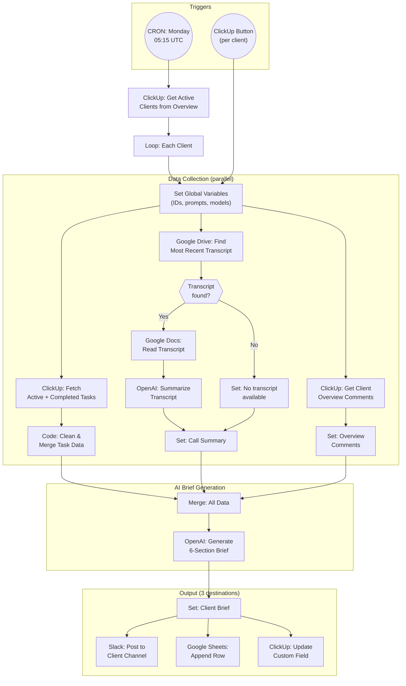

# A3: Client Check-in Brief V2

## Goal

**Problem:** The current AI Check-in automation (workflow `Client Brief`, ID: `8yGdvbTng8ZHIDiU`) produces output that is too long and not structured enough for quick decision-making. The brief is written to Google Sheets and a ClickUp custom field but never posted to Slack, where the team actually communicates. Additionally, the Monday schedule trigger is disconnected, the Slack history node is dead code, and null folder IDs cause crashes.

**Solution:** Revamp the existing workflow with a new structured 6-section output format, add Slack posting to the client's channel, fix the Monday auto-loop for all active clients, add error handling, and remove dead code.

**Business Value:** Quality improvement — the team gets a directly usable, concise check-in brief in Slack every Monday without manual effort. Reduced errors from null pointer crashes.

## Flow Diagram



## N8N Workflow

**Workflow Information:**
- **Status:** Updating workflow `Client Brief` (ID: `8yGdvbTng8ZHIDiU`)
- **n8n Instance:** n8n-peakora
- **Changes:** Prompt update, Slack posting, schedule trigger fix, error handling, dead code removal

**Credentials Required:**

| Credential Name | Type | Description |
|----------------|------|-------------|
| Peakora ClickUp | OAuth2 API | ClickUp task/folder/list access |
| Google Drive | OAuth2 | Search client folders + transcripts |
| Google Docs | OAuth2 | Read transcript content |
| OpenAI | API Key | AI summary + brief generation |
| Google Sheets | OAuth2 | Append brief to tracking sheet |
| Slack | Bot Token | Post messages to client channels |

**Key Configuration:**
- **Triggers:** Webhook POST `/client_briefing` (per-client button) + Schedule Trigger (Mondays 05:15 UTC for all active clients)
- **Error Handling:** ClickUp folder lookup → Continue On Fail (skip client if folder missing). All HTTP nodes → Retry On Fail (3 attempts).
- **Slack Channel:** Read from ClickUp custom field `Slack Channel ID` (field: `14d07314-2bc9-45d9-ae28-8b2696aa37ab`)

**Node Types Used:**

| Node | Purpose | Count |
|------|---------|-------|
| Webhook | Per-client trigger (ClickUp button) | 1 |
| Schedule Trigger | Monday auto-run | 1 |
| ClickUp | Get client info, tasks, comments | ~5 |
| HTTP Request | ClickUp API (tasks, comments, custom field update) | ~6 |
| Google Drive | Search client folders, find transcripts | 3 |
| Google Docs | Read transcript | 1 |
| OpenAI | Transcript summary + brief generation | 2 |
| Google Sheets | Append brief row | 1 |
| Slack | Post to client channel | 1 |
| Code | Clean task data, extract folder IDs | ~3 |
| Set | Variable management | ~6 |
| IF / Filter | Conditional logic (transcript exists, folder present) | ~4 |
| Merge | Combine parallel branches | 3 |

## API References

| System | Endpoint | Method | Auth | Notes |
|--------|----------|--------|------|-------|
| ClickUp | `/api/v2/task/{id}` | GET | OAuth2 | Get Client Overview task (native node) |
| ClickUp | `/api/v2/list/{id}/task` | GET | OAuth2 | Fetch active/completed tasks (HTTP Request) |
| ClickUp | `/api/v2/task/{id}/comment` | GET | OAuth2 | Get task comments (HTTP Request) |
| ClickUp | `/api/v2/task/{id}/field/{field_id}` | POST | OAuth2 | Update Weekly Client Overview field (HTTP Request) |
| Google Drive | Search API | GET | OAuth2 | Find client folders + transcripts (native node) |
| Google Docs | Document content | GET | OAuth2 | Read transcript (native node) |
| OpenAI | Chat Completions | POST | API Key | AI processing (native n8n-langchain node) |
| Google Sheets | Append Row | POST | OAuth2 | Log brief (native node) |
| Slack | `chat.postMessage` | POST | Bot Token | Post brief to channel (native node) |

## Step Details

### 1. Trigger & Initialize

**Webhook path (per-client):** Receives ClickUp automation payload with full task data including custom fields. Extracts client name, folder IDs, Slack channel ID.

**Schedule path (Monday auto-loop):**
1. Get all tasks from ClickUp "Client Overview" list (ID: `901206982566`)
2. Filter for status = "active"
3. Loop over each client, passing task data to the same pipeline

**Global Variables extracted:**
- `clickup_client_overview_id` — task ID
- `clickup_client_overview_name` — client name
- `clickup_client_overview_client_folder` — ClickUp folder URL
- `slack_channel_id` — from custom field `Slack Channel ID`
- `google_drive_folder_id` — from custom field `Client Project Folder (Google Drive)`
- `collab_health_check` — from custom field `Collab Health Check` (Green/Yellow/Red)
- `issue_resolution` — from custom field `Issue Resolution`
- AI prompts and model IDs

### 2. Fetch Data (3 parallel branches)

**Branch A — ClickUp Tasks:**
1. Extract ClickUp folder ID from URL (Code node with null check — if null, skip branch)
2. Get lists from client folder → filter for "Main Program" list
3. Fetch active tasks (statuses: to do, in progress, blocked/pending) with subtasks
4. Fetch completed tasks (closed in last 7 days, ordered by date_done)
5. For in-progress/pending tasks: fetch comments + threaded replies
6. Clean task data: remove unnecessary fields, format dates, extract checklists
7. Merge active tasks (with comments) + completed tasks

**Branch B — Meeting Transcript:**
1. Search Google Drive for client folder using `google_drive_folder_id`
2. Search for "Transcripts" subfolder
3. If found: get most recent file, sort by date, limit to 1
4. Read transcript via Google Docs
5. AI summarize key talking points (gpt-4.1-mini)
6. If not found: set call_summary to empty string

**Branch C — Client Overview Comments:**
1. Get comments from the Client Overview task
2. Format as JSON for AI input

### 3. Merge & Generate Brief

Merge all three branches into single data item containing:
- `clickup_tasks.clickup_active_tasks` (JSON)
- `clickup_tasks.clickup_completed_tasks` (JSON)
- `client_overview_comments` (JSON)
- `call_summary` (string)

### 4. AI Brief Generation (NEW prompt)

**Model:** gpt-5-mini (configurable via Global Variables)

**System Message:**
```
You are a concise operations analyst. Your job is to extract a structured check-in brief from project data. Follow the exact output format. Be direct and factual — no filler.
```

**User Prompt:**
```
## OUTPUT FORMAT

Produce EXACTLY these 6 sections. Omit a section only if no relevant data exists.

### 1. Decisions Made This Week
- Decision (what was agreed + why it matters)

### 2. Progress
- Task/Action → completed / in progress / blocked

### 3. Next Steps
- Owner — task — due date (if known)

### 4. Blockers / Risks
- Blocker (impact + what's needed to unblock)

### 5. Client Input Needed
- What approval / feedback / data is required

### 6. Collab Health Status
Include ONLY if status is not Green.
Current status: {collab_health_check}
Notes: {issue_resolution}

---

## RULES
- Use ONLY information from the inputs below. Never invent tasks, names, dates, or owners.
- Keep each section to 3-5 bullet points maximum.
- Use exact task names or faithful paraphrases.
- Prefer items from the call transcript and recent comments over older task data.
- "Next Steps" must have an owner name if mentioned in any source.
- Total output: under 400 words.

## INPUTS
- ClickUp Active Tasks (JSON): {clickup_active_tasks}
- ClickUp Completed Tasks (JSON): {clickup_completed_tasks}
- Client Overview Comments (JSON): {client_overview_comments}
- Latest Meeting Summary: {call_summary}
- Collab Health Check: {collab_health_check}
- Issue Resolution Notes: {issue_resolution}
```

### 5. Output (3 destinations)

**A. Slack Message:**
- Post to channel `{slack_channel_id}` (read from Client Overview custom field)
- Format as Slack markdown (bold headers, bullet points)
- Message structure:
  ```
  *{Client Name} — Weekly Check-In ({date})*

  {6-section brief formatted for Slack}
  ```

**B. Google Sheets:**
- Append row: Client Name | Date | Brief text
- Same sheet as current workflow

**C. ClickUp Custom Field:**
- Update "Weekly Client Overview" field (ID: `649cb5a4-e01b-4e36-a012-805fb5c95cfb`)
- Plain text version of the brief

## Edge Cases & Error Handling

| Scenario | Handling | n8n Configuration |
|----------|----------|-------------------|
| Client has no ClickUp folder URL set | Skip ClickUp tasks branch, generate brief from transcript + comments only | Code node: null check on folder URL, return empty tasks |
| No transcript found in Google Drive | Skip transcript branch, generate brief from ClickUp data only | IF node: check transcript exists |
| Client has no Slack Channel ID | Skip Slack posting, still write to Sheets + ClickUp | IF node: check slack_channel_id is non-empty |
| OpenAI API timeout | Retry 3x | Retry On Fail on OpenAI nodes |
| OpenAI returns empty/malformed response | Set fallback text: "AI Brief Not Generated" | Expression fallback: `{{ $json.message.content \|\| 'AI Brief Not Generated' }}` |
| Slack channel not found (invalid ID) | Log error, continue to Sheets + ClickUp | Continue On Fail on Slack node |
| Slack message too long (>4000 chars) | Truncate brief, add "See full brief in ClickUp" | Code node: check length, truncate if needed |
| ClickUp API rate limit (429) | Retry with backoff | Retry On Fail, 3 attempts, exponential |
| Google Drive folder not accessible | Skip transcript branch | Continue On Fail on Google Drive nodes |
| Schedule trigger: client with no data | Skip client, continue to next | Continue On Fail on main pipeline |

## Testing

### Manual Testing in N8N

**Setup:**
1. Select one test client (e.g., YOO Digital, task ID: `869ap6c9y`)
2. Disable write nodes: Slack post, Google Sheets append, ClickUp custom field update
3. Keep all read + AI nodes enabled

**Test Execution:**
1. Trigger via webhook with test client task_id
2. Inspect outputs at each node:
   - Global Variables: Verify Slack channel ID, folder IDs, prompts populated
   - ClickUp Active Tasks: Check tasks returned with correct statuses
   - Clean Clickup Active: Verify cleaned JSON structure
   - Create Call Transcript Overview: Verify transcript summary
   - Create Message Brief: **Verify output follows 6-section format**
   - Set Client Brief: Verify brief text is non-empty
3. Confirm brief is under 400 words
4. Confirm Collab Health section only appears if status is not Green

**Single Write Test:**
1. Enable Slack post node only
2. Set channel to a test channel (not real client channel)
3. Execute manually
4. Verify Slack message:
   - Has client name and date in header
   - 6-section format is readable
   - No Slack formatting errors

**Schedule Trigger Test:**
1. Temporarily change schedule to "every 5 minutes"
2. Check that workflow loops through active clients
3. Verify each client gets a separate brief
4. Revert schedule to Monday 05:15 UTC

### Visual Verification

**In Slack:**
1. Check test channel for posted message
2. Verify bold headers render correctly
3. Verify bullet points are readable
4. Confirm total message length is reasonable (not a wall of text)

**In Google Sheets:**
1. Check tracking sheet for new row
2. Verify Client Name, Date, Brief columns populated

**In ClickUp:**
1. Open Client Overview task
2. Check "Weekly Client Overview" custom field
3. Verify brief text is updated

### Acceptance Criteria

**Workflow Execution:**
- [ ] Workflow completes without errors for webhook trigger
- [ ] Workflow completes without errors for schedule trigger (all active clients)
- [ ] Execution time under 60 seconds per client (improved from ~73s)

**Output Format:**
- [ ] Brief follows 6-section format exactly
- [ ] Collab Health section only appears when status is not Green
- [ ] Brief is under 400 words
- [ ] Each section has max 3-5 bullet points
- [ ] No hallucinated tasks, names, or dates

**Slack:**
- [ ] Message posted to correct client Slack channel
- [ ] Formatting renders correctly (bold, bullets)
- [ ] Skips posting if client has no Slack Channel ID

**Error Handling:**
- [ ] Null folder ID does NOT crash workflow (skips branch gracefully)
- [ ] Missing transcript does NOT crash workflow (generates brief from ClickUp data)
- [ ] Missing Slack Channel ID skips Slack but still writes to Sheets + ClickUp

**Backward Compatibility:**
- [ ] Google Sheets append still works as before
- [ ] ClickUp custom field update still works as before
- [ ] Webhook trigger still works with existing ClickUp button automation

## Implementation Notes

**Orchestrator:** n8n (updating existing workflow `8yGdvbTng8ZHIDiU`)

**Node Strategy:**
- **Native nodes:** ClickUp (get task), Google Drive (search), Google Docs (read), Google Sheets (append), Slack (post message), OpenAI (chat completion)
- **HTTP Request nodes:** ClickUp tasks list API, ClickUp comments API, ClickUp custom field update
- **Code nodes:** Clean task JSON, extract folder ID from URL (with null check), Slack message formatting

**Changes from Current Workflow:**

| Area | Current | V2 |
|------|---------|-----|
| AI prompt | 7-section format (long) | 6-section format (concise, <400 words) |
| Output | Google Sheets + ClickUp only | + Slack posting to client channel |
| Schedule Trigger | Disconnected | Connected, loops all active clients |
| Slack history node | Dead code (hardcoded, placeholder) | Removed |
| Folder ID handling | Crashes on null | Graceful skip with fallback |
| Collab Health | Not used | Read from ClickUp, included only if not Green |

**Key Custom Fields Used:**

| Field Name | Field ID | Purpose |
|------------|----------|---------|
| Slack Channel ID | `14d07314-...` | Target for Slack posting |
| Client Project Folder | `70cdab54-...` | ClickUp folder URL |
| Client Project Folder (Google Drive) | `8d80e475-...` | Google Drive folder ID |
| Collab Health Check | `0145319d-...` | Green/Yellow/Red status |
| Issue Resolution | `f1d85666-...` | Health context notes |
| Weekly Client Overview | `649cb5a4-...` | Output: brief text |
| Client Brief (button) | `ab24782d-...` | Trigger: ClickUp automation |

**Credentials Setup:**

| Credential | Type | Notes |
|------------|------|-------|
| Peakora ClickUp OAuth2 | OAuth2 API | Already configured (ID: `iGvcC0XNjsD5mw0g`) |
| Google Drive/Docs/Sheets | OAuth2 | Already configured |
| OpenAI | API Key | Already configured |
| Slack | Bot Token | Already configured |

**Testing Approach:**
- Manual testing in n8n UI with write nodes disabled
- Single-write test to Slack test channel
- Schedule trigger smoke test (temporary 5-minute interval)
- Visual verification in Slack, Sheets, ClickUp

## Changelog

| Version | Date | Changes |
|---------|------|---------|
| 1.0.0 | 2026-02-16 | Initial V2 specification — new 6-section format, Slack posting, schedule fix, error handling |