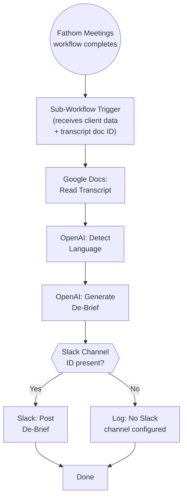

# A4: Meeting De-Brief

## Goal

**Problem:** After client meetings, the team has no automated summary of what was decided and what needs to happen next. Meeting insights live only in raw Fathom transcripts in Google Drive, requiring manual review to extract action items.

**Solution:** Create a sub-workflow that triggers automatically when the existing Fathom Meetings workflow saves a transcript. The sub-workflow reads the transcript, uses AI to extract key decisions and next steps, and posts a structured de-brief to the client's Slack channel — in the language of the meeting.

**Business Value:** Immediate post-meeting visibility for the team. No manual transcript review needed. Action items with owners and ClickUp links posted to Slack within minutes of meeting end.

## Flow Diagram



## N8N Workflow

**Workflow Information:**
- **Status:** New sub-workflow
- **n8n Instance:** n8n-peakora
- **Called by:** Fathom Meetings workflow (ID: `0cMuQexkKr6WvAqf`) — add Execute Sub-Workflow node at the end

**Credentials Required:**

| Credential Name | Type | Description |
|----------------|------|-------------|
| Google Docs | OAuth2 | Read transcript content |
| OpenAI | API Key | Language detection + de-brief generation |
| Slack | Bot Token | Post de-brief to client channel |
| Peakora ClickUp | OAuth2 API | Look up client Slack Channel ID (if not passed from parent) |

**Key Configuration:**
- **Trigger:** Execute Sub-Workflow trigger (called by parent workflow)
- **Error Handling:** All nodes → Continue On Fail. If AI fails, post error message to Slack instead of de-brief.
- **Language:** AI detects transcript language and outputs de-brief in the same language.

**Node Types Used:**

| Node | Purpose | Count |
|------|---------|-------|
| Execute Sub-Workflow Trigger | Entry point from Fathom Meetings | 1 |
| Google Docs | Read transcript | 1 |
| OpenAI | Language detection + de-brief generation | 1-2 |
| ClickUp | Get client Slack Channel ID (optional) | 0-1 |
| Slack | Post de-brief | 1 |
| IF | Check Slack channel present | 1 |
| Set | Variable management | 2-3 |

## API References

| System | Endpoint | Method | Auth | Notes |
|--------|----------|--------|------|-------|
| Google Docs | Document content | GET | OAuth2 | Read transcript (native node) |
| OpenAI | Chat Completions | POST | API Key | De-brief generation (native n8n-langchain node) |
| Slack | `chat.postMessage` | POST | Bot Token | Post to channel (native node) |
| ClickUp | `/api/v2/task/{id}` | GET | OAuth2 | Get client overview for Slack Channel ID (only if not passed from parent) |

## Step Details

### 1. Sub-Workflow Trigger

Receives data from the parent Fathom Meetings workflow:

**Expected input payload:**
```json
{
  "client_name": "YOO Digital",
  "transcript_doc_id": "1abc...xyz",
  "slack_channel_id": "C0A6YLNFWJJ",
  "meeting_title": "Weekly Check-In - YOO Digital",
  "meeting_date": "2026-02-11"
}
```

**How to pass this from Fathom Meetings:**
The parent workflow already has:
- Client name (from ClickUp filter)
- Transcript Google Doc ID (from Create Transcript + Add Transcript nodes)
- The client's ClickUp task ID (can be used to fetch Slack Channel ID)

Add an Execute Sub-Workflow node after the "Move File" node in Fathom Meetings, passing these fields.

### 2. Read Transcript

- Read the full content of the Google Doc using the `transcript_doc_id`
- The transcript is already saved by the Fathom Meetings workflow
- **Output:** Raw transcript text

### 3. AI De-Brief Generation

**Model:** gpt-5-mini (or configurable)

**Single prompt approach** (language detection + de-brief in one call):

```
## ROLE
You are a meeting analyst. Extract a structured de-brief from this meeting transcript.

## OUTPUT RULES
1. Detect the primary language of the transcript.
2. Write the ENTIRE de-brief in that same language.
3. Use ONLY information explicitly stated in the transcript.
4. Never invent action items, owners, dates, or decisions.
5. If a section has no relevant content, omit it entirely.
6. Keep total output under 300 words.

## OUTPUT FORMAT

### Key Decisions
- Decision (what was agreed + why)

### Next Steps
- Owner — task — due date (if mentioned)

If no clear decisions or next steps exist, output:
"No key decisions or action items identified in this meeting."

## TRANSCRIPT
{transcript_content}
```

### 4. Post to Slack

**Slack message format:**
```
*{Client Name} — Meeting De-Brief ({meeting_date})*
_{meeting_title}_

{AI-generated de-brief in meeting language}
```

**Channel:** Use `slack_channel_id` from input payload.

If no Slack Channel ID is available, log the de-brief to workflow execution output but do not post.

## Integration with Fathom Meetings Workflow

### Changes Required to Parent Workflow (ID: `0cMuQexkKr6WvAqf`)

The Fathom Meetings workflow currently ends at the "Move File" node. To integrate:

1. **Add a ClickUp Get Task node** after "Filter Client" to fetch the client's Slack Channel ID from the Client Overview custom fields
2. **Add an Execute Sub-Workflow node** after "Move File" that calls this sub-workflow with:
   - `client_name` from the Filter Client output
   - `transcript_doc_id` from the Create Transcript output
   - `slack_channel_id` from the ClickUp custom field
   - `meeting_title` from the Fathom webhook payload (if available)
   - `meeting_date` from the Get Date node

### Optional: Meeting Filter

Not all meetings may warrant a de-brief. Options to filter:

| Filter Approach | Implementation | Complexity |
|-----------------|---------------|------------|
| De-brief all matched meetings | No filter needed — if Fathom Meetings matches a client, de-brief it | None (default) |
| Title-based filter | IF node: only trigger if meeting title contains keywords (e.g., "check-in", "weekly", "status") | Low |
| ClickUp config per client | Add a "De-Brief Enabled" custom field checkbox on Client Overview | Medium |
| Minimum transcript length | IF node: only trigger if transcript > N words (skip very short calls) | Low |

**Recommendation:** Start with "de-brief all matched meetings" + a minimum transcript length check (skip transcripts under 200 words). Add title-based or per-client filtering later if needed.

## Edge Cases & Error Handling

| Scenario | Handling | n8n Configuration |
|----------|----------|-------------------|
| Transcript doc not found / deleted | Log error, skip de-brief | Continue On Fail on Google Docs node |
| Transcript is very short (<200 words) | Skip de-brief, log "Meeting too short" | IF node: word count check |
| Transcript is very long (>50,000 chars) | Truncate to last 30,000 chars (most recent context) | Code node: truncate before AI call |
| OpenAI timeout | Retry 3x | Retry On Fail on OpenAI node |
| OpenAI returns empty response | Post fallback: "De-brief could not be generated. See transcript in Google Drive." | Expression fallback |
| No Slack Channel ID | Skip Slack posting, log de-brief to execution | IF node check |
| Slack channel not found | Log error, continue | Continue On Fail on Slack node |
| Non-English transcript | AI detects language and outputs in same language | Handled in prompt |
| Multiple languages in meeting | AI detects primary language, outputs in that | Handled in prompt |
| Fathom webhook fires but no client match | Parent workflow handles this — sub-workflow never called | N/A |

## Testing

### Manual Testing in N8N

**Setup:**
1. Find a recent transcript in Google Drive (from a real or test meeting)
2. Note the Google Doc ID
3. Disable Slack posting node
4. Set up sub-workflow trigger with test data

**Test Execution:**
1. Call sub-workflow with test payload:
   ```json
   {
     "client_name": "Test Client",
     "transcript_doc_id": "{real_doc_id}",
     "slack_channel_id": "{test_channel_id}",
     "meeting_title": "Weekly Check-In",
     "meeting_date": "2026-02-16"
   }
   ```
2. Inspect outputs:
   - Google Docs Read: Verify transcript text loaded
   - OpenAI De-Brief: Verify output has "Key Decisions" and "Next Steps" sections
   - Verify output is in the language of the transcript
   - Verify output is under 300 words
3. Check that "No key decisions" fallback works with a trivial transcript

**Single Write Test:**
1. Enable Slack node, point to test channel
2. Execute with real transcript
3. Verify Slack message:
   - Client name and date in header
   - Meeting title in italics
   - De-brief sections render correctly
   - Language matches transcript

**Integration Test (with Fathom Meetings):**
1. Add Execute Sub-Workflow node to Fathom Meetings
2. Trigger Fathom Meetings workflow manually with test webhook data
3. Verify sub-workflow is called with correct parameters
4. Verify de-brief appears in test Slack channel

### Visual Verification

**In Slack:**
1. Check test channel for de-brief message
2. Verify formatting (bold headers, bullet points, italics)
3. Verify language matches the meeting
4. Confirm message is concise and actionable

### Acceptance Criteria

**Workflow Execution:**
- [ ] Sub-workflow triggers correctly from Fathom Meetings
- [ ] Execution completes in under 30 seconds
- [ ] Short transcripts (<200 words) are skipped gracefully

**De-Brief Quality:**
- [ ] Output follows "Key Decisions" + "Next Steps" format
- [ ] De-brief is in the same language as the meeting transcript
- [ ] No hallucinated decisions, owners, or dates
- [ ] Under 300 words
- [ ] Correctly handles "no decisions found" case

**Slack:**
- [ ] Message posted to correct client channel
- [ ] Header includes client name, date, meeting title
- [ ] Formatting renders correctly
- [ ] Skips posting if no Slack Channel ID

**Error Handling:**
- [ ] Missing transcript doc does not crash workflow
- [ ] OpenAI failure posts fallback message
- [ ] Missing Slack channel skips posting gracefully

## Implementation Notes

**Orchestrator:** n8n (new sub-workflow + modification to existing Fathom Meetings workflow)

**Node Strategy:**
- **Native nodes:** Google Docs (read), OpenAI (chat), Slack (post message)
- **HTTP Request nodes:** None required (all systems have native nodes)
- **Code nodes:** Transcript length check, truncation if needed

**Implementation Order:**
1. Create the sub-workflow (this spec)
2. Test with manual trigger + test data
3. Modify Fathom Meetings workflow to pass data and call sub-workflow
4. Test end-to-end with real Fathom webhook

**Credentials Setup:**

| Credential | Type | Notes |
|------------|------|-------|
| Google Docs OAuth2 | OAuth2 | Already configured (shared with Client Brief) |
| OpenAI | API Key | Already configured |
| Slack Bot Token | Bot Token | Already configured |

**Testing Approach:**
- Manual testing with real transcript Google Doc IDs
- Single-write test to Slack test channel
- Integration test via Fathom Meetings parent workflow
- Visual verification in Slack

## Changelog

| Version | Date | Changes |
|---------|------|---------|
| 1.0.0 | 2026-02-16 | Initial specification |