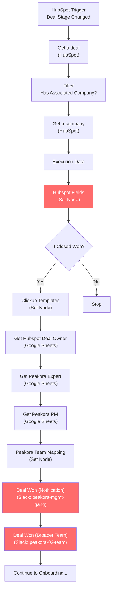

# A1: Fix Closed Won Slack Notifications

## Goal

**Problem:** When a deal moves to "Closed Won" in HubSpot, Slack notifications display incorrect PM and Expert values. PM always shows "N/A" and Expert previously defaulted to "Tim" for deals without an assigned expert.

**Solution:** Fix the n8n expression references in Slack notification nodes to use the already-mapped fields from Set nodes, and add missing deal fields to the `Hubspot Fields` Set node so Slack expressions reference a single clean data source.

**Business Value:** Management and team get accurate deal notifications showing correct PM and Expert assignments, enabling proper project handoffs.

## Root Cause Analysis

### Bug 1: PM always shows "N/A"

Both Slack nodes use `$json?.Name` to display the PM, but `$json` at the Slack node refers to the output of the **Peakora Team Mapping** Set node, which outputs `peakora_pm_name` (not `Name`). So `$json?.Name` evaluates to `undefined` → "N/A".

**Evidence:** Execution 7663 (ESGroup deal) — `Peakora Team Mapping` output has `peakora_pm_name: "Daniel"`, but Slack message shows `PK PM: N/A`.

### Bug 2: Expert works by accident

The Expert line uses `$('Get Peakora Expert').first().json?.Name` — a direct node reference to the Google Sheets output (which has a `Name` column). This bypasses the Team Mapping node and works, but is inconsistent.

### Bug 3: Messy expression references

The Slack message templates mix direct HubSpot API references (`$('Get a deal')`, `$('Get a company')`) with Set node references. This is fragile — the data has already been mapped into `Hubspot Fields` and `Peakora Team Mapping`, so all Slack expressions should reference those Set nodes.

## Flow Diagram



**Red nodes** = nodes requiring changes.

## N8N Workflow

**Workflow Information:**
- **Status:** Updating workflow "Onboarding - PT. 1" (ID: `x791p6DZTCiLJzUl`)
- **n8n Instance:** n8n-peakora
- **Active:** Yes

**Credentials Required:**
| Credential Name | Type | Description |
|----------------|------|-------------|
| HubSpot OAuth2 | OAuth2 API | Read deal properties |
| Google Sheets OAuth2 | OAuth2 API | Lookup Peakora Users sheet |
| Slack Bot Token | Bot Token | Post to channels |

**Key Configuration:**
- **Trigger:** HubSpot Trigger (deal stage change webhook)
- **Google Sheets Lookup:** Sheet `1j416gWAHznjscnV_t90Ec4lWABv6EFKzUX_9gaKUD5A`, tab "Users"
- **Slack Channels:**
  - Production: `C067BQVMHTR` (peakora-mgmt-gang), `C057Q0GJ9N1` (peakora-02-team)
  - Testing: `C096T139Z9S`

**Nodes Requiring Changes:**

| Node | Type | Change |
|------|------|--------|
| Hubspot Fields | Set | Add 5 missing fields (deal source, start date, briefing, etc.) |
| Deal Won (Notification) | Slack | Rewrite ALL expressions to use mapped fields |
| Deal Won (Broader Team Notification) | Slack | Rewrite ALL expressions to use mapped fields |

## Fix Details

### Fix 1: Hubspot Fields Node — Add Missing Fields

The Slack messages currently reach back to `$('Get a deal')` and `$('Get a company')` for several fields that aren't in `Hubspot Fields`. Add them so every Slack expression can reference a single clean source.

**Fields already present:**
- `hubspot_company_name`, `hubspot_product`, `hubspot_closed_amount`, `hubspot_closed_amount_currency`, `hubspot_peakora_pm`, `hubspot_peakora_expert`

**Fields to add:**

| Field Name | Expression | Purpose |
|------------|-----------|---------|
| `hubspot_deal_source` | `={{ $('Get a deal').first()?.json?.properties?.lead_source?.value \|\| '' }}` | Deal Source |
| `hubspot_sub_deal_source` | `={{ $('Get a deal').first()?.json?.properties?.sub_lead_source?.value \|\| '' }}` | Sub Deal Source |
| `hubspot_referral_source` | `={{ $('Get a deal').first()?.json?.properties?.referral_partner_source?.value \|\| '' }}` | Referring Source |
| `hubspot_start_date` | `={{ $('Get a deal').first()?.json?.properties?.project_start_date?.value ? $('Get a deal').first().json.properties.project_start_date.value.toDateTime('ms').format('yyyy-MM-dd') : '' }}` | Project Start Date (formatted) |
| `hubspot_briefing` | `={{ $('Get a deal').first()?.json?.properties?.project_briefing?.value \|\| '' }}` | Short Briefing |

**Keep existing fallback ID `140026975`** for `hubspot_peakora_pm` and `hubspot_peakora_expert` — no change to those expressions.

### Fix 2: Slack Node — "Deal Won (Notification)" (Management Channel)

Replace the entire message template. All expressions now reference the mapped Set nodes instead of raw HubSpot API responses.

**Current (broken — mixed references, wrong PM expression):**
```
🔔✍️ NEW DEAL 😎
Company: {{ $('Get a company').first().json.properties?.name?.value || "N/A" }}
Product: {{ $('Get a deal').first().json.properties?.product?.value || "N/A" }}
Amount: {{ $('Get a deal').first().json.properties?.hs_closed_amount?.value || "N/A" }}
Currency: {{ $('Get a deal').first().json.properties?.deal_currency_code?.value || "N/A" }}
Deal Source: {{ $('Get a deal').first().json.properties?.lead_source?.value || "N/A" }}
Sub Deal Source: {{ $('Get a deal').first().json.properties?.sub_lead_source?.value || "N/A" }}
Referring Source: {{ $('Get a deal').first().json.properties.referral_partner_source?.value || "N/A" }}
---
Starting: {{ ... $('Get a deal') date formatting ... }}
PK PM: {{ $json?.Name || "N/A" }}
PK Lead Expert: {{ $('Get Peakora Expert').first().json?.Name || "N/A" }}
Short Briefing: {{ $('Get a deal').first().json.properties?.project_briefing?.value || "N/A" }}
```

**Fixed (clean — mapped fields only):**
```
🔔✍️ NEW DEAL 😎
Company: {{ $('Hubspot Fields').first().json.hubspot_company_name || "N/A" }}
Product: {{ $('Hubspot Fields').first().json.hubspot_product || "N/A" }}
Amount: {{ $('Hubspot Fields').first().json.hubspot_closed_amount || "N/A" }}
Currency: {{ $('Hubspot Fields').first().json.hubspot_closed_amount_currency || "N/A" }}
Deal Source: {{ $('Hubspot Fields').first().json.hubspot_deal_source || "N/A" }}
Sub Deal Source: {{ $('Hubspot Fields').first().json.hubspot_sub_deal_source || "N/A" }}
Referring Source: {{ $('Hubspot Fields').first().json.hubspot_referral_source || "N/A" }}
---
Starting: {{ $('Hubspot Fields').first().json.hubspot_start_date || "N/A" }}
PK PM: {{ $json.peakora_pm_name || "N/A" }}
PK Lead Expert: {{ $json.peakora_expert_name || "N/A" }}
Short Briefing:
{{ $('Hubspot Fields').first().json.hubspot_briefing || "N/A" }}
```

### Fix 3: Slack Node — "Deal Won (Broader Team Notification)" (Team Channel)

Same cleanup, but without financial data (Amount/Currency).

**Fixed (clean — no Amount/Currency):**
```
🔔✍️ NEW DEAL 😎
Company: {{ $('Hubspot Fields').first().json.hubspot_company_name || "N/A" }}
Product: {{ $('Hubspot Fields').first().json.hubspot_product || "N/A" }}

---
Starting: {{ $('Hubspot Fields').first().json.hubspot_start_date || "N/A" }}
PK PM: {{ $json.peakora_pm_name || "N/A" }}
PK Lead Expert: {{ $json.peakora_expert_name || "N/A" }}

Short Briefing:
{{ $('Hubspot Fields').first().json.hubspot_briefing || "N/A" }}
```

## Edge Cases & Error Handling

| Scenario | Handling | n8n Config |
|----------|----------|------------|
| Deal has no PM assigned in HubSpot | Falls back to ID `140026975` → resolves to fallback team member | Existing `?? '140026975'` in Hubspot Fields |
| Deal has no Expert assigned in HubSpot | Falls back to ID `140026975` → resolves to fallback team member | Existing `?? '140026975'` in Hubspot Fields |
| Google Sheets lookup returns no match | Team Mapping fields will be empty → Slack shows "N/A" | Continue On Fail on Google Sheets nodes |
| Google Sheets lookup returns multiple matches | First match used by n8n `.item` behavior | Already handled |
| HubSpot property name changed | PM/Expert won't resolve → falls back to `140026975` | Monitor for incorrect assignments |
| Deal stage is not Closed Won | Workflow stops at "If Closed Won" (FALSE branch) | Existing behavior, correct |
| New HubSpot field not in Hubspot Fields | Will show "N/A" in Slack — add to Set node | Add mapping when new fields needed |

## Testing

### Testing Workflow Approach

Create a **separate test workflow** that replicates only the notification path, posting to the test channel `C096T139Z9S` instead of production channels.

**Test Workflow Structure:**
```
Manual Trigger → Set Test Data → Get Hubspot Deal Owner → Get Peakora Expert → Get Peakora PM → Peakora Team Mapping → Slack (Test Channel)
```

This avoids:
- Triggering from HubSpot (no need to move real deals)
- Posting to production Slack channels
- Running the full onboarding flow (ClickUp, Google Drive, Notion, etc.)

### Test Deals

Three scenarios using data from real executions, with modified PM/Expert assignments:

**Test Deal A: Both PM and Expert assigned** (from execution 7663 — ESGroup)
```json
{
  "hubspot_company_name": "ESGroup",
  "hubspot_product": "Outbound",
  "hubspot_closed_amount": "21620.0",
  "hubspot_closed_amount_currency": "CHF",
  "hubspot_deal_source": "Other",
  "hubspot_sub_deal_source": "Referral - Other",
  "hubspot_referral_source": "Thomas Ogi",
  "hubspot_start_date": "2026-02-16",
  "hubspot_briefing": "3M DFY project for a new client...",
  "hubspot_peakora_deal_owner": "58740518",
  "hubspot_peakora_pm": "81817586",
  "hubspot_peakora_expert": "81867062"
}
```
**Expected:** PM = "Daniel", Expert = "Lidiia"

**Test Deal B: PM assigned, Expert uses fallback** (from execution 7559 — ServiceHunter)
```json
{
  "hubspot_company_name": "ServiceHunter AG - quitt",
  "hubspot_product": "Datafoundation/CRM Setup",
  "hubspot_closed_amount": "6486.0",
  "hubspot_closed_amount_currency": "CHF",
  "hubspot_deal_source": "",
  "hubspot_sub_deal_source": "",
  "hubspot_referral_source": "",
  "hubspot_start_date": "",
  "hubspot_briefing": "",
  "hubspot_peakora_deal_owner": "58740518",
  "hubspot_peakora_pm": "81817586",
  "hubspot_peakora_expert": "140026975"
}
```
**Expected:** PM = "Daniel", Expert = whoever `140026975` maps to (verify!)

**Test Deal C: Both PM and Expert use fallback** (simulated)
```json
{
  "hubspot_company_name": "Test Company",
  "hubspot_product": "Outbound",
  "hubspot_closed_amount": "10000",
  "hubspot_closed_amount_currency": "CHF",
  "hubspot_deal_source": "",
  "hubspot_sub_deal_source": "",
  "hubspot_referral_source": "",
  "hubspot_start_date": "",
  "hubspot_briefing": "",
  "hubspot_peakora_deal_owner": "58740518",
  "hubspot_peakora_pm": "140026975",
  "hubspot_peakora_expert": "140026975"
}
```
**Expected:** PM = fallback person, Expert = same fallback person (confirms who `140026975` is)

### Test Execution Steps

1. **Build test workflow** with Manual Trigger + Set node (pinned test data) + Google Sheets lookups + Team Mapping + Slack (channel: `C096T139Z9S`)
2. **Run Test Deal A** — verify both PM and Expert resolve correctly
3. **Run Test Deal B** — verify PM resolves, Expert shows fallback person
4. **Run Test Deal C** — verify both show fallback person (identifies who `140026975` is)
5. **Apply fixes to production workflow** once all 3 tests pass
6. **Run one live test** by moving a real deal to Closed Won in HubSpot sandbox (if available)

### Visual Verification

**In Slack (test channel `C096T139Z9S`):**
1. Test A message: PM = "Daniel", Expert = "Lidiia", all deal fields populated
2. Test B message: PM = "Daniel", Expert = fallback name, some deal fields blank ("N/A")
3. Test C message: PM = fallback name, Expert = fallback name

**After production deployment (channels `peakora-mgmt-gang` and `peakora-02-team`):**
1. Management channel includes Amount + Currency
2. Team channel omits Amount + Currency
3. Both show correct PM and Expert

### Acceptance Criteria

**Workflow Execution:**
- [ ] Test workflow completes without errors for all 3 test deals
- [ ] Production workflow completes without errors after fix applied

**PM Display:**
- [ ] PM shows correct name when `rgh_pm` property is set (Test A, B)
- [ ] PM shows fallback team member when `rgh_pm` is empty (Test C)

**Expert Display:**
- [ ] Expert shows correct name when `peakora_expert_lead` is set (Test A)
- [ ] Expert shows fallback team member when `peakora_expert_lead` is empty (Test B, C)
- [ ] Expert no longer hardcoded to "Tim" regardless of assignment

**Message Quality:**
- [ ] All expressions reference mapped Set nodes (no `$('Get a deal')` in Slack)
- [ ] Management channel (`peakora-mgmt-gang`) includes Amount and Currency
- [ ] Team channel (`peakora-02-team`) omits Amount and Currency

**Multi-Deal Verification:**
- [ ] Tested with 3 different deal configurations (per Phase 0 acceptance criteria)
- [ ] No other notification fields broken by the fix

## Implementation Notes

**Orchestrator:** n8n (native nodes for all systems)

**Node Strategy:**
- **Native nodes:** HubSpot (Trigger + Get), Google Sheets (lookup), Slack (post message)
- **Set nodes:** Hubspot Fields, Clickup Templates, Peakora Team Mapping

**Implementation Steps:**
1. Create test workflow (Manual Trigger → Set data → Lookups → Team Mapping → Slack test channel)
2. Run 3 test deals through test workflow
3. Once tests pass, update production workflow:
   a. Add 5 new fields to `Hubspot Fields` Set node
   b. Replace message template in `Deal Won (Notification)` Slack node
   c. Replace message template in `Deal Won (Broader Team Notification)` Slack node
4. Monitor next live Closed Won trigger

**Node IDs Reference (production workflow):**
| Node | ID |
|------|-----|
| Hubspot Fields | `21649898-99dc-4c8e-a039-15eb4216edb8` |
| Deal Won (Notification) | `8db5c84e-3ad0-498e-bcf4-98e1faf6b434` |
| Deal Won (Broader Team Notification) | `f783a8a2-25e9-400c-9104-a93d0a61d4b5` |

## Open Questions

- [ ] Verify HubSpot property names `rgh_pm` and `peakora_expert_lead` are correct
- [ ] Confirm who HubSpot Owner ID `140026975` maps to (run Test C to find out)

## Changelog

| Version | Date | Changes |
|---------|------|---------|
| 1.0.0 | 2026-02-16 | Initial specification — root cause analysis and fix plan |
| 1.1.0 | 2026-02-16 | Rewrote Slack expressions to use mapped Set node fields. Added 5 missing fields to Hubspot Fields. Added testing workflow with 3 test deals and test channel. Kept fallback ID `140026975`. |
| 1.2.0 | 2026-02-16 | Deployed to production. Fixed broader team Slack node to use explicit `$('Peakora Team Mapping')` reference (not `$json` which resolves to upstream Slack API response). Test workflow ID: `oc2yg0HFFe0B4Kpu`. |