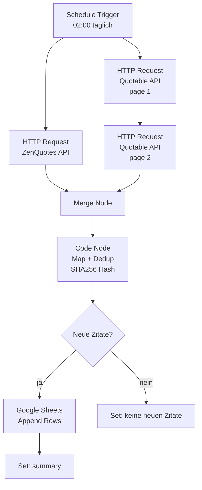

# A1 – Quote Scraper

## Goal

Täglich automatisch Zitate aus öffentlichen Web-APIs scrapen und in Google Sheets speichern. Dedup-Logik verhindert Duplikate.

## Flow



## API References

| System | Endpoint | Auth | Rate Limit |
|--------|----------|------|------------|
| ZenQuotes | `GET https://zenquotes.io/api/quotes` | None | 5 req/30s (generous) |
| Quotable | `GET https://api.quotable.io/quotes?limit=150&page=1` | None | None documented |
| Google Sheets | Append Row (n8n native node) | OAuth2 (n8n connection) | 100 req/100s |

## Quote Schema (Google Sheets)

Sheet name: **Quotes**

| Column | Type | Source | Notes |
|--------|------|--------|-------|
| id | string | generated | UUID v4 |
| text | string | API | Zitattext |
| author | string | API | Autorenname |
| category | string | API/mapped | motivation, wisdom, success, happiness, humor |
| language | string | static | "en" oder "de" |
| source | string | static | "zenquotes", "quotable", "static" |
| date_added | date | generated | YYYY-MM-DD |
| hash | string | generated | SHA256 der ersten 100 Zeichen von text |

## Dedup Logic

Im Code Node:
1. Alle vorhandenen Hashes aus Google Sheets lesen
2. Für jeden neuen Eintrag Hash berechnen
3. Nur Einträge ohne existierenden Hash appenden

## ZenQuotes Response Mapping

```json
// Input: [{"q": "...", "a": "Author", "h": "<blockquote>...</blockquote>"}]
// Output:
{
  "text": item.q,
  "author": item.a,
  "category": "motivation",  // ZenQuotes hat keine Kategorien → default
  "language": "en",
  "source": "zenquotes"
}
```

## Quotable Response Mapping

```json
// Input: { results: [{ content, author, tags: ["wisdom"] }] }
// Output:
{
  "text": item.content,
  "author": item.author,
  "category": item.tags[0] || "wisdom",  // erstes Tag als Kategorie
  "language": "en",
  "source": "quotable"
}
```

## Static German Quotes (einmalig)

Beim ersten Lauf werden die ~40 deutschen Zitate aus dem Original-HTML als `source: "static"`, `language: "de"` eingetragen.

## Error Handling

- `continueOnFail: true` auf beiden HTTP Nodes
- IF Node nach Merge: wenn beide leer → Workflow-Fehler loggen, kein Crash
