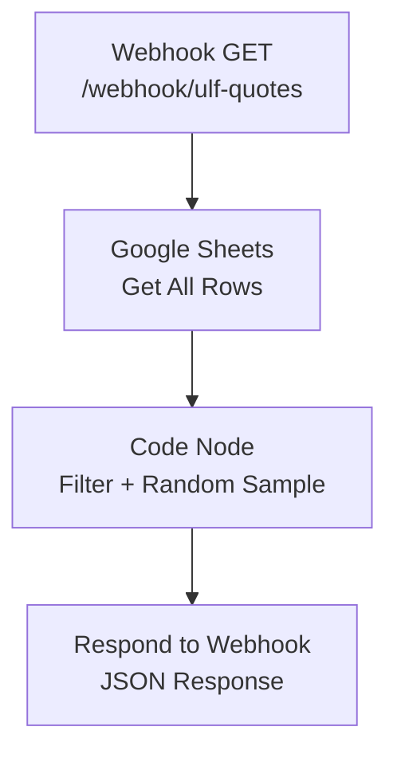

# A2 – Quote API Endpoint

## Goal

Webhook-Endpoint der das HTML-Frontend mit Zitaten aus Google Sheets versorgt. Unterstützt Filterung nach Kategorie und Sprache.

## Flow



## Endpoint

- **Method:** GET
- **Path:** `/webhook/ulf-quotes`
- **Auth:** None (public, read-only)

## Query Parameters

| Param | Type | Default | Description |
|-------|------|---------|-------------|
| category | string | (alle) | motivation, wisdom, success, happiness, humor |
| lang | string | (alle) | en, de |
| limit | number | 3 | Anzahl zurückgegebener Zitate (max 10) |

## Response Format

```json
{
  "quotes": [
    {
      "text": "Der einzige Weg, großartige Arbeit zu leisten...",
      "author": "Steve Jobs",
      "category": "motivation",
      "lang": "de"
    }
  ],
  "total": 847,
  "filtered": 42
}
```

## Code Node Logic

```javascript
const items = $input.all();
const allQuotes = items.map(i => i.json);

const category = $json.query?.category || null;
const lang = $json.query?.lang || null;
const limit = Math.min(parseInt($json.query?.limit) || 3, 10);

// Filter
let filtered = allQuotes;
if (category) filtered = filtered.filter(q => q.category === category);
if (lang) filtered = filtered.filter(q => q.language === lang);

// Random sample
const shuffled = filtered.sort(() => Math.random() - 0.5);
const selected = shuffled.slice(0, limit);

return [{
  json: {
    quotes: selected.map(q => ({
      text: q.text,
      author: q.author,
      category: q.category,
      lang: q.language
    })),
    total: allQuotes.length,
    filtered: filtered.length
  }
}];
```

## Respond to Webhook Config

- **Response Code:** 200
- **Response Mode:** lastNode
- **Response Data:** First Entry JSON
- **CORS:** `Access-Control-Allow-Origin: *` (Header im Respond Node)

## Edge Cases

- Keine Zitate in Sheets → leere `quotes: []` zurückgeben, nicht crashen
- Ungültige `limit` Werte → auf 3 defaulten
- Unbekannte Kategorie → leeres Ergebnis (kein Error)
