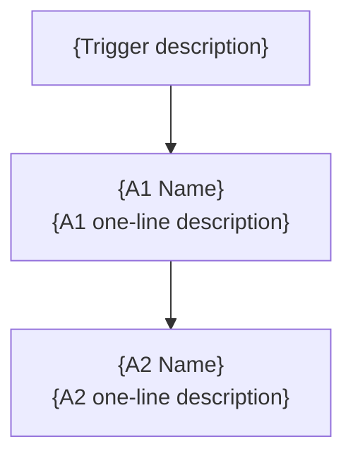

# {Client Name} — {System Title}

> Your {system description} is live and running. This guide explains how it works, what you'll see, and how to make changes.

**In this guide:** [How It Works](#how-it-works) · [What You'll See](#what-youll-see) · [What You Can Configure](#what-you-can-configure) · [Troubleshooting](#troubleshooting) · [Key Contacts](#key-contacts)

## What We Built

{1-2 paragraphs: the problem, the solution, key benefits. Write for a non-technical audience.}

The system runs {frequency} without any manual work. You only need to step in when {human handoff condition}.

---

## How It Works

{Number} automations work together:

> **Plain-text summary:** {Trigger} → **A1** ({description}) → **A2** ({description})

{Brief explanation of how the automations relate to each other.}

---

## {Primary Tracking System} — What You'll See

{Description of where the client can see what's happening — Google Sheet, dashboard, CRM, etc.}

| Column / Field | What It Shows |
|----------------|---------------|
| **{field}** | {description} |

### Status Meanings

| Status | What It Means |
|--------|---------------|
| **{status}** | {description} |

---

## What You Can Configure

Most settings can be changed without touching the automations. Here's what you can adjust and where:

### In Make.com Data Stores ({Config Store Name})

Log in to [eu1.make.com](https://eu1.make.com) → Data Stores → {Store Name} → click the "{record}" record.

| Setting | Field Name | Current Default | What It Does |
|---------|-----------|----------------|--------------|
| {Setting} | `{field}` | {default} | {description} |

### In Make.com Scenario Settings

| Setting | Where | Current Default |
|---------|-------|----------------|
| {Setting} | {Scenario} → Scheduling tab | {default} |

---

## Troubleshooting — Quick Reference

| Issue | What to Check |
|-------|---------------|
| {Common issue} | {What to do — include specific Make.com navigation steps} |

For any issues not covered here, contact your automation support team.

---

## Key Contacts

| Role | Who | Contact |
|------|-----|---------|
| {Role} | {Name} | {Contact method} |

---

*Version {X.0} | Last updated: {date}*
