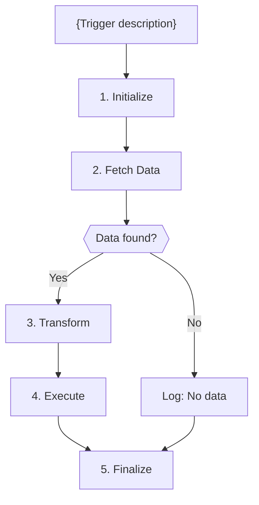

# A{N}: {Automation Name}

## Goal

**Problem:** {Describe the manual task or pain point being solved}

**Solution:** {High-level approach to solving the problem}

**Business Value:** {Quantifiable impact - time saved, error reduction, etc.}

## Flow Diagram



<!-- For n8n: use node-based diagrams from modules/MERMAID-PATTERNS.md (n8n section).
     Show node types and operations: "GET /orders", "Code: Transform", "Slack: Notify" -->

<!-- For Make.com: use module-based diagrams from modules/MERMAID-PATTERNS.md (Make.com section).
     Show app + action: "Fortnox: List orders", "Router", "Slack: Post message" -->

## API References

| System | Endpoints | Auth | Rate Limit |
|--------|-----------|------|------------|
| {system} | GET /endpoint, POST /endpoint | OAuth2/API Key | N req/sec |

**API Clients:**
- `python/clients/{system}/client.py` (Trigger.dev)
- `app/clients/{system}/client.py` (FastAPI)

<!-- For n8n: also note whether native n8n nodes exist for each system.
     Replace "API Clients" with node strategy:
     - Native nodes: Slack, Google Sheets
     - HTTP Request nodes: Fortnox, Upsales -->

<!-- For Make.com: also note whether native Make.com app modules exist for each system.
     Replace "API Clients" with module strategy:
     - Native app modules: Slack, Google Sheets
     - HTTP modules: Fortnox, custom APIs -->

<!-- ============================================================
     N8N ONLY: Include this section when orchestrator is n8n.
     See modules/N8N-SECTIONS.md for templates.
     ============================================================ -->

<!-- ## N8N Workflow

**Workflow Information:**
- **Status:** New workflow / Updating workflow {name} (ID: {id})
- **n8n Instance:** {client instance name from .mcp.json}
- **Workflow File:** `context/{automation_id}-n8n-workflow.json` (optional export)

**Credentials Required:**
| Credential Name | Type | Description |
|----------------|------|-------------|
| {System} - OAuth2 | OAuth2 API | {Purpose} |

**Key Configuration:**
- **Trigger:** Schedule Trigger (daily at 08:00 CET) / Webhook (POST /path)
- **Error Handling:** All HTTP nodes → Continue on Fail / Retry On Fail (3 attempts)
- **Pagination:** {How handled, if applicable}

**Node Types Used:**
| Node | Purpose | Count |
|------|---------|-------|
| Schedule Trigger | Daily execution | 1 |
| HTTP Request | Fetch/create data in {system} | {N} |
| Code | Transform data | {N} |
| IF | Filter logic | {N} |
-->

<!-- ============================================================
     MAKE.COM ONLY: Include this section when orchestrator is make.
     See modules/MAKE-SECTIONS.md for templates.
     ============================================================ -->

<!-- ## Make.com Scenario

**Scenario Information:**
- **Status:** New scenario / Updating scenario {name}
- **Make.com Organization:** {org name}
- **Scenario URL:** {direct link to scenario in Make.com}

**Connections Required:**
| Connection Name | App | Type | Description |
|----------------|-----|------|-------------|
| {System} - OAuth2 | {App} | OAuth2 | {Purpose} |

**Key Configuration:**
- **Trigger:** Instant webhook / Scheduled ({interval}) / Watch module ({resource})
- **Error Handling:** Error handlers on HTTP and write modules
- **Rate Limiting:** Sleep modules between iterations ({N}ms)

**Module Types Used:**
| Module | App | Purpose | Count |
|--------|-----|---------|-------|
| Watch {resource} | {System} | Trigger: detect new items | 1 |
| HTTP Make a request | Generic | Fetch/create data in {system} | {N} |
| Router | Flow control | Branch logic | {N} |
| Iterator | Flow control | Process arrays | {N} |
-->

## Step Details

### 1. Initialize
- Validate configuration and credentials
- Initialize API clients
- **Output:** Clients ready

### 2. Fetch Data
- {Describe what data is fetched and from where}
- **Output:** {Describe the data structure}

### 3. Transform
- {Describe the transformation logic}
- Field mappings:
  - `source.field` → `target.field`
- **Output:** {Describe the transformed data}

### 4. Execute
- {Describe the main action - API calls, data writes, etc.}
- **Output:** {Describe the result}

### 5. Finalize
- Log execution summary to database
- Update dashboard stats
- {Optional: Send notifications}
- **Output:** Run complete

<!-- For n8n: steps don't need to follow the 5-step pattern.
     Name steps after what each n8n node does. Include Code node
     snippets for complex transformations (see Herbox Sweden A3 spec). -->

<!-- For Make.com: steps don't need to follow the 5-step pattern.
     Name steps after what each Make.com module does. Include data
     mapping details for complex transformations. -->

## Edge Cases & Error Handling

| Scenario | Handling | Recovery |
|----------|----------|----------|
| Rate limit (429) | Retry with exponential backoff (3 attempts) | Auto-retry |
| Auth expired (401) | Refresh token, retry once | Auto-retry |
| Not found (404) | Log warning, skip item | Continue |
| Server error (5xx) | Fail step, trigger self-healing | Manual review |
| Timeout | Retry 3x with increasing timeout | Auto-retry |
| Duplicate detected | Skip, log as "already_exists" | Continue |
| Invalid data | Skip item, log error | Continue |

<!-- For n8n: add n8n-specific handling column (Continue On Fail, Retry On Fail).
     See modules/EDGE-CASES.md (n8n section). -->

<!-- For Make.com: add Make.com-specific handling column (error handler type: Break/Resume/Ignore).
     See modules/EDGE-CASES.md (Make.com section). -->

## Testing

<!-- For code-based (Trigger.dev / FastAPI): use pytest patterns below -->

### Unit Tests

```python
def test_transform_{automation_id}():
    """Test transformation logic produces correct output."""
    input_data = {...}
    result = transform(input_data)
    assert result == expected

def test_skip_duplicates_{automation_id}():
    """Test duplicate detection skips existing items."""
    pass

def test_handle_empty_data_{automation_id}():
    """Test graceful handling when no data found."""
    pass
```

### Integration Tests

```python
def test_{automation_id}_dry_run():
    """Full automation in dry-run mode - no side effects."""
    automation = MyAutomation()
    result = automation.run(dry_run=True)
    assert result["dry_run"] is True
    assert "would_process" in result

def test_{automation_id}_sandbox():
    """Full automation against sandbox/test API."""
    pass
```

### Acceptance Criteria

- [ ] {Criterion 1: e.g., "Items created with correct fields"}
- [ ] {Criterion 2: e.g., "No duplicate items created"}
- [ ] {Criterion 3: e.g., "Dashboard shows execution count"}
- [ ] {Criterion 4: e.g., "Failed items logged with reason"}
- [ ] {Criterion 5: e.g., "Dry run mode works without side effects"}

<!-- ============================================================
     N8N ONLY: Replace the pytest sections above with these.
     See modules/N8N-SECTIONS.md and TESTING-SECTION.md (n8n section).
     ============================================================ -->

<!-- ### Manual Testing in N8N

**Setup:**
1. Add Limit node (set to 2) after {fetch node}
2. Disable write nodes: {list POST/PUT/DELETE nodes}
3. Disable notification nodes

**Test Execution:**
1. Run manually via N8N UI
2. Inspect outputs at each node:
   - {Node}: Check {what to verify}
3. Verify transformations produce expected format

**Single Write Test:**
1. Enable {write node} with Limit = 1
2. Execute manually
3. Verify in {target system} UI:
   - {What to check}

**Production Run:**
1. Remove Limit node
2. Enable all nodes
3. Monitor first full execution

### Visual Verification

**In {Target System} UI:**
1. Navigate to {location}
2. Verify {field} is populated: {expected value}
3. Check {field} matches: {expected pattern}
4. Confirm no duplicate entries

### Acceptance Criteria

- [ ] Workflow completes without errors
- [ ] All {resource} fetched (check node output count)
- [ ] Only {condition} items processed
- [ ] {Resource} created in {system} with correct fields
- [ ] Duplicate prevention works on re-run
- [ ] {System} UI shows expected results
-->

<!-- ============================================================
     MAKE.COM ONLY: Replace the pytest sections above with these.
     See modules/MAKE-SECTIONS.md for testing templates.
     ============================================================ -->

<!-- ### Manual Testing in Make.com

**Setup:**
1. Ensure scenario scheduling is OFF
2. Prepare test data in source system
3. Open scenario in Make.com editor

**Test Execution (Run once):**
1. Click "Run once" in Make.com editor
2. Inspect each module's input/output bubbles
3. Verify data mappings produce expected format
4. Check filters pass/block expected items

**Single Write Test:**
1. Run once with limited input (1-2 items)
2. Verify in {target system} UI:
   - {What to check}

**Production Run:**
1. Toggle scheduling ON
2. Monitor first 2-3 executions in history
3. Verify all items processed correctly

### Acceptance Criteria

- [ ] Scenario completes all modules without errors
- [ ] All {resource} fetched (check module output count)
- [ ] Only {condition} items processed
- [ ] {Resource} created/updated with correct fields
- [ ] Duplicate prevention works on re-run
- [ ] Error handlers catch failures gracefully
-->

## Implementation Notes

**Code Location:** `python/automations/{automation_id}.py` (Trigger.dev) or `app/automations/{automation_id}.py` (FastAPI)

**Dependencies:**
- {API client packages}
- {Other dependencies}

**Environment Variables:**
| Variable | Required | Description |
|----------|----------|-------------|
| {VAR_NAME} | Yes | {Description} |

<!-- ============================================================
     N8N ONLY: Replace implementation notes above with:
     ============================================================ -->

<!-- ## Implementation Notes

**Orchestrator:** n8n ({node strategy description})

**Node Strategy:**
- **Native nodes:** {List systems with native n8n nodes}
- **HTTP Request nodes:** {List systems using HTTP Request}
- **Code nodes:** {List transformations needing JavaScript}

**Credentials Setup:**
| Credential | Type | Notes |
|------------|------|-------|
| {System} OAuth2 | OAuth2 API | Configure in n8n Credentials, auto-refresh |

**Testing Approach:**
- Manual testing in n8n UI with Limit nodes
- Visual verification in {target systems}
- Idempotency testing (re-run doesn't create duplicates)
-->

<!-- ============================================================
     MAKE.COM ONLY: Replace implementation notes above with:
     ============================================================ -->

<!-- ## Implementation Notes

**Orchestrator:** Make.com (manual UI, spec-guided)

**Module Strategy:**
- **Native app modules:** {List systems with native Make.com apps}
- **HTTP modules:** {List systems using generic HTTP module}
- **Flow control modules:** {Router, Iterator, Aggregator, Filter, Set variable}

**Connections Setup:**
| Connection | App | Type | Notes |
|------------|-----|------|-------|
| {System} | {App} | OAuth2 | Configure in Make.com Connections, auto-refresh |

**Testing Approach:**
- Run once in Make.com editor with test data
- Visual verification in {target systems}
- Idempotency testing (re-run creates no duplicates)
-->

## Changelog

| Version | Date | Changes |
|---------|------|---------|
| 1.0.0 | {YYYY-MM-DD} | Initial specification |
